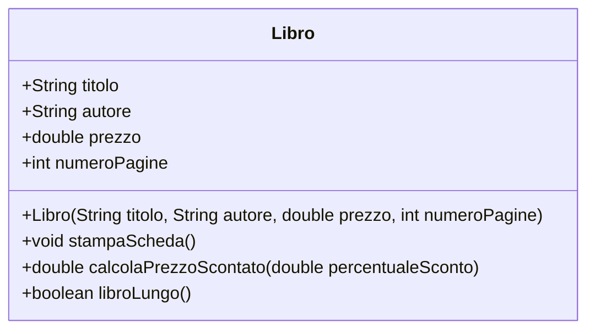

# 03. LAB11 - Classi, oggetti e costruttori con `Libro`

## Obiettivo del laboratorio

In questo laboratorio realizzerai il tuo primo piccolo progetto orientato agli oggetti con più file Java.

Creerai:

- una classe `Libro`, che rappresenta un libro;
- una classe `AppLibro`, che contiene il `main`;
- un package `corso.lab11`;
- una struttura di cartelle coerente con il package.

Il laboratorio consolida:

- classi;
- oggetti;
- attributi;
- metodi di istanza;
- costruttori;
- `this`;
- package;
- compilazione multi-file.


---

## Diagramma UML minimo della classe `Libro`

Prima di scrivere il codice, osserva la classe che realizzerai:



In questa UD il diagramma serve solo a leggere una classe singola.

Le frecce tra classi, cioè associazione, aggregazione, composizione e dipendenza, saranno trattate più avanti.

---

## 1. Struttura da creare

Crea questa struttura:

```text
lab11/
  src/
    corso/
      lab11/
        Libro.java
        AppLibro.java
  docs/
    evidence_lab11.md
```

Se usi Git Bash, PowerShell o terminale Linux, puoi creare le cartelle così:

```bash
mkdir -p lab11/src/corso/lab11
mkdir -p lab11/docs
cd lab11
```

Su PowerShell, se `mkdir -p` non funziona, crea le cartelle manualmente oppure usa:

```powershell
New-Item -ItemType Directory -Force -Path lab11\src\corso\lab11
New-Item -ItemType Directory -Force -Path lab11\docs
Set-Location lab11
```

---

## 2. File `Libro.java`

Crea il file:

```text
src/corso/lab11/Libro.java
```

Inserisci:

```java
package corso.lab11;

public class Libro {
    String titolo;
    String autore;
    double prezzo;
    int numeroPagine;

    public Libro(String titolo, String autore, double prezzo, int numeroPagine) {
        this.titolo = titolo;
        this.autore = autore;
        this.prezzo = prezzo;
        this.numeroPagine = numeroPagine;
    }

    public void stampaScheda() {
        System.out.println("Titolo: " + titolo);
        System.out.println("Autore: " + autore);
        System.out.println("Prezzo: " + prezzo);
        System.out.println("Numero pagine: " + numeroPagine);
    }

    public double calcolaPrezzoScontato(double percentualeSconto) {
        return prezzo - prezzo * percentualeSconto / 100;
    }

    public boolean libroLungo() {
        return numeroPagine >= 300;
    }
}
```

---

## 3. Analisi della classe `Libro`

La prima riga è:

```java
package corso.lab11;
```

Questa riga indica che la classe appartiene al package:

```text
corso.lab11
```

La classe contiene attributi:

```java
String titolo;
String autore;
double prezzo;
int numeroPagine;
```

Questi attributi descrivono lo stato di un libro.

In questa prima unità non usiamo ancora `private`, getter e setter.

È una semplificazione didattica.

---

## 4. Costruttore

Il costruttore è:

```java
public Libro(String titolo, String autore, double prezzo, int numeroPagine) {
    this.titolo = titolo;
    this.autore = autore;
    this.prezzo = prezzo;
    this.numeroPagine = numeroPagine;
}
```

Serve a inizializzare l'oggetto quando viene creato.

Esempio:

```java
Libro libro1 = new Libro("Fondamenti di Java", "Mario Rossi", 39.90, 280);
```

La parola `this` indica l'oggetto corrente.

---

## 5. Metodi di istanza

La classe `Libro` contiene tre metodi di istanza:

```java
public void stampaScheda()
```

stampa i dati del libro.

```java
public double calcolaPrezzoScontato(double percentualeSconto)
```

calcola il prezzo scontato usando il prezzo dell'oggetto.

```java
public boolean libroLungo()
```

restituisce `true` se il libro ha almeno 300 pagine.

Questi metodi vengono chiamati su oggetti specifici:

```java
libro1.stampaScheda();
```

---

## 6. File `AppLibro.java`

Crea il file:

```text
src/corso/lab11/AppLibro.java
```

Inserisci:

```java
package corso.lab11;

import java.util.Scanner;

public class AppLibro {

    public static double leggiDouble(Scanner scanner, String messaggio) {
        while (true) {
            System.out.print(messaggio);
            String testo = scanner.nextLine();

            try {
                return Double.parseDouble(testo);
            } catch (NumberFormatException e) {
                System.out.println("Errore: devi inserire un numero reale valido.");
            }
        }
    }

    public static int leggiIntero(Scanner scanner, String messaggio) {
        while (true) {
            System.out.print(messaggio);
            String testo = scanner.nextLine();

            try {
                return Integer.parseInt(testo);
            } catch (NumberFormatException e) {
                System.out.println("Errore: devi inserire un numero intero valido.");
            }
        }
    }

    public static String leggiStringaNonVuota(Scanner scanner, String messaggio) {
        while (true) {
            System.out.print(messaggio);
            String testo = scanner.nextLine().trim();

            if (!testo.isEmpty()) {
                return testo;
            }

            System.out.println("Errore: il testo non può essere vuoto.");
        }
    }

    public static Libro creaLibroDaInput(Scanner scanner) {
        String titolo = leggiStringaNonVuota(scanner, "Titolo: ");
        String autore = leggiStringaNonVuota(scanner, "Autore: ");
        double prezzo = leggiDouble(scanner, "Prezzo: ");
        int numeroPagine = leggiIntero(scanner, "Numero pagine: ");

        return new Libro(titolo, autore, prezzo, numeroPagine);
    }

    public static void stampaRiepilogoLibro(Libro libro, double sconto) {
        libro.stampaScheda();

        System.out.println("Prezzo scontato (" + sconto + "%): " + libro.calcolaPrezzoScontato(sconto));

        if (libro.libroLungo()) {
            System.out.println("Nota: libro lungo.");
        } else {
            System.out.println("Nota: libro breve o medio.");
        }
    }

    public static void main(String[] args) {
        Scanner scanner = new Scanner(System.in);

        Libro libro1 = new Libro("Fondamenti di Java", "Mario Rossi", 39.90, 280);
        Libro libro2 = new Libro("Algoritmi di base", "Anna Verdi", 49.50, 420);

        System.out.println("=== LIBRO 1 ===");
        stampaRiepilogoLibro(libro1, 10);

        System.out.println();
        System.out.println("=== LIBRO 2 ===");
        stampaRiepilogoLibro(libro2, 15);

        System.out.println();
        System.out.println("=== CREA UN NUOVO LIBRO ===");
        Libro libro3 = creaLibroDaInput(scanner);

        System.out.println();
        System.out.println("=== LIBRO 3 ===");
        stampaRiepilogoLibro(libro3, 5);

        scanner.close();
    }
}
```

---

## 7. Analisi della classe `AppLibro`

La classe `AppLibro` contiene il metodo:

```java
public static void main(String[] args)
```

Questa classe esegue il programma.

La classe `Libro` rappresenta il dominio.

La classe `AppLibro` usa gli oggetti `Libro`.

Questa separazione è importante:

```text
Libro -> modello
AppLibro -> programma che usa il modello
```

---

## 8. Creazione degli oggetti

Nel `main` trovi:

```java
Libro libro1 = new Libro("Fondamenti di Java", "Mario Rossi", 39.90, 280);
Libro libro2 = new Libro("Algoritmi di base", "Anna Verdi", 49.50, 420);
```

Ogni istruzione crea un oggetto diverso.

`libro1` e `libro2` sono due oggetti distinti della stessa classe.

Hanno la stessa struttura, ma dati diversi.

---

## 9. Creazione di un oggetto da input

Il metodo:

```java
public static Libro creaLibroDaInput(Scanner scanner)
```

legge i dati da tastiera e restituisce un nuovo oggetto `Libro`.

La riga più importante è:

```java
return new Libro(titolo, autore, prezzo, numeroPagine);
```

Qui il programma crea un oggetto a partire dai dati inseriti dall'utente.

---

## 10. Compilazione

Dalla cartella `lab11`, compila così:

```bash
javac -d out src/corso/lab11/Libro.java src/corso/lab11/AppLibro.java
```

Se non esistono errori, verrà creata la cartella `out`.

---

## 11. Esecuzione

Esegui così:

```bash
java -cp out corso.lab11.AppLibro
```

Attenzione: devi usare il nome completo della classe, compreso il package.

Sbagliato:

```bash
java AppLibro
```

Corretto:

```bash
java -cp out corso.lab11.AppLibro
```

Sì, è più lungo. Java ama ricordarti che l'organizzazione ha un prezzo.

---

## 12. Test obbligatori

### Test 1 - Compilazione

Esegui:

```bash
javac -d out src/corso/lab11/Libro.java src/corso/lab11/AppLibro.java
```

Verifica che non compaiano errori.

---

### Test 2 - Esecuzione

Esegui:

```bash
java -cp out corso.lab11.AppLibro
```

Verifica che vengano stampati i dati di `libro1` e `libro2`.

---

### Test 3 - Input utente

Quando il programma chiede un nuovo libro, inserisci:

```text
Titolo: Java per principianti
Autore: Laura Bianchi
Prezzo: 29.90
Numero pagine: 180
```

Verifica che venga stampata la scheda del terzo libro.

---

### Test 4 - Libro lungo

Inserisci un libro con almeno 300 pagine.

Verifica che venga stampato:

```text
Nota: libro lungo.
```

---

### Test 5 - Input numerico non valido

Quando viene chiesto il prezzo, prova a inserire:

```text
ciao
```

Il programma deve mostrare un errore e chiedere di nuovo il valore.

---

## 13. File di evidenza

Compila il file:

```text
docs/evidence_lab11.md
```

Struttura consigliata:

```md
# Evidence Lab11

## Dati partecipante

Nome:
Data:

## Obiettivo

## Struttura del progetto

## Classi create

## Comandi usati

## Test eseguiti

## Errori incontrati

## Soluzioni adottate

## Risposte alle domande

## Conclusioni
```

---

## 14. Domande di verifica

Rispondi nel file `docs/evidence_lab11.md`.

1. Che cosa rappresenta la classe `Libro`?
2. Che cosa rappresenta la classe `AppLibro`?
3. Perché il file `Libro.java` non contiene il `main`?
4. Quali sono gli attributi della classe `Libro`?
5. Quali sono i metodi di istanza della classe `Libro`?
6. A cosa serve il costruttore?
7. A cosa serve `this` nel costruttore?
8. Che differenza c'è tra `libro1` e `libro2`?
9. Perché `creaLibroDaInput(...)` restituisce un oggetto `Libro`?
10. Perché il comando di esecuzione usa `corso.lab11.AppLibro`?
11. Che cosa succede se dimentichi `new`?
12. Che cosa succede se il package non corrisponde alla struttura delle cartelle?
13. Perché in questa unità non usiamo ancora `private`, getter e setter?
14. Quale parte del codice è ancora procedurale?
15. Quale parte del codice è orientata agli oggetti?

---

## 15. Errori comuni

### Errore 1 - Dimenticare il package

Ogni file deve iniziare con:

```java
package corso.lab11;
```

---

### Errore 2 - Compilare dalla cartella sbagliata

Compila dalla root del laboratorio:

```text
lab11
```

Non da dentro:

```text
src/corso/lab11
```

---

### Errore 3 - Eseguire senza package

Sbagliato:

```bash
java -cp out AppLibro
```

Corretto:

```bash
java -cp out corso.lab11.AppLibro
```

---

### Errore 4 - Dimenticare `new`

Sbagliato:

```java
Libro libro1 = Libro("Titolo", "Autore", 10.0, 100);
```

Corretto:

```java
Libro libro1 = new Libro("Titolo", "Autore", 10.0, 100);
```

---

### Errore 5 - Confondere attributi e parametri

Nel costruttore:

```java
this.titolo = titolo;
```

a sinistra c'è l'attributo dell'oggetto.

A destra c'è il parametro ricevuto dal costruttore.

---

## 16. Sintesi

In questo laboratorio hai costruito il primo progetto OOP multi-file.

Hai creato:

```text
Libro.java
AppLibro.java
```

Hai usato:

- classe;
- oggetto;
- attributi;
- costruttore;
- `this`;
- metodi di istanza;
- package;
- compilazione multi-file.

Questo laboratorio apre il percorso verso incapsulamento, getter, setter e relazioni tra oggetti.
