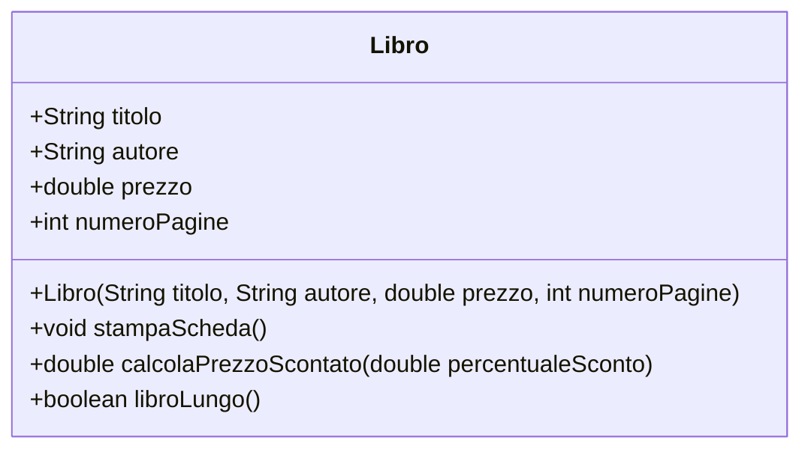

# 05. Ponte minimo - Classi che collaborano

## Obiettivo

Questo file serve solo a preparare il terreno per UD16.

In UD11 hai creato una classe `Libro` e una classe `AppLibro` che la usa.

Questo è già un primo esempio di collaborazione tra classi:

```text
AppLibro crea e usa oggetti Libro
```

Non studiamo ancora tutte le relazioni UML.

Per ora ci basta capire una cosa:

```text
un programma orientato agli oggetti è fatto da più classi che collaborano
```

---

## 1. Una classe può usare un'altra classe

Nel laboratorio hai scritto codice simile a questo:

```java
Libro libro1 = new Libro("Fondamenti di Java", "Mario Rossi", 39.90, 280);
libro1.stampaScheda();
```

Qui `AppLibro` usa `Libro`.

`AppLibro` non rappresenta un libro.

`AppLibro` è solo la classe applicativa che contiene il `main`.

`Libro`, invece, rappresenta un concetto del dominio.

---

## 2. Differenza tra classe applicativa e classe dominio

| Tipo di classe | Ruolo | Esempio |
|---|---|---|
| Classe dominio | Rappresenta qualcosa del problema | `Libro` |
| Classe applicativa | Avvia il programma e coordina le operazioni | `AppLibro` |

Questa distinzione è importante perché aiuta a evitare un errore frequente:

```text
mettere tutto nel main
```

Il `main` deve coordinare.

Le classi dominio devono rappresentare dati e comportamenti significativi.

---

## 3. UML minimo usato in UD11

Per ora usiamo UML solo per rappresentare una classe singola.



Lettura del diagramma:

| Riga | Significato |
|---|---|
| `class Libro` | esiste una classe chiamata `Libro` |
| `String titolo` | la classe ha un attributo `titolo` |
| `Libro(...)` | la classe ha un costruttore |
| `stampaScheda()` | la classe ha un metodo |

Il simbolo `+` indica visibilità pubblica.

In UD12 introdurremo meglio `private`, getter e setter.

---

## 4. Cosa non fare ancora

In questa UD non bisogna ancora classificare tutte le relazioni.

Non serve decidere se tra due classi c'è:

- associazione;
- aggregazione;
- composizione;
- dipendenza;
- ereditarietà;
- interfaccia.

Questi concetti arriveranno dopo, quando saranno disponibili abbastanza esempi concreti.

Studiare le frecce UML prima degli oggetti è come discutere la segnaletica autostradale prima di aver acceso l'auto. Tecnicamente possibile, umanamente sospetto.

---

## 5. Mini esercizio di lettura

Osserva questo codice:

```java
Libro libro = new Libro("Java Base", "Autore Demo", 25.0, 200);
libro.stampaScheda();
```

Rispondi:

1. Quale classe viene usata?
2. Quale oggetto viene creato?
3. Quale costruttore viene chiamato?
4. Quale metodo di istanza viene eseguito?
5. Perché `stampaScheda()` viene chiamato su `libro` e non direttamente sulla classe `Libro`?

---

## 6. Sintesi

Per ora ricordiamo solo questo:

```text
Classe = modello
Oggetto = elemento concreto creato dal modello
main = punto di avvio
classe dominio = rappresenta qualcosa del problema
```

Le relazioni complete tra classi saranno trattate in UD16.
