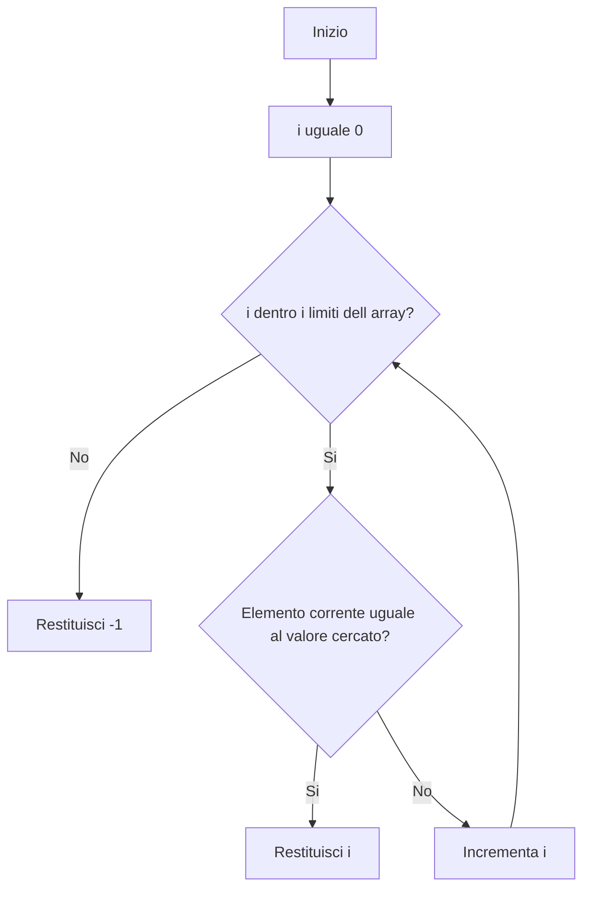
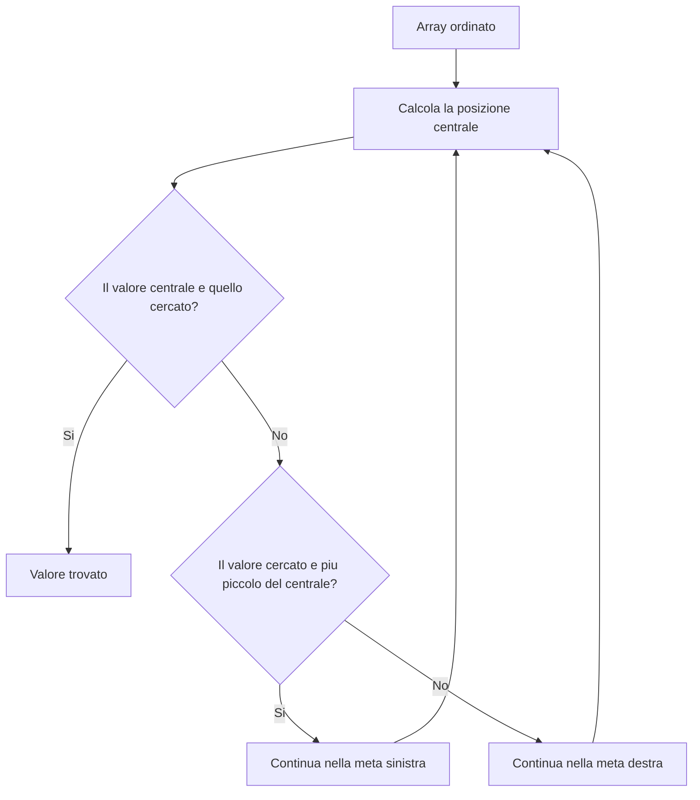
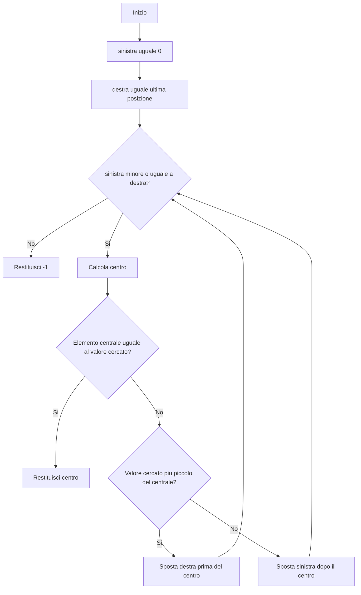
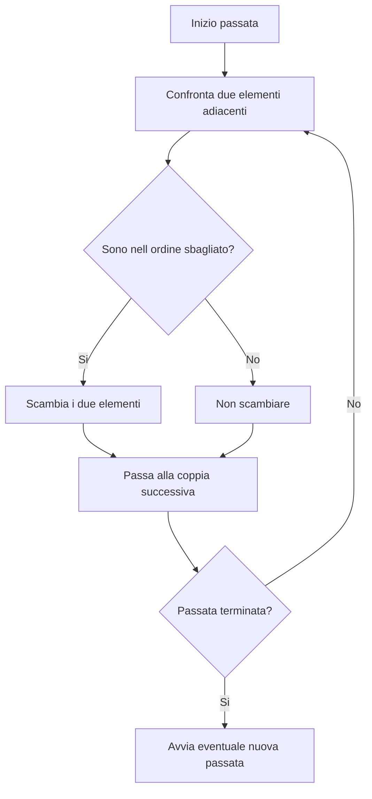
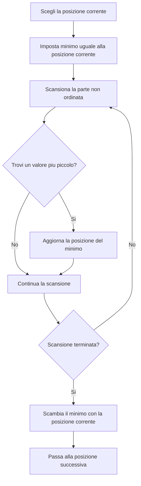
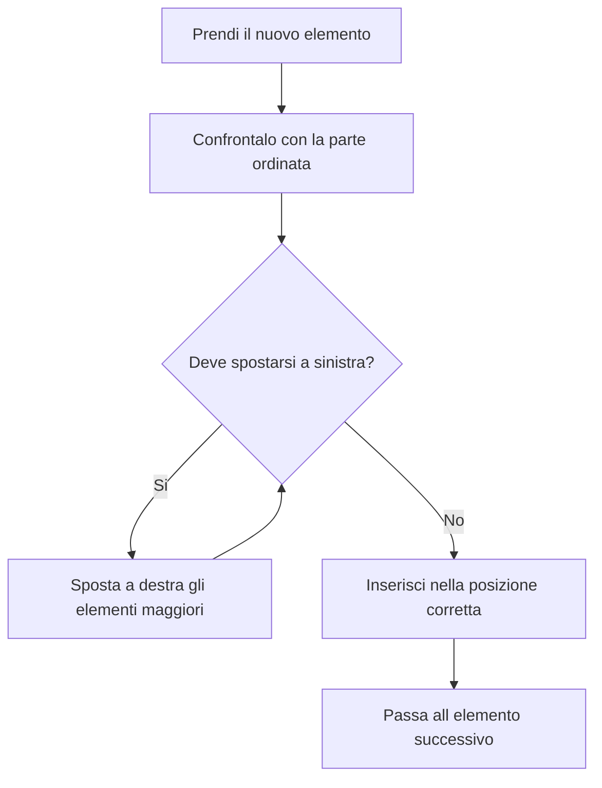
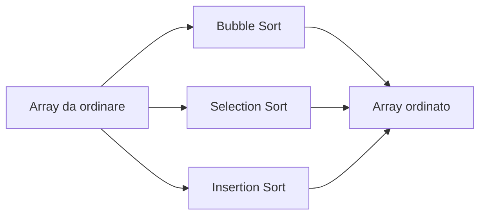
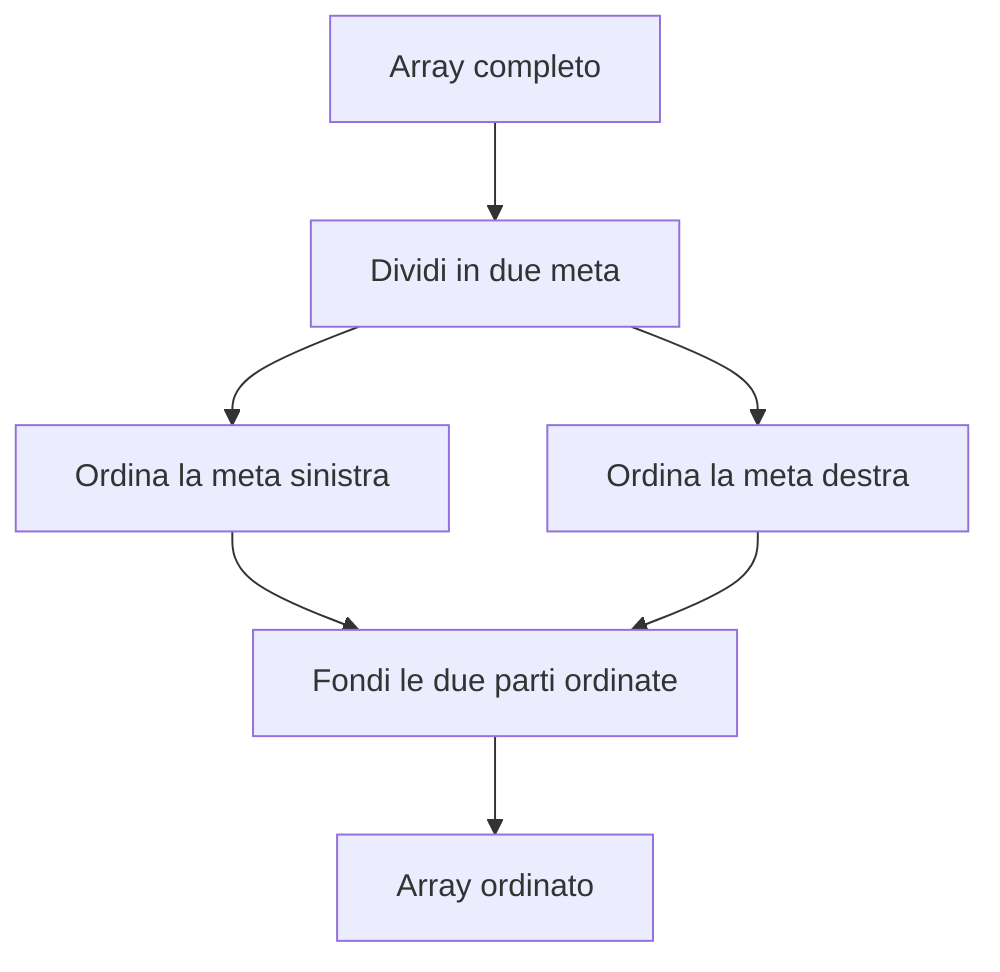
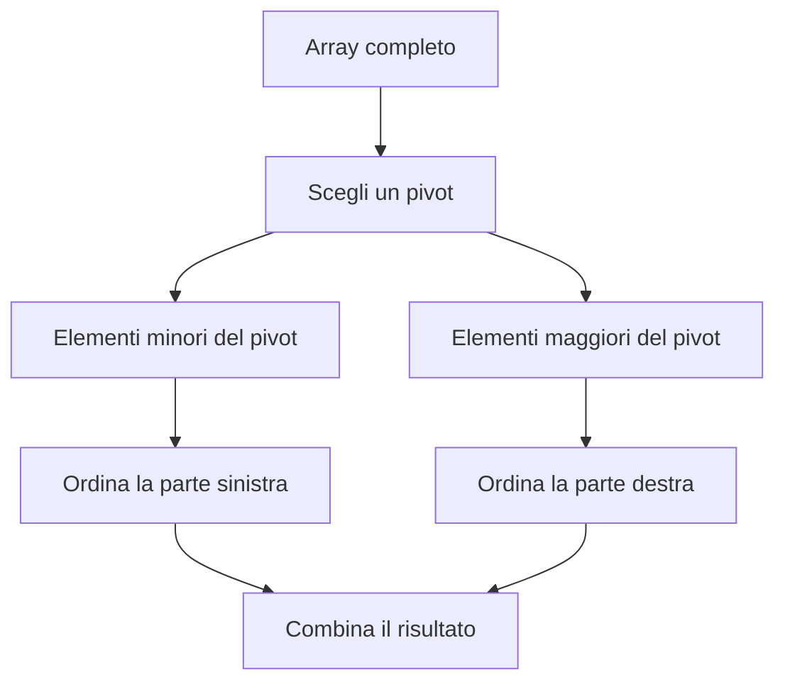

# LAB08B - Ricerca binaria e algoritmi di ordinamento

## Obiettivo del laboratorio

In questo laboratorio si approfondiscono due temi fondamentali sugli array:

- la **ricerca binaria**;
- alcuni algoritmi di **ordinamento**.

Nel LAB08 sono stati introdotti gli array, la ricerca lineare, il conteggio, il minimo, il massimo e un primo ordinamento semplice.

In questo laboratorio si compie un passaggio ulteriore: non si lavora più solo sul contenuto dell'array, ma anche sul **modo in cui i dati sono organizzati**.

Questo aspetto è importante perché alcuni algoritmi funzionano solo se i dati rispettano determinate condizioni.

La ricerca binaria, per esempio, funziona correttamente solo se l'array è già ordinato.

---

## 1. Prerequisiti

Prima di svolgere questo laboratorio devi conoscere:

- dichiarazione e uso di array in Java;
- ciclo `for`;
- ciclo `while`;
- metodi statici;
- passaggio di array a un metodo;
- uso di `Arrays.toString(...)`;
- copia di array con `Arrays.copyOf(...)`;
- ricerca lineare;
- ordinamento crescente di base.

---

## 2. File di evidenza

Crea il seguente file:

```text
docs/evidence_lab08b_ricerca_binaria_ordinamenti.md
```

Nel file di evidenza documenta, per ogni esercizio svolto:

- nome del file Java creato;
- obiettivo dell'esercizio;
- metodi implementati;
- comando di compilazione;
- comando di esecuzione;
- almeno due test eseguiti;
- output ottenuto;
- eventuali errori incontrati;
- ragionamento usato.

---

## 3. Ricerca lineare

La **ricerca lineare** controlla gli elementi dell'array uno alla volta, partendo dalla prima posizione.

Funziona anche se l'array non è ordinato.

Esempio:

```text
Array: [8, 3, 10, 4, 7]
Valore cercato: 4
```

La ricerca controlla:

```text
8 -> non trovato
3 -> non trovato
10 -> non trovato
4 -> trovato
```

Quando il valore viene trovato, il metodo può restituire la posizione.

### Metodo Java

```java
public static int ricercaLineare(int[] array, int valore) {
    for (int i = 0; i < array.length; i++) {
        if (array[i] == valore) {
            return i;
        }
    }

    return -1;
}
```

### Schema Mermaid - Ricerca lineare



---

## 4. Ricerca binaria

La **ricerca binaria** è un algoritmo più efficiente della ricerca lineare, ma può essere usata solo se l'array è ordinato.

L'idea è questa:

1. considera l'intervallo di ricerca;
2. calcola la posizione centrale;
3. confronta il valore cercato con l'elemento centrale;
4. se il valore è uguale, la ricerca termina;
5. se il valore è più piccolo, continua nella metà sinistra;
6. se il valore è più grande, continua nella metà destra.

A ogni passaggio, metà degli elementi viene esclusa dalla ricerca.

### Esempio guidato

```text
Array ordinato: [3, 7, 10, 14, 18, 21, 25]
Valore cercato: 18
```

Primo passo:

```text
sinistra = 0
destra = 6
centro = 3
array[centro] = 14
```

Poiché `18` è maggiore di `14`, la ricerca continua nella metà destra.

Secondo passo:

```text
sinistra = 4
destra = 6
centro = 5
array[centro] = 21
```

Poiché `18` è minore di `21`, la ricerca continua nella metà sinistra del nuovo intervallo.

Terzo passo:

```text
sinistra = 4
destra = 4
centro = 4
array[centro] = 18
```

Il valore è stato trovato in posizione `4`.

### Schema Mermaid - Idea della ricerca binaria



### Schema Mermaid - Ricerca binaria iterativa



### Metodo Java

```java
public static int ricercaBinaria(int[] array, int valore) {
    int sinistra = 0;
    int destra = array.length - 1;

    while (sinistra <= destra) {
        int centro = (sinistra + destra) / 2;

        if (array[centro] == valore) {
            return centro;
        }

        if (valore < array[centro]) {
            destra = centro - 1;
        } else {
            sinistra = centro + 1;
        }
    }

    return -1;
}
```

### Nota importante

La ricerca binaria non deve essere applicata a un array non ordinato.

Esempio:

```text
Array non ordinato: [20, 5, 18, 2, 30]
```

Su questo array, la ricerca binaria può dare risultati errati perché il confronto con l'elemento centrale non permette di capire quale metà scartare.

---

## 5. Ricerca lineare e ricerca binaria a confronto

| Aspetto | Ricerca lineare | Ricerca binaria |
|---|---|---|
| Richiede array ordinato | No | Sì |
| Strategia | Controlla un elemento alla volta | Divide l'intervallo a metà |
| Caso peggiore | Può visitare tutto l'array | Riduce rapidamente il numero di elementi |
| Complessità intuitiva | Cresce molto con la dimensione dell'array | Cresce lentamente |
| Difficoltà di implementazione | Bassa | Media |

Esempio intuitivo:

| Numero elementi | Ricerca lineare, caso peggiore | Ricerca binaria, numero approssimativo di passi |
|---:|---:|---:|
| 10 | 10 confronti | circa 4 passi |
| 100 | 100 confronti | circa 7 passi |
| 1.000 | 1.000 confronti | circa 10 passi |
| 1.000.000 | 1.000.000 confronti | circa 20 passi |

---

## 6. Ordinamento degli array

Ordinare un array significa disporre i suoi elementi secondo una regola.

Nel nostro caso useremo soprattutto l'ordine crescente.

Esempio:

```text
Array originale: [8, 3, 10, 4, 7]
Array ordinato:  [3, 4, 7, 8, 10]
```

Ordinare è importante perché molti algoritmi diventano più efficaci quando i dati sono organizzati.

La ricerca binaria ne è un esempio diretto.

---

## 7. Bubble Sort

### Idea generale

Bubble Sort confronta elementi adiacenti.

Se due elementi vicini sono nell'ordine sbagliato, vengono scambiati.

Dopo ogni passata, l'elemento più grande si sposta verso la fine dell'array.

### Esempio

```text
Array iniziale: [5, 2, 4, 1]
```

Prima passata:

```text
[5, 2, 4, 1]
[2, 5, 4, 1]
[2, 4, 5, 1]
[2, 4, 1, 5]
```

Il valore `5` è arrivato in fondo.

### Schema Mermaid - Bubble Sort



### Metodo Java

```java
public static void bubbleSort(int[] array) {
    for (int i = 0; i < array.length - 1; i++) {
        for (int j = 0; j < array.length - 1 - i; j++) {
            if (array[j] > array[j + 1]) {
                int temp = array[j];
                array[j] = array[j + 1];
                array[j + 1] = temp;
            }
        }
    }
}
```

### Osservazione

Bubble Sort è semplice da capire, ma non è efficiente su array grandi.

---

## 8. Selection Sort

### Idea generale

Selection Sort cerca il minimo nella parte non ordinata dell'array e lo porta nella posizione corretta.

### Esempio

```text
Array iniziale: [7, 3, 9, 1]
```

Prima passata:

```text
minimo trovato: 1
scambio con il primo elemento
array: [1, 3, 9, 7]
```

Seconda passata:

```text
parte già ordinata: [1]
parte da controllare: [3, 9, 7]
minimo trovato: 3
array: [1, 3, 9, 7]
```

### Schema Mermaid - Selection Sort



### Metodo Java

```java
public static void selectionSort(int[] array) {
    for (int i = 0; i < array.length - 1; i++) {
        int minIndex = i;

        for (int j = i + 1; j < array.length; j++) {
            if (array[j] < array[minIndex]) {
                minIndex = j;
            }
        }

        int temp = array[i];
        array[i] = array[minIndex];
        array[minIndex] = temp;
    }
}
```

### Osservazione

Selection Sort effettua molti confronti, ma in genere meno scambi rispetto a Bubble Sort.

---

## 9. Insertion Sort

### Idea generale

Insertion Sort costruisce progressivamente una parte ordinata dell'array.

Prende un elemento alla volta e lo inserisce nella posizione corretta rispetto agli elementi già ordinati.

È simile al modo in cui si ordinano le carte in mano.

### Esempio

```text
Array iniziale: [5, 2, 4, 6, 1]
```

Passaggi intuitivi:

```text
[5]
[2, 5]
[2, 4, 5]
[2, 4, 5, 6]
[1, 2, 4, 5, 6]
```

### Schema Mermaid - Insertion Sort



### Metodo Java

```java
public static void insertionSort(int[] array) {
    for (int i = 1; i < array.length; i++) {
        int chiave = array[i];
        int j = i - 1;

        while (j >= 0 && array[j] > chiave) {
            array[j + 1] = array[j];
            j--;
        }

        array[j + 1] = chiave;
    }
}
```

### Osservazione

Insertion Sort è spesso adatto per array piccoli o quasi ordinati.

---

## 10. Confronto tra Bubble Sort, Selection Sort e Insertion Sort

| Algoritmo | Idea principale | Vantaggio | Limite |
|---|---|---|---|
| Bubble Sort | Scambia elementi adiacenti | Molto semplice | Poco efficiente |
| Selection Sort | Cerca ogni volta il minimo | Pochi scambi | Molti confronti |
| Insertion Sort | Inserisce nella parte già ordinata | Buono su array piccoli o quasi ordinati | Può fare molti spostamenti |

### Schema Mermaid - Confronto generale



---

## 11. Cenno ad algoritmi più avanzati

Gli algoritmi visti finora sono utili per imparare il ragionamento.

Su grandi quantità di dati, però, si usano algoritmi più efficienti.

Tra questi ci sono:

- **Merge Sort**;
- **Quick Sort**.

In questo laboratorio non è richiesta la loro implementazione completa.

Serve però capire l'idea generale.

---

## 12. Merge Sort

Merge Sort divide l'array in due metà, ordina le due metà e poi le fonde in un unico array ordinato.

### Schema Mermaid - Merge Sort



---

## 13. Quick Sort

Quick Sort sceglie un elemento chiamato **pivot**.

Poi separa gli elementi più piccoli e più grandi del pivot.

Infine ordina ricorsivamente le parti ottenute.

### Schema Mermaid - Quick Sort



---

# 14. Esercizi

## Esercizio 1 - Ricerca binaria iterativa

### File da creare

```text
Esercizio01_RicercaBinariaIterativa.java
```

### Richiesta

Scrivi un programma che:

1. legga la dimensione dell'array;
2. legga gli elementi dell'array;
3. crei una copia dell'array originale;
4. ordini la copia in modo crescente;
5. legga un valore da cercare;
6. usi la ricerca binaria sulla copia ordinata;
7. stampi array originale, array ordinato e posizione trovata.

### Metodi richiesti

```java
public static int[] leggiArray(Scanner scanner, int dimensione)
```

```java
public static void bubbleSort(int[] array)
```

```java
public static int ricercaBinaria(int[] array, int valore)
```

### Test minimo

Input:

```text
7
14
3
25
10
18
7
21
18
```

Output atteso:

```text
Array originale: [14, 3, 25, 10, 18, 7, 21]
Array ordinato: [3, 7, 10, 14, 18, 21, 25]
Posizione del valore 18 nell array ordinato: 4
```

---

## Esercizio 2 - Confronto tra ricerca lineare e ricerca binaria

### File da creare

```text
Esercizio02_ConfrontoRicerche.java
```

### Richiesta

Scrivi un programma che:

1. usi un array di almeno 10 interi;
2. chieda all'utente un valore da cercare;
3. esegua la ricerca lineare sull'array originale;
4. ordini una copia dell'array;
5. esegua la ricerca binaria sull'array ordinato;
6. stampi il numero di confronti eseguiti dai due algoritmi.

### Obiettivo

Capire che due algoritmi possono risolvere lo stesso problema con costi diversi.

---

## Esercizio 3 - Verifica del prerequisito della ricerca binaria

### File da creare

```text
Esercizio03_VerificaPrerequisitoBinaria.java
```

### Richiesta

Scrivi un programma che:

1. legga un array;
2. verifichi se è ordinato in modo crescente;
3. se non è ordinato, stampi un messaggio chiaro;
4. ordini l'array;
5. applichi la ricerca binaria.

### Metodo richiesto

```java
public static boolean isOrdinatoCrescente(int[] array)
```

---

## Esercizio 4 - Bubble Sort

### File da creare

```text
Esercizio04_BubbleSort.java
```

### Richiesta

Implementa Bubble Sort.

Il programma deve stampare:

- array originale;
- array ordinato;
- numero di confronti eseguiti;
- numero di scambi eseguiti.

---

## Esercizio 5 - Selection Sort

### File da creare

```text
Esercizio05_SelectionSort.java
```

### Richiesta

Implementa Selection Sort.

Il programma deve stampare:

- array originale;
- array ordinato;
- numero di confronti eseguiti;
- numero di scambi eseguiti.

---

## Esercizio 6 - Insertion Sort

### File da creare

```text
Esercizio06_InsertionSort.java
```

### Richiesta

Implementa Insertion Sort.

Il programma deve stampare:

- array originale;
- array ordinato;
- numero di confronti eseguiti;
- numero di spostamenti eseguiti.

---

## Esercizio 7 - Confronto tra tre ordinamenti

### File da creare

```text
Esercizio07_ConfrontoOrdinamenti.java
```

### Richiesta

Scrivi un programma che:

1. definisca un array iniziale;
2. crei tre copie dell'array;
3. ordini la prima copia con Bubble Sort;
4. ordini la seconda copia con Selection Sort;
5. ordini la terza copia con Insertion Sort;
6. stampi i tre risultati;
7. confronti numero di confronti, scambi o spostamenti.

---

## Esercizio 8 - Ricerca binaria dopo ordinamento

### File da creare

```text
Esercizio08_RicercaBinariaDopoOrdinamento.java
```

### Richiesta

Scrivi un programma che:

1. legga un array;
2. ordini l'array con uno degli algoritmi studiati;
3. chieda un valore da cercare;
4. applichi la ricerca binaria;
5. stampi il risultato.

### Obiettivo

Capire che la ricerca binaria non dipende dal tipo di ordinamento usato.

Dipende dal fatto che l'array finale sia ordinato.

---

# 15. Challenge facoltative

## Challenge 1 - Bubble Sort ottimizzato

### File da creare

```text
Challenge01_BubbleSortOttimizzato.java
```

### Richiesta

Modifica Bubble Sort usando una variabile booleana:

```java
boolean scambio;
```

Se durante una passata non avviene nessuno scambio, l'algoritmo può terminare prima.

---

## Challenge 2 - Ricerca binaria ricorsiva

### File da creare

```text
Challenge02_RicercaBinariaRicorsiva.java
```

### Metodo richiesto

```java
public static int ricercaBinariaRicorsiva(int[] array, int valore, int sinistra, int destra)
```

### Suggerimento logico

Una funzione ricorsiva deve avere:

- un caso base di successo;
- un caso base di fallimento;
- una chiamata ricorsiva sulla metà sinistra o sulla metà destra.

---

## Challenge 3 - Confronto con Arrays.sort

### File da creare

```text
Challenge03_ConfrontoConArraysSort.java
```

### Richiesta

Ordina lo stesso array usando:

```java
Arrays.sort(array)
```

Confronta il risultato con quello prodotto dai tuoi algoritmi.

---

# 16. Domande finali

Rispondi nel file:

```text
docs/evidence_lab08b_ricerca_binaria_ordinamenti.md
```

Domande:

1. Perché la ricerca binaria richiede un array ordinato?
2. Perché la ricerca lineare può funzionare anche su array non ordinati?
3. Che cosa rappresentano le variabili `sinistra`, `destra` e `centro`?
4. Perché la ricerca binaria elimina metà degli elementi a ogni passaggio?
5. Che cosa succede se applichi la ricerca binaria a un array non ordinato?
6. Qual è l'idea principale di Bubble Sort?
7. Qual è l'idea principale di Selection Sort?
8. Qual è l'idea principale di Insertion Sort?
9. Perché Bubble Sort è facile da capire ma poco efficiente?
10. Perché può essere utile contare confronti e scambi?
11. Quale algoritmo di ordinamento ti sembra più intuitivo? Motiva la risposta.
12. Perché `Arrays.sort(...)` è comodo ma non sostituisce lo studio degli algoritmi?

---

# 17. Sintesi finale

In questo laboratorio hai studiato:

- ricerca lineare;
- ricerca binaria;
- Bubble Sort;
- Selection Sort;
- Insertion Sort;
- cenni a Merge Sort e Quick Sort;
- confronto intuitivo dei costi degli algoritmi.

La cosa più importante da ricordare è questa:

> Un algoritmo non è solo una sequenza di istruzioni. È una strategia per risolvere un problema rispettando determinate condizioni.

Nel caso della ricerca binaria, la condizione fondamentale è che l'array sia ordinato.

Nel caso degli algoritmi di ordinamento, il risultato finale può essere lo stesso, ma il percorso per ottenerlo può essere molto diverso.

Questa distinzione è essenziale per iniziare a ragionare come programmatori e non solo come esecutori di codice.
