# 00 - Presentazione UD11

## Prime classi, oggetti, costruttori, `this` e package

Questa unità introduce il primo passaggio serio dalla programmazione procedurale alla programmazione orientata agli oggetti.

Finora abbiamo scritto programmi centrati su:

- `main`;
- variabili;
- condizioni;
- cicli;
- metodi statici;
- input da tastiera;
- piccoli algoritmi.

Da questa UD iniziamo a ragionare in modo diverso:

```text
classe -> oggetto -> stato -> comportamento -> collaborazione tra classi
```

L'obiettivo non è ancora progettare sistemi complessi.

L'obiettivo è imparare a creare una classe, costruire oggetti da quella classe e usare metodi di istanza in modo consapevole.

---

## Perché questa UD è importante

La programmazione procedurale organizza il codice intorno alle operazioni.

La programmazione a oggetti organizza il codice intorno a elementi del problema rappresentati come oggetti.

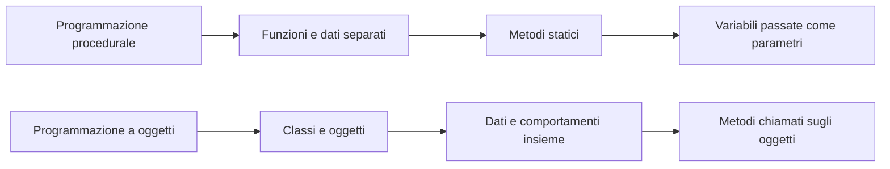

Esempio concettuale:

| Prima | Dopo |
|---|---|
| dati del libro in variabili separate | dati del libro dentro un oggetto `Libro` |
| funzione `stampaLibro(...)` | metodo `libro.stampaScheda()` |
| prezzo passato come parametro | prezzo contenuto nell'oggetto |
| programma centrato sul `main` | programma diviso in classi con responsabilità diverse |

---

## Cosa impareremo

Alla fine della UD11 dovrai saper spiegare e usare questi concetti:

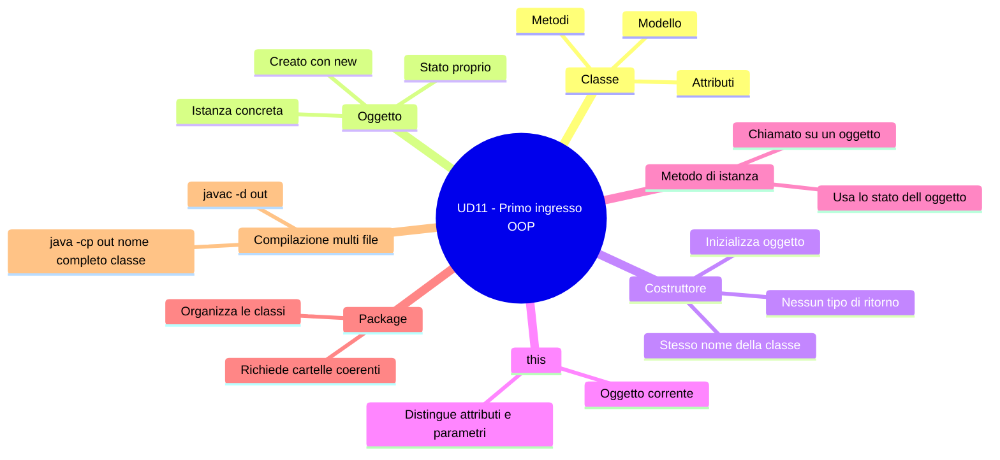

---

## Cosa non faremo ancora

In questa UD non studieremo ancora in modo completo:

- `private`, getter e setter;
- incapsulamento completo;
- ereditarietà;
- interfacce;
- polimorfismo;
- cast tra oggetti;
- associazione, aggregazione, composizione e dipendenza UML.

Vedremo solo un uso minimo di UML per leggere la struttura di una singola classe.

Le relazioni complete tra classi saranno affrontate più avanti, quando avremo abbastanza basi per interpretarle correttamente.

---

## Mappa della giornata

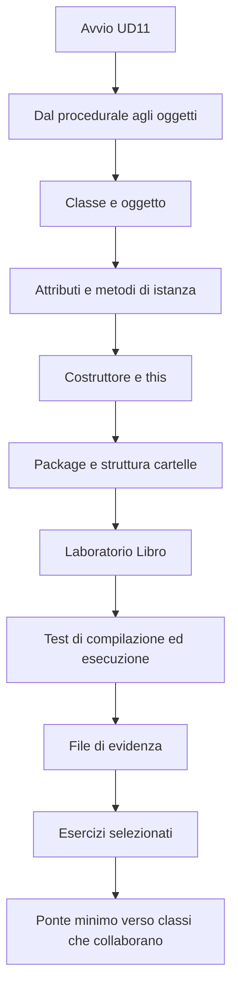

---

## Sequenza dei materiali

Durante la UD useremo questi file nell'ordine indicato:

| Ordine | File | Scopo |
|---:|---|---|
| 1 | `01.Dal_procedurale_agli_oggetti.md` | capire il cambio di mentalità |
| 2 | `02.Classi_oggetti_costruttori_this_package.md` | imparare la sintassi minima OOP |
| 3 | `03.LAB11_Classi_oggetti_costruttori_Libro.md` | realizzare il laboratorio principale |
| 4 | `04.Esercizi_LAB11_classi_oggetti_costruttori.md` | consolidare con esercizi mirati |
| 5 | `05.Ponte_minimo_classi_che_collaborano.md` | preparare il collegamento verso le UD successive |

---

## Da procedurale a OOP

Nel codice procedurale i dati sono spesso separati dalle operazioni.

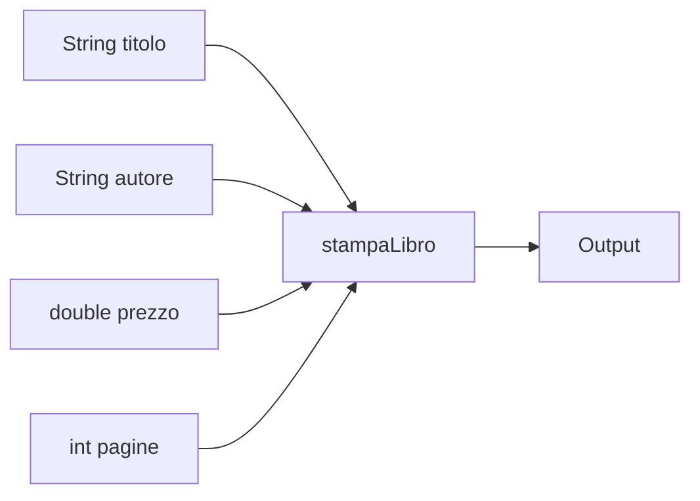

Nel codice a oggetti i dati e le operazioni vengono raccolti nella stessa classe.

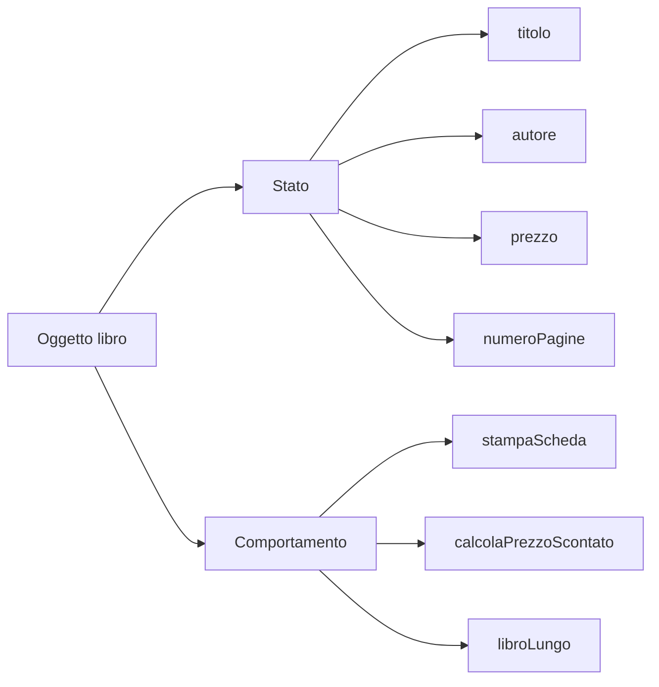

---

## Classe e oggetto

Una classe è un modello.

Un oggetto è un elemento concreto creato da quel modello.

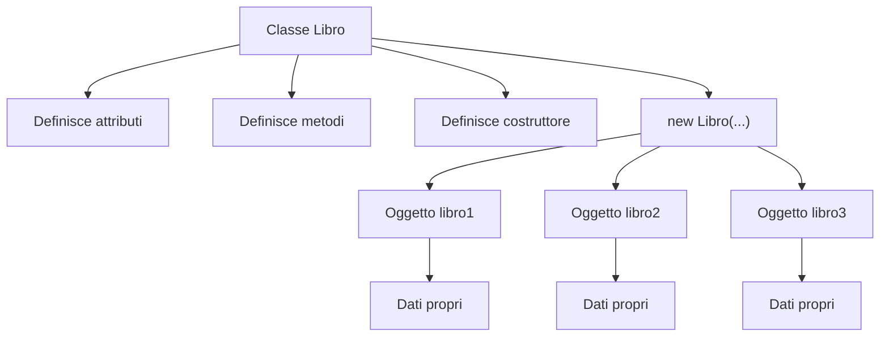

Esempio:

```java
Libro libro1 = new Libro("Fondamenti di Java", "Mario Rossi", 39.90, 280);
Libro libro2 = new Libro("Algoritmi di base", "Anna Verdi", 49.50, 420);
```

`libro1` e `libro2` sono due oggetti distinti della stessa classe.

---

## UML minimo della classe `Libro`

In questa UD useremo UML solo per leggere una classe singola.

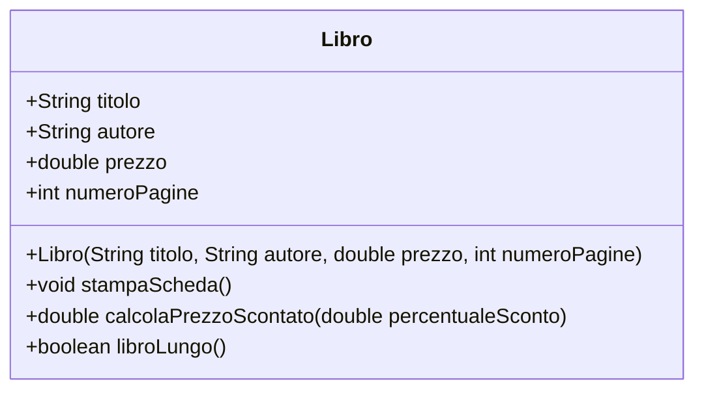

Lettura del diagramma:

| Elemento | Significato |
|---|---|
| `class Libro` | esiste una classe chiamata `Libro` |
| `String titolo` | la classe ha un attributo `titolo` |
| `Libro(...)` | la classe ha un costruttore |
| `stampaScheda()` | la classe ha un metodo di istanza |
| `calcolaPrezzoScontato(...)` | metodo che restituisce un valore numerico |
| `libroLungo()` | metodo che restituisce `true` oppure `false` |

---

## Struttura del laboratorio

Nel laboratorio realizzeremo questa struttura:

```text
lab11/
  src/
    corso/
      lab11/
        Libro.java
        AppLibro.java
  docs/
    evidence_lab11.md
```

Schema della struttura:

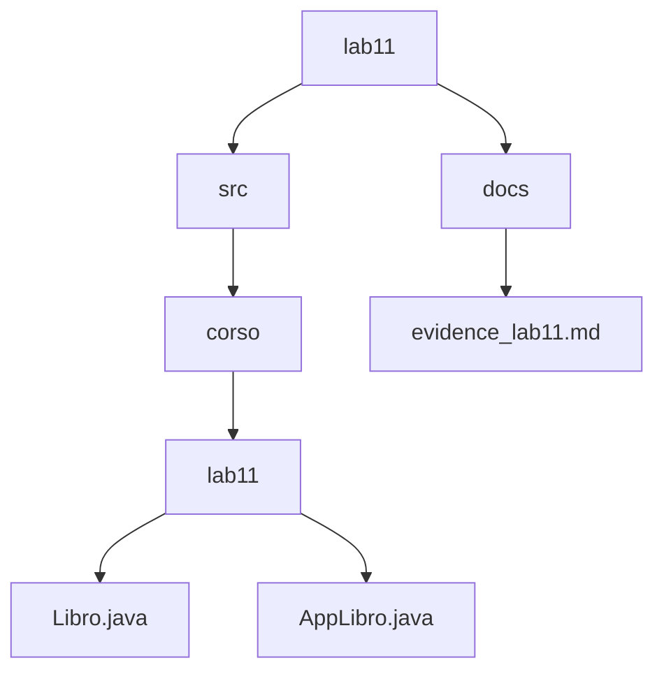

---

## Ruolo delle classi nel laboratorio

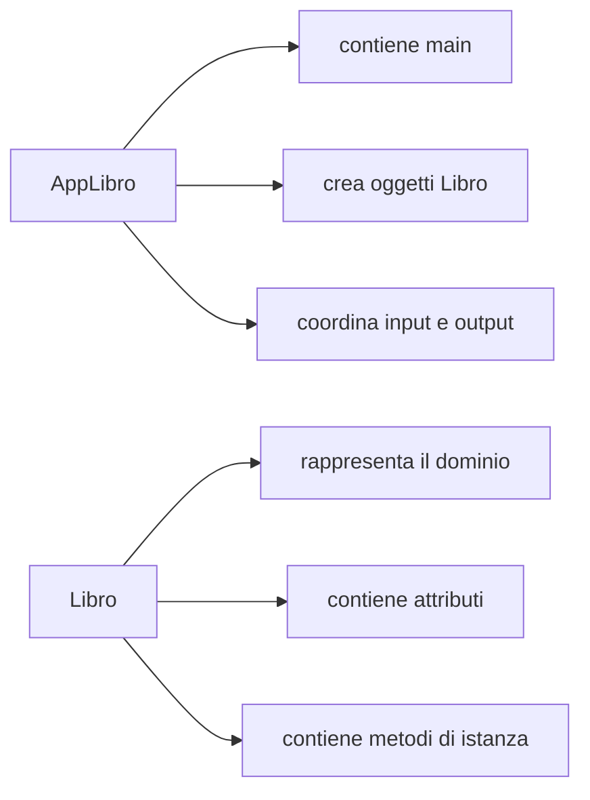

| Classe | Ruolo |
|---|---|
| `Libro` | rappresenta il concetto di libro nel programma |
| `AppLibro` | avvia il programma e usa gli oggetti `Libro` |

Questa distinzione è fondamentale: il `main` coordina, la classe di dominio rappresenta qualcosa del problema.

---

## Costruttore e `this`

Il costruttore inizializza l'oggetto quando viene creato.

```java
public Libro(String titolo, String autore, double prezzo, int numeroPagine) {
    this.titolo = titolo;
    this.autore = autore;
    this.prezzo = prezzo;
    this.numeroPagine = numeroPagine;
}
```

Schema del significato di `this`:

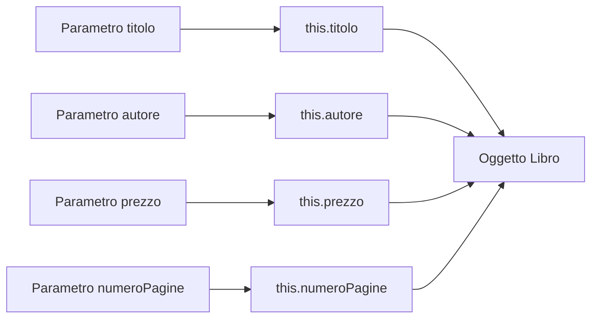

`this.titolo` indica l'attributo dell'oggetto corrente.

`titolo` indica il parametro ricevuto dal costruttore.

---

## Package e compilazione

Il package che useremo è:

```java
package corso.lab11;
```

Il package deve essere coerente con le cartelle:

```text
src/corso/lab11/
```

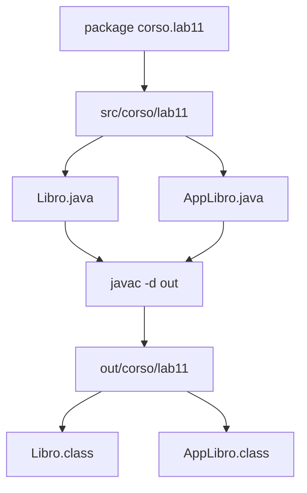

Comando di compilazione dalla cartella `lab11`:

```bash
javac -d out src/corso/lab11/Libro.java src/corso/lab11/AppLibro.java
```

Comando di esecuzione:

```bash
java -cp out corso.lab11.AppLibro
```

Non basta scrivere:

```bash
java AppLibro
```

La classe appartiene al package `corso.lab11`, quindi va eseguita usando il nome completo.

---

## Metodo di lavoro

Durante la UD lavoreremo così:

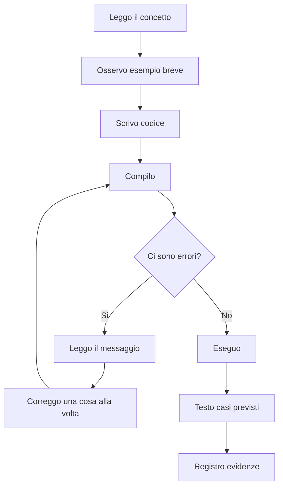

Regola pratica:

```text
prima capire il modello, poi scrivere codice, poi compilare, poi testare, poi documentare
```

---

## Test obbligatori del laboratorio

Nel laboratorio dovrai verificare almeno questi casi:

| Test | Cosa verifica |
|---|---|
| compilazione senza errori | struttura file e package corretti |
| esecuzione del programma | comando `java -cp out corso.lab11.AppLibro` corretto |
| stampa dei libri predefiniti | creazione oggetti tramite costruttore |
| inserimento di un nuovo libro | input utente e creazione oggetto da dati inseriti |
| libro con almeno 300 pagine | metodo `libroLungo()` |
| prezzo non valido | gestione input numerico errato |

---

## File di evidenza

Dovrai compilare:

```text
docs/evidence_lab11.md
```

Il file dovrà contenere:

- dati partecipante;
- obiettivo del laboratorio;
- struttura del progetto;
- classi create;
- comandi usati;
- test eseguiti;
- errori incontrati;
- soluzioni adottate;
- risposte alle domande;
- conclusioni.

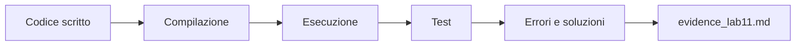

---

## Errori comuni da evitare

| Errore | Effetto |
|---|---|
| dimenticare `package corso.lab11;` | la classe non risulta nel package atteso |
| compilare dalla cartella sbagliata | percorsi e package diventano confusi |
| eseguire senza nome completo della classe | Java non trova `AppLibro` |
| dimenticare `new` | non viene creato l'oggetto |
| confondere attributo e parametro | il costruttore non inizializza correttamente l'oggetto |
| mettere tutto nel `main` | si perde il senso della programmazione a oggetti |

---

## Esercizi della UD

Dopo il laboratorio principale useremo alcuni esercizi di consolidamento.

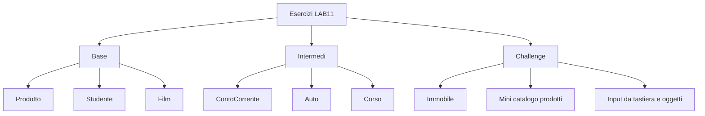

In aula verranno selezionati solo alcuni esercizi.

Gli altri servono come consolidamento autonomo.

---

## Ponte verso le prossime UD

UD11 apre la strada alle unità successive.

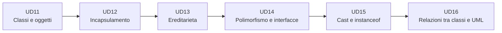

In UD11 vediamo solo che una classe può usare un'altra classe:

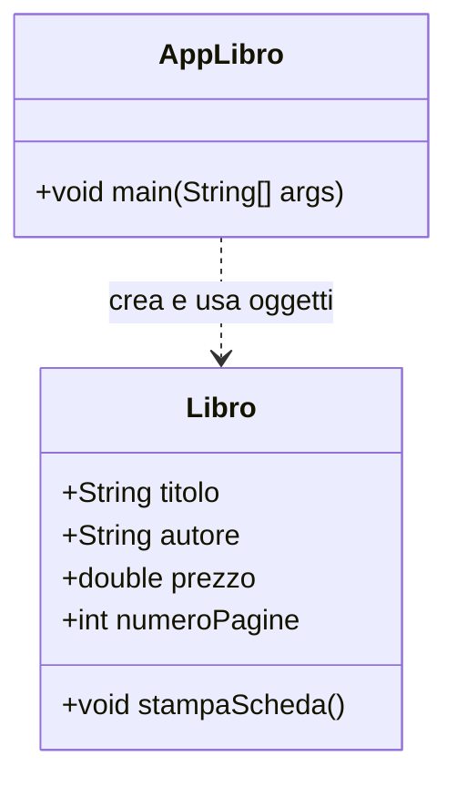

Non classifichiamo ancora tutte le relazioni.

Per ora basta capire questo:

```text
un programma orientato agli oggetti è formato da classi che collaborano
```

---

## Risultato atteso della UD11

Alla fine della UD dovrai essere in grado di:

- spiegare la differenza tra classe e oggetto;
- creare una classe con attributi e metodi;
- scrivere un costruttore;
- usare `this` correttamente;
- creare oggetti con `new`;
- chiamare metodi di istanza;
- separare classe dominio e classe applicativa;
- usare un package coerente con le cartelle;
- compilare ed eseguire un progetto Java multi-file;
- documentare il lavoro nel file di evidenza.

---

## Sintesi finale

Questa UD ha un obiettivo preciso:

```text
passare dal codice centrato sulle funzioni
al codice centrato sugli oggetti
```

La sequenza da ricordare è:

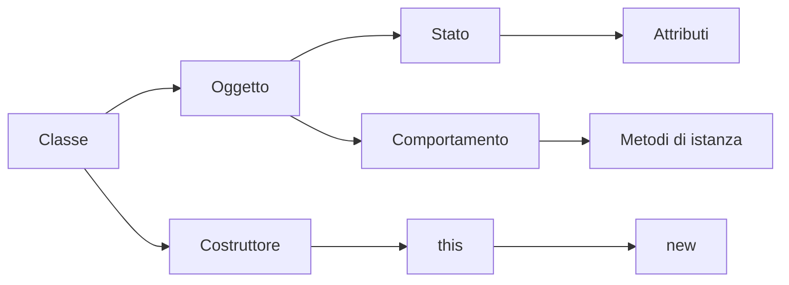

Se questi concetti diventano solidi, le prossime UD saranno molto più comprensibili.

Se restano confusi, ereditarietà, interfacce e polimorfismo saranno molto più difficili da comprendere e applicare correttamente.
