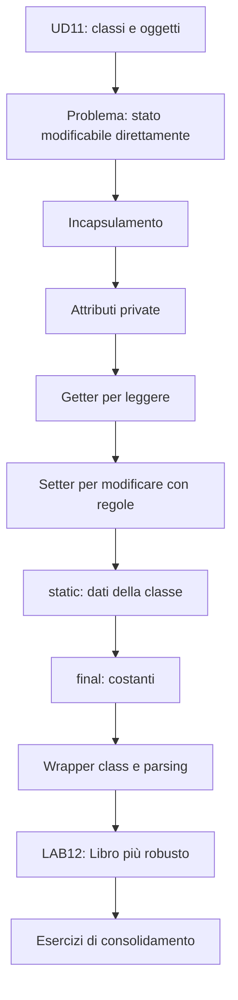
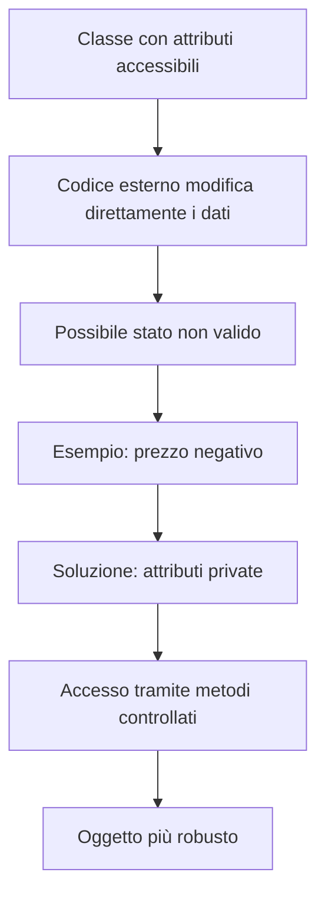
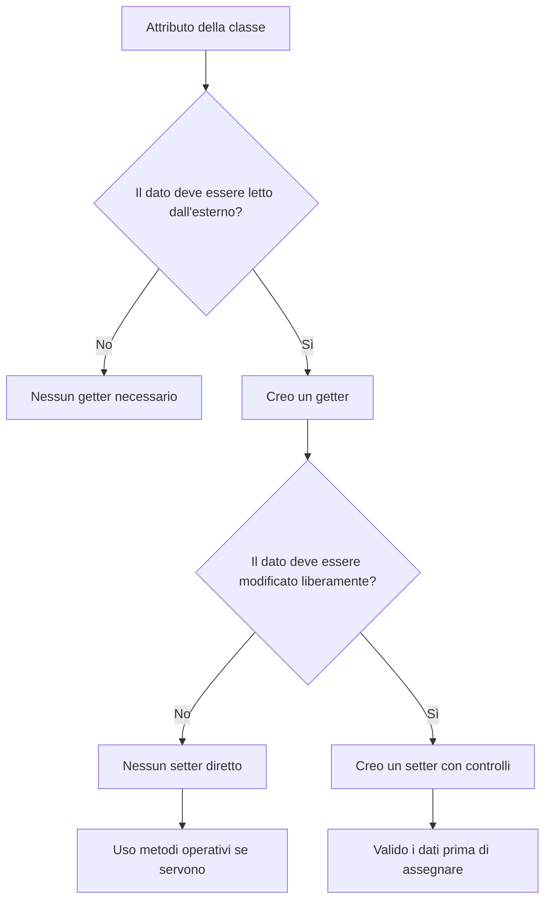
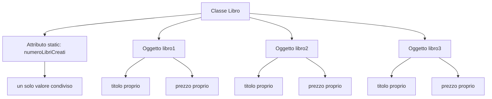
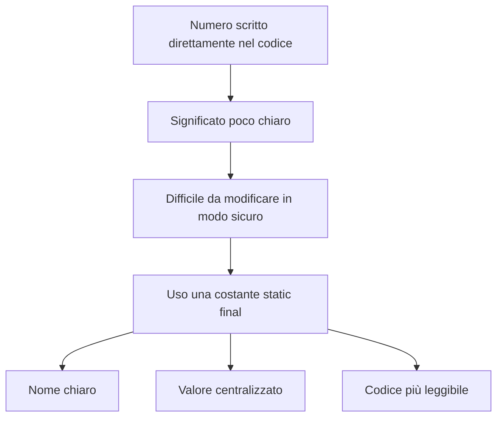
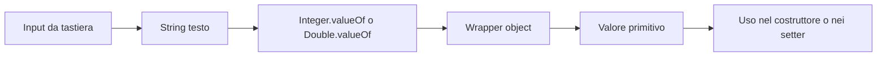
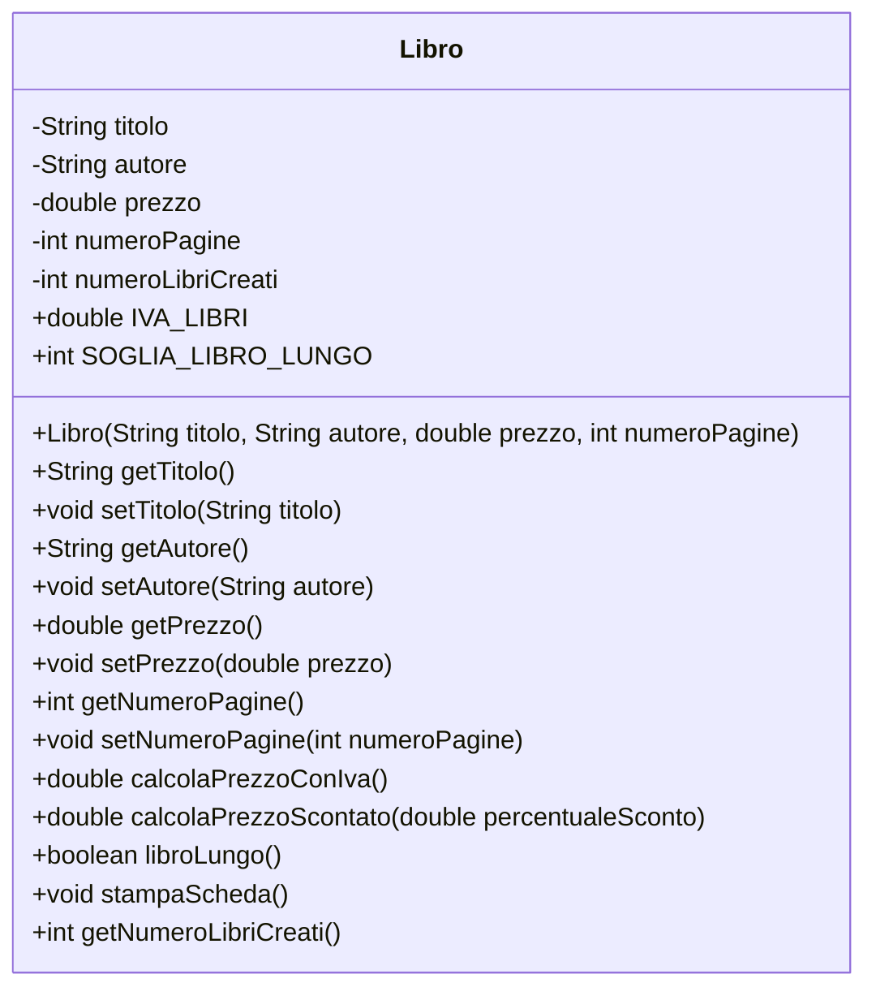
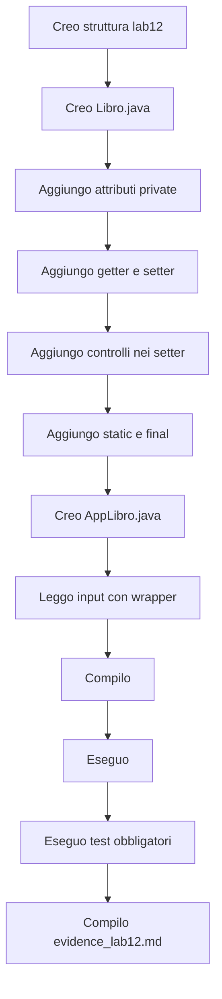
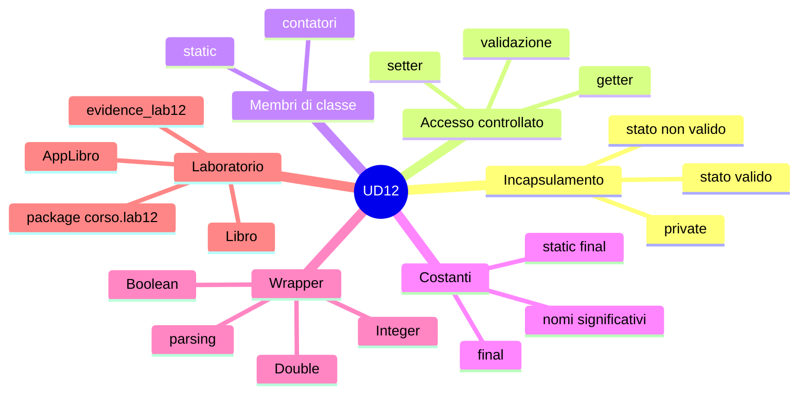
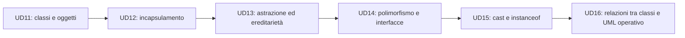

# 00 - Presentazione UD12

# Incapsulamento, getter, setter, `static`, `final` e wrapper

## Obiettivo della giornata

Nella UD11 avete imparato a creare classi e oggetti.

Nella UD12 il passo successivo è rendere questi oggetti più controllati e più affidabili.

Il punto centrale della giornata è questo:

```text
un oggetto non deve essere un contenitore aperto di dati modificabili a caso
```

Un oggetto deve proteggere il proprio stato interno e permettere modifiche solo attraverso metodi controllati.

---

## Perché questa UD è importante

Una classe con attributi accessibili direttamente può sembrare semplice.

Esempio:

```java
libro.prezzo = -100;
```

Il codice può anche compilare.

Il problema è che il dato non ha senso.

La UD12 introduce gli strumenti minimi per evitare questo tipo di errore:

- attributi `private`;
- getter;
- setter con controlli;
- costanti `static final`;
- membri `static`;
- wrapper class per il parsing dei dati.

---

## Mappa della giornata



---

## Da UD11 a UD12

| UD11 | UD12 |
|---|---|
| Creo una classe | Proteggo una classe |
| Creo oggetti con `new` | Impedisco stati non validi |
| Uso attributi e metodi | Controllo accesso e modifica |
| Uso costruttori e `this` | Uso setter validati |
| Uso package e più file | Mantengo package e progetto multi-file |

---

## Programma operativo

| Blocco | Argomento | Risultato atteso |
|---|---|---|
| 1 | Incapsulamento, `private`, getter e setter | Capire perché gli attributi non devono essere modificati direttamente |
| 2 | Validazione nei setter | Bloccare valori non validi |
| 3 | `static` e membri di classe | Distinguere dati dell'oggetto e dati della classe |
| 4 | `final` e costanti | Usare nomi significativi per valori fissi |
| 5 | Wrapper class | Collegare `Integer`, `Double`, `Boolean` al parsing |
| 6 | LAB12 | Realizzare una versione più robusta di `Libro` |
| 7 | Esercizi | Applicare lo stesso modello ad altre classi |

---

## Prima idea: proteggere lo stato

Lo stato di un oggetto è l'insieme dei suoi dati.

Per un libro:

```text
titolo
autore
prezzo
numeroPagine
```

Uno stato valido può essere:

```text
titolo = Java Base
prezzo = 29.90
numeroPagine = 250
```

Uno stato non valido può essere:

```text
titolo = stringa vuota
prezzo = -10
numeroPagine = 0
```

La classe deve impedire o controllare questi valori.

---

## Schema: stato non valido e incapsulamento



---

## `private`

`private` rende un attributo accessibile solo dentro la classe.

Esempio:

```java
private double prezzo;
```

Da un'altra classe non si può più scrivere:

```java
libro.prezzo = -100;
```

Questo è corretto.

Il prezzo deve essere modificato solo attraverso un metodo controllato.

---

## Getter

Un getter permette di leggere un valore.

Esempio:

```java
public double getPrezzo() {
    return prezzo;
}
```

Uso:

```java
System.out.println(libro.getPrezzo());
```

Il getter non modifica l'oggetto.

Serve solo a esporre un'informazione.

---

## Setter

Un setter permette di modificare un valore.

Setter debole:

```java
public void setPrezzo(double prezzo) {
    this.prezzo = prezzo;
}
```

Questo setter non protegge davvero nulla.

Setter migliore:

```java
public void setPrezzo(double prezzo) {
    if (prezzo >= 0) {
        this.prezzo = prezzo;
    } else {
        System.out.println("Prezzo non valido.");
    }
}
```

Ora l'oggetto può rifiutare valori non validi.

---

## Getter e setter non sono un rito automatico

Non tutti gli attributi devono avere sempre un setter.

Esempio importante:

```java
public void setSaldo(double saldo)
```

In un conto corrente sarebbe pericoloso, perché permetterebbe di cambiare il saldo direttamente.

Meglio usare metodi che rappresentano operazioni reali:

```java
public void versa(double importo)
public boolean preleva(double importo)
```

---

## Schema: decidere se serve un setter



---

## Seconda idea: dato dell'oggetto e dato della classe

Un attributo normale appartiene al singolo oggetto.

Esempio:

```java
private String titolo;
```

Ogni libro ha il proprio titolo.

Un attributo `static` appartiene alla classe.

Esempio:

```java
private static int numeroLibriCreati;
```

Il contatore è condiviso da tutti gli oggetti `Libro`.

---

## Schema: attributi di istanza e attributi statici



---

## Quando usare `static`

Usare `static` quando il dato appartiene alla classe, non al singolo oggetto.

Esempi adatti:

```java
private static int numeroLibriCreati;
public static int getNumeroLibriCreati()
```

Esempio sbagliato:

```java
private static String titolo;
```

Il titolo deve appartenere al singolo libro.

Se fosse `static`, tutti i libri condividerebbero lo stesso titolo. Un disastro piccolo, ma molto istruttivo.

---

## Terza idea: costanti con `static final`

Una costante rappresenta un valore fisso con un nome chiaro.

Esempio:

```java
public static final double IVA_LIBRI = 0.04;
public static final int SOGLIA_LIBRO_LUNGO = 300;
```

Perché usarle?

```java
return prezzo + prezzo * IVA_LIBRI;
```

è più leggibile di:

```java
return prezzo + prezzo * 0.04;
```

Il numero `0.04` da solo non spiega nulla.

La costante `IVA_LIBRI` comunica il significato.

---

## Schema: perché usare costanti



---

## Quarta idea: wrapper class

Java ha tipi primitivi e classi wrapper.

| Primitivo | Wrapper |
|---|---|
| `int` | `Integer` |
| `double` | `Double` |
| `boolean` | `Boolean` |
| `char` | `Character` |
| `long` | `Long` |

I wrapper permettono di trattare valori primitivi come oggetti e offrono metodi utili.

Li avete già incontrati nel parsing.

---

## Parsing con wrapper

Esempio:

```java
Integer valore = Integer.valueOf("25");
int numero = valore.intValue();
```

Esempio:

```java
Double valore = Double.valueOf("12.5");
double prezzo = valore.doubleValue();
```

Nel laboratorio useremo i wrapper per leggere numeri da input e trasformare stringhe in valori numerici.

---

## Schema: input testuale e wrapper



---

## LAB12: classe `Libro` più robusta

Nel laboratorio principale miglioreremo la classe `Libro`.

La nuova versione userà:

- attributi `private`;
- getter;
- setter con controlli;
- costanti `static final`;
- contatore `static`;
- wrapper class per il parsing;
- package `corso.lab12`.

---

## UML minimo della classe `Libro`



Legenda rapida:

| Simbolo | Significato |
|---|---|
| `-` | membro privato |
| `+` | membro pubblico |
| `static` | nel codice Java appartiene alla classe |
| `final` | nel codice Java indica un valore non riassegnabile |

---

## Struttura del laboratorio

```text
lab12/
  src/
    corso/
      lab12/
        Libro.java
        AppLibro.java
  docs/
    evidence_lab12.md
```

La struttura delle cartelle deve essere coerente con il package:

```java
package corso.lab12;
```

---

## Flusso di lavoro del laboratorio



---

## Comandi fondamentali

Dalla cartella `lab12`:

```bash
javac -d out src/corso/lab12/Libro.java src/corso/lab12/AppLibro.java
```

Esecuzione:

```bash
java -cp out corso.lab12.AppLibro
```

Il nome completo della classe è necessario perché il programma usa il package `corso.lab12`.

---

## Test obbligatori

Durante il laboratorio dovrete verificare almeno questi casi:

| Test | Cosa verificare |
|---|---|
| Compilazione | Il progetto compila senza errori |
| Esecuzione base | I primi due libri vengono stampati |
| Setter non valido | `setPrezzo(-50)` non modifica il prezzo |
| Setter valido | `setPrezzo(35.90)` aggiorna il prezzo |
| Input utente | Il terzo libro viene creato da tastiera |
| Parsing errato | Inserendo `ciao` come prezzo, il programma richiede di nuovo il valore |
| Contatore statico | Alla fine risultano tre libri creati |

---

## File di evidenza

Create il file:

```text
docs/evidence_lab12.md
```

Il file deve contenere:

- struttura del progetto;
- classi create;
- attributi privati;
- getter e setter;
- validazioni implementate;
- membri `static`;
- costanti `final`;
- wrapper usati;
- comandi di compilazione;
- comandi di esecuzione;
- test validi;
- test non validi;
- errori incontrati;
- soluzioni adottate;
- risposte alle domande.

---

## Esercizi consigliati in aula

Per consolidare la UD12, gli esercizi consigliati sono:

1. `Prodotto`, con attributi privati e setter validati;
2. `Studente`, con contatore statico;
3. `ContoCorrente`, senza setter diretto per il saldo.

Se il gruppo procede bene:

4. `Corso`, con soglia corso lungo e contatore statico.

---

## Esercizi da completare in autonomia

Gli esercizi più adatti al consolidamento individuale sono:

- `Film`, con costante `final`;
- `Auto`, con wrapper e parsing;
- `Immobile`;
- `Prenotazione`;
- mini catalogo con oggetti.

Il file degli esercizi è una banca di attività, non una lista da finire tutta in aula.

---

## Errori comuni da evitare

| Errore | Perché è un problema |
|---|---|
| Lasciare attributi pubblici | Il codice esterno può creare stati non validi |
| Scrivere setter senza controlli | Il setter diventa solo una porta più lunga verso lo stesso errore |
| Rendere `static` un dato dell'oggetto | Tutti gli oggetti condividono un valore che dovrebbe essere individuale |
| Usare numeri fissi nel codice | Il significato del valore non è chiaro |
| Confondere `parseInt` e `valueOf` | Uno restituisce un primitivo, l'altro un wrapper |
| Eseguire senza nome completo della classe | Il package richiede `corso.lab12.AppLibro` |

---

## Schema finale dei concetti



---

## Cosa dovete saper fare a fine UD12

Alla fine della giornata dovete essere in grado di:

- spiegare perché gli attributi devono essere `private`;
- scrivere getter e setter in modo ragionato;
- inserire controlli nei setter;
- evitare setter quando serve un metodo operativo;
- distinguere attributi di istanza e attributi `static`;
- usare costanti `static final`;
- usare wrapper class nel parsing;
- compilare ed eseguire un progetto multi-file con package;
- documentare test ed errori nel file di evidenza.

---

## Collegamento con le prossime UD



UD12 è il passaggio che trasforma gli oggetti da semplici contenitori di dati a componenti più affidabili.

Se questo passaggio non è chiaro, le UD successive rischiano di diventare una collezione elegante di parole Java sopra classi fragili.
