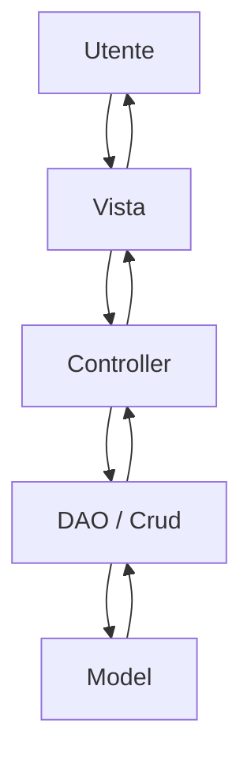
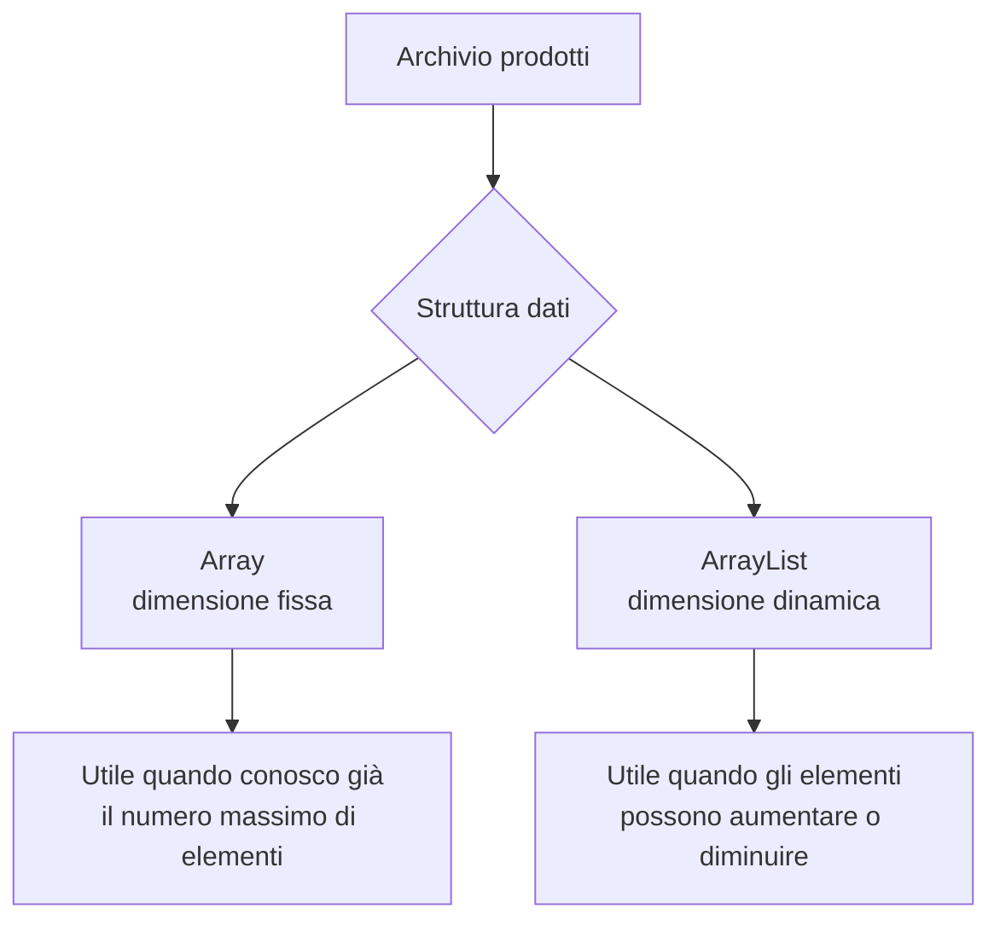
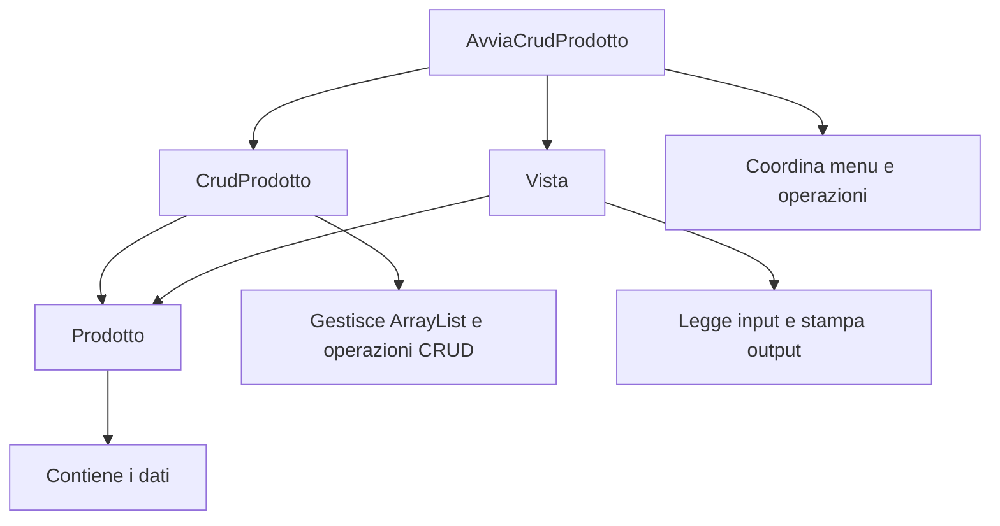

# UD12A - Separazione delle responsabilità e MVC semplificato in console

## Obiettivo dell'unità

Questa unità introduce il concetto di **separazione delle responsabilità** e una prima forma semplificata di organizzazione in stile **MVC**.

L'obiettivo non è studiare MVC in modo teorico e completo, ma capire perché un programma Java non dovrebbe mettere tutto il codice dentro il metodo `main`.

Nel laboratorio successivo useremo questa organizzazione per costruire un CRUD da console.

---

## 1. Problema: tutto nel `main`

Un programma piccolo può essere scritto tutto dentro `main`.

Esempio:

```java
public class Main {
    public static void main(String[] args) {
        // menu
        // input
        // creazione oggetti
        // ricerca
        // modifica
        // cancellazione
        // stampa
    }
}
```

Questo approccio funziona solo all'inizio.

Quando il programma cresce, il file diventa difficile da:

- leggere;
- correggere;
- modificare;
- testare;
- spiegare;
- riutilizzare.

Il problema non è Java. Il problema è mettere logica, input, output e dati tutti nello stesso punto.

---

## 2. Separare le responsabilità

Una responsabilità è un compito preciso assegnato a una classe.

Esempio:

| Responsabilità | Classe possibile |
|---|---|
| Rappresentare i dati di un prodotto | `Prodotto` |
| Gestire l'archivio dei prodotti | `CrudProdotto` |
| Leggere e stampare dati da console | `Vista` |
| Coordinare il flusso del programma | `AvviaCrudProdotto` |

Ogni classe ha un ruolo più chiaro.

---

## 3. Schema generale



In un'applicazione console il flusso è semplice:

1. l'utente sceglie un'operazione;
2. la vista legge l'input;
3. il controller decide cosa fare;
4. il DAO gestisce l'archivio;
5. il model rappresenta i dati;
6. la vista mostra il risultato.

---

## 4. Che cosa significa MVC

MVC è un modo di organizzare il codice in tre aree principali.

| Parte | Significato | Compito |
|---|---|---|
| Model | Modello dei dati | Rappresenta le entità del dominio |
| View | Vista | Gestisce input e output verso l'utente |
| Controller | Controllore | Coordina le azioni dell'applicazione |

Nel nostro caso useremo anche una classe DAO/CRUD per gestire la lista degli oggetti.

---

## 5. MVC in una applicazione console

In una vera applicazione enterprise MVC può avere molte varianti.

Nel nostro laboratorio console lo useremo in modo semplice.

```text
src/
├── controller/
│   └── AvviaCrudProdotto.java
├── model/
│   ├── Prodotto.java
│   └── dao/
│       └── CrudProdotto.java
└── view/
    └── Vista.java
```

---

## 6. Ruolo del Model

Il **Model** rappresenta i dati principali dell'applicazione.

Esempio:

```java
public class Prodotto {
    private int id;
    private String nome;
    private String descrizione;
    private String categoria;
    private double prezzo;
    private int quantita;
}
```

La classe `Prodotto` non deve occuparsi di:

- leggere da tastiera;
- stampare menu;
- decidere quale operazione CRUD eseguire;
- gestire direttamente l'intero archivio.

Deve rappresentare un singolo prodotto.

---

## 7. Mini introduzione: array, lista e `ArrayList`

Prima di usare `ArrayList<Prodotto>` è utile chiarire un punto importante.

Fino a questo momento abbiamo già incontrato gli **array**.

Un array permette di conservare più valori dello stesso tipo.

Esempio:

```java
Prodotto[] prodotti = new Prodotto[3];
```

Questo array può contenere al massimo tre prodotti.

```java
prodotti[0] = new Prodotto();
prodotti[1] = new Prodotto();
prodotti[2] = new Prodotto();
```

Il limite principale è che la dimensione dell'array viene decisa all'inizio.

Se l'array è stato creato con 3 posizioni, non può diventare automaticamente di 4, 5 o 100 posizioni.

---

### 7.1 Che cos'è una lista

Una **lista** è una struttura che può contenere più elementi in sequenza.

Nel nostro caso vogliamo una lista di prodotti:

```text
Prodotto 1
Prodotto 2
Prodotto 3
Prodotto 4
...
```

A differenza di un array tradizionale, una lista può crescere quando aggiungiamo nuovi elementi.

Questa caratteristica è utile in un CRUD, perché non sappiamo in anticipo quanti prodotti verranno inseriti.

---

### 7.2 Differenza essenziale tra array e `ArrayList`

| Aspetto | Array | ArrayList |
|---|---|---|
| Dimensione | Fissa | Dinamica |
| Creazione | `new Prodotto[10]` | `new ArrayList<Prodotto>()` |
| Aggiunta elemento | Si assegna una posizione | Si usa `.add()` |
| Lettura elemento | `prodotti[0]` | `prodotti.get(0)` |
| Numero elementi | `prodotti.length` | `prodotti.size()` |
| Rimozione elemento | Non comoda | Si usa `.remove()` |

---

### 7.3 Esempio con array

```java
Prodotto[] prodotti = new Prodotto[2];

prodotti[0] = new Prodotto();
prodotti[1] = new Prodotto();
```

Se vogliamo aggiungere un terzo prodotto, l'array non ha spazio.

Bisognerebbe creare un nuovo array più grande e copiare gli elementi.

Tecnicamente possibile, didatticamente fastidioso, umanamente evitabile.

---

### 7.4 Esempio con `ArrayList`

Per usare `ArrayList`, bisogna importarla:

```java
import java.util.ArrayList;
```

Poi possiamo creare una lista di prodotti:

```java
ArrayList<Prodotto> prodotti = new ArrayList<Prodotto>();
```

oppure, in forma abbreviata:

```java
ArrayList<Prodotto> prodotti = new ArrayList<>();
```

Il significato è:

```text
Creo una lista che può contenere oggetti di tipo Prodotto.
```

---

### 7.5 Operazioni minime che useremo

In questo laboratorio useremo solo poche operazioni di `ArrayList`.

#### Aggiungere un prodotto

```java
prodotti.add(p);
```

#### Leggere un prodotto per posizione

```java
Prodotto p = prodotti.get(0);
```

#### Modificare un prodotto in una posizione

```java
prodotti.set(0, nuovoProdotto);
```

#### Cancellare un prodotto da una posizione

```java
prodotti.remove(0);
```

#### Sapere quanti prodotti ci sono

```java
int numeroProdotti = prodotti.size();
```

#### Verificare se la lista è vuota

```java
if (prodotti.isEmpty()) {
    System.out.println("Nessun prodotto presente.");
}
```

---

### 7.6 Schema mentale



---

### 7.7 Perché useremo `ArrayList` nel CRUD

Nel CRUD sui prodotti l'utente potrà:

- inserire nuovi prodotti;
- cancellare prodotti esistenti;
- visualizzare l'elenco aggiornato;
- modificare prodotti già presenti.

Quindi il numero di prodotti cambia durante l'esecuzione.

Per questo useremo:

```java
private ArrayList<Prodotto> dbProdotti;
```

Questa istruzione significa:

```text
La classe possiede un archivio in memoria formato da una lista dinamica di prodotti.
```

Non studieremo qui tutte le Collections di Java.

Per ora ci basta sapere che `ArrayList` è una lista dinamica adatta a gestire un piccolo archivio in memoria.

---

## 8. Ruolo del DAO / CRUD

Nel nostro esempio useremo una classe `CrudProdotto`.

Questa classe gestisce un archivio in memoria:

```java
private ArrayList<Prodotto> dbProdotti;
```

Si occupa di:

- inserire;
- modificare;
- cancellare;
- cercare;
- visualizzare l'elenco dei dati tramite restituzione della lista.

Esempio:

```java
public void inserisci(Prodotto p) {
    dbProdotti.add(p);
}
```

Questa classe non deve leggere da tastiera.

---

## 9. Ruolo della View

La **View** gestisce l'interazione con l'utente.

Nel nostro caso la view è una classe Java da console.

Si occupa di:

- mostrare il menu;
- leggere stringhe, interi e decimali;
- stampare messaggi;
- acquisire i dati di un prodotto;
- mostrare uno o più prodotti.

Esempio:

```java
public String leggiStringa(String messaggio) {
    System.out.print(messaggio + " ");
    return input.nextLine();
}
```

Nel nostro stile, lo `Scanner` viene gestito internamente dalla classe `Vista`.

Il controller non passa lo `Scanner` come parametro ai metodi.

---

## 10. Ruolo del Controller

Il **Controller** coordina il programma.

Nel nostro esempio sarà la classe:

```java
AvviaCrudProdotto
```

Questa classe contiene il metodo `main`.

Il controller:

- mostra il menu usando la vista;
- legge la scelta dell'utente;
- richiama il metodo corretto del CRUD;
- decide cosa fare in base ai risultati;
- chiede conferme all'utente tramite la vista.

Esempio:

```java
Vista vista = new Vista();
CrudProdotto crud = new CrudProdotto();

vista.menu();
int scelta = vista.leggiIntero("Che operazione vuoi eseguire?");
```

---

## 11. Schema delle responsabilità



---

## 12. Perché non passare lo Scanner

Una possibile soluzione è creare uno `Scanner` nel `main` e passarlo ai metodi.

Esempio:

```java
vista.inserisciProdotto(scanner, prodotto);
```

Nel nostro laboratorio non useremo questa forma.

Useremo invece una `Vista` che possiede il proprio `Scanner`:

```java
public class Vista {
    private Scanner input;

    public Vista() {
        this.input = new Scanner(System.in);
    }
}
```

In questo modo il controller rimane più pulito:

```java
vista.inserisciProdotto(prodotto);
```

La vista è responsabile dell'input.

---

## 13. Attenzione: MVC semplificato

Questo non è ancora MVC completo come nelle applicazioni web.

È una versione didattica per imparare a separare:

- dati;
- logica di gestione;
- input/output;
- coordinamento.

Lo stesso principio sarà utile più avanti quando si passerà a:

```text
console application
file
database
web application
Spring MVC
REST API
```

---

## 14. Domande di comprensione

1. Perché non conviene mettere tutto nel metodo `main`?
2. Qual è il compito del model?
3. Qual è la differenza principale tra array e `ArrayList`?
4. Perché in un CRUD è più comodo usare un `ArrayList` rispetto a un array?
5. Quale metodo di `ArrayList` permette di aggiungere un elemento?
6. Quale metodo di `ArrayList` permette di conoscere il numero di elementi?
7. Qual è il compito della view?
8. Qual è il compito del controller?
9. Qual è il compito della classe DAO/CRUD?
10. Perché la classe `Prodotto` non deve leggere input da tastiera?
11. Perché la classe `CrudProdotto` non deve stampare il menu?
12. Perché può essere utile gestire lo `Scanner` dentro la classe `Vista`?
13. Questa organizzazione è già MVC completo oppure una versione semplificata?
14. Come potrebbe evolvere questa struttura in una futura applicazione web?

---

## 15. Sintesi finale

Separare le responsabilità significa assegnare a ogni classe un compito preciso.

Nel nostro percorso useremo questa struttura:

```text
Model      -> dati
DAO/CRUD   -> gestione archivio
View       -> input/output
Controller -> coordinamento
```

Questa organizzazione rende il codice più chiaro e prepara il passaggio verso applicazioni più strutturate.
