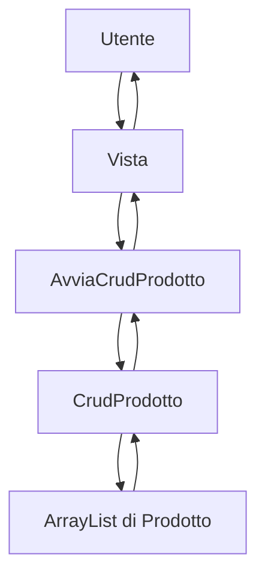
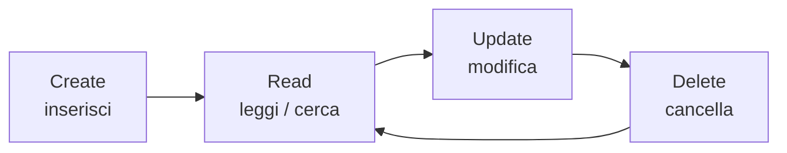

# UD12B - Laboratorio: CRUD completo da console su Prodotto

## Obiettivo del laboratorio

In questo laboratorio realizzerai una piccola applicazione Java da console per gestire un archivio di prodotti.

L'applicazione userà una struttura a pacchetti ispirata a una separazione semplificata delle responsabilità:

```text
controller
model
model.dao
view
```

Il laboratorio non spiega in profondità il pattern MVC. Il concetto viene trattato in una unità separata.

Qui l'obiettivo è costruire un CRUD funzionante usando uno stile simile al progetto `GestionePersona`.

---

## 1. Che cosa realizzerai

L'applicazione permetterà di:

| Operazione | Azione |
|---|---|
| Create | Inserire un nuovo prodotto |
| Read | Visualizzare tutti i prodotti |
| Read | Cercare un prodotto per ID |
| Read | Cercare prodotti per nome |
| Update | Modificare un prodotto esistente |
| Delete | Cancellare un prodotto esistente |

I dati saranno salvati in memoria dentro un `ArrayList`.

Quando il programma termina, i dati vengono persi.

---

## 2. Prerequisiti

Prima di svolgere questo laboratorio devi conoscere:

- classi e oggetti;
- costruttori;
- costruttore vuoto;
- costruttore di copia;
- attributi `private`;
- getter e setter;
- `ArrayList`;
- cicli;
- `switch`;
- `Scanner`;
- `try/catch` di base;
- package Java.

---

## 3. Struttura del progetto

Crea questa struttura:

```text
GestioneProdotto/
└── src/
    ├── controller/
    │   └── AvviaCrudProdotto.java
    ├── model/
    │   ├── Prodotto.java
    │   └── dao/
    │       └── CrudProdotto.java
    └── view/
        └── Vista.java
```

A compilazione avvenuta, useremo una cartella `bin` per i file `.class`.

```text
GestioneProdotto/
├── src/
└── bin/
```

---

## 4. Schema generale



---

## 5. Responsabilità delle classi

| Classe | Package | Responsabilità |
|---|---|---|
| `Prodotto` | `model` | Rappresenta un singolo prodotto |
| `CrudProdotto` | `model.dao` | Gestisce l'archivio in memoria |
| `Vista` | `view` | Gestisce input e output da console |
| `AvviaCrudProdotto` | `controller` | Contiene il `main` e coordina il programma |

---

## 6. Classe `Prodotto`

Crea il file:

```text
src/model/Prodotto.java
```

Codice:

```java
package model;

public class Prodotto {
    private int id;
    private String nome;
    private String descrizione;
    private String categoria;
    private double prezzo;
    private int quantita;

    public Prodotto() {
    }

    public Prodotto(Prodotto p) {
        this.id = p.getId();
        this.nome = p.getNome();
        this.descrizione = p.getDescrizione();
        this.categoria = p.getCategoria();
        this.prezzo = p.getPrezzo();
        this.quantita = p.getQuantita();
    }

    public Prodotto(int id, String nome, String descrizione, String categoria, double prezzo, int quantita) {
        this.id = id;
        this.nome = nome;
        this.descrizione = descrizione;
        this.categoria = categoria;
        this.prezzo = prezzo;
        this.quantita = quantita;
    }

    public int getId() {
        return id;
    }

    public String getNome() {
        return nome;
    }

    public String getDescrizione() {
        return descrizione;
    }

    public String getCategoria() {
        return categoria;
    }

    public double getPrezzo() {
        return prezzo;
    }

    public int getQuantita() {
        return quantita;
    }

    public void setId(int id) {
        if (id > 0) {
            this.id = id;
        }
    }

    public void setNome(String nome) {
        if (nome != null && !nome.trim().isEmpty()) {
            this.nome = nome.trim();
        }
    }

    public void setDescrizione(String descrizione) {
        if (descrizione != null && !descrizione.trim().isEmpty()) {
            this.descrizione = descrizione.trim();
        }
    }

    public void setCategoria(String categoria) {
        if (categoria != null && !categoria.trim().isEmpty()) {
            this.categoria = categoria.trim();
        }
    }

    public void setPrezzo(double prezzo) {
        if (prezzo >= 0) {
            this.prezzo = prezzo;
        }
    }

    public void setQuantita(int quantita) {
        if (quantita >= 0) {
            this.quantita = quantita;
        }
    }

    @Override
    public String toString() {
        return "ID: " + id
                + " | Nome: " + nome
                + " | Descrizione: " + descrizione
                + " | Categoria: " + categoria
                + " | Prezzo: " + prezzo + " euro"
                + " | Quantita: " + quantita;
    }
}
```

---

## 7. Nota didattica sulla creazione del prodotto

In questo laboratorio il prodotto viene creato come nel progetto di riferimento:

```java
Prodotto p = new Prodotto();
vista.inserisciProdotto(p);
crud.inserisci(p);
```

Quindi non useremo una forma come questa:

```java
crud.creaProdotto(nome, descrizione, categoria, prezzo, quantita);
```

Il motivo è didattico: vogliamo rendere visibile il ciclo:

```text
creazione oggetto vuoto
valorizzazione tramite setter
controllo ID duplicato
inserimento nell'ArrayList
```

---

## 8. Classe `CrudProdotto`

Crea il file:

```text
src/model/dao/CrudProdotto.java
```

Codice:

```java
package model.dao;

import java.util.ArrayList;
import model.Prodotto;

public class CrudProdotto {
    private ArrayList<Prodotto> dbProdotti;

    public CrudProdotto() {
        this.dbProdotti = new ArrayList<Prodotto>();
    }

    public void inserisci(Prodotto p) {
        dbProdotti.add(p);
    }

    public void modifica(int indice, Prodotto p) {
        dbProdotti.set(indice, p);
    }

    public void cancella(int indice) {
        dbProdotti.remove(indice);
    }

    public Prodotto leggi(int indice) {
        return dbProdotti.get(indice);
    }
/* Firma di  un metodo: tipo_restituito; nome_metodo; tipi_dei_parametri
int somma();
int somma(int,int);
int somma(double, double);
int somma(double, int);
*/


    public ArrayList<Prodotto> leggi() {
        return dbProdotti;
    }

    public int getIndice(int id) {
        for (int i = 0; i < dbProdotti.size(); i++) {
            if (id == dbProdotti.get(i).getId()) {
                return i;
            }
        }
        return -1;
    }

    public ArrayList<Prodotto> cercaPerNome(String testo) {
        ArrayList<Prodotto> risultati = new ArrayList<Prodotto>();
        String testoMinuscolo = testo.toLowerCase();

        for (int i = 0; i < dbProdotti.size(); i++) {
            Prodotto p = dbProdotti.get(i);
            if (p.getNome().toLowerCase().contains(testoMinuscolo)) {
                risultati.add(p);
            }
        }
        return risultati;
    }
}
```

---

## 9. Osservazioni su `CrudProdotto`

La classe `CrudProdotto` contiene l'archivio in memoria:

```java
private ArrayList<Prodotto> dbProdotti;
```

Le operazioni principali sono:

```java
inserisci
modifica
cancella
leggi
getIndice
cercaPerNome
```

Il metodo `getIndice` cerca un prodotto in base all'ID e restituisce la posizione nell'`ArrayList`.

Se non trova nulla, restituisce:

```java
-1
```

Questa convenzione sarà usata nel controller per capire se il prodotto esiste.

---

## 10. Classe `Vista`

Crea il file:

```text
src/view/Vista.java
```

Codice:

```java
package view;

import java.util.ArrayList;
import java.util.Scanner;
import model.Prodotto;

public class Vista {
    private Scanner input;

    public Vista() {
        this.input = new Scanner(System.in);
    }

    public int leggiIntero(String messaggio) {
        int numero = 0;
        boolean valido = false;

        while (!valido) {
            System.out.print(messaggio + " ");
            String valore = input.nextLine().trim();

            try {
                numero = Integer.parseInt(valore);
                valido = true;
            } catch (NumberFormatException e) {
                stampa("Errore: inserire un numero intero valido.");
            }
        }

        return numero;
    }

    public double leggiDecimale(String messaggio) {
        double numero = 0;
        boolean valido = false;

        while (!valido) {
            System.out.print(messaggio + " ");
            String valore = input.nextLine().trim().replace(",", ".");

            try {
                numero = Double.parseDouble(valore);
                valido = true;
            } catch (NumberFormatException e) {
                stampa("Errore: inserire un numero decimale valido.");
            }
        }

        return numero;
    }

    public String leggiStringa(String messaggio) {
        System.out.print(messaggio + " ");
        return input.nextLine();
    }

    public String leggiStringaObbligatoria(String messaggio) {
        String valore = "";

        while (valore.trim().isEmpty()) {
            System.out.print(messaggio + " ");
            valore = input.nextLine().trim();

            if (valore.isEmpty()) {
                stampa("Errore: il valore non può essere vuoto.");
            }
        }

        return valore;
    }

    public void stampa(String messaggio) {
        System.out.println(messaggio);
    }

    public void menu() {
        System.out.println("================================");
        System.out.println("      GESTIONE PRODOTTI");
        System.out.println("================================");
        System.out.println("0) Inserimento dati di esempio");
        System.out.println("1) Inserimento prodotto");
        System.out.println("2) Modifica prodotto");
        System.out.println("3) Cancella prodotto");
        System.out.println("4) Visualizza prodotti");
        System.out.println("5) Cerca prodotto per ID");
        System.out.println("6) Cerca prodotto per nome");
        System.out.println("7) Esci");
        System.out.println("================================");
    }

    public void inserisciProdotto(Prodotto p) {
        p.setId(leggiIntero("ID:"));
        p.setNome(leggiStringaObbligatoria("Nome:"));
        p.setDescrizione(leggiStringaObbligatoria("Descrizione:"));
        p.setCategoria(leggiStringaObbligatoria("Categoria:"));
        p.setPrezzo(leggiDecimale("Prezzo:"));
        p.setQuantita(leggiIntero("Quantità:"));
    }

    public void visualizza(ArrayList<Prodotto> dbProdotti) {
        if (dbProdotti.isEmpty()) {
            stampa("Nessun prodotto presente.");
            return;
        }

        for (int i = 0; i < dbProdotti.size(); i++) {
            System.out.println(dbProdotti.get(i).toString());
        }
    }

    public void visualizzaProdotto(Prodotto p) {
        System.out.println("Id: " + p.getId());
        System.out.println("Nome: " + p.getNome());
        System.out.println("Descrizione: " + p.getDescrizione());
        System.out.println("Categoria: " + p.getCategoria());
        System.out.println("Prezzo: " + p.getPrezzo());
        System.out.println("Quantità: " + p.getQuantita());
    }

    public int cercaID() {
        return leggiIntero("Scegli un id:");
    }

    public void modificaProdotto(Prodotto pt) {
        String modifica;

        modifica = leggiStringa("Nome [" + pt.getNome() + "]:");
        if (!modifica.equals("")) {
            pt.setNome(modifica);
        }

        modifica = leggiStringa("Descrizione [" + pt.getDescrizione() + "]:");
        if (!modifica.equals("")) {
            pt.setDescrizione(modifica);
        }

        modifica = leggiStringa("Categoria [" + pt.getCategoria() + "]:");
        if (!modifica.equals("")) {
            pt.setCategoria(modifica);
        }

        modifica = leggiStringa("Prezzo [" + pt.getPrezzo() + "]:");
        if (!modifica.equals("")) {
            try {
                pt.setPrezzo(Double.parseDouble(modifica.replace(",", ".")));
            } catch (NumberFormatException e) {
                stampa("Prezzo non valido: valore precedente mantenuto.");
            }
        }

        modifica = leggiStringa("Quantità [" + pt.getQuantita() + "]:");
        if (!modifica.equals("")) {
            try {
                pt.setQuantita(Integer.parseInt(modifica));
            } catch (NumberFormatException e) {
                stampa("Quantità non valida: valore precedente mantenuto.");
            }
        }
    }

    public void pausa() {
        leggiStringa("Premi INVIO per continuare ...");
    }
}
```

---

## 11. Nota didattica sullo Scanner

Lo `Scanner` non viene passato dal controller alla vista.

La classe `Vista` lo possiede come attributo:

```java
private Scanner input;
```

e lo inizializza nel costruttore:

```java
public Vista() {
    this.input = new Scanner(System.in);
}
```

Quindi nel controller possiamo scrivere:

```java
vista.inserisciProdotto(p);
```

invece di scrivere:

```java
vista.inserisciProdotto(scanner, p);
```

Questa scelta mantiene l'input dentro la classe che si occupa dell'interazione con l'utente.

---

## 12. Classe `AvviaCrudProdotto`

Crea il file:

```text
src/controller/AvviaCrudProdotto.java
```

Codice:

```java
package controller;

import model.Prodotto;
import model.dao.CrudProdotto;
import view.Vista;

public class AvviaCrudProdotto {
    public static void main(String[] args) {
        Prodotto p;
        Prodotto copiaProdotto;
        Prodotto prodottoTrovato;
        int scelta;
        int idDaCercare;
        int indice;
        String risposta;

        Vista vista = new Vista();
        CrudProdotto crud = new CrudProdotto();

        do {
            vista.menu();
            scelta = vista.leggiIntero("Che operazione vuoi eseguire?");

            switch (scelta) {
                case 0:
                    caricaDatiEsempio(crud, vista);
                    break;

                case 1:
                    vista.stampa("*** INSERIMENTO ***");
                    p = new Prodotto();
                    vista.inserisciProdotto(p);

                    while (crud.getIndice(p.getId()) != -1) {
                        vista.stampa("ID già presente.");
                        p.setId(vista.leggiIntero("Inserire un nuovo ID:"));
                    }

                    crud.inserisci(p);
                    vista.stampa("Prodotto inserito correttamente.");
                    break;

                case 2:
                    vista.stampa("*** MODIFICA ***");
                    vista.visualizza(crud.leggi());

                    idDaCercare = vista.cercaID();
                    indice = crud.getIndice(idDaCercare);

                    if (indice != -1) {
                        prodottoTrovato = crud.leggi(indice);
                        copiaProdotto = new Prodotto(prodottoTrovato);

                        vista.stampa("Prodotto selezionato:");
                        vista.visualizzaProdotto(copiaProdotto);

                        vista.modificaProdotto(copiaProdotto);

                        risposta = vista.leggiStringa("Confermi la modifica (s/n)?");
                        if (risposta.equalsIgnoreCase("s")) {
                            crud.modifica(indice, copiaProdotto);
                            vista.stampa("Modifica effettuata.");
                        } else {
                            vista.stampa("Modifica annullata.");
                        }
                    } else {
                        vista.stampa("ID " + idDaCercare + " non trovato.");
                    }
                    break;

                case 3:
                    vista.stampa("*** CANCELLA ***");
                    vista.visualizza(crud.leggi());

                    idDaCercare = vista.cercaID();
                    indice = crud.getIndice(idDaCercare);

                    if (indice != -1) {
                        vista.stampa("Prodotto da cancellare:");
                        vista.visualizzaProdotto(crud.leggi(indice));

                        risposta = vista.leggiStringa("Vuoi cancellare questo prodotto (s/n)?");
                        if (risposta.equalsIgnoreCase("s")) {
                            crud.cancella(indice);
                            vista.stampa("Cancellazione effettuata.");
                        } else {
                            vista.stampa("Cancellazione annullata.");
                        }
                    } else {
                        vista.stampa("ID " + idDaCercare + " non trovato.");
                    }
                    break;

                case 4:
                    vista.stampa("*** VISUALIZZA ***");
                    vista.visualizza(crud.leggi());
                    break;

                case 5:
                    vista.stampa("*** CERCA PER ID ***");
                    idDaCercare = vista.cercaID();
                    indice = crud.getIndice(idDaCercare);

                    if (indice != -1) {
                        vista.visualizzaProdotto(crud.leggi(indice));
                    } else {
                        vista.stampa("ID " + idDaCercare + " non trovato.");
                    }
                    break;

                case 6:
                    vista.stampa("*** CERCA PER NOME ***");
                    String testo = vista.leggiStringaObbligatoria("Testo da cercare nel nome:");
                    vista.visualizza(crud.cercaPerNome(testo));
                    break;

                case 7:
                    vista.stampa("Chiusura programma.");
                    break;

                default:
                    vista.stampa("Scelta non valida.");
            }

            if (scelta != 7) {
                vista.pausa();
            }

        } while (scelta != 7);

        vista.stampa("FINE");
    }

    private static void caricaDatiEsempio(CrudProdotto crud, Vista vista) {
        if (crud.getIndice(1) != -1) {
            vista.stampa("Dati di esempio già caricati.");
            return;
        }

        crud.inserisci(new Prodotto(1, "Notebook", "Computer portatile 15 pollici", "Informatica", 799.90, 5));
        crud.inserisci(new Prodotto(2, "Mouse", "Mouse ottico USB", "Accessori", 12.50, 30));
        crud.inserisci(new Prodotto(3, "Monitor", "Monitor LED 24 pollici", "Informatica", 149.99, 8));
        crud.inserisci(new Prodotto(4, "Tastiera", "Tastiera meccanica", "Accessori", 59.90, 12));

        vista.stampa("Dati di esempio caricati.");
    }
}
```

---

## 13. Compilazione

Apri il terminale nella cartella principale del progetto:

```text
GestioneProdotto/
```

Compila:

```bash
javac -d bin src/model/Prodotto.java src/model/dao/CrudProdotto.java src/view/Vista.java src/controller/AvviaCrudProdotto.java
```

---

## 14. Esecuzione

Sempre dalla cartella principale del progetto:

```bash
java -cp bin controller.AvviaCrudProdotto
```

Output atteso iniziale:

```text
================================
      GESTIONE PRODOTTI
================================
0) Inserimento dati di esempio
1) Inserimento prodotto
2) Modifica prodotto
3) Cancella prodotto
4) Visualizza prodotti
5) Cerca prodotto per ID
6) Cerca prodotto per nome
7) Esci
================================
Che operazione vuoi eseguire?
```

---

## 15. Flusso consigliato di test

### Test 1 - Visualizzare archivio vuoto

Scegli:

```text
4
```

Output atteso:

```text
Nessun prodotto presente.
```

---

### Test 2 - Caricare dati di esempio

Scegli:

```text
0
```

Output atteso:

```text
Dati di esempio caricati.
```

---

### Test 3 - Visualizzare prodotti

Scegli:

```text
4
```

Dovrai vedere i prodotti di esempio.

---

### Test 4 - Inserire un nuovo prodotto

Scegli:

```text
1
```

Inserisci:

```text
ID: 5
Nome: Webcam
Descrizione: Webcam Full HD
Categoria: Accessori
Prezzo: 39.90
Quantità: 10
```

Output atteso:

```text
Prodotto inserito correttamente.
```

---

### Test 5 - Provare un ID duplicato

Scegli:

```text
1
```

Inserisci un ID già presente, per esempio:

```text
ID: 1
```

Output atteso:

```text
ID già presente.
Inserire un nuovo ID:
```

---

### Test 6 - Cercare per ID

Scegli:

```text
5
```

Inserisci:

```text
1
```

Dovrai vedere il prodotto con ID `1`.

---

### Test 7 - Cercare per nome

Scegli:

```text
6
```

Inserisci:

```text
mo
```

Il programma mostrerà i prodotti il cui nome contiene `mo`.

Esempi possibili:

```text
Mouse
Monitor
```

---

### Test 8 - Modificare un prodotto

Scegli:

```text
2
```

Inserisci l'ID del prodotto da modificare.

Durante la modifica, puoi:

- scrivere un nuovo valore;
- premere solo INVIO per mantenere il valore precedente.

Esempio:

```text
Nome [Notebook]:
Descrizione [Computer portatile 15 pollici]: Notebook 15 pollici aggiornato
Categoria [Informatica]:
Prezzo [799.9]: 749.90
Quantità [5]:
```

Poi conferma con:

```text
s
```

---

### Test 9 - Cancellare un prodotto

Scegli:

```text
3
```

Inserisci l'ID del prodotto da cancellare.

Conferma con:

```text
s
```

Il prodotto deve essere eliminato dall'archivio.

---

### Test 10 - Uscire

Scegli:

```text
7
```

Output atteso:

```text
Chiusura programma.
FINE
```

---

## 16. Schema del ciclo CRUD



---

## 17. Punti importanti del laboratorio

### 17.1 ID gestito dall'utente

In questo laboratorio l'ID viene inserito dall'utente.

Per questo motivo è necessario controllare che non sia già presente:

```java
while (crud.getIndice(p.getId()) != -1) {
    vista.stampa("ID già presente.");
    p.setId(vista.leggiIntero("Inserire un nuovo ID:"));
}
```

---

### 17.2 Modifica su copia

Durante la modifica non modifichiamo subito l'oggetto originale.

Prima creiamo una copia:

```java
copiaProdotto = new Prodotto(prodottoTrovato);
```

Poi modifichiamo la copia:

```java
vista.modificaProdotto(copiaProdotto);
```

Solo dopo la conferma sostituiamo il prodotto originale:

```java
crud.modifica(indice, copiaProdotto);
```

Questo evita modifiche accidentali prima della conferma.

---

### 17.3 Cancellazione con conferma

La cancellazione viene eseguita solo se l'utente conferma:

```java
risposta = vista.leggiStringa("Vuoi cancellare questo prodotto (s/n)?");

if (risposta.equalsIgnoreCase("s")) {
    crud.cancella(indice);
}
```

---

### 17.4 Input nella Vista

La classe `Vista` gestisce lo `Scanner` internamente.

Il controller non conosce lo scanner e non lo passa ai metodi.

---

## 18. Errori frequenti

### Errore 1 - Compilare dalla cartella sbagliata

Con i package, non compilare entrando dentro `src/controller`.

Compila dalla cartella principale del progetto:

```bash
javac -d bin src/model/Prodotto.java src/model/dao/CrudProdotto.java src/view/Vista.java src/controller/AvviaCrudProdotto.java
```

---

### Errore 2 - Eseguire la classe senza package

Questo comando è errato:

```bash
java AvviaCrudProdotto
```

Il comando corretto è:

```bash
java -cp bin controller.AvviaCrudProdotto
```

---

### Errore 3 - Cancellare usando ID invece dell'indice

Il metodo:

```java
crud.cancella(indice);
```

riceve l'indice dell'`ArrayList`, non direttamente l'ID.

Prima bisogna cercare l'indice:

```java
indice = crud.getIndice(idDaCercare);
```

---

### Errore 4 - Leggere l'oggetto prima di verificare l'indice

Prima bisogna controllare:

```java
if (indice != -1) {
    prodottoTrovato = crud.leggi(indice);
}
```

Non bisogna fare:

```java
prodottoTrovato = crud.leggi(indice);
if (indice != -1) {
    ...
}
```

Se `indice` vale `-1`, il programma genera errore.

---

## 19. Domande di comprensione

1. Quale classe contiene il metodo `main`?
2. Quale classe rappresenta un singolo prodotto?
3. Quale classe contiene l'`ArrayList`?
4. Quale classe gestisce lo `Scanner`?
5. Perché il prodotto viene creato prima vuoto e poi valorizzato?
6. Perché bisogna controllare se l'ID è già presente?
7. Perché durante la modifica viene usato un costruttore di copia?
8. Perché `cancella` riceve un indice e non direttamente un ID?
9. Da quale cartella bisogna lanciare `javac`?
10. Qual è il comando corretto per eseguire una classe con package?

---

## 20. Esercizi autonomi

### Esercizio 1 - Validare prezzo e quantità

Modifica `inserisciProdotto` in modo che:

- il prezzo non possa essere negativo;
- la quantità non possa essere negativa.

---

### Esercizio 2 - Cercare per categoria

Aggiungi in `CrudProdotto` un metodo:

```java
public ArrayList<Prodotto> cercaPerCategoria(String categoria)
```

Poi aggiungi una voce di menu per usarlo.

---

### Esercizio 3 - Valore totale magazzino

Aggiungi un metodo che calcoli il valore totale del magazzino:

```text
prezzo * quantita
```

per tutti i prodotti.

Firma suggerita:

```java
public double calcolaValoreMagazzino()
```

---

### Esercizio 4 - Prodotto più costoso

Aggiungi un metodo che restituisca il prodotto con prezzo più alto.

Firma suggerita:

```java
public Prodotto trovaProdottoPiuCostoso()
```

---

## 21. Criteri di completamento

Il laboratorio è completato quando:

- il progetto compila senza errori;
- il programma parte con il menu;
- i dati di esempio possono essere caricati;
- è possibile inserire un prodotto;
- è impedito l'inserimento di un ID duplicato;
- è possibile visualizzare tutti i prodotti;
- è possibile cercare per ID;
- è possibile cercare per nome;
- è possibile modificare un prodotto;
- è possibile cancellare un prodotto solo dopo conferma;
- il programma termina scegliendo `7`.

---

## 22. Sintesi finale

In questo laboratorio hai creato un CRUD completo da console su prodotti.

Hai usato:

- package;
- classi modello;
- classe DAO/CRUD;
- classe vista;
- classe controller;
- oggetti creati con costruttore vuoto;
- setter;
- costruttore di copia;
- `ArrayList`;
- ricerca per ID;
- modifica con conferma;
- cancellazione con conferma;
- `Scanner` gestito dentro la classe `Vista`.

Questa struttura prepara il passaggio successivo verso una spiegazione più completa di MVC e, più avanti, verso CRUD con file, database e applicazioni web.
