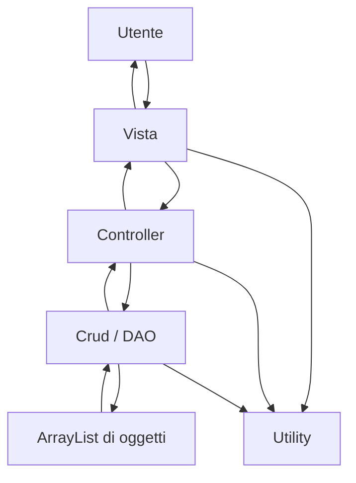
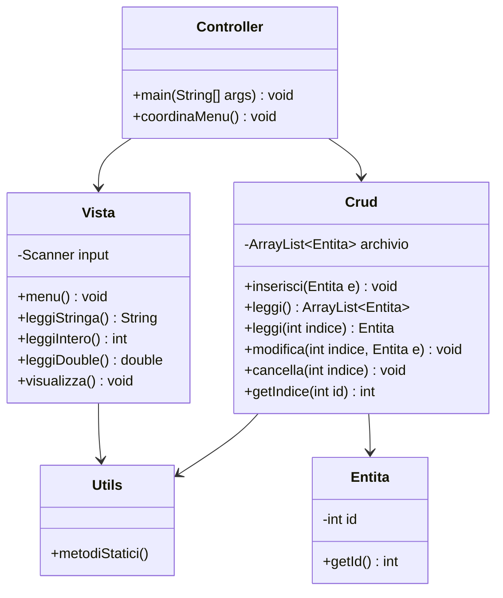

# UD12 - Challenge avanzate: CRUD console con ruoli separati, `ArrayList` e utility

## Obiettivo del file

Questo file contiene poche challenge, ma più impegnative.

L'obiettivo non è ripetere esercizi semplici su getter e setter, ma costruire piccole applicazioni console organizzate con responsabilità separate.

Ogni challenge richiede:

- una classe **model**;
- una classe **DAO/CRUD**;
- una classe **Vista**;
- una classe **Controller** con `main`;
- una o più classi **utility**;
- uso di `ArrayList`;
- CRUD completo;
- gestione dello `Scanner` solo dentro la classe `Vista`.

Le entità usate sono già familiari:

- libri;
- prodotti;
- immobili.

---

## 1. Regole comuni per tutte le challenge

Ogni progetto deve rispettare questa organizzazione:

```text
challengeXX-nome/
└── src/
    ├── controller/
    │   └── AvviaApplicazione.java
    ├── model/
    │   ├── Entita.java
    │   └── dao/
    │       └── CrudEntita.java
    ├── view/
    │   └── Vista.java
    └── util/
        ├── TestoUtils.java
        ├── NumeroUtils.java
        └── FormatoUtils.java
```

Il nome reale delle classi cambia in base alla challenge.

Esempio per i libri:

```text
challenge01-biblioteca/
└── src/
    ├── controller/
    │   └── AvviaBiblioteca.java
    ├── model/
    │   ├── Libro.java
    │   └── dao/
    │       └── CrudLibro.java
    ├── view/
    │   └── VistaBiblioteca.java
    └── util/
        ├── TestoUtils.java
        ├── NumeroUtils.java
        └── FormatoUtils.java
```

---

## 2. Regola obbligatoria sullo `Scanner`

Lo `Scanner` deve stare solo nella classe `Vista`.

Esempio corretto:

```java
public class VistaBiblioteca {
    private Scanner input;

    public VistaBiblioteca() {
        this.input = new Scanner(System.in);
    }
}
```

Il controller può usare la vista così:

```java
VistaBiblioteca vista = new VistaBiblioteca();

String titolo = vista.leggiStringaObbligatoria("Titolo:");
```

Forma vietata:

```java
Scanner scanner = new Scanner(System.in);
vista.leggiStringa(scanner, "Titolo:");
```

Il controller non deve creare né passare lo `Scanner`.

---

## 3. Regola sulle utility

Le classi utility devono contenere metodi `static`.

Non devono gestire direttamente lo `Scanner`.

La `Vista` legge una stringa da console, poi può usare le utility per validare, convertire o formattare.

Esempio:

```java
String inputUtente = input.nextLine();

if (NumeroUtils.isIntero(inputUtente)) {
    int numero = NumeroUtils.toIntero(inputUtente);
}
```

Quindi:

```text
Vista       -> legge da tastiera
Utility     -> valida, converte, formatta
Controller  -> coordina il flusso
DAO/CRUD    -> gestisce ArrayList
Model       -> rappresenta i dati
```

---

## 4. Utility minime consigliate

Puoi creare queste classi nel package `util`.

### `TestoUtils`

Metodi suggeriti:

```java
package util;

public class TestoUtils {

    public static boolean stringaVuota(String valore) {
        return valore == null || valore.trim().isEmpty();
    }

    public static String normalizza(String valore) {
        if (valore == null) {
            return "";
        }
        return valore.trim();
    }

    public static boolean contieneIgnoraMaiuscole(String testo, String ricerca) {
        if (testo == null || ricerca == null) {
            return false;
        }
        return testo.toLowerCase().contains(ricerca.toLowerCase());
    }
}
```

### `NumeroUtils`

Metodi suggeriti:

```java
package util;

public class NumeroUtils {

    public static boolean isIntero(String valore) {
        try {
            Integer.parseInt(valore);
            return true;
        } catch (NumberFormatException e) {
            return false;
        }
    }

    public static boolean isDouble(String valore) {
        try {
            Double.parseDouble(valore.replace(",", "."));
            return true;
        } catch (NumberFormatException e) {
            return false;
        }
    }

    public static int toIntero(String valore) {
        return Integer.parseInt(valore);
    }

    public static double toDouble(String valore) {
        return Double.parseDouble(valore.replace(",", "."));
    }
}
```

### `FormatoUtils`

Metodi suggeriti:

```java
package util;

public class FormatoUtils {

    public static String euro(double valore) {
        return String.format("%.2f euro", valore);
    }

    public static String percentuale(double valore) {
        return String.format("%.2f%%", valore);
    }
}
```

Queste utility sono volutamente semplici.

Non stiamo aprendo tutto il tempio oscuro delle librerie di utilità. Qui servono solo strumenti chiari e riutilizzabili.

---

## 5. Schema comune dell'architettura



---

## 6. Schema comune delle responsabilità



---

# Challenge 1 - Biblioteca console con CRUD libri

## Obiettivo

Realizzare una gestione completa di una piccola biblioteca.

Questa challenge consolida:

- model;
- DAO/CRUD;
- vista console;
- controller;
- utility;
- `ArrayList`;
- ricerca;
- modifica con copia;
- cancellazione con conferma.

---

## 1.1 Struttura richiesta

```text
challenge01-biblioteca/
└── src/
    ├── controller/
    │   └── AvviaBiblioteca.java
    ├── model/
    │   ├── Libro.java
    │   └── dao/
    │       └── CrudLibro.java
    ├── view/
    │   └── VistaBiblioteca.java
    └── util/
        ├── TestoUtils.java
        ├── NumeroUtils.java
        └── FormatoUtils.java
```

---

## 1.2 Classe `Libro`

Package:

```java
package model;
```

Attributi privati:

```java
private int id;
private String titolo;
private String autore;
private int annoPubblicazione;
private double prezzo;
private boolean disponibile;
```

Costanti richieste:

```java
public static final int ANNO_MINIMO = 1450;
public static final int ANNO_MASSIMO = 2100;
```

Costruttori richiesti:

```java
public Libro()
public Libro(int id, String titolo, String autore, int annoPubblicazione, double prezzo, boolean disponibile)
public Libro(Libro libro)
```

Il costruttore di copia servirà nella modifica con conferma.

---

## 1.3 Metodi di `Libro`

Richiesti:

```java
getId()
setId(int id)

getTitolo()
setTitolo(String titolo)

getAutore()
setAutore(String autore)

getAnnoPubblicazione()
setAnnoPubblicazione(int annoPubblicazione)

getPrezzo()
setPrezzo(double prezzo)

isDisponibile()
setDisponibile(boolean disponibile)

stampaDisponibilita()
toString()
```

Regole:

- `id` deve essere maggiore di zero;
- `titolo` non può essere vuoto;
- `autore` non può essere vuoto;
- `annoPubblicazione` deve essere tra `ANNO_MINIMO` e `ANNO_MASSIMO`;
- `prezzo` non può essere negativo.

---

## 1.4 Classe `CrudLibro`

Package:

```java
package model.dao;
```

Attributo:

```java
private ArrayList<Libro> dbLibri;
```

Metodi CRUD richiesti:

```java
public void inserisci(Libro libro)
public ArrayList<Libro> leggi()
public Libro leggi(int indice)
public void modifica(int indice, Libro libro)
public void cancella(int indice)
public int getIndice(int id)
```

Metodi di ricerca richiesti:

```java
public ArrayList<Libro> cercaPerTitolo(String testo)
public ArrayList<Libro> cercaPerAutore(String testo)
public ArrayList<Libro> cercaDisponibili()
public ArrayList<Libro> cercaPerAnnoMaggioreDi(int anno)
```

Metodi statistici richiesti:

```java
public double calcolaValoreTotale()
public Libro trovaLibroPiuCostoso()
public int contaDisponibili()
```

---

## 1.5 Classe `VistaBiblioteca`

Package:

```java
package view;
```

Attributo obbligatorio:

```java
private Scanner input;
```

Metodi minimi richiesti:

```java
public void menu()
public void stampa(String messaggio)

public String leggiStringa(String messaggio)
public String leggiStringaObbligatoria(String messaggio)
public int leggiIntero(String messaggio)
public double leggiDouble(String messaggio)
public boolean leggiBooleanSN(String messaggio)

public void inserisciLibro(Libro libro)
public void modificaLibro(Libro libro)

public void visualizzaLibro(Libro libro)
public void visualizzaLibri(ArrayList<Libro> libri)
public int chiediId()
public boolean conferma(String messaggio)
public void pausa()
```

La vista deve usare `NumeroUtils` per controllare interi e decimali.

Esempio:

```java
while (!NumeroUtils.isIntero(valore)) {
    stampa("Errore: inserire un numero intero.");
}
```

---

## 1.6 Classe `AvviaBiblioteca`

Package:

```java
package controller;
```

Il controller deve:

1. creare `VistaBiblioteca`;
2. creare `CrudLibro`;
3. mostrare il menu;
4. gestire le scelte;
5. impedire ID duplicati;
6. usare copia dell'oggetto in modifica;
7. chiedere conferma prima di modificare;
8. chiedere conferma prima di cancellare;
9. non contenere logica interna dell'`ArrayList`;
10. non creare `Scanner`.

---

## 1.7 Menu richiesto

```text
1) Carica dati di esempio
2) Inserisci libro
3) Visualizza tutti i libri
4) Cerca libro per ID
5) Cerca libri per titolo
6) Cerca libri per autore
7) Cerca libri disponibili
8) Modifica libro
9) Cancella libro
10) Statistiche biblioteca
0) Esci
```

---

## 1.8 Statistiche richieste

La voce "Statistiche biblioteca" deve mostrare:

```text
Numero totale libri
Numero libri disponibili
Valore totale catalogo
Libro più costoso
```

---

## 1.9 Test richiesti

Nel file evidence documenta:

1. caricamento dati di esempio;
2. inserimento libro valido;
3. tentativo di inserimento ID duplicato;
4. ricerca per ID esistente;
5. ricerca per ID inesistente;
6. ricerca per titolo;
7. ricerca per autore;
8. modifica con conferma;
9. modifica annullata;
10. cancellazione con conferma;
11. cancellazione annullata;
12. statistiche finali.

---

# Challenge 2 - Magazzino prodotti con CRUD e sotto-scorta

## Obiettivo

Realizzare una gestione console di prodotti di magazzino.

Questa challenge consolida il CRUD su un'entità già vista e aggiunge logiche di magazzino.

---

## 2.1 Struttura richiesta

```text
challenge02-magazzino/
└── src/
    ├── controller/
    │   └── AvviaMagazzino.java
    ├── model/
    │   ├── Prodotto.java
    │   └── dao/
    │       └── CrudProdotto.java
    ├── view/
    │   └── VistaMagazzino.java
    └── util/
        ├── TestoUtils.java
        ├── NumeroUtils.java
        └── FormatoUtils.java
```

---

## 2.2 Classe `Prodotto`

Package:

```java
package model;
```

Attributi privati:

```java
private int id;
private String nome;
private String descrizione;
private String categoria;
private double prezzo;
private int quantita;
```

Costanti richieste:

```java
public static final int SOGLIA_SOTTO_SCORTA = 5;
public static final double PREZZO_MASSIMO = 100000.0;
```

Costruttori richiesti:

```java
public Prodotto()
public Prodotto(int id, String nome, String descrizione, String categoria, double prezzo, int quantita)
public Prodotto(Prodotto prodotto)
```

---

## 2.3 Metodi di `Prodotto`

Richiesti:

```java
getId()
setId(int id)

getNome()
setNome(String nome)

getDescrizione()
setDescrizione(String descrizione)

getCategoria()
setCategoria(String categoria)

getPrezzo()
setPrezzo(double prezzo)

getQuantita()
setQuantita(int quantita)

calcolaValoreMagazzino()
sottoScorta()
toString()
```

Regole:

- `id` maggiore di zero;
- `nome` non vuoto;
- `descrizione` non vuota;
- `categoria` non vuota;
- `prezzo` compreso tra `0` e `PREZZO_MASSIMO`;
- `quantita` maggiore o uguale a zero;
- `sottoScorta()` restituisce `true` se `quantita < SOGLIA_SOTTO_SCORTA`.

---

## 2.4 Classe `CrudProdotto`

Package:

```java
package model.dao;
```

Attributo:

```java
private ArrayList<Prodotto> dbProdotti;
```

Metodi CRUD richiesti:

```java
public void inserisci(Prodotto prodotto)
public ArrayList<Prodotto> leggi()
public Prodotto leggi(int indice)
public void modifica(int indice, Prodotto prodotto)
public void cancella(int indice)
public int getIndice(int id)
```

Metodi di ricerca richiesti:

```java
public ArrayList<Prodotto> cercaPerNome(String testo)
public ArrayList<Prodotto> cercaPerCategoria(String categoria)
public ArrayList<Prodotto> prodottiSottoScorta()
```

Metodi statistici richiesti:

```java
public double calcolaValoreTotaleMagazzino()
public Prodotto trovaProdottoPiuCostoso()
public Prodotto trovaProdottoConQuantitaMinima()
public int contaProdotti()
```

---

## 2.5 Classe `VistaMagazzino`

Package:

```java
package view;
```

Attributo obbligatorio:

```java
private Scanner input;
```

Metodi richiesti:

```java
public void menu()
public void stampa(String messaggio)

public String leggiStringa(String messaggio)
public String leggiStringaObbligatoria(String messaggio)
public int leggiIntero(String messaggio)
public double leggiDouble(String messaggio)

public void inserisciProdotto(Prodotto prodotto)
public void modificaProdotto(Prodotto prodotto)

public void visualizzaProdotto(Prodotto prodotto)
public void visualizzaProdotti(ArrayList<Prodotto> prodotti)

public int chiediId()
public boolean conferma(String messaggio)
public void pausa()
```

La vista deve usare:

- `NumeroUtils` per leggere interi e decimali;
- `FormatoUtils.euro(...)` per mostrare importi;
- `TestoUtils` per controllare stringhe vuote.

---

## 2.6 Menu richiesto

```text
1) Carica dati di esempio
2) Inserisci prodotto
3) Visualizza prodotti
4) Cerca prodotto per ID
5) Cerca prodotti per nome
6) Cerca prodotti per categoria
7) Visualizza prodotti sotto scorta
8) Modifica prodotto
9) Cancella prodotto
10) Statistiche magazzino
0) Esci
```

---

## 2.7 Statistiche richieste

La voce "Statistiche magazzino" deve mostrare:

```text
Numero totale prodotti
Valore totale magazzino
Prodotto più costoso
Prodotto con quantità minima
Numero prodotti sotto scorta
```

---

## 2.8 Regole di modifica

La modifica deve essere parziale.

Esempio:

```text
Nome [Mouse]:
Descrizione [Mouse ottico USB]: Mouse ottico wireless
Categoria [Accessori]:
Prezzo [12.5]:
Quantità [10]: 8
```

Se l'utente preme solo INVIO, il valore precedente resta invariato.

La modifica deve avvenire su una copia:

```java
Prodotto copia = new Prodotto(prodottoOriginale);
```

Solo dopo conferma:

```java
crud.modifica(indice, copia);
```

---

## 2.9 Test richiesti

Nel file evidence documenta:

1. caricamento dati esempio;
2. inserimento valido;
3. tentativo di ID duplicato;
4. ricerca per nome;
5. ricerca per categoria;
6. visualizzazione sotto scorta;
7. modifica parziale;
8. modifica annullata;
9. cancellazione confermata;
10. cancellazione annullata;
11. statistiche finali;
12. input numerico non valido gestito dalla vista.

---

# Challenge 3 - Agenzia immobiliare con CRUD immobili

## Obiettivo

Realizzare una gestione console di immobili.

Questa challenge usa una nuova entità rispetto al CRUD prodotto, ma mantiene la stessa architettura.

Serve a dimostrare che la struttura:

```text
model + dao + view + controller + util
```

non dipende dall'entità specifica.

---

## 3.1 Struttura richiesta

```text
challenge03-agenzia-immobiliare/
└── src/
    ├── controller/
    │   └── AvviaAgenzia.java
    ├── model/
    │   ├── Immobile.java
    │   └── dao/
    │       └── CrudImmobile.java
    ├── view/
    │   └── VistaAgenzia.java
    └── util/
        ├── TestoUtils.java
        ├── NumeroUtils.java
        └── FormatoUtils.java
```

---

## 3.2 Classe `Immobile`

Package:

```java
package model;
```

Attributi privati:

```java
private int id;
private String indirizzo;
private String comune;
private String tipologia;
private double metriQuadri;
private double prezzo;
private boolean disponibile;
```

Costanti richieste:

```java
public static final double METRI_MINIMI = 10.0;
public static final double PREZZO_MINIMO = 1000.0;
```

Costruttori richiesti:

```java
public Immobile()
public Immobile(int id, String indirizzo, String comune, String tipologia, double metriQuadri, double prezzo, boolean disponibile)
public Immobile(Immobile immobile)
```

---

## 3.3 Metodi di `Immobile`

Richiesti:

```java
getId()
setId(int id)

getIndirizzo()
setIndirizzo(String indirizzo)

getComune()
setComune(String comune)

getTipologia()
setTipologia(String tipologia)

getMetriQuadri()
setMetriQuadri(double metriQuadri)

getPrezzo()
setPrezzo(double prezzo)

isDisponibile()
setDisponibile(boolean disponibile)

prezzoAlMetroQuadro()
immobileCostoso(double soglia)
statoDisponibilita()
toString()
```

Regole:

- `id` maggiore di zero;
- `indirizzo` non vuoto;
- `comune` non vuoto;
- `tipologia` non vuota;
- `metriQuadri >= METRI_MINIMI`;
- `prezzo >= PREZZO_MINIMO`.

---

## 3.4 Classe `CrudImmobile`

Package:

```java
package model.dao;
```

Attributo:

```java
private ArrayList<Immobile> dbImmobili;
```

Metodi CRUD richiesti:

```java
public void inserisci(Immobile immobile)
public ArrayList<Immobile> leggi()
public Immobile leggi(int indice)
public void modifica(int indice, Immobile immobile)
public void cancella(int indice)
public int getIndice(int id)
```

Metodi di ricerca richiesti:

```java
public ArrayList<Immobile> cercaPerComune(String comune)
public ArrayList<Immobile> cercaPerTipologia(String tipologia)
public ArrayList<Immobile> cercaDisponibili()
public ArrayList<Immobile> cercaSottoPrezzo(double prezzoMassimo)
public ArrayList<Immobile> cercaSopraMetri(double metriMinimi)
```

Metodi statistici richiesti:

```java
public double calcolaValorePortafoglio()
public Immobile trovaImmobilePiuCostoso()
public Immobile trovaImmobilePrezzoMqPiuAlto()
public double calcolaPrezzoMedio()
public int contaDisponibili()
```

---

## 3.5 Classe `VistaAgenzia`

Package:

```java
package view;
```

Attributo obbligatorio:

```java
private Scanner input;
```

Metodi richiesti:

```java
public void menu()
public void stampa(String messaggio)

public String leggiStringa(String messaggio)
public String leggiStringaObbligatoria(String messaggio)
public int leggiIntero(String messaggio)
public double leggiDouble(String messaggio)
public boolean leggiBooleanSN(String messaggio)

public void inserisciImmobile(Immobile immobile)
public void modificaImmobile(Immobile immobile)

public void visualizzaImmobile(Immobile immobile)
public void visualizzaImmobili(ArrayList<Immobile> immobili)

public int chiediId()
public boolean conferma(String messaggio)
public void pausa()
```

---

## 3.6 Menu richiesto

```text
1) Carica dati di esempio
2) Inserisci immobile
3) Visualizza immobili
4) Cerca immobile per ID
5) Cerca immobili per comune
6) Cerca immobili per tipologia
7) Cerca immobili disponibili
8) Cerca immobili sotto un prezzo massimo
9) Cerca immobili sopra una metratura minima
10) Modifica immobile
11) Cancella immobile
12) Statistiche agenzia
0) Esci
```

---

## 3.7 Statistiche richieste

La voce "Statistiche agenzia" deve mostrare:

```text
Numero totale immobili
Numero immobili disponibili
Valore totale portafoglio
Prezzo medio immobili
Immobile più costoso
Immobile con prezzo al metro quadro più alto
```

---

## 3.8 Uso richiesto delle utility

Usa `FormatoUtils.euro(...)` per:

- prezzo;
- prezzo medio;
- valore totale portafoglio;
- prezzo al metro quadro.

Usa `TestoUtils.contieneIgnoraMaiuscole(...)` per:

- ricerca per comune;
- ricerca per tipologia.

Usa `NumeroUtils` nella vista per leggere:

- ID;
- prezzo massimo;
- metratura minima;
- prezzo immobile;
- metri quadri.

---

## 3.9 Test richiesti

Nel file evidence documenta:

1. caricamento dati esempio;
2. inserimento immobile valido;
3. tentativo di dati non validi;
4. ricerca per ID;
5. ricerca per comune;
6. ricerca per tipologia;
7. ricerca disponibili;
8. ricerca sotto prezzo;
9. ricerca sopra metratura;
10. modifica con conferma;
11. cancellazione con conferma;
12. statistiche finali.

---

# Challenge 4 - Refactoring guidato: da prodotto a libro o immobile

## Obiettivo

Dimostrare che la stessa architettura può essere riutilizzata cambiando entità.

Questa challenge è più progettuale.

Non devi copiare e incollare alla cieca.

Devi riconoscere quali parti cambiano e quali restano simili.

Come se il copia-incolla finalmente decidesse di frequentare un corso serale di responsabilità.

---

## 4.1 Richiesta

Scegli una delle applicazioni completate:

- magazzino prodotti;
- biblioteca libri;
- agenzia immobiliare.

Poi crea una nuova applicazione simile cambiando entità.

Esempi:

```text
Prodotto -> Libro
Prodotto -> Immobile
Libro -> Prodotto
Immobile -> Libro
```

---

## 4.2 Cosa deve restare simile

Restano simili:

- struttura dei package;
- presenza di model;
- presenza di DAO;
- presenza di view;
- presenza di controller;
- uso di utility;
- uso di `ArrayList`;
- gestione dello `Scanner` nella view;
- CRUD completo;
- conferma prima di modifica e cancellazione.

---

## 4.3 Cosa deve cambiare

Devono cambiare:

- attributi dell'entità;
- validazioni;
- ricerche specifiche;
- statistiche specifiche;
- testi del menu;
- metodi di visualizzazione;
- dati di esempio.

---

## 4.4 Tabella di confronto da compilare

Nel file evidence aggiungi una tabella:

| Parte | Cosa è rimasto uguale | Cosa è cambiato |
|---|---|---|
| Model | | |
| DAO/CRUD | | |
| View | | |
| Controller | | |
| Utility | | |
| Menu | | |
| Ricerche | | |
| Statistiche | | |

---

# Criteri comuni di completamento

Ogni challenge è completata quando:

- il progetto compila senza errori;
- l'applicazione parte da console;
- il menu è leggibile;
- lo `Scanner` è presente solo nella classe `Vista`;
- il controller non crea `Scanner`;
- il DAO usa `ArrayList`;
- il CRUD è completo;
- gli ID duplicati vengono gestiti;
- la modifica usa una copia dell'oggetto;
- la cancellazione richiede conferma;
- le ricerche restituiscono risultati corretti;
- le statistiche sono coerenti;
- le utility sono usate davvero;
- input numerici errati non fanno terminare il programma;
- il file evidence è compilato.

---

# Comandi di compilazione ed esecuzione

## Esempio compilazione

Dalla cartella principale del progetto:

```bash
javac -d out src/util/*.java src/model/*.java src/model/dao/*.java src/view/*.java src/controller/*.java
```

## Esempio esecuzione

```bash
java -cp out controller.AvviaBiblioteca
```

oppure:

```bash
java -cp out controller.AvviaMagazzino
```

oppure:

```bash
java -cp out controller.AvviaAgenzia
```

---

# File di evidenza

Per ogni challenge crea:

```text
docs/evidence_challenge.md
```

Compila queste sezioni:

```text
# Evidence Challenge

## Nome challenge

## Struttura del progetto

## Classi create

## Package usati

## Model
- attributi
- validazioni
- metodi principali

## DAO/CRUD
- ArrayList usato
- metodi CRUD
- ricerche
- statistiche

## View
- Scanner interno
- metodi di input
- metodi di output
- uso utility

## Controller
- menu
- gestione scelte
- conferme
- controlli ID duplicati

## Utility
- classi utility create
- metodi static usati

## Test eseguiti
- inserimento valido
- inserimento non valido
- ID duplicato
- ricerca esistente
- ricerca inesistente
- modifica confermata
- modifica annullata
- cancellazione confermata
- cancellazione annullata
- statistiche

## Errori incontrati

## Soluzioni adottate

## Considerazioni finali
```

---

# Domande finali

Rispondi nel file evidence.

1. Perché il DAO usa `ArrayList`?
2. Perché lo `Scanner` deve stare nella classe `Vista`?
3. Perché il controller non deve contenere la logica dell'`ArrayList`?
4. Perché le utility non devono leggere direttamente da tastiera?
5. Perché conviene usare un costruttore di copia durante la modifica?
6. Perché bisogna controllare l'indice prima di leggere dall'`ArrayList`?
7. Quali parti dell'applicazione cambiano passando da `Prodotto` a `Libro`?
8. Quali parti restano simili passando da `Prodotto` a `Immobile`?
9. Quale challenge ti ha aiutato di più a capire la separazione dei ruoli?
10. Quale parte trovi ancora più difficile: model, DAO, view, controller o utility?

---

# Sintesi finale

Queste challenge preparano il passaggio da semplici classi Java a piccole applicazioni organizzate.

La regola principale è:

```text
ogni classe deve avere una responsabilità chiara
```

Il model rappresenta i dati.

Il DAO gestisce l'archivio.

La view parla con l'utente.

Il controller coordina.

Le utility aiutano con operazioni comuni.

`ArrayList` permette di gestire archivi dinamici in memoria.

Questo schema verrà ritrovato più avanti anche in applicazioni con file, database, web application e framework.
