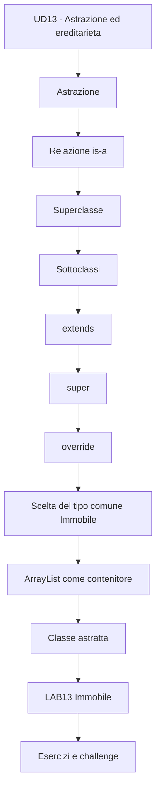
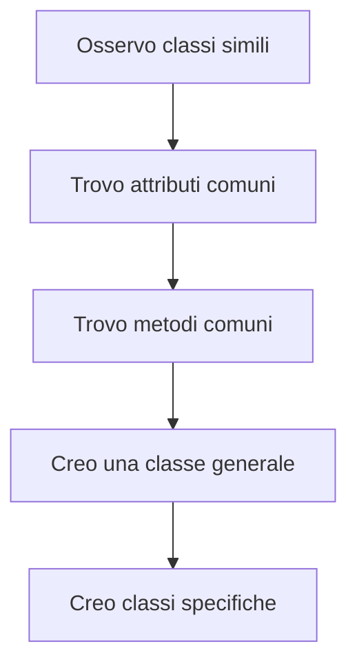
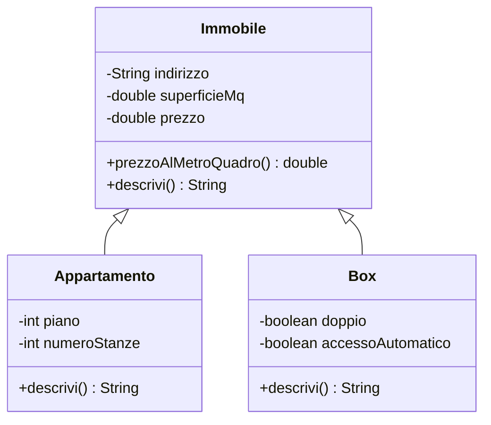
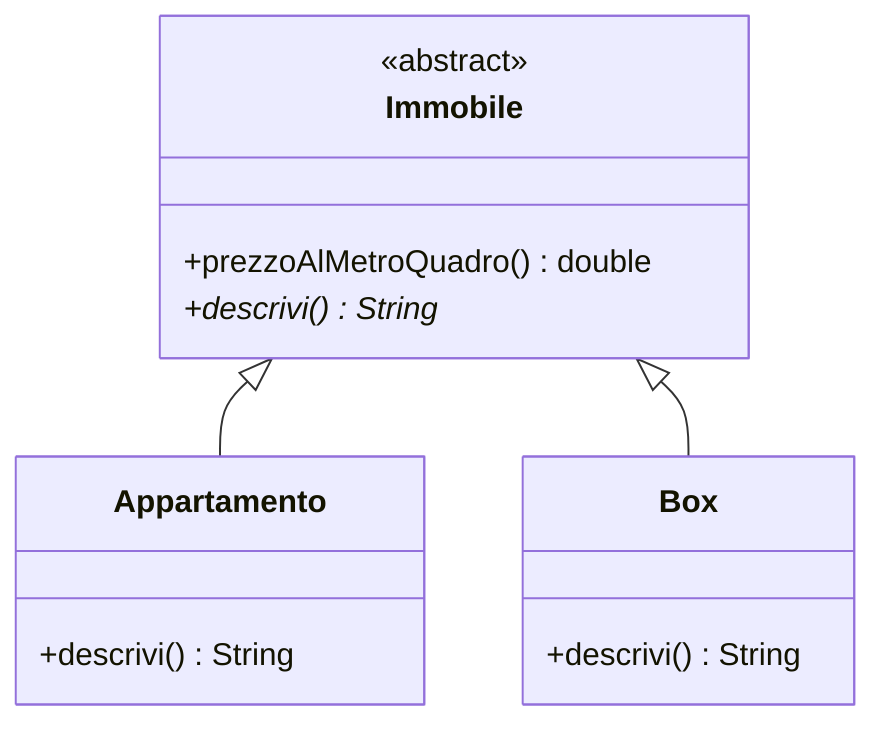
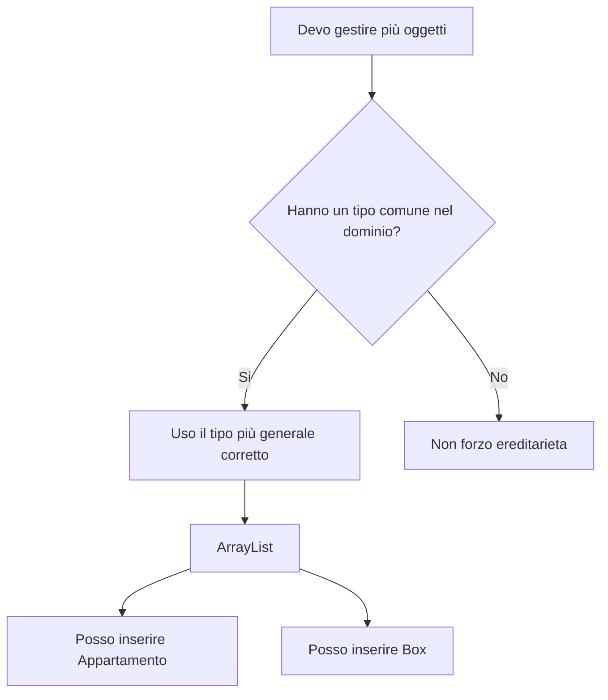
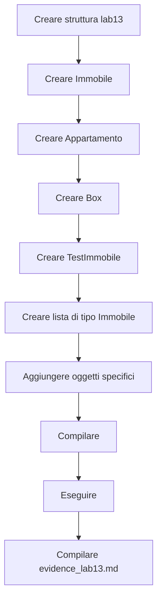
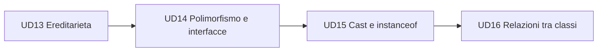

# 00 - Presentazione UD13

# Astrazione ed ereditarietà in Java

## Obiettivo della giornata

Nelle UD precedenti avete imparato a:

- creare classi e oggetti;
- usare costruttori;
- proteggere lo stato con `private`;
- usare getter e setter;
- validare i dati;
- usare `static`, `final` e wrapper class;
- gestire più oggetti scegliendo un **tipo comune** (`Immobile`) e usando `ArrayList` solo come contenitore operativo.

In questa UD fate un passo ulteriore:

```text
progettare classi più generali e classi più specifiche
```

Il tema centrale è l'ereditarietà.

---

## Perché questa UD è importante

Finora avete lavorato soprattutto con singole classi:

```text
Libro
Prodotto
Studente
ContoCorrente
```

Ora iniziate a riconoscere situazioni in cui più classi hanno dati e comportamenti comuni.

Esempio:

```text
Appartamento
Box
```

Sono diversi, ma condividono:

- indirizzo;
- superficie;
- prezzo;
- calcolo del prezzo al metro quadro.

Invece di duplicare questi elementi in ogni classe, possiamo creare una classe più generale:

```text
Immobile
```

Poi possiamo dire:

```text
Appartamento è un Immobile
Box è un Immobile
```

Questo è il punto di ingresso nell'ereditarietà.

---

## Mappa della giornata



---

## Concetto chiave 1 - Astrazione

Astrazione significa individuare ciò che è comune e importante.

Nel nostro dominio:

```text
Appartamento
Box
```

possono essere generalizzati in:

```text
Immobile
```

Schema:



---

## Concetto chiave 2 - Relazione `is-a`

L'ereditarietà è adatta quando posso dire:

```text
X è un tipo di Y
```

Esempi corretti:

| Classe specifica | Classe generale | Frase |
|---|---|---|
| `Appartamento` | `Immobile` | un appartamento è un immobile |
| `Box` | `Immobile` | un box è un immobile |
| `Studente` | `Persona` | uno studente è una persona |
| `Auto` | `Veicolo` | un'auto è un veicolo |

Esempi sbagliati:

| Errore | Perché è sbagliato |
|---|---|
| `Motore extends Auto` | un motore non è un'auto |
| `Aula extends Studente` | un'aula non è uno studente |
| `Libro extends Biblioteca` | un libro non è una biblioteca |

Quando la frase `è un tipo di` non funziona, probabilmente non serve ereditarietà. Serve un'altra relazione. Ma quella festa di frecce arriverà in UD16, con la dovuta dose di pazienza civile.

---

## Superclasse e sottoclassi

Nel laboratorio userete questa struttura:



`Immobile` contiene ciò che è comune.

`Appartamento` e `Box` contengono ciò che è specifico.

---

## `extends`

La parola chiave:

```java
extends
```

serve per dichiarare che una classe estende un'altra classe.

Esempio:

```java
public class Appartamento extends Immobile {
    ...
}
```

Significato:

```text
Appartamento è una sottoclasse di Immobile
```

---

## `super(...)`

Quando una sottoclasse viene creata, deve essere inizializzata anche la parte ereditata dalla superclasse.

Esempio:

```java
public Appartamento(String indirizzo, double superficieMq, double prezzo, int piano, int numeroStanze) {
    super(indirizzo, superficieMq, prezzo);
    this.piano = piano;
    this.numeroStanze = numeroStanze;
}
```

`super(...)` chiama il costruttore della superclasse.

---

## Override

Una sottoclasse può ridefinire un metodo ereditato.

Esempio:

```java
@Override
public String descrivi() {
    return "Appartamento in " + getIndirizzo();
}
```

Questo si chiama **overriding**.

La classe generale fornisce un comportamento base.

La classe specifica può personalizzarlo.

---

## Overloading e overriding

In questa UD chiarirete anche una distinzione importante.

| Concetto | Significato | Dove avviene |
|---|---|---|
| Overloading | stesso nome, parametri diversi | stessa classe o gerarchia |
| Overriding | stesso metodo ridefinito | superclasse e sottoclasse |

Esempio di overloading:

```java
somma(int a, int b)
somma(double a, double b)
```

Esempio di overriding:

```java
Immobile.descrivi()
Appartamento.descrivi()
Box.descrivi()
```

---


## Completamento - Classi astratte

Dopo aver capito una superclasse concreta, introdurremo anche una superclasse astratta.

La domanda è:

```text
ha senso creare direttamente un oggetto Immobile generico?
```

Nel nostro modello, spesso la risposta è no.

Vogliamo creare oggetti concreti come:

```text
Appartamento
Box
Villa
```

ma usare `Immobile` come base comune.



La forma Java sarà:

```java
public abstract class Immobile {
    public abstract String descrivi();
}
```

Questo significa:

```text
Immobile fornisce la base comune
ma ogni sottoclasse concreta deve descriversi da sola
```

Non useremo ancora le interfacce in modo operativo: quelle arrivano in UD14. Qui completiamo il discorso sull'ereditarietà.

## Perché il tipo scelto è `Immobile`

In questo punto non dobbiamo fissarci su `ArrayList`.

`ArrayList` è solo il contenitore, cioè lo strumento che permette di gestire più oggetti senza una dimensione fissa.

La scelta didattica più importante è il **tipo degli elementi**:

```java
ArrayList<Immobile> immobili = new ArrayList<>();
```

Qui il punto non è “stiamo usando una lista”.

Il punto è:

```text
la lista contiene riferimenti di tipo Immobile
```

Perché scegliamo `Immobile`?

Perché nel nostro dominio è il tipo più generale comune:

```text
Appartamento è un Immobile
Box è un Immobile
```

Quindi possiamo inserire oggetti specifici diversi dentro la stessa lista:

```java
immobili.add(new Appartamento(...));
immobili.add(new Box(...));
```

La lista è omogenea dal punto di vista del tipo dichiarato:

```text
Immobile
```

ma può contenere oggetti reali più specifici:

```text
Appartamento
Box
```

Questa è una prima applicazione concreta della relazione `is-a`.



La domanda importante non è:

```text
uso array o ArrayList?
```

La domanda importante è:

```text
qual è il tipo più generale corretto per rappresentare questi oggetti?
```

In LAB13 la risposta è:

```text
Immobile
```

---

## Struttura del laboratorio

Dovrete creare questa struttura:

```text
lab13/
  src/
    corso/
      lab13/
        Immobile.java
        Appartamento.java
        Box.java
        TestImmobile.java
  docs/
    evidence_lab13.md
```

---

## Flusso operativo



---

## Comandi fondamentali

Dalla cartella `lab13`, compilate con:

```bash
javac -d out src/corso/lab13/*.java
```

Eseguite con:

```bash
java -cp out corso.lab13.TestImmobile
```

---

## Test obbligatori

| Test | Verifica |
|---|---|
| Compilazione | il progetto compila senza errori |
| Creazione oggetti | vengono creati almeno un appartamento e un box |
| Ereditarietà | `Appartamento` e `Box` estendono `Immobile` |
| `super(...)` | le sottoclassi inizializzano la parte comune |
| Override | `descrivi()` produce output diverso per ogni sottoclasse |
| Tipo `Immobile` | la lista usa il tipo più generale del dominio |
| `ArrayList` | la lista è il contenitore operativo, non il concetto principale |
| Evidenza | il file `evidence_lab13.md` spiega le scelte |

---

## File di evidenza

Create:

```text
docs/evidence_lab13.md
```

Struttura consigliata:

```md
# Evidence LAB13

## Dati partecipante

Nome:
Data:

## Obiettivo del laboratorio

## Classi create

## Relazione is-a individuata

## Uso di extends

## Uso di super

## Metodi ridefiniti con override

## Scelta del tipo `Immobile` nella lista

## Comandi di compilazione

## Comandi di esecuzione

## Output osservato

## Errori incontrati

## Risposte alle domande

## Conclusioni
```

---

## Errori comuni da evitare

### 1. Usare ereditarietà solo per riutilizzare codice

Non basta dire:

```text
mi serve un metodo già scritto
```

La relazione deve essere corretta nel dominio.

### 2. Dimenticare `super(...)`

Se la superclasse ha un costruttore con parametri, la sottoclasse deve chiamarlo.

### 3. Duplicare attributi comuni

Se `indirizzo`, `superficieMq` e `prezzo` sono già in `Immobile`, non devono essere riscritti in `Appartamento` e `Box`.

### 4. Confondere overloading e overriding

Il nome somiglia, perché evidentemente qualcuno voleva rendere la vita più pittoresca. Ma sono concetti diversi.

---

## Piano indicativo della giornata

| Blocco | Durata indicativa |
|---|---:|
| Astrazione e relazione `is-a` | 1 ora |
| `extends`, `super(...)`, override | 1 ora e 15 minuti |
| Consolidamento overriding / confronto con overloading | 45 minuti |
| Laboratorio guidato LAB13 | 2 ore e 30 minuti |
| Classi astratte: completamento guidato | 45 minuti |
| Esercizi selezionati e file evidenza | 1 ora e 30 minuti |

Totale:

```text
circa 8 ore
```

---

## Collegamento con le prossime UD



UD13 prepara UD14.

Il completamento sulle classi astratte chiarisce che una superclasse può anche essere non istanziabile direttamente.

In UD14 vedrete che un riferimento di tipo generale, come `Immobile`, può puntare a oggetti specifici diversi e far eseguire comportamenti diversi.

UD13 costruisce le fondamenta.

UD14 ci camminerà sopra. Con cautela, si spera.

---

## Sintesi finale

La frase da ricordare è:

```text
usa ereditarietà solo quando una classe è davvero un tipo più specifico di un'altra
```

E la seconda frase è:

```text
quando gestisci più oggetti della gerarchia, scegli come tipo il riferimento più generale corretto, per esempio Immobile
```
