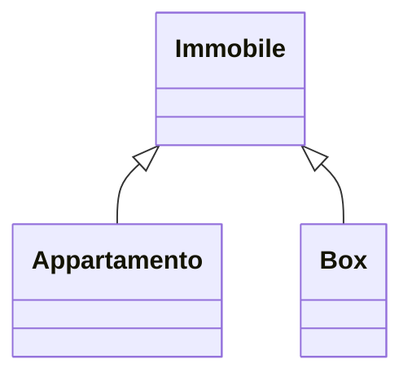
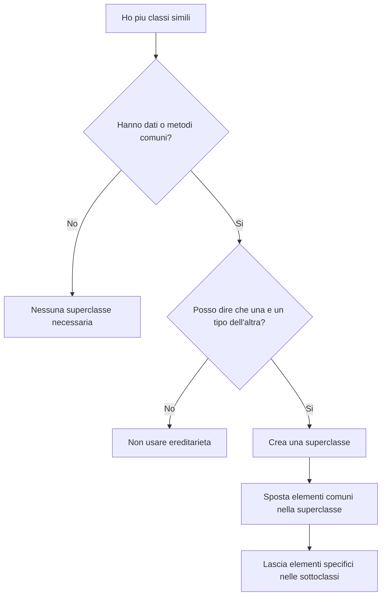

# 01. Astrazione e relazione `is-a`

## Obiettivo

In questa attività imparerai il concetto di astrazione nel contesto della programmazione orientata agli oggetti.

L'obiettivo non è ancora scrivere subito `extends`.

L'obiettivo è capire quando più classi hanno caratteristiche comuni e quando una classe può essere considerata un tipo più specifico di un'altra.

Questa è la base dell'ereditarietà.

---

## 1. Che cosa significa astrazione

Astrazione significa individuare gli elementi essenziali di un problema e ignorare i dettagli non necessari in quel momento.

Nel nostro caso significa:

```text
osservare più classi simili e individuare ciò che hanno in comune
```

Esempio:

```text
Appartamento
Box
```

Sono diversi, ma hanno alcune caratteristiche comuni:

- indirizzo;
- superficie;
- prezzo.

Possiamo generalizzare questi dati in una classe più generale:

```text
Immobile
```

---

## 2. Esempio senza astrazione

Immagina di scrivere due classi separate.

### Appartamento

```java
public class Appartamento {
    private String indirizzo;
    private double superficieMq;
    private double prezzo;
    private int piano;
    private int numeroStanze;
}
```

### Box

```java
public class Box {
    private String indirizzo;
    private double superficieMq;
    private double prezzo;
    private boolean doppio;
    private boolean accessoAutomatico;
}
```

Il codice funziona, ma contiene duplicazione.

Gli attributi comuni sono ripetuti:

```text
indirizzo
superficieMq
prezzo
```

Quando un programma cresce, questa duplicazione diventa un problema.

---

## 3. Generalizzare

Possiamo estrarre gli elementi comuni in una classe più generale.

```java
public class Immobile {
    private String indirizzo;
    private double superficieMq;
    private double prezzo;
}
```

Poi le classi specifiche manterranno solo ciò che le rende diverse.

```text
Appartamento -> piano, numeroStanze
Box -> doppio, accessoAutomatico
```

---

## 4. Superclasse e sottoclasse

La classe più generale si chiama **superclasse**.

Le classi più specifiche si chiamano **sottoclassi**.

Nel nostro esempio:

| Ruolo | Classe |
|---|---|
| Superclasse | `Immobile` |
| Sottoclasse | `Appartamento` |
| Sottoclasse | `Box` |

Schema:



---

## 5. Relazione `is-a`

L'ereditarietà deve rappresentare una relazione:

```text
is-a
```

cioè:

```text
è un tipo di
```

Esempi corretti:

```text
Appartamento è un Immobile
Box è un Immobile
Studente è una Persona
Auto è un Veicolo
```

Esempi sbagliati:

```text
Motore è un Auto
Aula è uno Studente
Libro è una Biblioteca
```

Questi esempi sbagliati non dovrebbero usare ereditarietà.

---

## 6. `is-a` e `has-a`

Non confondere:

```text
is-a = è un tipo di
has-a = ha un riferimento a / contiene
```

Esempio corretto di `is-a`:

```text
Appartamento è un Immobile
```

Esempio corretto di `has-a`:

```text
Auto ha un Motore
```

Quindi:

```java
public class Auto extends Motore
```

è sbagliato.

Una macchina non è un motore.

Una macchina ha un motore.

Il fatto che il codice possa essere scritto non significa che il modello abbia senso. Java non è ancora in grado di sospirare davanti alle scelte sbagliate, ma ci va vicino.

---

## 7. Quando usare ereditarietà

Usa ereditarietà quando:

- esiste una relazione `is-a` chiara;
- la sottoclasse è davvero un caso più specifico della superclasse;
- ci sono dati o comportamenti comuni sensati;
- le sottoclassi possono specializzare alcuni comportamenti.

Esempio:

```text
Immobile
  Appartamento
  Box
```

---

## 8. Quando non usare ereditarietà

Non usare ereditarietà quando:

- vuoi solo riutilizzare codice;
- la relazione `is-a` non è vera;
- una classe contiene l'altra;
- una classe usa l'altra solo temporaneamente.

Esempio sbagliato:

```java
public class Ordine extends Cliente {
}
```

Un ordine non è un cliente.

Probabilmente un ordine è collegato a un cliente, ma questa sarà un'altra relazione, non ereditarietà.

---

## 9. Astrazione non significa ancora `abstract class`

In questa UD la parola **astrazione** significa:

```text
individuare caratteristiche comuni
```

Non significa ancora necessariamente:

```java
abstract class
```

Le classi astratte sono un argomento successivo.

Per ora useremo una superclasse concreta:

```java
public class Immobile {
    ...
}
```

---

## 10. Perché dopo UD12 usiamo anche `ArrayList`

Dopo UD12 avete già iniziato a usare `ArrayList` per gestire più oggetti.

In UD13 useremo questa idea per conservare più oggetti di una stessa gerarchia.

Esempio:

```java
ArrayList<Immobile> immobili = new ArrayList<>();
immobili.add(new Appartamento(...));
immobili.add(new Box(...));
```

Questo funziona perché:

```text
Appartamento è un Immobile
Box è un Immobile
```

Quindi entrambi possono essere trattati come `Immobile`.

Per ora lo useremo in modo semplice.

Il polimorfismo sarà approfondito in UD14.

---

## 11. Schema mentale



---

## 12. Domande di verifica

Rispondi nel file di evidenza.

1. Che cosa significa astrazione?
2. Quali elementi comuni hanno `Appartamento` e `Box`?
3. Che cos'è una superclasse?
4. Che cos'è una sottoclasse?
5. Che cosa significa relazione `is-a`?
6. Perché `Appartamento` può essere considerato un `Immobile`?
7. Perché `Auto extends Motore` è sbagliato?
8. Che differenza c'è tra `is-a` e `has-a`?
9. Perché non bisogna usare ereditarietà solo per riutilizzare codice?
10. Perché `ArrayList<Immobile>` può contenere appartamenti e box?

---

## 13. Sintesi

La regola fondamentale è:

```text
usa ereditarietà solo quando la relazione is-a è vera
```

L'astrazione ti aiuta a individuare ciò che è comune.

L'ereditarietà ti permette di rappresentare una specializzazione.

`ArrayList` ti permette di lavorare con più oggetti della gerarchia senza tornare a strutture rigide e povere.
