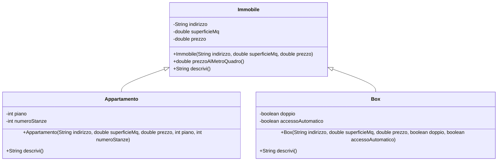

# 03. LAB13 - Astrazione ed ereditarietà con `Immobile`

## Obiettivo del laboratorio

In questo laboratorio costruirai una piccola gerarchia di classi.

La superclasse sarà:

```text
Immobile
```

Le sottoclassi saranno:

```text
Appartamento
Box
```

Il laboratorio ti farà usare:

- astrazione;
- relazione `is-a`;
- `extends`;
- `super(...)`;
- override;
- `@Override`;
- attributi `private`;
- getter e setter;
- `ArrayList` per gestire più immobili;
- package;
- progetto multi-file.

---

## Diagramma UML del laboratorio



---

## 1. Struttura da creare

Crea questa struttura:

```text
lab13/
  src/
    corso/
      lab13/
        Immobile.java
        Appartamento.java
        Box.java
        TestImmobile.java
  docs/
    evidence_lab13.md
```

Da terminale Linux, WSL o Git Bash:

```bash
mkdir -p lab13/src/corso/lab13
mkdir -p lab13/docs
cd lab13
```

Su PowerShell:

```powershell
New-Item -ItemType Directory -Force -Path lab13\src\corso\lab13
New-Item -ItemType Directory -Force -Path lab13\docs
Set-Location lab13
```

---

## 2. File `Immobile.java`

Crea:

```text
src/corso/lab13/Immobile.java
```

Inserisci:

```java
package corso.lab13;

public class Immobile {
    private String indirizzo;
    private double superficieMq;
    private double prezzo;

    public Immobile(String indirizzo, double superficieMq, double prezzo) {
        setIndirizzo(indirizzo);
        setSuperficieMq(superficieMq);
        setPrezzo(prezzo);
    }

    public String getIndirizzo() {
        return indirizzo;
    }

    public void setIndirizzo(String indirizzo) {
        if (indirizzo != null && !indirizzo.trim().isEmpty()) {
            this.indirizzo = indirizzo.trim();
        } else {
            this.indirizzo = "Indirizzo non disponibile";
        }
    }

    public double getSuperficieMq() {
        return superficieMq;
    }

    public void setSuperficieMq(double superficieMq) {
        if (superficieMq > 0) {
            this.superficieMq = superficieMq;
        } else {
            this.superficieMq = 1.0;
        }
    }

    public double getPrezzo() {
        return prezzo;
    }

    public void setPrezzo(double prezzo) {
        if (prezzo >= 0) {
            this.prezzo = prezzo;
        } else {
            this.prezzo = 0.0;
        }
    }

    public double prezzoAlMetroQuadro() {
        return prezzo / superficieMq;
    }

    public String descrivi() {
        return "Immobile in " + indirizzo
                + ", superficie " + superficieMq
                + " mq, prezzo " + prezzo
                + ", prezzo/mq " + prezzoAlMetroQuadro();
    }
}
```

### Analisi

`Immobile` contiene gli elementi comuni:

- indirizzo;
- superficie;
- prezzo;
- calcolo del prezzo al metro quadro;
- descrizione base.

Gli attributi sono `private`, coerentemente con UD12.

---

## 3. File `Appartamento.java`

Crea:

```text
src/corso/lab13/Appartamento.java
```

Inserisci:

```java
package corso.lab13;

public class Appartamento extends Immobile {
    private int piano;
    private int numeroStanze;

    public Appartamento(String indirizzo, double superficieMq, double prezzo, int piano, int numeroStanze) {
        super(indirizzo, superficieMq, prezzo);
        setPiano(piano);
        setNumeroStanze(numeroStanze);
    }

    public int getPiano() {
        return piano;
    }

    public void setPiano(int piano) {
        this.piano = piano;
    }

    public int getNumeroStanze() {
        return numeroStanze;
    }

    public void setNumeroStanze(int numeroStanze) {
        if (numeroStanze > 0) {
            this.numeroStanze = numeroStanze;
        } else {
            this.numeroStanze = 1;
        }
    }

    @Override
    public String descrivi() {
        return "Appartamento in " + getIndirizzo()
                + ", piano " + piano
                + ", stanze " + numeroStanze
                + ", superficie " + getSuperficieMq()
                + " mq, prezzo " + getPrezzo()
                + ", prezzo/mq " + prezzoAlMetroQuadro();
    }
}
```

### Analisi

`Appartamento`:

- estende `Immobile`;
- chiama `super(...)`;
- aggiunge `piano` e `numeroStanze`;
- ridefinisce `descrivi()`.

---

## 4. File `Box.java`

Crea:

```text
src/corso/lab13/Box.java
```

Inserisci:

```java
package corso.lab13;

public class Box extends Immobile {
    private boolean doppio;
    private boolean accessoAutomatico;

    public Box(String indirizzo, double superficieMq, double prezzo, boolean doppio, boolean accessoAutomatico) {
        super(indirizzo, superficieMq, prezzo);
        this.doppio = doppio;
        this.accessoAutomatico = accessoAutomatico;
    }

    public boolean isDoppio() {
        return doppio;
    }

    public void setDoppio(boolean doppio) {
        this.doppio = doppio;
    }

    public boolean isAccessoAutomatico() {
        return accessoAutomatico;
    }

    public void setAccessoAutomatico(boolean accessoAutomatico) {
        this.accessoAutomatico = accessoAutomatico;
    }

    @Override
    public String descrivi() {
        return "Box in " + getIndirizzo()
                + ", superficie " + getSuperficieMq()
                + " mq, prezzo " + getPrezzo()
                + ", doppio " + doppio
                + ", accesso automatico " + accessoAutomatico
                + ", prezzo/mq " + prezzoAlMetroQuadro();
    }
}
```

### Analisi

`Box`:

- estende `Immobile`;
- aggiunge caratteristiche specifiche;
- ridefinisce `descrivi()`.

---

## 5. File `TestImmobile.java`

Crea:

```text
src/corso/lab13/TestImmobile.java
```

Inserisci:

```java
package corso.lab13;

import java.util.ArrayList;

public class TestImmobile {

    public static void stampaArchivio(ArrayList<Immobile> immobili) {
        System.out.println("=== ARCHIVIO IMMOBILI ===");

        for (Immobile immobile : immobili) {
            System.out.println(immobile.descrivi());
        }
    }

    public static double calcolaPrezzoMedio(ArrayList<Immobile> immobili) {
        if (immobili == null || immobili.isEmpty()) {
            return 0.0;
        }

        double totale = 0.0;

        for (Immobile immobile : immobili) {
            totale += immobile.getPrezzo();
        }

        return totale / immobili.size();
    }

    public static Immobile trovaImmobilePiuCostoso(ArrayList<Immobile> immobili) {
        if (immobili == null || immobili.isEmpty()) {
            return null;
        }

        Immobile piuCostoso = immobili.get(0);

        for (Immobile immobile : immobili) {
            if (immobile.getPrezzo() > piuCostoso.getPrezzo()) {
                piuCostoso = immobile;
            }
        }

        return piuCostoso;
    }

    public static void main(String[] args) {
        ArrayList<Immobile> immobili = new ArrayList<>();

        immobili.add(new Appartamento("Via Roma 10", 85.0, 168000.0, 3, 4));
        immobili.add(new Box("Via Milano 5", 22.0, 28000.0, false, true));
        immobili.add(new Appartamento("Via Napoli 12", 110.0, 230000.0, 5, 5));
        immobili.add(new Box("Via Torino 8", 35.0, 45000.0, true, true));

        stampaArchivio(immobili);

        System.out.println();
        System.out.println("Prezzo medio: " + calcolaPrezzoMedio(immobili));

        Immobile piuCostoso = trovaImmobilePiuCostoso(immobili);
        System.out.println("Immobile più costoso:");
        System.out.println(piuCostoso.descrivi());
    }
}
```

### Analisi

Il test usa:

```java
ArrayList<Immobile>
```

per contenere oggetti `Appartamento` e `Box`.

Questo è coerente con la nuova UD12 e prepara UD14.

---

## 6. Compilazione

Dalla cartella `lab13`, compila così:

```bash
javac -d out src/corso/lab13/*.java
```

---

## 7. Esecuzione

Esegui così:

```bash
java -cp out corso.lab13.TestImmobile
```

---

## 8. Test obbligatori

### Test 1 - Compilazione

Esegui:

```bash
javac -d out src/corso/lab13/*.java
```

Verifica che non compaiano errori.

---

### Test 2 - Esecuzione

Esegui:

```bash
java -cp out corso.lab13.TestImmobile
```

Verifica che venga stampato l'archivio immobili.

---

### Test 3 - `extends`

Verifica che:

```java
public class Appartamento extends Immobile
public class Box extends Immobile
```

siano presenti.

---

### Test 4 - `super(...)`

Verifica che i costruttori delle sottoclassi chiamino il costruttore della superclasse.

---

### Test 5 - Override

Verifica che `Appartamento` e `Box` ridefiniscano:

```java
descrivi()
```

con `@Override`.

---

### Test 6 - `ArrayList`

Verifica che il programma usi:

```java
ArrayList<Immobile>
```

non un array fisso.

---

### Test 7 - Prezzo medio e immobile più costoso

Verifica che il programma calcoli:

- prezzo medio;
- immobile più costoso.

---

## 9. File di evidenza

Crea:

```text
docs/evidence_lab13.md
```

Struttura consigliata:

```md
# Evidence LAB13

## Dati partecipante

Nome:
Data:

## Obiettivo del laboratorio

## Classi create

## Superclasse

## Sottoclassi

## Relazione is-a

## Uso di extends

## Uso di super

## Metodi ridefiniti

## Uso di ArrayList

## Comandi di compilazione

## Comandi di esecuzione

## Output osservato

## Errori incontrati

## Risposte alle domande

## Conclusioni
```

---

## 10. Domande di verifica

Rispondi in `docs/evidence_lab13.md`.

1. Qual è la superclasse del laboratorio?
2. Quali sono le sottoclassi?
3. Perché `Appartamento` è un `Immobile`?
4. Perché `Box` è un `Immobile`?
5. Quali attributi sono comuni e quindi stanno in `Immobile`?
6. Quali attributi sono specifici di `Appartamento`?
7. Quali attributi sono specifici di `Box`?
8. A cosa serve `super(...)`?
9. Quale metodo viene ridefinito nelle sottoclassi?
10. Perché usiamo `ArrayList<Immobile>`?
11. Che vantaggio ha `ArrayList` rispetto a oggetti separati?
12. Che cosa succederebbe se duplicassi `indirizzo`, `superficieMq` e `prezzo` anche nelle sottoclassi?

---

## 11. Estensione facoltativa

Aggiungi una nuova sottoclasse:

```text
Villa
```

Attributi specifici:

- `double superficieGiardino`;
- `boolean piscina`.

La classe deve:

- estendere `Immobile`;
- chiamare `super(...)`;
- ridefinire `descrivi()`;
- essere aggiunta all'`ArrayList<Immobile>` nel `main`.

---

## 12. Sintesi

In questo laboratorio hai costruito una gerarchia semplice:

```text
Immobile
  Appartamento
  Box
```

Hai usato `ArrayList<Immobile>` per lavorare con più oggetti della stessa famiglia.

Il concetto centrale è:

```text
una sottoclasse eredita la parte comune e aggiunge la propria parte specifica
```
