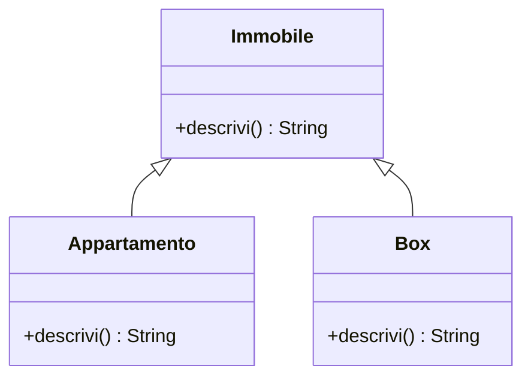
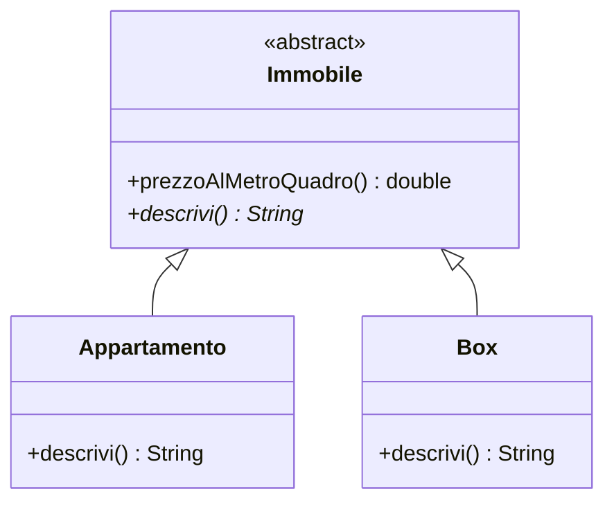
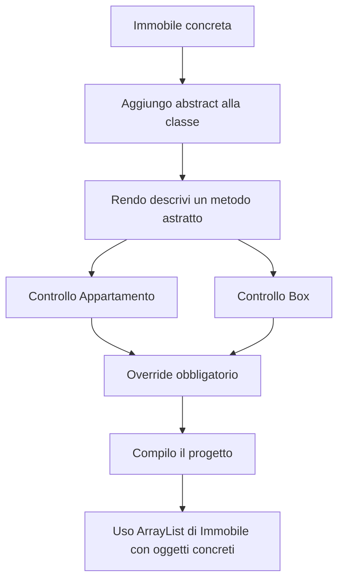

# 05. Classi astratte, `abstract class` e metodi astratti

## Obiettivo

Questo file completa la UD13 introducendo le **classi astratte** in Java.

Nella prima parte della UD13 avete usato il termine **astrazione** in senso concettuale:

```text
individuare caratteristiche comuni tra classi diverse
```

Ora introduciamo anche lo strumento Java collegato:

```java
abstract class
```

L'obiettivo non è aggiungere una parola chiave tanto per far felice il compilatore, che già riceve abbastanza attenzioni immeritate. L'obiettivo è capire quando una superclasse deve essere usata come **modello comune**, ma non deve essere istanziata direttamente.

---

## 1. Prima distinzione importante

In UD13 ci sono due livelli da distinguere.

| Termine | Significato |
|---|---|
| Astrazione concettuale | trovare dati e comportamenti comuni |
| Classe astratta Java | una classe dichiarata con `abstract` |

Quindi:

```text
abbiamo già usato astrazione come ragionamento
ora vediamo abstract come costrutto Java
```

Questa distinzione evita una confusione molto comune: pensare che ogni volta che si parla di astrazione si debba subito scrivere `abstract`. No. Prima si ragiona. Poi, eventualmente, si scrive codice. Sembra una procedura estrema, ma funziona.

---

## 2. Il problema: una superclasse concreta può essere istanziata

Nel laboratorio principale avete creato una classe `Immobile` simile a questa:

```java
public class Immobile {
    private String indirizzo;
    private double superficieMq;
    private double prezzo;

    public String descrivi() {
        return "Immobile generico";
    }
}
```

Questa classe può essere istanziata:

```java
Immobile immobile = new Immobile("Via Demo", 80.0, 150000.0);
```

Tecnicamente funziona.

Ma dal punto di vista del dominio può essere discutibile.

Nel nostro modello, un immobile reale dovrebbe essere qualcosa di più specifico:

```text
Appartamento
Box
Villa
LocaleCommerciale
```

La classe `Immobile` serve soprattutto come base comune.

---

## 3. Superclasse concreta e superclasse astratta

Una superclasse può essere:

| Tipo di superclasse | Significato | Si può fare `new`? |
|---|---|---:|
| Concreta | può rappresentare oggetti reali | sì |
| Astratta | serve come modello comune per sottoclassi | no |

Nel laboratorio iniziale `Immobile` era concreta, perché serviva a introdurre ereditarietà in modo graduale.

Ora possiamo fare un passo in più:

```java
public abstract class Immobile {
    ...
}
```

Da quel momento non sarà più possibile scrivere:

```java
new Immobile(...)
```

---

## 4. Diagramma: prima e dopo

### Prima: superclasse concreta



`Immobile` contiene un metodo `descrivi()` con una descrizione generica.

### Dopo: superclasse astratta



Il simbolo `*` accanto a `descrivi()` indica, in modo didattico, che il metodo è astratto.

---

## 5. Dichiarare una classe astratta

La sintassi è:

```java
public abstract class Immobile {
    ...
}
```

Una classe astratta:

- può avere attributi;
- può avere costruttori;
- può avere metodi concreti;
- può avere metodi astratti;
- non può essere istanziata direttamente.

Questa ultima frase è importante:

```text
una classe astratta non può essere usata con new
```

---

## 6. Metodo concreto in una classe astratta

Una classe astratta può contenere metodi già implementati.

Esempio:

```java
public double prezzoAlMetroQuadro() {
    return prezzo / superficieMq;
}
```

Questo metodo ha senso per tutti gli immobili.

Quindi può restare nella superclasse astratta.

Le sottoclassi lo ereditano senza doverlo riscrivere.

---

## 7. Metodo astratto

Un metodo astratto dichiara che una operazione deve esistere, ma non fornisce il corpo.

Esempio:

```java
public abstract String descrivi();
```

Osserva bene:

```java
public abstract String descrivi();
```

non ha graffe.

Non si scrive:

```java
public abstract String descrivi() {
    ...
}
```

Un metodo astratto dice:

```text
ogni sottoclasse concreta dovrà fornire la propria versione
```

---

## 8. Refactoring di `Immobile`

Versione aggiornata di `Immobile.java`:

```java
package corso.lab13;

public abstract class Immobile {
    private String indirizzo;
    private double superficieMq;
    private double prezzo;

    public Immobile(String indirizzo, double superficieMq, double prezzo) {
        setIndirizzo(indirizzo);
        setSuperficieMq(superficieMq);
        setPrezzo(prezzo);
    }

    public String getIndirizzo() {
        return indirizzo;
    }

    public void setIndirizzo(String indirizzo) {
        if (indirizzo != null && !indirizzo.trim().isEmpty()) {
            this.indirizzo = indirizzo.trim();
        } else {
            this.indirizzo = "Indirizzo non disponibile";
        }
    }

    public double getSuperficieMq() {
        return superficieMq;
    }

    public void setSuperficieMq(double superficieMq) {
        if (superficieMq > 0) {
            this.superficieMq = superficieMq;
        } else {
            this.superficieMq = 1.0;
        }
    }

    public double getPrezzo() {
        return prezzo;
    }

    public void setPrezzo(double prezzo) {
        if (prezzo >= 0) {
            this.prezzo = prezzo;
        } else {
            this.prezzo = 0.0;
        }
    }

    public double prezzoAlMetroQuadro() {
        return prezzo / superficieMq;
    }

    public abstract String descrivi();
}
```

Cosa è cambiato?

```java
public abstract class Immobile
```

La classe è diventata astratta.

```java
public abstract String descrivi();
```

Il metodo `descrivi()` non ha più una versione generica.

Ogni sottoclasse deve fornire la propria descrizione.

---

## 9. Le sottoclassi devono implementare il metodo astratto

`Appartamento` deve avere:

```java
@Override
public String descrivi() {
    return "Appartamento in " + getIndirizzo()
            + ", piano " + piano
            + ", stanze " + numeroStanze
            + ", superficie " + getSuperficieMq()
            + " mq, prezzo " + getPrezzo()
            + ", prezzo/mq " + prezzoAlMetroQuadro();
}
```

`Box` deve avere:

```java
@Override
public String descrivi() {
    return "Box in " + getIndirizzo()
            + ", superficie " + getSuperficieMq()
            + " mq, prezzo " + getPrezzo()
            + ", doppio " + doppio
            + ", accesso automatico " + accessoAutomatico
            + ", prezzo/mq " + prezzoAlMetroQuadro();
}
```

Se una sottoclasse concreta non implementa `descrivi()`, il compilatore segnala errore.

E per una volta ha ragione senza bisogno di negoziare.

---

## 10. Cosa succede nel `main`

Questo resta corretto:

```java
ArrayList<Immobile> immobili = new ArrayList<>();

immobili.add(new Appartamento("Via Roma 10", 85.0, 168000.0, 3, 4));
immobili.add(new Box("Via Milano 5", 22.0, 28000.0, false, true));
```

Perché non stai creando oggetti `Immobile`.

Stai creando oggetti concreti `Appartamento` e `Box`, poi li stai trattando come `Immobile`.

Questo prepara direttamente UD14 sul polimorfismo.

---

## 11. Cosa non è più permesso

Dopo aver reso `Immobile` astratta, questo non compila:

```java
Immobile immobile = new Immobile("Via Demo", 80.0, 150000.0);
```

Errore atteso:

```text
Immobile is abstract; cannot be instantiated
```

Questo errore è corretto.

Significa che il modello impedisce di creare oggetti troppo generici.

---

## 12. Flusso del refactoring



---

## 13. Classe astratta e costruttore

Una classe astratta può avere un costruttore.

Questo può sembrare strano:

```java
public abstract class Immobile {
    public Immobile(String indirizzo, double superficieMq, double prezzo) {
        ...
    }
}
```

Se non posso fare `new Immobile(...)`, a cosa serve il costruttore?

Serve alle sottoclassi.

Quando scrivi:

```java
super(indirizzo, superficieMq, prezzo);
```

il costruttore della superclasse viene comunque eseguito.

Quindi:

```text
non puoi creare direttamente un Immobile
ma ogni Appartamento e ogni Box costruisce anche la parte Immobile ereditata
```

---

## 14. Classe astratta o interfaccia?

Per ora basta questa distinzione minima.

| Domanda | Scelta probabile |
|---|---|
| Devo condividere stato comune? | classe astratta |
| Devo condividere metodi già implementati? | classe astratta |
| Devo definire solo una capacità comune? | interfaccia |
| Classi diverse devono promettere lo stesso comportamento? | interfaccia |

Nel nostro dominio:

```text
Immobile
```

è una buona candidata a classe astratta perché contiene stato comune:

- indirizzo;
- superficie;
- prezzo.

In UD14 vedrete invece un'interfaccia come:

```java
public interface Pubblicabile {
    String creaAnnuncio();
}
```

`Pubblicabile` non rappresenta una famiglia di oggetti con stato comune.

Rappresenta una capacità:

```text
sa creare un annuncio
```

---

## 15. Esercizio guidato

Parti dal laboratorio `Immobile` già svolto.

Esegui queste modifiche:

1. modifica `Immobile` in `abstract class`;
2. trasforma `descrivi()` in metodo astratto;
3. verifica che `Appartamento` e `Box` abbiano `@Override` su `descrivi()`;
4. prova a compilare;
5. aggiungi temporaneamente nel `main` questa riga:

```java
// Immobile errore = new Immobile("Via Errore", 10.0, 1000.0);
```

6. togli il commento, osserva l'errore di compilazione, poi rimetti il commento;
7. documenta l'errore nel file di evidenza.

Non lasciare il codice errato attivo nel progetto finale. Il laboratorio deve compilare, non diventare un museo dell'incidente.

---

## 16. Challenge breve

Aggiungi una nuova sottoclasse:

```text
Villa
```

Attributi specifici:

- `double superficieGiardino`;
- `boolean piscina`.

Requisiti:

- `Villa extends Immobile`;
- chiama `super(...)` nel costruttore;
- implementa `descrivi()`;
- aggiunge oggetti `Villa` all'`ArrayList<Immobile>`;
- verifica che il ciclo stampi descrizioni diverse.

---

## 17. Domande di verifica

Rispondi nel file di evidenza.

1. Che differenza c'è tra astrazione concettuale e `abstract class`?
2. Perché `Immobile` può essere una classe astratta?
3. Una classe astratta può avere attributi?
4. Una classe astratta può avere costruttori?
5. Perché una classe astratta non può essere istanziata direttamente?
6. Che cos'è un metodo astratto?
7. Perché `descrivi()` può essere astratto in `Immobile`?
8. Che cosa succede se una sottoclasse concreta non implementa un metodo astratto?
9. Perché `prezzoAlMetroQuadro()` resta un metodo concreto?
10. Che differenza iniziale c'è tra classe astratta e interfaccia?

---

## 18. Sintesi

La regola principale è:

```text
usa una classe astratta quando vuoi una base comune non istanziabile direttamente
```

Nel nostro caso:

```text
Immobile è una base comune
Appartamento, Box e Villa sono oggetti concreti
```

La forma finale è:

```java
public abstract class Immobile {
    public abstract String descrivi();
}
```

Le sottoclassi concrete devono completare ciò che la superclasse astratta lascia volutamente aperto.
