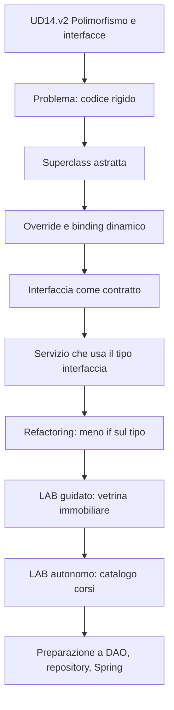
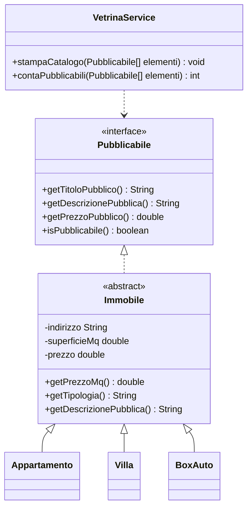

# 00 - Presentazione UD14.v2

# Polimorfismo e interfacce

## Obiettivo della giornata

In questa unità si passa da una gerarchia di classi semplicemente corretta a una struttura realmente utilizzabile in un'applicazione.

Il concetto centrale è:

```text
un servizio deve poter lavorare con comportamenti comuni senza dipendere dalle classi concrete
```

Questo significa che il codice deve poter trattare oggetti diversi attraverso:

- una superclasse astratta;
- una interfaccia;
- un riferimento di tipo generale.

---

## Problema di partenza

Supponiamo di avere tre classi:

```text
Appartamento
Villa
BoxAuto
```

Tutte rappresentano immobili, ma ognuna ha caratteristiche specifiche.

Una soluzione rigida tende a produrre metodi separati:

```java
stampaAppartamento(appartamento);
stampaVilla(villa);
stampaBoxAuto(boxAuto);
```

Oppure codice condizionale basato sul tipo:

```java
if (tipo.equals("villa")) {
    // stampa dati villa
} else if (tipo.equals("appartamento")) {
    // stampa dati appartamento
} else if (tipo.equals("box")) {
    // stampa dati box
}
```

Questa soluzione funziona solo finché il dominio resta piccolo. Appena si aggiunge un nuovo tipo, il codice centrale deve essere modificato.

Una soluzione polimorfica consente invece di scrivere:

```java
Pubblicabile[] elementi = { appartamento, villa, boxAuto };

for (Pubblicabile elemento : elementi) {
    System.out.println(elemento.getTitoloPubblico());
    System.out.println(elemento.getDescrizionePubblica());
}
```

Il ciclo non conosce la classe concreta. Conosce solo il contratto `Pubblicabile`.

---

## Risultati attesi

Al termine della UD14.v2 il partecipante non deve limitarsi a riconoscere una riga di codice polimorfico. Deve essere in grado di usare polimorfismo e interfacce per progettare una piccola applicazione Java più flessibile, leggibile ed estendibile.

In particolare, il partecipante deve essere in grado di:

### 1. Comprendere il comportamento polimorfico a runtime

Dato un riferimento come:

```java
Pubblicabile elemento = new Villa("Via dei Pini 7", 180.0, 420000.0, 500.0, true);
```

deve saper spiegare:

- qual è il tipo del riferimento;
- qual è il tipo reale dell'oggetto;
- quali metodi sono visibili attraverso il riferimento;
- quale implementazione viene eseguita a runtime;
- perché l'oggetto può essere trattato come `Pubblicabile`.

Questa competenza è considerata prerequisito operativo per affrontare il resto della giornata.

### 2. Progettare classi che condividono un comportamento comune

Il partecipante deve saper individuare quando classi diverse possono essere trattate in modo uniforme attraverso un'interfaccia.

Deve quindi saper rispondere a domande come:

- quali classi hanno un comportamento comune?
- il comportamento comune rappresenta un contratto?
- conviene usare una superclass astratta, una interfaccia o entrambe?
- quali metodi devono essere obbligatori per tutte le classi coinvolte?

### 3. Usare interfacce per ridurre dipendenze tra classi

Il partecipante deve saper progettare metodi, servizi o controller che lavorano con un tipo astratto invece che con una classe concreta.

Esempio atteso:

```java
public void pubblicaElemento(Pubblicabile elemento) {
    System.out.println(elemento.getTitoloPubblico());
    System.out.println(elemento.getDescrizionePubblica());
}
```

Il partecipante deve saper spiegare perché questo approccio è più flessibile rispetto a:

```java
public void pubblicaVilla(Villa villa) {
    System.out.println(villa.getTitoloPubblico());
    System.out.println(villa.getDescrizionePubblica());
}
```

### 4. Realizzare un piccolo modello estendibile

Il partecipante deve essere in grado di implementare un modello composto da:

- una o più interfacce;
- una superclass concreta o astratta, se utile;
- più classi concrete che implementano lo stesso contratto;
- una classe di servizio che usa il tipo interfaccia;
- un programma principale che dimostra il comportamento polimorfico.

L'obiettivo non è solo far compilare il codice, ma progettare una struttura che possa essere estesa aggiungendo nuove classi senza modificare pesantemente il codice già scritto.

### 5. Effettuare un refactoring da codice rigido a codice polimorfico

Dato un codice iniziale basato su controlli espliciti del tipo, ad esempio con `if`, `switch` o `instanceof`, il partecipante deve saper proporre una soluzione alternativa basata su overriding e interfacce.

Esempio di codice da evitare quando non necessario:

```java
if (tipo.equals("villa")) {
    // stampa dati villa
} else if (tipo.equals("appartamento")) {
    // stampa dati appartamento
}
```

Esempio di direzione corretta:

```java
for (Pubblicabile elemento : elementi) {
    System.out.println(elemento.getDescrizionePubblica());
}
```

### 6. Motivare le scelte progettuali

Il partecipante deve saper motivare, oralmente o nel file di evidenza, le scelte fatte nel laboratorio.

In particolare deve saper spiegare:

- perché è stata introdotta una determinata interfaccia;
- quali classi la implementano;
- quale codice è diventato più semplice grazie al polimorfismo;
- quali modifiche sarebbero necessarie per aggiungere una nuova tipologia;
- quali limiti avrebbe avuto una soluzione basata solo su ereditarietà.

### 7. Prepararsi ai passaggi successivi del corso

La UD14.v2 deve preparare il partecipante alle unità successive, dove gli stessi concetti saranno riutilizzati in contesti più realistici:

- Collections e Generics;
- DAO e repository;
- validazione ed eccezioni;
- persistenza su file;
- JDBC;
- Dependency Injection;
- Spring.

Il partecipante deve quindi comprendere che una interfaccia non è solo un esercizio sintattico, ma uno strumento centrale per separare ruoli, responsabilità e implementazioni.

---

## Mappa della giornata



---

## Schema concettuale



---

## Idea da ricordare

Una classe concreta deve contenere i propri dettagli.

Un servizio deve conoscere solo ciò che gli serve per svolgere il proprio compito.

Se il servizio deve pubblicare elementi in una vetrina, non deve necessariamente conoscere `Villa`, `Appartamento` e `BoxAuto`. Può conoscere solo il contratto `Pubblicabile`.
