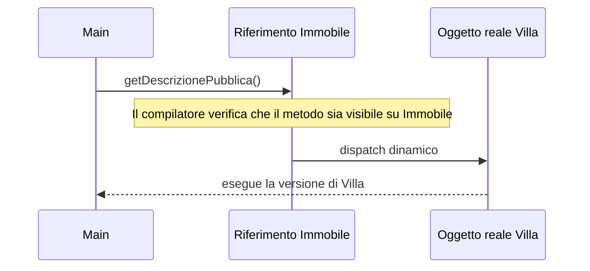

# 01 - Polimorfismo, riferimenti e binding dinamico

## Obiettivo

Questa sezione consolida il polimorfismo basato sull'ereditarietà e lo collega a un criterio progettuale: scrivere codice che dipenda dal comportamento necessario, non dal dettaglio concreto dell'oggetto.

Esempio:

```java
Immobile immobile = new Appartamento("Via Roma 10", 85.0, 168000.0, 3, 4);
```

Il riferimento è di tipo `Immobile`, ma l'oggetto reale è un `Appartamento`.

---

## 1. Ripasso operativo: ereditarietà

Una gerarchia di ereditarietà può essere rappresentata così:

```text
Immobile
├── Appartamento
├── Villa
└── BoxAuto
```

In Java:

```java
public class Appartamento extends Immobile {
    ...
}
```

La relazione è:

```text
Appartamento è un Immobile
```

Questo permette di usare `Immobile` come tipo generale.

---

## 2. Tipo del riferimento e tipo reale dell'oggetto

Osservare:

```java
Immobile immobile = new Appartamento("Via Roma 10", 85.0, 168000.0, 3, 4);
```

| Parte del codice | Significato |
|---|---|
| `Immobile immobile` | riferimento di tipo generale |
| `new Appartamento(...)` | oggetto reale creato in memoria |

Questi due tipi possono essere diversi quando esiste una relazione di ereditarietà.

La sottoclasse può essere vista come la superclasse.

---

## 3. Che cosa decide il tipo del riferimento

Il tipo del riferimento decide quali metodi il compilatore permette di chiamare.

Esempio:

```java
Immobile immobile = new Appartamento("Via Roma 10", 85.0, 168000.0, 3, 4);

immobile.getIndirizzo();
immobile.getPrezzo();
immobile.getDescrizionePubblica();
```

Queste chiamate sono possibili se i metodi sono dichiarati in `Immobile` o in una sua superclasse/interfaccia visibile.

Non è invece possibile chiamare direttamente un metodo specifico di `Appartamento` se il riferimento è di tipo `Immobile`:

```java
immobile.getPiano(); // errore se getPiano() esiste solo in Appartamento
```

Il compilatore guarda il tipo del riferimento, non il tipo reale dell'oggetto.

---

## 4. Che cosa decide il tipo reale dell'oggetto

Il tipo reale dell'oggetto decide quale metodo viene eseguito a runtime quando il metodo è ridefinito.

Esempio:

```java
Immobile immobile = new Villa("Via dei Pini 7", 180.0, 420000.0, 500.0, true);
System.out.println(immobile.getDescrizionePubblica());
```

Se `Villa` ridefinisce `getDescrizionePubblica()`, viene eseguita la versione di `Villa`.

Questo comportamento si chiama **binding dinamico**.

---

## 5. Binding statico e binding dinamico

| Caso | Quando si decide | Esempio |
|---|---|---|
| Controllo dei metodi chiamabili | compilazione | il riferimento consente solo alcuni metodi |
| Scelta dell'implementazione eseguita | runtime | viene eseguito il metodo della classe reale |

Esempio:

```java
Immobile immobile = new Villa(...);
immobile.getDescrizionePubblica();
```

Il compilatore verifica che `getDescrizionePubblica()` sia chiamabile su un riferimento `Immobile`.

A runtime, Java esegue la versione presente in `Villa`, se ridefinita.

---

## 6. Uso con array

Prima delle collection si può già usare il polimorfismo con gli array:

```java
Immobile[] immobili = new Immobile[3];

immobili[0] = new Appartamento("Via Roma 10", 85.0, 168000.0, 3, 4);
immobili[1] = new Villa("Via dei Pini 7", 180.0, 420000.0, 500.0, true);
immobili[2] = new BoxAuto("Via Verdi 2", 18.0, 28000.0, true);

for (Immobile immobile : immobili) {
    System.out.println(immobile.getDescrizionePubblica());
}
```

L'array è di tipo `Immobile[]`, ma contiene oggetti reali diversi.

Ogni oggetto risponde con il proprio comportamento.

---

## 7. Il problema del codice rigido

Senza polimorfismo, spesso si scrive codice simile a questo:

```java
public static void stampa(Object oggetto) {
    if (oggetto instanceof Appartamento) {
        Appartamento a = (Appartamento) oggetto;
        System.out.println(a.getDescrizionePubblica());
    } else if (oggetto instanceof Villa) {
        Villa v = (Villa) oggetto;
        System.out.println(v.getDescrizionePubblica());
    } else if (oggetto instanceof BoxAuto) {
        BoxAuto b = (BoxAuto) oggetto;
        System.out.println(b.getDescrizionePubblica());
    }
}
```

Questo codice presenta diversi problemi:

- conosce tutte le classi concrete;
- deve essere modificato quando nasce una nuova classe;
- duplica la logica di stampa;
- sposta fuori dalle classi un comportamento che può appartenere agli oggetti.

Il polimorfismo permette di scrivere:

```java
public static void stampa(Immobile immobile) {
    System.out.println(immobile.getDescrizionePubblica());
}
```

Oppure, se non serve conoscere l'intera gerarchia immobiliare:

```java
public static void stampa(Pubblicabile elemento) {
    System.out.println(elemento.getDescrizionePubblica());
}
```

---

## 8. Refactoring concettuale

### Prima: metodo legato alla classe concreta

```java
public void stampaVilla(Villa villa) {
    System.out.println(villa.getDescrizionePubblica());
}
```

Questo metodo funziona solo con `Villa`.

### Dopo: metodo legato al comportamento richiesto

```java
public void stampaElemento(Pubblicabile elemento) {
    System.out.println(elemento.getDescrizionePubblica());
}
```

Questo metodo funziona con qualunque oggetto che implementa `Pubblicabile`.

---

## 9. Diagramma del dispatch dinamico



---

## 10. Regola pratica

Quando più classi condividono un comportamento, chiedersi:

```text
il codice che userà questi oggetti ha davvero bisogno della classe concreta?
```

Se la risposta è no, è preferibile usare:

- una superclasse astratta, quando esiste una base comune di stato e comportamento;
- una interfaccia, quando serve esprimere un contratto operativo;
- entrambe, quando la gerarchia ha stato comune e deve rispettare un comportamento esterno.

---

## Domande di controllo

1. Perché un riferimento `Immobile` può puntare a un oggetto `Villa`?
2. Perché un riferimento `Immobile` non può chiamare un metodo presente solo in `Villa`?
3. Chi decide quale versione di un metodo ridefinito viene eseguita?
4. Perché una sequenza di `if` basata sul tipo può essere un segnale di progettazione rigida?
5. In quale caso è preferibile passare un parametro `Pubblicabile` invece di un parametro `Villa`?
