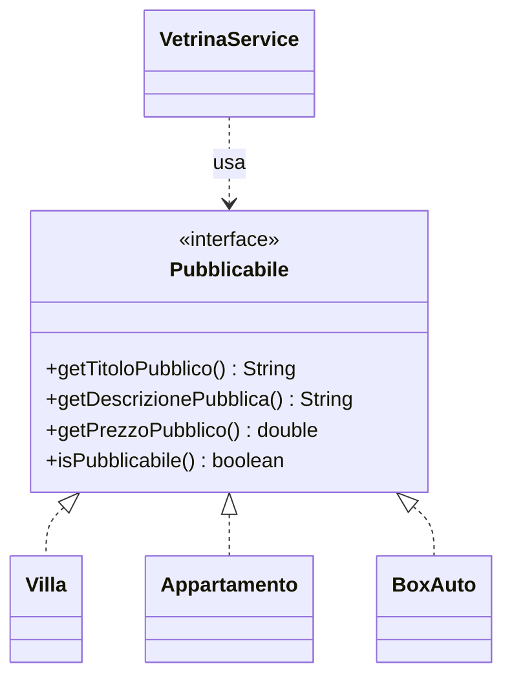

# 02 - Interfacce, contratti e implements

## Obiettivo

Questa sezione consolida l'uso delle interfacce come strumento di progettazione.

Una interfaccia non serve solo a scrivere una nuova parola chiave. Serve a definire un contratto tra chi produce oggetti e chi li usa.

Nel laboratorio useremo l'interfaccia `Pubblicabile` per indicare che un oggetto può essere mostrato in una vetrina pubblica.

---

## 1. Che cosa rappresenta una interfaccia

Una interfaccia rappresenta un insieme di operazioni che una classe si impegna a fornire.

Esempio:

```java
public interface Pubblicabile {
    String getTitoloPubblico();
    String getDescrizionePubblica();
    double getPrezzoPubblico();
    boolean isPubblicabile();
}
```

Questa interfaccia non dice come calcolare titolo, descrizione o prezzo.

Dice solo che ogni classe che la implementa deve offrire quei metodi.

---

## 2. Implementare una interfaccia

Una classe implementa una interfaccia con `implements`:

```java
public class Villa extends Immobile implements Pubblicabile {
    ...
}
```

Se `Villa` non implementa tutti i metodi richiesti dall'interfaccia, il codice non compila.

Questo è utile perché il contratto viene verificato dal compilatore.

---

## 3. Interfaccia e classe astratta insieme

Nel laboratorio useremo questa struttura:

```java
public interface Pubblicabile {
    String getTitoloPubblico();
    String getDescrizionePubblica();
    double getPrezzoPubblico();
    boolean isPubblicabile();
}
```

```java
public abstract class Immobile implements Pubblicabile {
    private String indirizzo;
    private double superficieMq;
    private double prezzo;

    public abstract String getTipologia();
}
```

La classe astratta `Immobile` contiene stato comune:

- indirizzo;
- superficie;
- prezzo.

L'interfaccia `Pubblicabile` rappresenta invece il comportamento richiesto dalla vetrina.

---

## 4. Perché non usare solo ereditarietà

Ereditarietà e interfacce rispondono a domande diverse.

| Strumento | Domanda a cui risponde |
|---|---|
| Superclasse | Che cosa hanno in comune queste classi come struttura? |
| Classe astratta | Quale base comune posso fornire senza creare oggetti generici? |
| Interfaccia | Quale comportamento devono garantire queste classi? |

Esempio:

```text
Villa è un Immobile
Appartamento è un Immobile
BoxAuto è un Immobile
```

Questa è una relazione di ereditarietà.

Ma la vetrina potrebbe pubblicare anche oggetti che non sono immobili, ad esempio:

```text
AnnuncioServizioFotografico
AnnuncioAsta
AnnuncioPromozionale
```

Se questi oggetti devono essere mostrati nella stessa vetrina, possono implementare `Pubblicabile` senza essere sottoclassi di `Immobile`.

---

## 5. Dipendere dal contratto, non dalla classe concreta

Metodo rigido:

```java
public void stampaVilla(Villa villa) {
    System.out.println(villa.getTitoloPubblico());
    System.out.println(villa.getDescrizionePubblica());
}
```

Metodo più flessibile:

```java
public void stampaElemento(Pubblicabile elemento) {
    System.out.println(elemento.getTitoloPubblico());
    System.out.println(elemento.getDescrizionePubblica());
}
```

Il secondo metodo non dipende da `Villa`. Dipende dal contratto `Pubblicabile`.

---

## 6. Visibilità dei metodi tramite riferimento interfaccia

Osservare:

```java
Pubblicabile elemento = new Villa("Via dei Pini 7", 180.0, 420000.0, 500.0, true);
```

Attraverso `elemento` sono visibili i metodi dichiarati in `Pubblicabile`:

```java
elemento.getTitoloPubblico();
elemento.getDescrizionePubblica();
elemento.getPrezzoPubblico();
elemento.isPubblicabile();
```

Non sono invece visibili i metodi specifici di `Villa`, se non sono presenti nell'interfaccia.

```java
elemento.hasPiscina(); // errore se hasPiscina() è solo in Villa
```

Questo non è un limite casuale. È una scelta di progetto: il codice che usa `Pubblicabile` deve conoscere solo ciò che serve per pubblicare.

---

## 7. Una classe può implementare più interfacce

Una classe Java può estendere una sola classe, ma può implementare più interfacce.

Esempio:

```java
public class Villa extends Immobile implements Pubblicabile, Valutabile {
    ...
}
```

Questo permette di separare contratti diversi:

```text
Pubblicabile -> può essere mostrato in vetrina
Valutabile   -> può produrre un punteggio o una valutazione
Archiviabile -> può essere salvato o archiviato
```

Questa idea tornerà in modo importante quando si parlerà di DAO, repository, servizi e Dependency Injection.

---

## 8. Diagramma: interfaccia come contratto



Il servizio dipende dall'interfaccia, non dalle classi concrete.

---

## 9. Collegamento con DAO e Spring

Questa forma:

```java
public class VetrinaService {
    public void stampaCatalogo(Pubblicabile[] elementi) {
        ...
    }
}
```

anticipa una forma che si ritroverà più avanti:

```java
public class CorsoService {
    private CorsoRepository repository;
}
```

Oppure:

```java
public class CorsoController {
    private CorsoService service;
}
```

In tutti questi casi, il principio è lo stesso:

```text
dipendere da un ruolo o contratto, non da un dettaglio concreto non necessario
```

---

## 10. Errori tipici

### Errore 1: interfaccia senza significato reale

Creare una interfaccia solo perché il corso la richiede produce codice inutile.

Una interfaccia deve rappresentare un ruolo:

```text
Pubblicabile
Validabile
Calcolabile
Archiviabile
Ricercabile
```

### Errore 2: interfaccia troppo grande

Una interfaccia non dovrebbe contenere metodi non necessari al ruolo che rappresenta.

Se `Pubblicabile` contiene anche `salvaSuDatabase()`, probabilmente sta mescolando responsabilità diverse.

### Errore 3: servizio ancora legato alle classi concrete

Se un servizio riceve `Pubblicabile`, ma poi usa molti `instanceof`, il vantaggio del polimorfismo viene ridotto.

```java
if (elemento instanceof Villa) {
    ...
}
```

`instanceof` non è vietato in assoluto, ma non deve sostituire il comportamento polimorfico quando questo è possibile.

---

## Domande di controllo

1. Perché `Pubblicabile` è un contratto e non una classe?
2. Quale vantaggio ha un metodo che riceve `Pubblicabile` invece di `Villa`?
3. In quale caso una classe astratta è più utile di una semplice interfaccia?
4. Perché una interfaccia troppo grande peggiora il progetto?
5. Che collegamento esiste tra interfacce, DAO e Dependency Injection?
