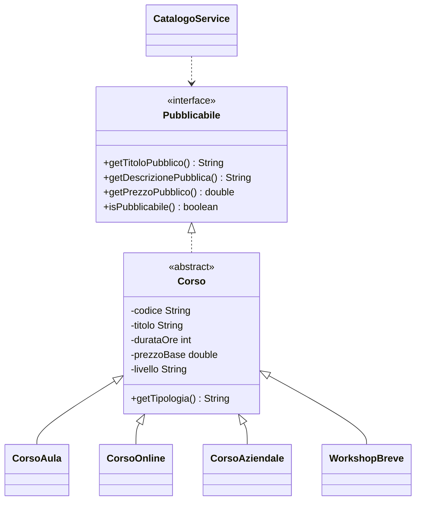

# 04 - LAB14 autonomo - Catalogo corsi pubblicabili

## Scenario

Un ente di formazione vuole realizzare un piccolo catalogo console per pubblicare corsi diversi.

I corsi possono avere modalità diverse:

- corso in aula;
- corso online;
- corso aziendale personalizzato.

Tutti devono poter essere mostrati in un catalogo pubblico, ma ogni tipologia ha informazioni e regole specifiche.

Il laboratorio deve applicare lo stesso principio visto nel laboratorio guidato:

```text
il servizio deve dipendere da un contratto, non dalle classi concrete
```

---

## Obiettivo del laboratorio autonomo

Realizzare una piccola applicazione Java che dimostri:

1. uso di una interfaccia come contratto;
2. uso di una classe astratta per stato e comportamento comuni;
3. uso di più classi concrete;
4. uso del polimorfismo in un servizio;
5. assenza di codice centrale basato su catene di `if`, `switch` o `instanceof`;
6. possibilità di aggiungere una nuova tipologia di corso con modifiche limitate.

---

## Strumenti e installazioni necessarie

Per questo laboratorio non servono strumenti aggiuntivi.

Verificare solo:

```bash
java -version
javac -version
git --version
```

Non installare in questa UD:

- Maven;
- Docker;
- MariaDB/MySQL;
- phpMyAdmin;
- Bootstrap;
- jQuery.

Questi strumenti verranno introdotti in unità successive, quando saranno realmente necessari.

---

## Struttura richiesta

Creare questa struttura:

```text
UD14_catalogo_corsi/
  src/
    corso/
      ud14/
        catalogo/
          Pubblicabile.java
          Corso.java
          CorsoAula.java
          CorsoOnline.java
          CorsoAziendale.java
          CatalogoService.java
          EseguiCatalogoCorsi.java
  docs/
    evidence_UD14_autonomo.md
```

---

## Requisito 1 - Interfaccia Pubblicabile

Creare una interfaccia:

```java
public interface Pubblicabile {
    String getTitoloPubblico();
    String getDescrizionePubblica();
    double getPrezzoPubblico();
    boolean isPubblicabile();
}
```

Il servizio userà questa interfaccia.

---

## Requisito 2 - Classe astratta Corso

Creare una classe astratta `Corso` che implementa `Pubblicabile`.

Attributi minimi richiesti:

- `codice`;
- `titolo`;
- `durataOre`;
- `prezzoBase`;
- `livello`.

Metodi richiesti:

- costruttore completo;
- getter;
- `getTipologia()` astratto;
- `getTitoloPubblico()`;
- `getDescrizionePubblica()`;
- `getPrezzoPubblico()`;
- `isPubblicabile()`.

Regola minima di pubblicabilità comune:

```text
un corso è pubblicabile se codice e titolo non sono vuoti, durataOre > 0 e prezzoBase >= 0
```

---

## Requisito 3 - Classi concrete

Creare almeno tre classi concrete.

### CorsoAula

Attributi specifici:

- `sede`;
- `numeroPosti`.

Regole:

- è pubblicabile solo se la sede non è vuota;
- è pubblicabile solo se `numeroPosti > 0`;
- la descrizione pubblica deve indicare sede e posti disponibili.

### CorsoOnline

Attributi specifici:

- `piattaforma`;
- `registrato`.

Regole:

- è pubblicabile solo se la piattaforma non è vuota;
- se `registrato` è `true`, la descrizione deve indicare che il corso è fruibile on demand;
- se `registrato` è `false`, la descrizione deve indicare che il corso è live online.

### CorsoAziendale

Attributi specifici:

- `nomeCliente`;
- `numeroPartecipantiPrevisti`;
- `personalizzato`.

Regole:

- è pubblicabile solo se `nomeCliente` non è vuoto;
- è pubblicabile solo se `numeroPartecipantiPrevisti > 0`;
- se `personalizzato` è `true`, il prezzo pubblico deve essere maggiorato del 20% rispetto al prezzo base.

---

## Requisito 4 - CatalogoService

Creare una classe `CatalogoService`.

La classe deve contenere metodi che lavorano con `Pubblicabile` o `Pubblicabile[]`.

Metodi minimi richiesti:

```java
public void stampaScheda(Pubblicabile elemento)
public void stampaCatalogo(Pubblicabile[] elementi)
public int contaPubblicabili(Pubblicabile[] elementi)
public double calcolaValoreTotale(Pubblicabile[] elementi)
public Pubblicabile trovaPiuCostoso(Pubblicabile[] elementi)
```

Vincolo importante:

```text
CatalogoService non deve dipendere da CorsoAula, CorsoOnline o CorsoAziendale.
```

Quindi nel servizio non devono comparire metodi come:

```java
public void stampaCorsoAula(CorsoAula corso) { ... }
```

E non devono comparire catene di questo tipo:

```java
if (elemento instanceof CorsoAula) {
    ...
} else if (elemento instanceof CorsoOnline) {
    ...
}
```

---

## Requisito 5 - Programma principale

Creare `EseguiCatalogoCorsi` con metodo `main`.

Il programma deve:

1. creare un array `Pubblicabile[]`;
2. inserire almeno cinque corsi, includendo almeno un corso non pubblicabile;
3. stampare il catalogo;
4. stampare il numero di corsi pubblicabili;
5. stampare il valore economico totale dei corsi pubblicabili;
6. stampare il corso più costoso;
7. dimostrare che il servizio non conosce le classi concrete.

---

## Requisito 6 - Estensione obbligatoria

Aggiungere una quarta classe concreta:

```text
WorkshopBreve
```

Attributi specifici suggeriti:

- `argomentoFocus`;
- `durataMassimaOre`;
- `materialeIncluso`.

Regole minime:

- deve estendere `Corso`;
- deve ridefinire `getTipologia()`;
- deve ridefinire `getDescrizionePubblica()`;
- deve essere pubblicabile solo se `durataOre <= durataMassimaOre`;
- deve essere aggiunto all'array nel `main`.

Dopo aver aggiunto `WorkshopBreve`, rispondere:

```text
CatalogoService è stato modificato? Se sì, perché? Se no, perché?
```

La risposta attesa è che il servizio non debba essere modificato se è stato progettato correttamente sul contratto `Pubblicabile`.

---

## Requisito 7 - Schema Mermaid

Nel file di evidenza inserire uno schema Mermaid simile a questo, adattandolo al proprio codice:



---

## Compilazione

Dalla cartella `UD14_catalogo_corsi`:

```bash
javac -d out src/corso/ud14/catalogo/*.java
```

---

## Esecuzione

```bash
java -cp out corso.ud14.catalogo.EseguiCatalogoCorsi
```

---

## Evidenza richiesta

Creare:

```text
docs/evidence_UD14_autonomo.md
```

Contenuto minimo:

```md
# Evidence UD14 autonomo

## Ambiente

- java -version:
- javac -version:
- git --version:

## Comandi eseguiti

```bash
javac -d out src/corso/ud14/catalogo/*.java
java -cp out corso.ud14.catalogo.EseguiCatalogoCorsi
```

## Output

Incollare qui l'output del programma.

## Schema classi

Inserire diagramma Mermaid.

## Scelte progettuali

### Perché è stata creata l'interfaccia Pubblicabile?

Risposta:

### Perché Corso è astratta?

Risposta:

### Perché CatalogoService lavora con Pubblicabile?

Risposta:

### Quale nuova classe è stata aggiunta?

Risposta:

### CatalogoService è stato modificato dopo l'aggiunta della nuova classe?

Risposta:

## Controllo qualità

- Il codice compila: sì/no
- Il servizio usa Pubblicabile: sì/no
- Non ci sono catene di instanceof nel servizio: sì/no
- È stata aggiunta WorkshopBreve: sì/no
```

---

## Criteri di valutazione

| Criterio | Atteso |
|---|---|
| Struttura package | corretta e coerente |
| Interfaccia | rappresenta un contratto reale |
| Classe astratta | contiene stato e comportamento comuni |
| Classi concrete | specializzano descrizione e regole |
| Servizio | dipende da `Pubblicabile`, non dalle classi concrete |
| Estensione | nuova classe aggiunta con modifiche limitate |
| Evidenza | completa, leggibile, con motivazioni |

---

## Errori da evitare

1. Creare `CatalogoService` con metodi separati per ogni classe concreta.
2. Usare `instanceof` per decidere come stampare ogni corso.
3. Mettere tutta la logica nel `main`.
4. Creare una interfaccia senza usarla come tipo di riferimento.
5. Dimenticare `@Override` nei metodi ridefiniti.
6. Lasciare classi concrete con campi pubblici.
7. Consegnare solo il codice senza spiegare le scelte progettuali.
