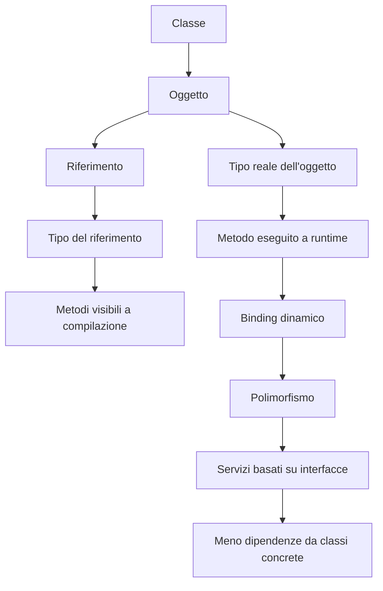
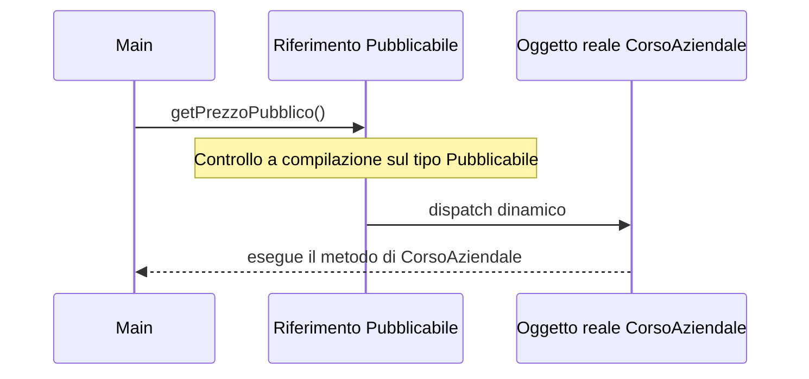
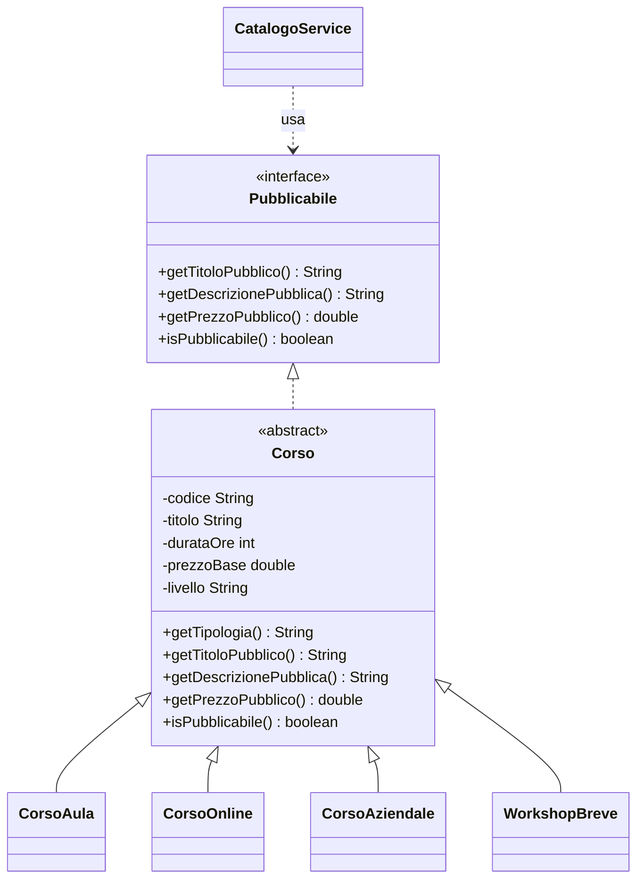
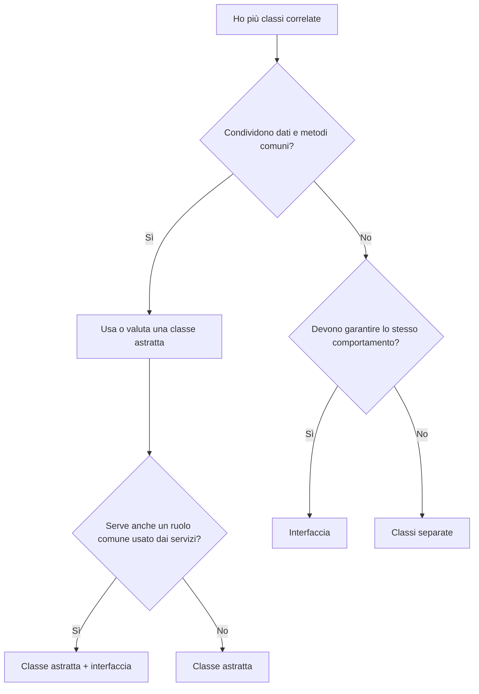

# UD14 - Scheda sintetica delle definizioni
## Polimorfismo, tipi, classi astratte, interfacce e `instanceof`

Questa scheda raccoglie i concetti nuovi della UD14 e chiarisce le differenze più importanti.
Va usata come riferimento rapido durante il laboratorio e nel ripasso. Rapido, non magico: Java resta Java, purtroppo.

---

## 1. Mappa dei concetti



---
## Descrizione del flusso

Una **classe** definisce la struttura e il comportamento di un certo tipo di elemento.

Da una classe si possono creare uno o più **oggetti**, cioè istanze concrete presenti in memoria.

Un oggetto viene normalmente utilizzato attraverso un **riferimento**, cioè una variabile che permette di accedere all’oggetto.

Ogni riferimento ha un **tipo dichiarato**, cioè il tipo scritto nel codice dal programmatore.

Il **tipo del riferimento** determina quali metodi risultano **visibili a compilazione**.

In pratica, il compilatore controlla cosa è possibile chiamare guardando il tipo della variabile, non il tipo reale dell’oggetto che sarà presente durante l’esecuzione.

L’oggetto, però, ha anche un **tipo reale**, cioè la classe concreta dell’istanza effettivamente creata con `new`.

Il **tipo reale dell’oggetto** determina quale metodo viene realmente eseguito a **runtime**, cioè durante l’esecuzione del programma.

Quando un metodo viene scelto a runtime in base al tipo reale dell’oggetto, si parla di **binding dinamico**.

Il **binding dinamico** è il meccanismo tecnico che rende possibile il **polimorfismo**.

Grazie al polimorfismo, il codice può lavorare con riferimenti di tipo più generale, per esempio **interfacce** o **classi astratte**, lasciando che a runtime venga usata l’implementazione concreta corretta.

Questo permette di costruire **servizi basati su interfacce**, dove il codice dipende da un contratto e non da una classe specifica.

Il risultato è un sistema con **meno dipendenze da classi concrete**, quindi più flessibile, più facile da modificare e più adatto a essere esteso.


## 2. Classe, oggetto, riferimento e tipo

| Concetto | Definizione | Esempio |
|---|---|---|
| **Classe** | Modello che descrive attributi e metodi degli oggetti | `class CorsoAula` |
| **Oggetto** | Istanza concreta creata in memoria | `new CorsoAula(...)` |
| **Riferimento** | Variabile usata per raggiungere un oggetto | `CorsoAula corso` |
| **Tipo** | Ciò che determina quali operazioni sono visibili sul riferimento | `Pubblicabile elemento` |

Esempio:

```java
Pubblicabile elemento = new CorsoAula(...);
```

| Parte | Significato |
|---|---|
| `Pubblicabile elemento` | riferimento di tipo `Pubblicabile` |
| `new CorsoAula(...)` | oggetto reale di classe `CorsoAula` |

Punto chiave:

```text
Il riferimento ha un tipo.
L'oggetto reale ha una classe concreta.
I due possono essere diversi.
```

---

## 3. Classe e tipo: non sono la stessa cosa

Una classe può essere usata come tipo, ma anche una interfaccia o una classe astratta possono essere usate come tipo.

```java
CorsoAula c1 = new CorsoAula(...);       // tipo classe concreta
Corso c2 = new CorsoAula(...);           // tipo classe astratta
Pubblicabile c3 = new CorsoAula(...);    // tipo interfaccia
```

In tutti e tre i casi l'oggetto reale è un `CorsoAula`.
Cambia il tipo del riferimento, quindi cambiano i metodi visibili al compilatore.

---

## 4. Tipo del riferimento

Il **tipo del riferimento** decide quali metodi il compilatore permette di chiamare.

```java
Pubblicabile elemento = new CorsoOnline(...);

elemento.getTitoloPubblico();        // ok
elemento.getDescrizionePubblica();   // ok
elemento.getPrezzoPubblico();        // ok
elemento.isPubblicabile();           // ok
```

Se un metodo esiste solo in `CorsoOnline`, ma non è dichiarato in `Pubblicabile`, non è visibile:

```java
elemento.isRegistrato(); // errore se isRegistrato() non è nel contratto Pubblicabile
```

Il compilatore non si commuove: guarda il tipo del riferimento, non le nostre speranze.

---

## 5. Tipo reale dell'oggetto

Il **tipo reale dell'oggetto** è la classe concreta creata con `new`.

```java
Pubblicabile elemento = new CorsoAziendale(...);
```

| Concetto | Valore |
|---|---|
| Tipo del riferimento | `Pubblicabile` |
| Tipo reale dell'oggetto | `CorsoAziendale` |

Il tipo reale diventa importante a runtime, quando Java deve scegliere quale versione di un metodo eseguire.

---

## 6. Compilazione e runtime

| Momento | Cosa decide Java | Esempio |
|---|---|---|
| **Compilazione** | Se il metodo è chiamabile tramite il tipo del riferimento | `Pubblicabile` contiene `getPrezzoPubblico()`? |
| **Runtime** | Quale implementazione concreta eseguire | L'oggetto reale è `CorsoAziendale`, quindi esegue quella versione |

```java
Pubblicabile elemento = new CorsoAziendale(...);
elemento.getPrezzoPubblico();
```

Durante la compilazione Java controlla il contratto `Pubblicabile`.
Durante l'esecuzione usa il comportamento della classe reale `CorsoAziendale`.

---

## 7. Polimorfismo

Il **polimorfismo** permette di trattare oggetti diversi attraverso un tipo comune.

```java
Pubblicabile[] catalogo = new Pubblicabile[4];

catalogo[0] = new CorsoAula(...);
catalogo[1] = new CorsoOnline(...);
catalogo[2] = new CorsoAziendale(...);
catalogo[3] = new WorkshopBreve(...);

for (Pubblicabile elemento : catalogo) {
    System.out.println(elemento.getDescrizionePubblica());
}
```

Tutti gli elementi sono visti come `Pubblicabile`, ma ogni oggetto risponde con il proprio comportamento.

Sintesi:

```text
Stesso tipo di riferimento.
Oggetti reali diversi.
Comportamenti diversi.
```

---

## 8. Binding dinamico

Il **binding dinamico** è il meccanismo con cui Java sceglie a runtime il metodo della classe reale.

```java
Pubblicabile elemento = new CorsoAziendale(...);
elemento.getPrezzoPubblico();
```

Se `CorsoAziendale` ridefinisce `getPrezzoPubblico()`, Java esegue quella versione.



---

## 9. Binding statico

Il **binding statico**, in questo contesto didattico, riguarda le decisioni controllate a compilazione.

Regola pratica:

```text
Il compilatore controlla ciò che è visibile dal tipo del riferimento.
```

Se il riferimento è `Pubblicabile`, sono visibili solo i metodi dichiarati in `Pubblicabile`.

---

## 10. Ereditarietà

L'**ereditarietà** rappresenta una relazione del tipo “è un”.

```text
CorsoAula è un Corso
CorsoOnline è un Corso
CorsoAziendale è un Corso
WorkshopBreve è un Corso
```

In Java si usa `extends`:

```java
public class CorsoAula extends Corso {
    ...
}
```

La sottoclasse eredita la parte comune dalla superclasse e può aggiungere o ridefinire comportamenti.

---

## 11. Superclasse e sottoclasse

| Concetto | Definizione | Esempio |
|---|---|---|
| **Superclasse** | Classe più generale da cui altre classi derivano | `Corso` |
| **Sottoclasse** | Classe più specifica che estende una superclasse | `CorsoOnline` |

`Corso` contiene elementi comuni.
`CorsoOnline` aggiunge dettagli specifici, come `piattaforma` e `registrato`.

---

## 12. Classe concreta

Una **classe concreta** è una classe da cui si possono creare oggetti con `new`.

```java
new CorsoAula(...);
new CorsoOnline(...);
new CorsoAziendale(...);
new WorkshopBreve(...);
```

Una classe concreta deve implementare tutti i metodi obbligatori ereditati da classi astratte e interfacce.

---

## 13. Classe astratta

Una **classe astratta** rappresenta una base comune, ma non deve essere istanziata direttamente.

```java
public abstract class Corso implements Pubblicabile {
    private String codice;
    private String titolo;
    private int durataOre;
    private double prezzoBase;
    private String livello;

    public abstract String getTipologia();
}
```

`Corso` è astratta perché un corso generico non è una tipologia reale sufficiente.
Nel catalogo servono corsi concreti: aula, online, aziendale, workshop.

Serve quando più classi condividono:

- attributi comuni;
- costruttore comune;
- metodi comuni;
- alcuni comportamenti da specializzare.

---

## 14. Metodo astratto

Un **metodo astratto** è dichiarato senza corpo.

```java
public abstract String getTipologia();
```

La classe astratta impone alle sottoclassi concrete di implementarlo.

```java
@Override
public String getTipologia() {
    return "Corso online";
}
```

---

## 15. Interfaccia

Una **interfaccia** definisce un contratto: indica quali metodi una classe deve offrire, senza dire come implementarli.

```java
public interface Pubblicabile {
    String getTitoloPubblico();
    String getDescrizionePubblica();
    double getPrezzoPubblico();
    boolean isPubblicabile();
}
```

`Pubblicabile` non contiene i dati del corso.
Dice solo cosa deve saper fare un oggetto per essere pubblicato nel catalogo.

---

## 16. Contratto

Un **contratto** è un insieme di operazioni garantite.

Nel caso di `Pubblicabile`:

```text
Ogni oggetto pubblicabile deve fornire:
- titolo pubblico;
- descrizione pubblica;
- prezzo pubblico;
- regola di pubblicabilità.
```

Il servizio può usare il contratto senza conoscere le classi concrete.

---

## 17. `implements`

`implements` indica che una classe rispetta una interfaccia.

```java
public abstract class Corso implements Pubblicabile {
    ...
}
```

Significa che `Corso` aderisce al contratto `Pubblicabile`.
Le classi concrete che estendono `Corso` saranno quindi trattabili come `Pubblicabile`.

---

## 18. Classe astratta o interfaccia?

| Strumento | Quando usarlo | Esempio UD14 |
|---|---|---|
| **Classe astratta** | Quando esistono stato e comportamento comuni | `Corso` |
| **Interfaccia** | Quando serve definire un ruolo o contratto operativo | `Pubblicabile` |
| **Entrambe** | Quando esistono dati comuni e serve anche un contratto esterno | `Corso implements Pubblicabile` |

Differenza essenziale:

```text
La classe astratta dice: cosa hanno in comune queste classi?
L'interfaccia dice: cosa devono saper fare questi oggetti?
```

---

## 19. Override

L'**override** avviene quando una sottoclasse ridefinisce un metodo ereditato o richiesto da una interfaccia.

```java
@Override
public String getDescrizionePubblica() {
    return super.getDescrizionePubblica()
            + " | Sede: " + sede
            + " | Posti disponibili: " + numeroPosti;
}
```

Serve per specializzare un comportamento comune.

---

## 20. Annotazione `@Override`

`@Override` comunica al compilatore che il metodo deve ridefinire un metodo esistente.

Vantaggi:

- rende chiara l'intenzione;
- aiuta a trovare errori di firma;
- evita falsi override.

```java
@Override
public boolean isPubblicabile() {
    return super.isPubblicabile() && !isBlank(sede) && numeroPosti > 0;
}
```

---

## 21. `super`

`super` permette di richiamare la superclasse.

Nel costruttore:

```java
super(codice, titolo, durataOre, prezzoBase, livello);
```

In un metodo ridefinito:

```java
return super.getDescrizionePubblica() + " | Sede: " + sede;
```

Nel primo caso inizializza la parte comune.
Nel secondo caso riusa un comportamento generale e aggiunge dettagli specifici.

---

## 22. `instanceof`

`instanceof` verifica se un oggetto è compatibile con un tipo.

```java
if (elemento instanceof CorsoOnline) {
    ...
}
```

Non è vietato.
Diventa però sospetto quando viene usato per scegliere comportamenti che potrebbero stare nelle classi concrete.

Codice rigido:

```java
if (elemento instanceof CorsoAula) {
    // descrizione per corso in aula
} else if (elemento instanceof CorsoOnline) {
    // descrizione per corso online
}
```

Codice polimorfico:

```java
System.out.println(elemento.getDescrizionePubblica());
```

Ogni classe sa già come descriversi. Interrogarla continuamente sul tipo è spesso un modo elegante per scrivere codice fragile.

---

## 23. Cast, upcast e downcast

| Concetto | Definizione | Esempio |
|---|---|---|
| **Cast** | Conversione esplicita di riferimento | `(CorsoOnline) elemento` |
| **Upcast** | Da tipo specifico a tipo generale | `Pubblicabile p = new CorsoAula(...)` |
| **Downcast** | Da tipo generale a tipo specifico | `CorsoAula c = (CorsoAula) p` |

L'upcast è naturale e sicuro.
Il downcast può fallire a runtime se l'oggetto reale non è del tipo atteso.

Esempio con controllo:

```java
if (elemento instanceof CorsoOnline) {
    CorsoOnline online = (CorsoOnline) elemento;
}
```

Nella UD14 l'obiettivo è evitare cast inutili quando il contratto `Pubblicabile` è sufficiente.

---

## 24. Servizio

Un **servizio** è una classe che coordina operazioni applicative.

Nella UD14, `CatalogoService`:

- stampa una scheda;
- stampa il catalogo;
- conta gli elementi pubblicabili;
- calcola il valore totale;
- trova l'elemento più costoso.

Il punto importante è il tipo dei parametri:

```java
public void stampaScheda(Pubblicabile elemento)
public void stampaCatalogo(Pubblicabile[] elementi)
```

Il servizio dipende dal contratto `Pubblicabile`, non da `CorsoAula`, `CorsoOnline` o `CorsoAziendale`.

---

## 25. Dipendere dal contratto, non dalla classe concreta

Soluzione rigida:

```java
public void stampaCorsoAula(CorsoAula corso) { ... }
public void stampaCorsoOnline(CorsoOnline corso) { ... }
```

Soluzione flessibile:

```java
public void stampaScheda(Pubblicabile elemento) { ... }
```

Vantaggio:

```text
Se aggiungo una nuova classe concreta, il servizio non deve cambiare.
```

---

## 26. Estendibilità

L'**estendibilità** è la capacità di aggiungere nuove classi senza modificare pesantemente il codice esistente.

Nella UD14:

```text
Aggiungo WorkshopBreve
WorkshopBreve estende Corso
Corso implementa Pubblicabile
CatalogoService continua a lavorare con Pubblicabile
```

Risultato: il servizio resta stabile.
Piccola vittoria della progettazione contro il caos, evento raro ma gradito.

---

## 27. Schema delle relazioni della UD14



---

## 28. Criterio pratico di scelta



---

## 29. Differenze fondamentali da ricordare

| Coppia | Differenza |
|---|---|
| Classe / oggetto | La classe è il modello; l'oggetto è l'istanza concreta |
| Oggetto / riferimento | L'oggetto vive in memoria; il riferimento permette di usarlo |
| Classe / tipo | Una classe può essere un tipo, ma anche interfacce e classi astratte possono esserlo |
| Tipo del riferimento / tipo reale | Il primo decide cosa posso chiamare; il secondo decide cosa viene eseguito |
| Classe astratta / interfaccia | La prima fornisce base comune; la seconda definisce un contratto |
| `extends` / `implements` | `extends` eredita da una classe; `implements` aderisce a una interfaccia |
| Override / overload | Override: ridefinizione ereditata; overload: stesso nome con parametri diversi |
| Polimorfismo / `instanceof` | Il polimorfismo fa lavorare gli oggetti tramite un tipo comune; `instanceof` controlla esplicitamente il tipo |
| Upcast / downcast | Upcast: specifico verso generale; downcast: generale verso specifico |

---

## 30. Mini glossario finale

| Termine | Definizione breve |
|---|---|
| **Classe** | Modello che definisce dati e comportamenti |
| **Oggetto** | Istanza concreta creata in memoria |
| **Riferimento** | Variabile che punta a un oggetto |
| **Tipo** | Insieme dei metodi visibili sul riferimento |
| **Classe concreta** | Classe istanziabile con `new` |
| **Classe astratta** | Classe base non istanziabile direttamente |
| **Metodo astratto** | Metodo senza corpo da implementare nelle sottoclassi |
| **Interfaccia** | Contratto di metodi da garantire |
| **Contratto** | Insieme di operazioni promesse da una classe |
| **`extends`** | Crea una relazione di ereditarietà |
| **`implements`** | Dichiara che una classe rispetta una interfaccia |
| **Override** | Ridefinizione di un metodo ereditato o richiesto |
| **Binding dinamico** | Scelta a runtime del metodo della classe reale |
| **Polimorfismo** | Uso di oggetti diversi tramite un tipo comune |
| **`instanceof`** | Operatore che verifica la compatibilità con un tipo |
| **Cast** | Conversione esplicita di riferimento |
| **Upcast** | Conversione verso un tipo più generale |
| **Downcast** | Conversione verso un tipo più specifico |
| **Servizio** | Classe che coordina operazioni applicative |
| **Estendibilità** | Capacità di aggiungere nuove classi con modifiche limitate |

---

## 31. Frasi chiave da saper spiegare

1. Il tipo del riferimento decide cosa posso chiamare.
2. Il tipo reale dell'oggetto decide quale implementazione viene eseguita.
3. Una interfaccia rappresenta un contratto operativo.
4. Una classe astratta rappresenta una base comune parziale.
5. Un servizio dovrebbe dipendere dal comportamento necessario, non dalla classe concreta.
6. `instanceof` non è vietato, ma non deve sostituire il polimorfismo.
7. Aggiungere una nuova classe non dovrebbe costringere a riscrivere il servizio centrale.

---

## 32. Controllo rapido di comprensione

1. In `Pubblicabile elemento = new CorsoOnline(...)`, qual è il tipo del riferimento?
2. Qual è il tipo reale dell'oggetto?
3. Perché non posso chiamare direttamente `isRegistrato()` su `elemento`?
4. Perché `CatalogoService` riceve `Pubblicabile` e non `CorsoAula`?
5. Che cosa succede se aggiungo `WorkshopBreve`?
6. Perché una catena di `instanceof` nel servizio è sospetta?
7. Quando conviene usare una classe astratta?
8. Quando conviene usare una interfaccia?

---

## 33. Sintesi finale

La UD14 introduce un passaggio importante: non basta creare classi che compilano.
Bisogna progettare classi che collaborano bene.

Il punto centrale è:

```text
Il codice stabile deve dipendere da concetti stabili.
```

Nel laboratorio il concetto stabile è il contratto `Pubblicabile`.
Le classi concrete possono aumentare o cambiare.
Il servizio resta più stabile perché lavora sul comportamento richiesto, non sui dettagli di ogni singola classe.
