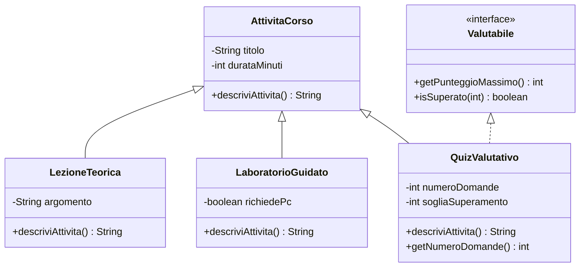

# 01 - Cast, upcasting, downcasting e `instanceof`

## 1. Il problema dei tipi nei riferimenti polimorfici

In Java una variabile di riferimento ha un tipo dichiarato. L'oggetto collegato a quella variabile ha invece un tipo reale.

Esempio:

```java
AttivitaCorso attivita = new QuizValutativo("Quiz ereditarietà", 30, 10, 18);
```

In questo caso:

| Elemento | Tipo |
|---|---|
| riferimento `attivita` | `AttivitaCorso` |
| oggetto reale | `QuizValutativo` |

Il compilatore guarda il tipo del riferimento. Il runtime conosce il tipo reale dell'oggetto.

## 2. Upcasting

L'upcasting consiste nel trattare un oggetto specifico come un oggetto più generale.

```java
QuizValutativo quiz = new QuizValutativo("Quiz Java", 30, 12, 18);
AttivitaCorso attivita = quiz;
```

Il passaggio da `QuizValutativo` ad `AttivitaCorso` è sicuro perché ogni `QuizValutativo` è anche una `AttivitaCorso`.

L'upcasting è spesso implicito:

```java
AttivitaCorso attivita = new QuizValutativo("Quiz Java", 30, 12, 18);
```

## 3. Effetto dell'upcasting sui metodi visibili

Dopo l'upcasting, attraverso il riferimento generale sono visibili solo i metodi dichiarati nel tipo generale.

```java
AttivitaCorso attivita = new QuizValutativo("Quiz Java", 30, 12, 18);

System.out.println(attivita.getTitolo());
System.out.println(attivita.descriviAttivita());
```

Se `getNumeroDomande()` è dichiarato solo in `QuizValutativo`, questa istruzione non compila:

```java
System.out.println(attivita.getNumeroDomande());
```

Il motivo è che il compilatore non può assumere che ogni `AttivitaCorso` sia un `QuizValutativo`.

## 4. Downcasting

Il downcasting consiste nel trattare un riferimento generale come un tipo più specifico.

```java
AttivitaCorso attivita = new QuizValutativo("Quiz Java", 30, 12, 18);
QuizValutativo quiz = (QuizValutativo) attivita;
```

Questo cast è valido perché l'oggetto reale è effettivamente un `QuizValutativo`.

Dopo il cast sono visibili anche i metodi specifici:

```java
System.out.println(quiz.getNumeroDomande());
```

## 5. Cast non valido

Il cast può essere sintatticamente accettato dal compilatore, ma fallire a runtime.

```java
AttivitaCorso attivita = new LezioneTeorica("Classi astratte", 90, "ereditarietà");
QuizValutativo quiz = (QuizValutativo) attivita;
```

Questo codice compila, ma a runtime genera una `ClassCastException`, perché l'oggetto reale non è un `QuizValutativo`.

## 6. `instanceof`

L'operatore `instanceof` verifica se un riferimento punta a un oggetto compatibile con un certo tipo.

```java
if (attivita instanceof QuizValutativo) {
    QuizValutativo quiz = (QuizValutativo) attivita;
    System.out.println(quiz.getNumeroDomande());
}
```

Il controllo serve a proteggere il downcasting.

## 7. `instanceof` con interfacce

`instanceof` può essere usato anche con le interfacce.

```java
if (attivita instanceof Valutabile) {
    Valutabile valutabile = (Valutabile) attivita;
    System.out.println(valutabile.getPunteggioMassimo());
}
```

Questo è utile quando il comportamento non dipende dalla gerarchia principale, ma da una capacità aggiuntiva.

Esempio:

- una `LezioneTeorica` può non essere valutabile;
- una `ChallengeAutonoma` può essere valutabile;
- un `QuizValutativo` può essere valutabile;
- tutte restano comunque `AttivitaCorso`.

## 8. Schema concettuale



## 9. Regola pratica

Usare il cast solo quando:

1. il riferimento è più generale dell'oggetto reale;
2. il metodo necessario non è visibile dal tipo del riferimento;
3. il tipo reale è stato verificato con `instanceof`, oppure è garantito dalla logica del programma;
4. non esiste una soluzione più pulita basata su polimorfismo o interfaccia.

## 10. Errore da evitare

Non usare `instanceof` per compensare una progettazione debole.

Questo codice può funzionare:

```java
if (attivita instanceof QuizValutativo) {
    // logica specifica del quiz
} else if (attivita instanceof LaboratorioGuidato) {
    // logica specifica del laboratorio
}
```

ma se ogni nuova classe obbliga a modificare questo blocco, il modello non è realmente estendibile.
