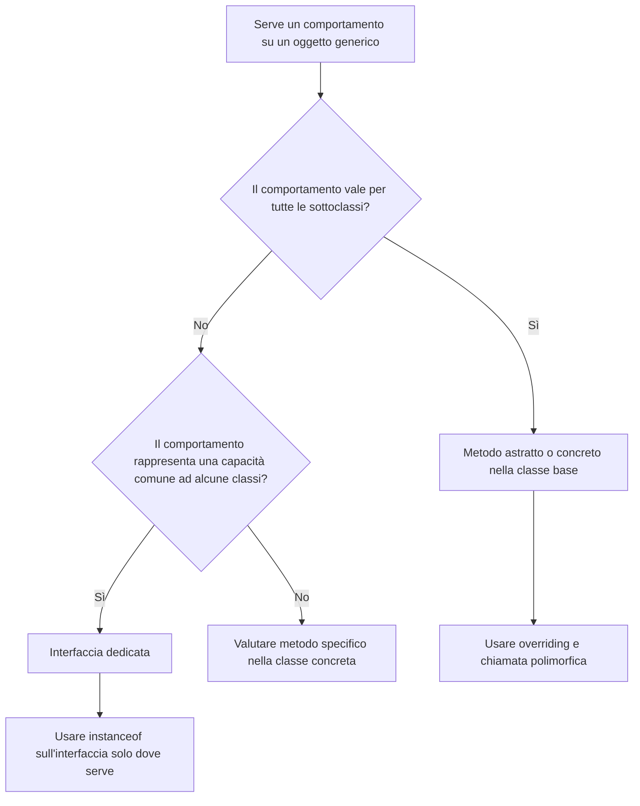

# 02 - `instanceof` e refactoring verso il polimorfismo

## 1. Quando `instanceof` è accettabile

`instanceof` è accettabile quando serve a riconoscere una capacità non comune a tutti gli oggetti.

Esempio:

```java
if (attivita instanceof Valutabile) {
    Valutabile valutabile = (Valutabile) attivita;
    System.out.println(valutabile.getPunteggioMassimo());
}
```

In questo caso non si sta chiedendo se l'attività è esattamente un quiz, un laboratorio o una challenge. Si sta chiedendo se possiede una capacità: essere valutabile.

Questo uso è più flessibile perché nuove classi potranno diventare valutabili semplicemente implementando l'interfaccia.

## 2. Quando `instanceof` diventa un problema

`instanceof` diventa sospetto quando viene usato per decidere continuamente cosa deve fare ogni classe.

Esempio fragile:

```java
public static String descrivi(AttivitaCorso attivita) {
    if (attivita instanceof LezioneTeorica) {
        return "Lezione teorica";
    }

    if (attivita instanceof LaboratorioGuidato) {
        return "Laboratorio guidato";
    }

    if (attivita instanceof QuizValutativo) {
        return "Quiz valutativo";
    }

    return "Attività generica";
}
```

Questo codice ha almeno tre problemi:

- conosce troppe classi concrete;
- deve essere modificato ogni volta che nasce una nuova sottoclasse;
- sposta fuori dagli oggetti una responsabilità che potrebbe stare dentro gli oggetti.

## 3. Refactoring con metodo polimorfico

Una soluzione migliore consiste nel dichiarare un metodo nella classe base:

```java
public abstract String descriviAttivita();
```

Ogni sottoclasse fornisce la propria implementazione:

```java
@Override
public String descriviAttivita() {
    return "Quiz: " + getTitolo() + " - domande: " + numeroDomande;
}
```

A questo punto il codice client diventa semplice:

```java
for (AttivitaCorso attivita : attivitaCorso) {
    System.out.println(attivita.descriviAttivita());
}
```

Il ciclo non deve più conoscere tutte le sottoclassi.

## 4. Refactoring con interfaccia per comportamento opzionale

Non tutti i comportamenti devono stare nella classe base.

Se solo alcune attività sono valutabili, non conviene inserire nella classe `AttivitaCorso` metodi come:

```java
public abstract int getPunteggioMassimo();
public abstract boolean isSuperato(int punteggio);
```

Questo obbligherebbe anche attività non valutabili a implementare metodi senza significato.

Soluzione migliore:

```java
public interface Valutabile {
    int getPunteggioMassimo();
    boolean isSuperato(int punteggioOttenuto);
}
```

Solo le classi realmente valutabili implementano questa interfaccia.

## 5. Schema decisionale



## 6. Esempio completo di evoluzione

### Versione rigida

```java
public static void stampaDettaglio(AttivitaCorso attivita) {
    if (attivita instanceof QuizValutativo) {
        QuizValutativo quiz = (QuizValutativo) attivita;
        System.out.println("Quiz con " + quiz.getNumeroDomande() + " domande");
    } else if (attivita instanceof LaboratorioGuidato) {
        LaboratorioGuidato lab = (LaboratorioGuidato) attivita;
        System.out.println("Laboratorio guidato");
    } else {
        System.out.println("Attività generica");
    }
}
```

### Versione migliore

```java
public static void stampaDettaglio(AttivitaCorso attivita) {
    System.out.println(attivita.descriviAttivita());
}
```

La logica specifica viene spostata dentro le classi concrete.

## 7. Uso residuo e motivato di `instanceof`

Dopo il refactoring può restare un uso limitato di `instanceof` per comportamenti opzionali:

```java
public static void stampaEsitoValutazione(AttivitaCorso attivita, int punteggio) {
    if (attivita instanceof Valutabile) {
        Valutabile valutabile = (Valutabile) attivita;
        System.out.println(valutabile.isSuperato(punteggio));
    }
}
```

Questo uso è accettabile perché non discrimina tra tutte le classi concrete. Verifica solo se l'oggetto possiede un contratto specifico.

## 8. Principio da ricordare

Un buon modello OO non elimina sempre `instanceof`, ma ne riduce l'uso ai casi in cui il controllo del tipo rappresenta davvero una scelta progettuale.

In generale:

- descrivere un oggetto: meglio polimorfismo;
- eseguire un comportamento comune: meglio metodo nella classe base o interfaccia;
- verificare una capacità opzionale: `instanceof` su interfaccia può essere accettabile;
- distinguere continuamente ogni sottoclasse concreta: probabile segnale di refactoring.

## 9. Collegamento con DAO e Spring

In seguito compariranno strutture come:

```java
CorsoDao dao = new CorsoDaoJdbc();
```

oppure:

```java
CorsoService service = new CorsoService(corsoRepository);
```

Il codice dovrà dipendere da contratti e tipi astratti. Per questo è importante comprendere ora la differenza tra:

- tipo dichiarato;
- tipo reale;
- metodi visibili in compilazione;
- comportamento risolto a runtime.
