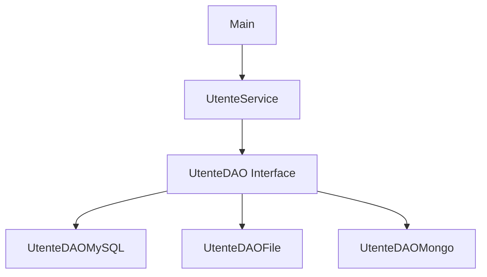

# Interfacce, DAO, Polimorfismo e Dependency Injection

## Obiettivo

Comprendere il collegamento tra:

* interfacce
* DAO
* polimorfismo
* Dependency Injection

Capire inoltre perché queste tecniche vengono utilizzate nello sviluppo professionale Java.

---

# 1. Il problema iniziale

Supponiamo di avere una classe che salva utenti in un database MySQL.

```java
public class UtenteDAOMySQL {

    public void salva(Utente utente) {
        System.out.println("Salvataggio MySQL");
    }
}
```

Utilizzo:

```java
UtenteDAOMySQL dao = new UtenteDAOMySQL();
dao.salva(utente);
```

## Problema

Il codice è fortemente collegato a MySQL.

Se in futuro vogliamo:

* usare file TXT
* usare PostgreSQL
* usare MongoDB
* usare API REST

bisogna modificare molte classi.

Questo crea forte accoppiamento.

---

# 2. Interfaccia = contratto

Per evitare dipendenze dirette dall’implementazione concreta, si introduce una interfaccia.

```java
public interface UtenteDAO {

    void salva(Utente utente);

    Utente cercaPerId(int id);
}
```

L’interfaccia definisce:

* quali operazioni devono essere disponibili
* NON come vengono realizzate

---

# 3. Implementazioni diverse

## Implementazione MySQL

```java
public class UtenteDAOMySQL implements UtenteDAO {

    @Override
    public void salva(Utente utente) {
        System.out.println("Salvataggio MySQL");
    }

    @Override
    public Utente cercaPerId(int id) {
        return new Utente(id, "Mario");
    }
}
```

---

## Implementazione File

```java
public class UtenteDAOFile implements UtenteDAO {

    @Override
    public void salva(Utente utente) {
        System.out.println("Salvataggio su file");
    }

    @Override
    public Utente cercaPerId(int id) {
        return new Utente(id, "Luigi");
    }
}
```

---

# 4. Polimorfismo

Il polimorfismo permette di usare implementazioni diverse tramite lo stesso tipo.

```java
UtenteDAO dao = new UtenteDAOMySQL();
```

oppure:

```java
UtenteDAO dao = new UtenteDAOFile();
```

## Significato

| Parte                  | Significato         |
| ---------------------- | ------------------- |
| `UtenteDAO`            | tipo di riferimento |
| `new UtenteDAOMySQL()` | oggetto reale       |

Il codice utilizza il contratto (`UtenteDAO`) senza conoscere i dettagli dell’implementazione.

---

# 5. DAO (Data Access Object)

Il DAO serve a separare:

* logica applicativa
* accesso ai dati

## Senza DAO

```text
Controller -> SQL diretto
```

## Con DAO

```text
Controller -> DAO -> Database
```

---

# 6. Dependency Injection

## Cos’è

La Dependency Injection consiste nel fornire ad una classe gli oggetti di cui ha bisogno dall’esterno.

La classe NON crea direttamente le proprie dipendenze.

---

# 7. Dove avviene la Dependency Injection

## Classe Service

```java
public class UtenteService {

    private UtenteDAO dao;

    public UtenteService(UtenteDAO dao) {
        this.dao = dao;
    }

    public void registra(Utente utente) {
        dao.salva(utente);
    }
}
```

## Punto importante

La classe:

```java
UtenteService
```

NON crea il DAO con:

```java
new UtenteDAOMySQL()
```

Riceve invece il DAO dall’esterno tramite il costruttore.

---

# 8. Dove avviene realmente l’iniezione

Nel `main`:

```java
public class Main {

    public static void main(String[] args) {

        UtenteDAO dao = new UtenteDAOMySQL();

        UtenteService service = new UtenteService(dao);

        service.registra(new Utente(1, "Anna"));
    }
}
```

## Dependency Injection

L’iniezione avviene qui:

```java
UtenteService service = new UtenteService(dao);
```

Infatti:

* il `Service` riceve il DAO dall’esterno
* NON decide quale implementazione usare

---

# 9. Vantaggi

## Codice meno accoppiato

La classe `UtenteService` non dipende da:

* MySQL
* File
* MongoDB

Dipende solo dall’interfaccia.

---

## Sostituzione semplice

Possiamo cambiare implementazione senza modificare il `Service`.

```java
UtenteDAO dao = new UtenteDAOFile();
```

---

## Maggiore testabilità

Possiamo creare implementazioni finte per i test.

```java
UtenteDAO dao = new UtenteDAOFake();
```

---

# 10. Collegamento tra i concetti

| Concetto             | Ruolo                               |
| -------------------- | ----------------------------------- |
| Interfaccia          | Definisce il contratto              |
| DAO                  | Isola accesso ai dati               |
| Polimorfismo         | Permette implementazioni diverse    |
| Dependency Injection | Fornisce l’implementazione concreta |

---

# 11. Schema completo



---

# 12. Idea fondamentale

L’applicazione deve dipendere da:

* contratti
* interfacce

NON da implementazioni concrete.

Questo rende il software:

* più flessibile
* più estendibile
* più manutenibile

---

# 13. Collegamento con Spring Framework

Spring utilizza continuamente:

* interfacce
* polimorfismo
* Dependency Injection

Esempio:

```java
@Autowired
private UtenteDAO dao;
```

Spring sceglie automaticamente quale implementazione fornire.

---

# 14. Riassunto finale

## Classe astratta

Rappresenta una famiglia di oggetti con:

* stato comune
* comportamento comune

---

## Interfaccia

Definisce:

* capacità
* comportamento atteso
* contratto

---

## DAO

Serve a separare:

* business logic
* persistenza dati

---

## Dependency Injection

Consiste nel:

* ricevere le dipendenze dall’esterno
* evitare `new` dentro le classi che usano tali dipendenze

---

# da ricordare

* L’interfaccia definisce il contratto.
* Il DAO separa la persistenza dalla logica applicativa.
* Il polimorfismo permette implementazuioni diverse
* La Dependency injection fornisce l'implementazione concreta senza modificare il codice client
