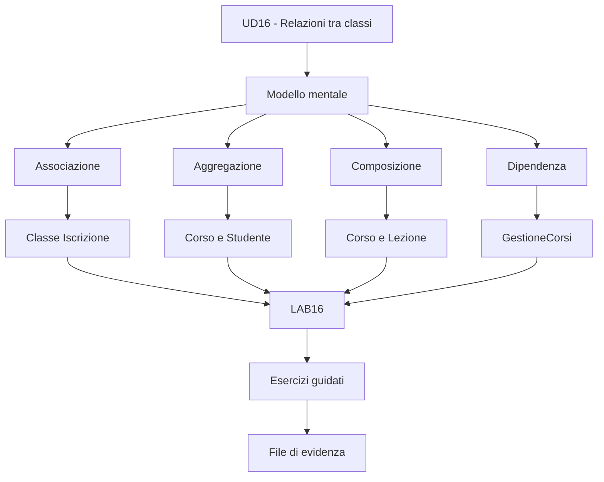
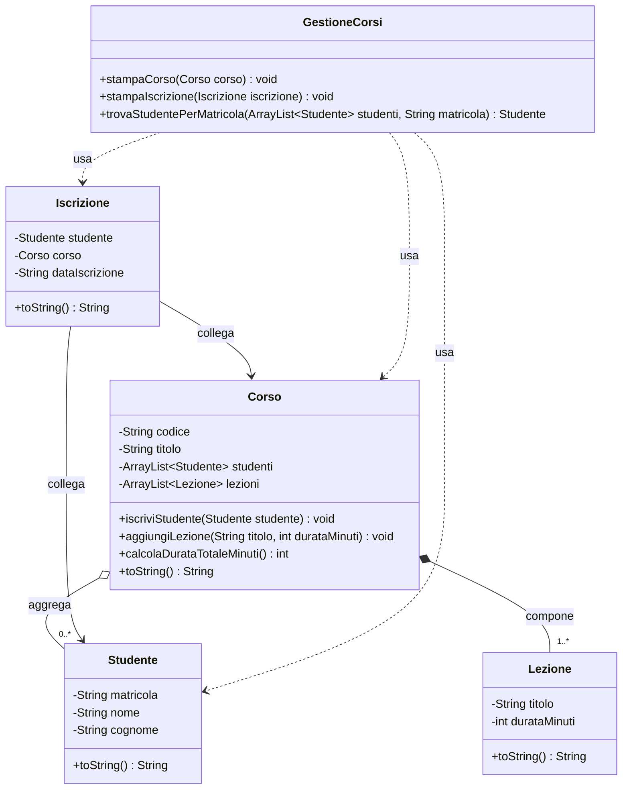
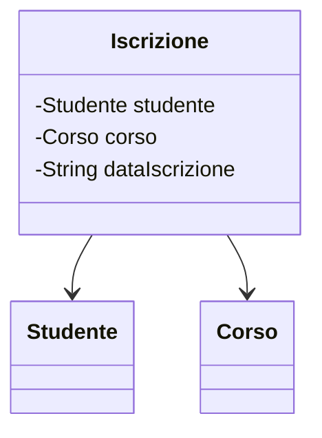
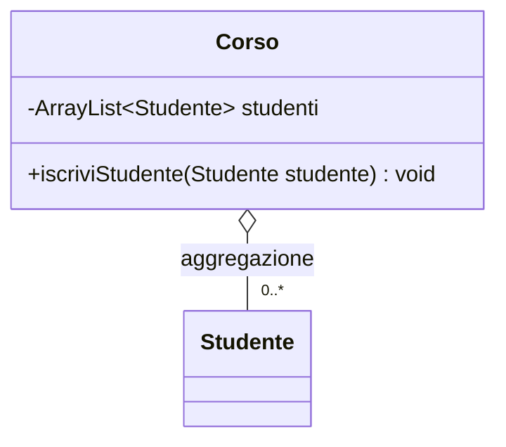
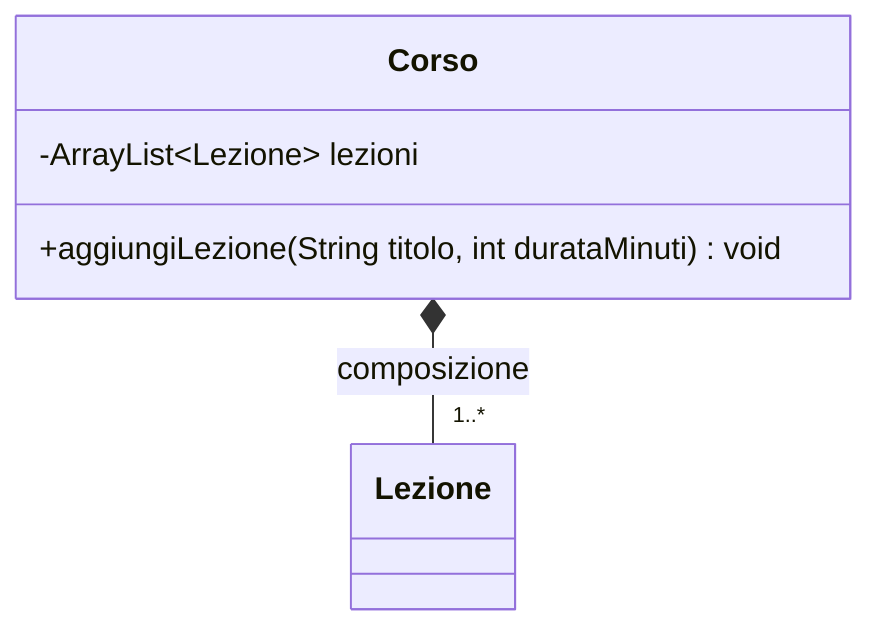
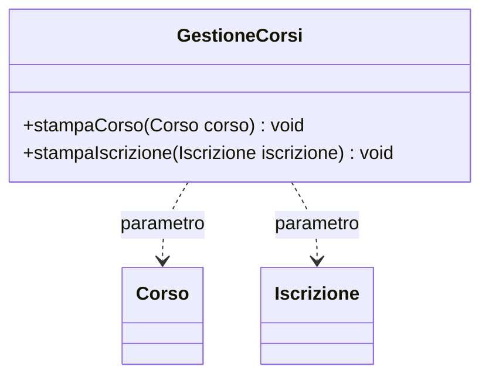
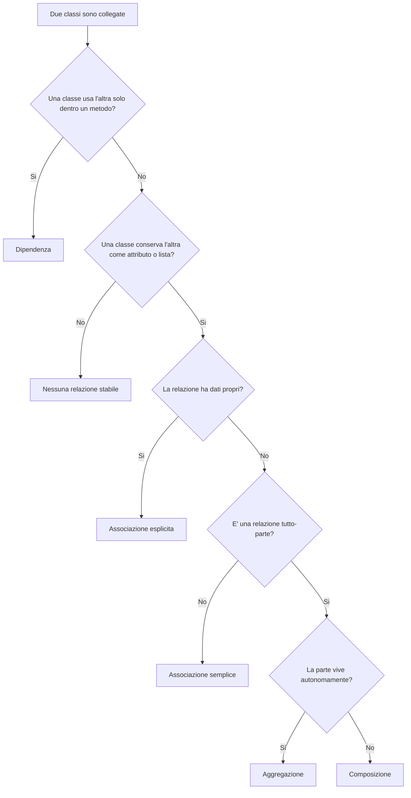
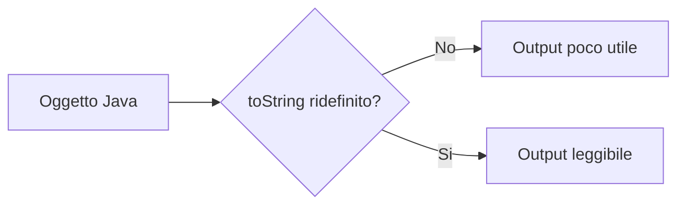
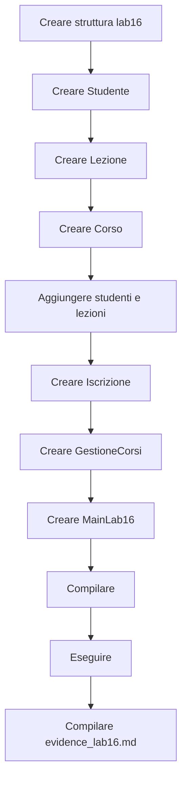
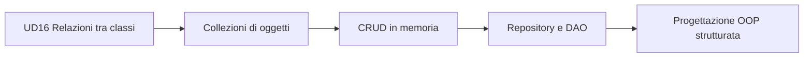

# 00 - Presentazione UD16

# Relazioni tra classi in Java

## Programma della giornata

Questa unità conclude il primo blocco OOP spostando l'attenzione dalla singola classe al modello formato da più classi collegate.

Finora avete lavorato su:

- classi e oggetti;
- incapsulamento;
- ereditarietà;
- polimorfismo;
- interfacce;
- cast e `instanceof`.

In questa UD userete questi concetti per modellare un piccolo dominio composto da oggetti che collaborano.

Il punto centrale non è avere molte classi.

Il punto centrale è saper spiegare perché quelle classi sono collegate in quel modo.

---

## Obiettivo della UD16

Alla fine della giornata dovrete saper distinguere e motivare quattro relazioni fondamentali:

| Relazione | Formula mentale | Esempio della UD |
|---|---|---|
| Associazione | due oggetti sono collegati | `Iscrizione` collega `Studente` e `Corso` |
| Aggregazione | un oggetto raggruppa parti autonome | `Corso` aggrega `Studente` |
| Composizione | un oggetto è composto da parti interne | `Corso` compone `Lezione` |
| Dipendenza | una classe usa un'altra classe temporaneamente | `GestioneCorsi` usa `Corso` come parametro |

---

## Mappa della giornata



---

## Da classi isolate a classi collegate

Nei laboratori precedenti una classe poteva essere studiata quasi da sola.

Esempi:

```text
Libro
Prodotto
Studente
Immobile
```

Ora il modello diventa più realistico:

```text
uno Studente si iscrive a un Corso
un Corso contiene Lezioni
una Iscrizione collega Studente e Corso
una classe GestioneCorsi usa oggetti del dominio
```

La domanda cambia.

Prima:

```text
come è fatta questa classe?
```

Ora:

```text
che relazione ha questa classe con le altre?
```

---

## Le classi del laboratorio

Nel laboratorio principale costruirete questo dominio:



---

## Associazione

Una associazione indica che due oggetti sono collegati.

Nel laboratorio userete una associazione esplicita:

```text
Iscrizione collega Studente e Corso
```

La relazione diventa una classe perché contiene un dato proprio:

```text
dataIscrizione
```



Domanda guida:

```text
la relazione ha informazioni proprie?
```

---

## Aggregazione

L'aggregazione è una relazione tutto-parte debole.

Nel laboratorio:

```text
Corso aggrega Studente
```

Uno studente può esistere anche fuori da quel corso.



Domanda guida:

```text
la parte può vivere anche senza il tutto?
```

---

## Composizione

La composizione è una relazione tutto-parte più forte.

Nel laboratorio:

```text
Corso compone Lezione
```

Nel modello scelto, le lezioni sono parti interne del corso.



Domanda guida:

```text
la parte è interna al tutto nel modello che sto costruendo?
```

---

## Dipendenza

La dipendenza è una relazione più debole.

Una classe usa un'altra classe per svolgere un'operazione, ma non la conserva come attributo.

Nel laboratorio:

```java
public void stampaCorso(Corso corso) {
    System.out.println(corso);
}
```



Domanda guida:

```text
la classe usa l'altra solo per eseguire un'operazione?
```

---

## Schema decisionale



---

## `toString()` nella UD16

Quando si stampano oggetti collegati, `toString()` rende l'output leggibile.



---

## Struttura del laboratorio

```text
lab16/
  src/
    corso/
      lab16/
        Studente.java
        Lezione.java
        Corso.java
        Iscrizione.java
        GestioneCorsi.java
        MainLab16.java
  docs/
    evidence_lab16.md
```

---

## Comandi fondamentali

Dalla cartella `lab16`, compilate con:

```bash
javac -d out src/corso/lab16/*.java
```

Eseguite con:

```bash
java -cp out corso.lab16.MainLab16
```

---

## Flusso operativo del laboratorio



---

## Test obbligatori

| Test | Verifica |
|---|---|
| Compilazione | comando `javac` senza errori |
| Esecuzione | avvio di `MainLab16` |
| Aggregazione | stampa degli studenti del corso |
| Composizione | stampa delle lezioni del corso |
| Associazione | stampa delle iscrizioni |
| Dipendenza | uso di oggetti passati come parametri |
| Ricerca | matricola esistente e non esistente |

---

## File di evidenza

Create il file:

```text
docs/evidence_lab16.md
```

Struttura consigliata:

```md
# Evidence LAB16

## Dati partecipante

Nome:
Data:

## Obiettivo del laboratorio

## Classi create

## Relazioni modellate

### Associazione

### Aggregazione

### Composizione

### Dipendenza

## Comandi di compilazione

## Comandi di esecuzione

## Output osservato

## Risposte alle domande

## Conclusioni
```

Il file di evidenza deve spiegare il modello, non solo dimostrare che il codice esegue.

---

## Esercizi consigliati in aula

```text
Esercizio 1 - Studente e corso
Esercizio 2 - Auto e motore
Esercizio 4 - Ordine e righe ordine
```

Se il gruppo procede bene:

```text
Esercizio 5 - Biblioteca e prestiti
```

---

## Collegamento con le prossime unità

UD16 prepara argomenti successivi come:

- collezioni di oggetti;
- CRUD in memoria;
- repository;
- DAO;
- progettazione OOP più strutturata.



---

## Sintesi finale

La frase da ricordare è:

```text
le classi collaborano perché il dominio lo richiede
```

In UD16 non si valuta solo il codice.

Si valuta la capacità di motivare il modello.
