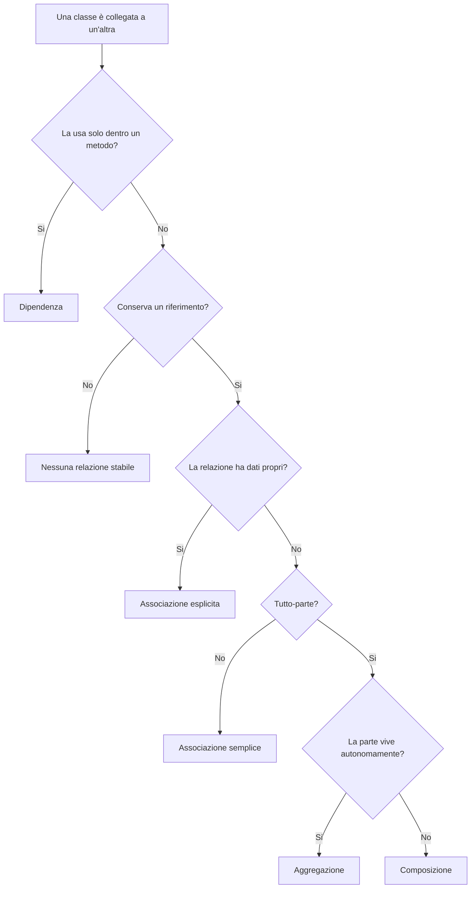

# 01. Relazioni tra classi: modello mentale

## Obiettivo

In questa attività inizierai a ragionare sulle classi non più come elementi isolati, ma come oggetti che collaborano.

Gli obiettivi sono:

- capire perché le classi hanno relazioni;
- distinguere collegamento stabile, contenimento e uso temporaneo;
- riconoscere quando una relazione merita una classe dedicata;
- preparare il laboratorio su associazione, aggregazione, composizione e dipendenza.

---

## 1. Da classi isolate a oggetti collegati

Nei laboratori precedenti hai creato classi come:

```text
Libro
Studente
Prodotto
Immobile
Corso
```

Ogni classe aveva attributi, costruttori e metodi.

Ora il problema diventa più vicino a un programma reale.

Esempi:

```text
uno Studente si iscrive a un Corso
un Corso contiene più Lezioni
un Ordine contiene più RigheOrdine
un Cliente effettua più Ordini
```

La domanda principale diventa:

```text
che relazione esiste tra questi oggetti?
```

---

## 2. Relazione tecnica e significato nel dominio

Se scrivi:

```java
private Corso corso;
```

hai creato un collegamento tecnico.

Ma devi ancora spiegare il significato della relazione:

- perché la classe conserva quel riferimento?
- la relazione è stabile o temporanea?
- l'oggetto collegato può esistere da solo?
- la relazione ha dati propri?

Il codice rappresenta la scelta, ma la scelta nasce dal dominio.

---

## 3. Relazioni che useremo in UD16

| Relazione | Idea |
|---|---|
| Associazione | due oggetti sono collegati |
| Aggregazione | un oggetto raggruppa altri oggetti autonomi |
| Composizione | un oggetto è composto da parti interne |
| Dipendenza | una classe usa un'altra classe per un'operazione |

---

## 4. Esempio: corso di formazione

Dominio:

```text
Studente
Corso
Lezione
Iscrizione
GestioneCorsi
```

Possibili relazioni:

```text
Corso aggrega Studente
Corso compone Lezione
Iscrizione associa Studente e Corso
GestioneCorsi dipende da Corso e Iscrizione
```

Ogni relazione ha un significato diverso.

---

## 5. Classe che rappresenta una relazione

A volte una relazione merita una classe dedicata.

Esempio:

```text
Studente si iscrive a Corso
```

Se vuoi conservare anche informazioni sulla relazione, per esempio:

- data iscrizione;
- stato iscrizione;
- note;
- codice pratica;

allora puoi creare una classe:

```java
public class Iscrizione {
    private Studente studente;
    private Corso corso;
    private String dataIscrizione;
}
```

`Iscrizione` non rappresenta una cosa fisica.

Rappresenta un collegamento dotato di informazioni proprie.

---

## 6. Relazione forte o debole

Quando due classi sono collegate, chiediti quanto è forte il legame.

Esempi:

| Caso | Tipo di legame |
|---|---|
| `GestioneCorsi` usa `Corso` come parametro | debole |
| `Corso` conserva studenti iscritti | intermedio |
| `Corso` contiene lezioni del proprio programma | forte nel modello scelto |
| `Iscrizione` collega studente e corso con una data | relazione esplicita |

---

## 7. Schema mentale



---

## 8. Domande di verifica

Rispondi nel file di evidenza.

1. Perché le classi non vanno viste solo come elementi isolati?
2. Che cosa significa collaborazione tra oggetti?
3. Perché non basta avere un attributo per capire una relazione?
4. Che cosa può rappresentare una classe come `Iscrizione`?
5. Che differenza c'è tra relazione forte e relazione debole?
6. Perché `GestioneCorsi` può dipendere da `Corso` senza conservarlo?
7. Che domande devi porti prima di scegliere una relazione?
8. Perché `Corso` e `Studente` sono collegati nel dominio?
9. Perché `Lezione` può essere vista come parte del `Corso`?
10. Qual è il rischio di scegliere relazioni senza motivarle?

---

## 9. Sintesi

Il punto fondamentale è:

```text
prima capisci il dominio, poi scrivi il codice
```

La relazione tra classi è una scelta di modellazione.

Nel prossimo file distinguerai in modo più preciso:

```text
associazione
aggregazione
composizione
dipendenza
```
