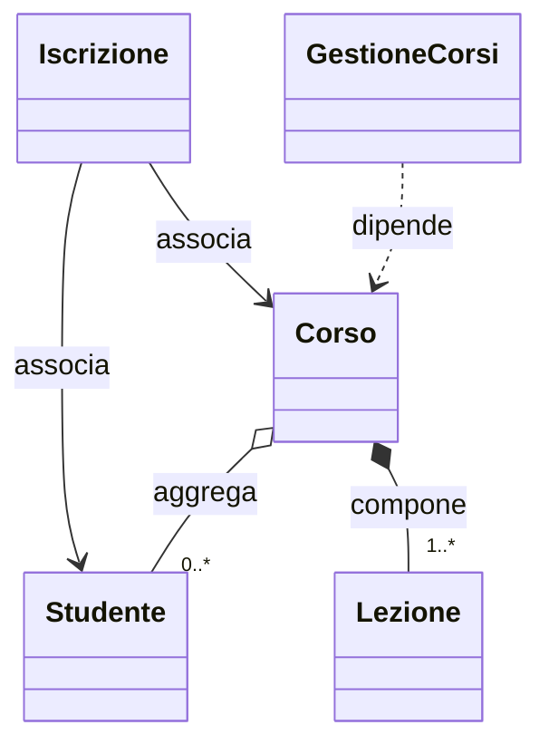

# 02. Associazione, aggregazione, composizione e dipendenza

## Obiettivo

In questa attività distinguerai quattro relazioni tra classi:

- associazione;
- aggregazione;
- composizione;
- dipendenza.

L'obiettivo è capire il significato di ciascuna relazione e come rappresentarla in Java.

---

## 1. Associazione

Una associazione è un collegamento tra oggetti.

Esempi:

```text
uno Studente è iscritto a un Corso
un Cliente effettua un Ordine
un Autore scrive un Libro
```

In Java può essere rappresentata con un riferimento diretto oppure con una classe dedicata.

Esempio con classe dedicata:

```java
public class Iscrizione {
    private Studente studente;
    private Corso corso;
    private String dataIscrizione;
}
```

Qui `Iscrizione` rappresenta il collegamento tra `Studente` e `Corso` e conserva anche la data.

---

## 2. Quando creare una classe per la relazione

Una relazione merita una classe propria quando ha dati o comportamento.

Esempi:

| Relazione | Perché può diventare classe |
|---|---|
| `Iscrizione` | ha una data o uno stato |
| `Prestito` | collega utente, libro e data |
| `RigaOrdine` | collega prodotto, quantità e prezzo |
| `Visita` | collega immobile, cliente e appuntamento |

Se la relazione non ha informazioni proprie, può bastare un riferimento diretto.

---

## 3. Aggregazione

L'aggregazione è una relazione tutto-parte debole.

Un oggetto raggruppa altri oggetti, ma le parti possono esistere anche autonomamente.

Esempio:

```text
Corso aggrega Studente
```

Gli studenti esistono anche fuori dal corso.

```java
public void iscriviStudente(Studente studente) {
    studenti.add(studente);
}
```

Lo studente viene creato altrove e poi passato al corso.

---

## 4. Composizione

La composizione è una relazione tutto-parte più forte.

Un oggetto è composto da parti che, nel modello scelto, sono interne al tutto.

Esempio:

```text
Corso compone Lezione
```

```java
public void aggiungiLezione(String titolo, int durataMinuti) {
    Lezione lezione = new Lezione(titolo, durataMinuti);
    lezioni.add(lezione);
}
```

Qui la lezione viene creata dal corso.

Questo rende evidente che, nel modello del laboratorio, la lezione è una parte interna del corso.

---

## 5. Dipendenza

Una dipendenza esiste quando una classe usa un'altra classe per svolgere un'operazione, senza conservarla come stato interno.

Esempio:

```java
public void stampaCorso(Corso corso) {
    System.out.println(corso);
}
```

`GestioneCorsi` usa `Corso` come parametro.

Questo è un uso temporaneo.

---

## 6. Confronto sintetico

| Relazione | Domanda guida | Esempio |
|---|---|---|
| Associazione | due oggetti sono collegati? | `Iscrizione` collega `Studente` e `Corso` |
| Aggregazione | il tutto raggruppa parti autonome? | `Corso` aggrega `Studente` |
| Composizione | il tutto possiede parti interne? | `Corso` compone `Lezione` |
| Dipendenza | una classe usa l'altra temporaneamente? | `GestioneCorsi` usa `Corso` come parametro |

---

## 7. Rappresentazione UML essenziale



---

## 8. `toString()` nel laboratorio

Quando il modello contiene più oggetti collegati, l'output deve essere leggibile.

Per questo le classi principali ridefiniscono:

```java
@Override
public String toString() {
    return "...";
}
```

Così una stampa come:

```java
System.out.println(studente);
```

produce informazioni utili invece di una rappresentazione tecnica poco leggibile.

---

## 9. Esempi da classificare

| Caso | Relazione probabile |
|---|---|
| `Ordine` contiene `RigaOrdine` create per quell'ordine | Composizione |
| `Biblioteca` conserva libri disponibili | Aggregazione |
| `Prestito` collega `Utente` e `Libro` | Associazione esplicita |
| `ReportService` riceve `Ordine` come parametro | Dipendenza |
| `Squadra` contiene `Giocatore` | Aggregazione |

---

## 10. Errori comuni

### Errore 1 - Confondere contenimento tecnico e significato

Il fatto che una classe contenga un riferimento non basta per capire la relazione.

Serve motivare il rapporto nel dominio.

### Errore 2 - Chiamare composizione ogni lista

Una lista può rappresentare relazioni diverse.

Conta il significato, non solo la struttura dati.

### Errore 3 - Ignorare le relazioni con dati propri

Se una relazione ha dati propri, spesso merita una classe dedicata.

### Errore 4 - Trasformare una classe di servizio in una classe onnipotente

Una classe di servizio deve avere responsabilità chiare.

---

## 11. Domande di verifica

Rispondi nel file di evidenza.

1. Che cos'è una associazione?
2. Quando una associazione merita una classe dedicata?
3. Che cos'è una aggregazione?
4. Perché `Corso` e `Studente` sono un buon esempio di aggregazione?
5. Che cos'è una composizione?
6. Perché `Corso` e `Lezione` possono rappresentare composizione?
7. Che cos'è una dipendenza?
8. Perché `GestioneCorsi` dipende da `Corso`?
9. Perché la struttura dati non basta a determinare il tipo di relazione?
10. Perché `toString()` è utile in questo laboratorio?

---

## 12. Sintesi

Le relazioni principali sono:

```text
associazione = collegamento
aggregazione = insieme di parti autonome
composizione = insieme di parti interne
dipendenza = uso temporaneo
```

La decisione nasce dal dominio.
