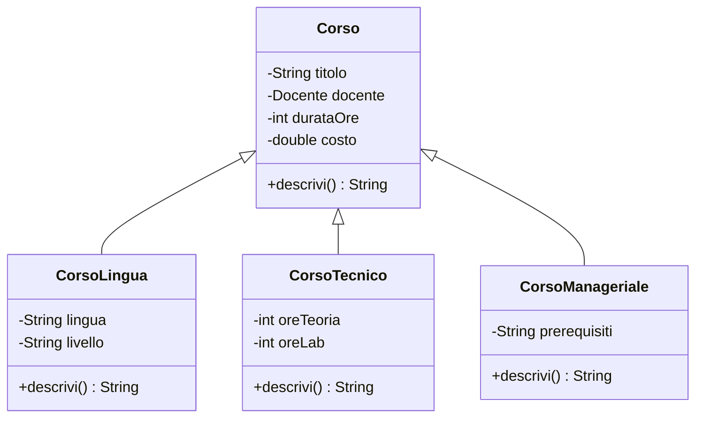
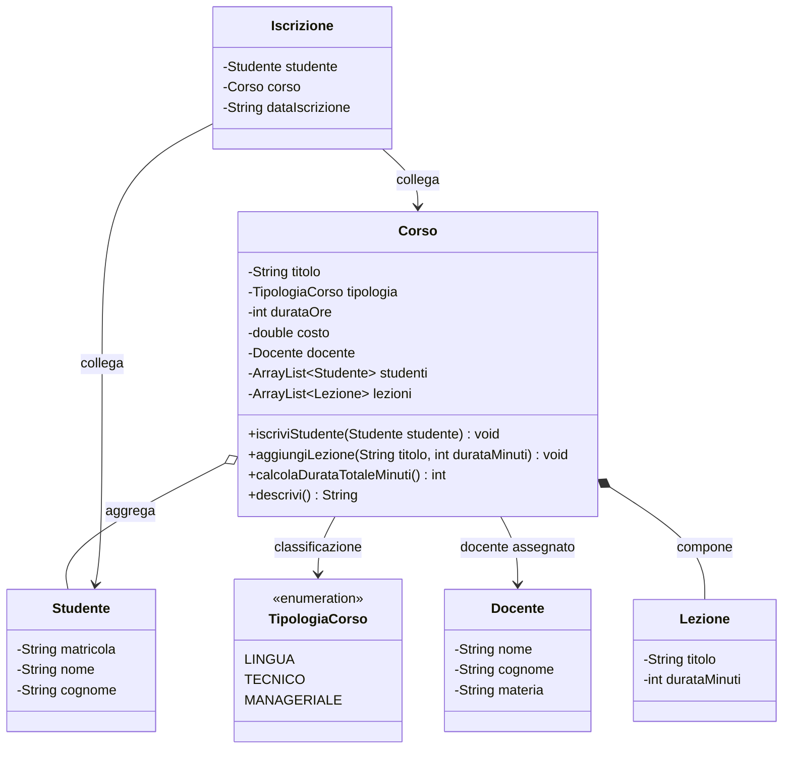

# Da sottoclassi di `Corso` a `TipologiaCorso`

## Obiettivo

Questo documento mostra come semplificare il modello UML dei corsi dopo UD16.

L'obiettivo è capire quando una differenza tra oggetti giustifica una sottoclasse e quando invece è sufficiente un attributo.

Nel caso analizzato, le classi:

```text
CorsoLingua
CorsoTecnico
CorsoManageriale
```

non sono necessariamente da modellare come sottoclassi.

Se la differenza principale è solo la categoria del corso, è preferibile usare una sola classe concreta `Corso` con un attributo `tipologia`.

---

## 1. Modello iniziale più complesso

Nel modello iniziale si poteva rappresentare `Corso` come superclasse e creare sottoclassi specifiche:



Questo modello è corretto solo se i tre tipi di corso hanno davvero regole, dati e comportamenti diversi.

---

## 2. Domanda di progettazione

Prima di creare sottoclassi bisogna chiedersi:

```text
CorsoLingua, CorsoTecnico e CorsoManageriale hanno davvero comportamenti diversi?
```

Se la risposta è sì, le sottoclassi possono avere senso.

Se la risposta è no, e cambia solo la categoria del corso, le sottoclassi sono eccessive.

---

## 3. Quando usare sottoclassi

Le sottoclassi sono giustificate quando cambiano:

| Aspetto | Esempio |
|---|---|
| Dati specifici | `CorsoLingua` ha `lingua` e `livello` |
| Regole diverse | `CorsoTecnico` calcola ore laboratorio e teoria |
| Comportamenti diversi | ogni corso ridefinisce `descrivi()` in modo sostanziale |
| Validazioni diverse | un corso tecnico richiede prerequisiti software |
| Operazioni specifiche | un corso lingua valuta livello CEFR |

In quel caso l'ereditarietà può essere utile.

---

## 4. Quando usare un attributo

Se invece la differenza è solo classificatoria, basta un attributo.

Esempio:

```text
LINGUA
TECNICO
MANAGERIALE
```

In questo caso la classe `Corso` può contenere:

```java
private TipologiaCorso tipologia;
```

Questa soluzione è più semplice, più leggibile e più adatta dopo UD16.

---

## 5. Modello semplificato 



---

## 6. Motivazione della semplificazione

La semplificazione è utile perché:

- riduce il numero di classi;
- evita ereditarietà non necessaria;
- rende il modello più leggibile;
- mantiene il focus sulle relazioni tra classi;
- distingue meglio classificazione e specializzazione;
- prepara meglio alla progettazione con attributi, enum e relazioni.

La regola è:

```text
Se cambia solo il valore di una categoria, usa un attributo.
Se cambiano comportamento e regole, valuta una sottoclasse.
```

---

## 7. Struttura Java consigliata

```text
src/
  corso/
    lab16/
      TipologiaCorso.java
      Docente.java
      Studente.java
      Lezione.java
      Corso.java
      Iscrizione.java
      Main.java
```

---

# 8. Codice Java completo

## 8.1 `TipologiaCorso.java`

```java
package corso.lab16;

public enum TipologiaCorso {
    LINGUA,
    TECNICO,
    MANAGERIALE
}
```

L'enum rappresenta un insieme chiuso di valori possibili.

È preferibile a una semplice `String` perché evita valori casuali come:

```text
tecnicco
manager
lingue varie
```

---

## 8.2 `Docente.java`

```java
package corso.lab16;

public class Docente {
    private String nome;
    private String cognome;
    private String materia;

    public Docente(String nome, String cognome, String materia) {
        this.nome = nome;
        this.cognome = cognome;
        this.materia = materia;
    }

    public String getNome() {
        return nome;
    }

    public String getCognome() {
        return cognome;
    }

    public String getMateria() {
        return materia;
    }

    @Override
    public String toString() {
        return nome + " " + cognome + " - " + materia;
    }
}
```

---

## 8.3 `Studente.java`

```java
package corso.lab16;

public class Studente {
    private String matricola;
    private String nome;
    private String cognome;

    public Studente(String matricola, String nome, String cognome) {
        this.matricola = matricola;
        this.nome = nome;
        this.cognome = cognome;
    }

    public String getMatricola() {
        return matricola;
    }

    public String getNome() {
        return nome;
    }

    public String getCognome() {
        return cognome;
    }

    @Override
    public String toString() {
        return matricola + " - " + nome + " " + cognome;
    }
}
```

---

## 8.4 `Lezione.java`

```java
package corso.lab16;

public class Lezione {
    private String titolo;
    private int durataMinuti;

    public Lezione(String titolo, int durataMinuti) {
        this.titolo = titolo;
        this.durataMinuti = durataMinuti;
    }

    public String getTitolo() {
        return titolo;
    }

    public int getDurataMinuti() {
        return durataMinuti;
    }

    @Override
    public String toString() {
        return titolo + " (" + durataMinuti + " minuti)";
    }
}
```

---

## 8.5 `Corso.java`

```java
package corso.lab16;

import java.util.ArrayList;

public class Corso {
    private String titolo;
    private TipologiaCorso tipologia;
    private int durataOre;
    private double costo;
    private Docente docente;

    private ArrayList<Studente> studenti;
    private ArrayList<Lezione> lezioni;

    public Corso(String titolo, TipologiaCorso tipologia, int durataOre, double costo, Docente docente) {
        this.titolo = titolo;
        this.tipologia = tipologia;
        this.durataOre = durataOre;
        this.costo = costo;
        this.docente = docente;
        this.studenti = new ArrayList<>();
        this.lezioni = new ArrayList<>();
    }

    public String getTitolo() {
        return titolo;
    }

    public TipologiaCorso getTipologia() {
        return tipologia;
    }

    public int getDurataOre() {
        return durataOre;
    }

    public double getCosto() {
        return costo;
    }

    public Docente getDocente() {
        return docente;
    }

    public void iscriviStudente(Studente studente) {
        if (studente != null && !studenti.contains(studente)) {
            studenti.add(studente);
        }
    }

    public void aggiungiLezione(String titolo, int durataMinuti) {
        lezioni.add(new Lezione(titolo, durataMinuti));
    }

    public int calcolaDurataTotaleMinuti() {
        int totale = 0;

        for (Lezione lezione : lezioni) {
            totale += lezione.getDurataMinuti();
        }

        return totale;
    }

    public void stampaStudenti() {
        System.out.println("Studenti iscritti al corso " + titolo + ":");

        for (Studente studente : studenti) {
            System.out.println("- " + studente);
        }
    }

    public void stampaLezioni() {
        System.out.println("Lezioni del corso " + titolo + ":");

        for (Lezione lezione : lezioni) {
            System.out.println("- " + lezione);
        }
    }

    public String descrivi() {
        return "Corso: " + titolo
                + " | tipologia: " + tipologia
                + " | durata ore: " + durataOre
                + " | costo: " + costo
                + " | docente: " + docente
                + " | durata lezioni: " + calcolaDurataTotaleMinuti() + " minuti";
    }

    @Override
    public String toString() {
        return descrivi();
    }
}
```

---

## 8.6 `Iscrizione.java`

```java
package corso.lab16;

public class Iscrizione {
    private Studente studente;
    private Corso corso;
    private String dataIscrizione;

    public Iscrizione(Studente studente, Corso corso, String dataIscrizione) {
        this.studente = studente;
        this.corso = corso;
        this.dataIscrizione = dataIscrizione;
    }

    public Studente getStudente() {
        return studente;
    }

    public Corso getCorso() {
        return corso;
    }

    public String getDataIscrizione() {
        return dataIscrizione;
    }

    @Override
    public String toString() {
        return "Iscrizione: " + studente
                + " -> " + corso.getTitolo()
                + " | data: " + dataIscrizione;
    }
}
```

---

## 8.7 `Main.java`

```java
package corso.lab16;

public class Main {
    public static void main(String[] args) {
        Docente docente = new Docente("Mario", "Rossi", "Java");

        Corso corsoJava = new Corso(
                "Java Object Oriented",
                TipologiaCorso.TECNICO,
                40,
                1200.0,
                docente
        );

        corsoJava.aggiungiLezione("Classi e oggetti", 120);
        corsoJava.aggiungiLezione("Incapsulamento", 150);
        corsoJava.aggiungiLezione("Relazioni tra classi", 180);

        Studente studente1 = new Studente("S001", "Anna", "Verdi");
        Studente studente2 = new Studente("S002", "Luca", "Bianchi");

        corsoJava.iscriviStudente(studente1);
        corsoJava.iscriviStudente(studente2);

        Iscrizione iscrizione = new Iscrizione(studente1, corsoJava, "2026-05-08");

        System.out.println("=== CORSO ===");
        System.out.println(corsoJava);

        System.out.println();
        System.out.println("=== LEZIONI ===");
        corsoJava.stampaLezioni();

        System.out.println();
        System.out.println("=== STUDENTI ===");
        corsoJava.stampaStudenti();

        System.out.println();
        System.out.println("=== ISCRIZIONE ===");
        System.out.println(iscrizione);
    }
}
```

---

# 9. Compilazione ed esecuzione

Dalla cartella principale del laboratorio:

```bash
javac -d out src/corso/lab16/*.java
```

Esecuzione:

```bash
java -cp out corso.lab16.Main
```

---

# 10. Cosa cambia rispetto al modello con sottoclassi

## Prima

```text
Corso
├── CorsoLingua
├── CorsoTecnico
└── CorsoManageriale
```

Il modello suggeriva che ogni tipologia fosse una specializzazione strutturale.

## Dopo

```text
Corso
└── tipologia: TipologiaCorso
```

Il modello dice che la tipologia è una classificazione del corso.

---

# 11. Vantaggio

Questa soluzione permette di chiarire una distinzione importante:

```text
ereditarietà = specializzazione reale
attributo = classificazione o proprietà
```

Nel nostro caso:

```text
CorsoTecnico non deve essere per forza una classe.
Può essere un Corso con tipologia TECNICO.
```

---

# 12. Possibile estensione futura

Se in futuro i corsi avranno regole davvero diverse, si potrà tornare all'ereditarietà.

Esempio:

```text
CorsoTecnico richiede ambiente di laboratorio
CorsoLingua richiede livello linguistico certificato
CorsoManageriale richiede assessment iniziale
```

In quel caso le sottoclassi potrebbero diventare utili.

Per ora il modello più corretto è:

```text
una classe Corso concreta + una tipologia come attributo
```
