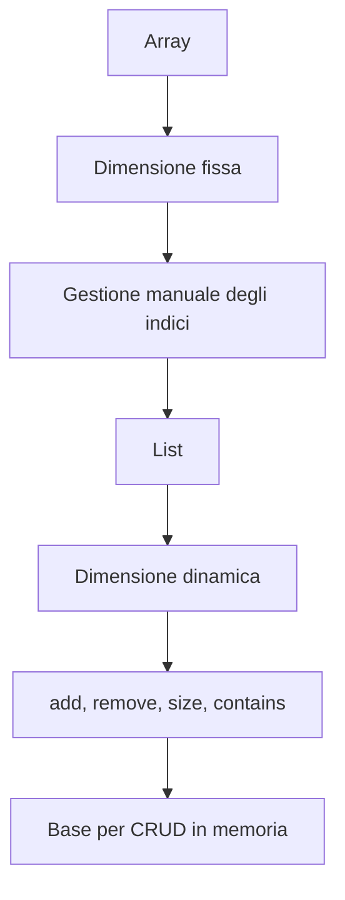

# 01 - Da array a `List`

## 1. Perché gli array non bastano sempre

Un array rappresenta una sequenza di elementi con dimensione fissa.

```java
String[] nomi = new String[3];
nomi[0] = "Anna";
nomi[1] = "Luca";
nomi[2] = "Marta";
```

Dopo la creazione, la dimensione dell'array non cambia.

Se bisogna aggiungere un quarto elemento, occorre creare un nuovo array più grande e copiare gli elementi. Questa operazione è possibile, ma non è comoda per applicazioni gestionali.

## 2. Problemi pratici con gli array nei CRUD

In un programma di gestione, gli elementi possono essere:

- aggiunti;
- cercati;
- modificati;
- cancellati;
- elencati;
- filtrati.

Con un array bisogna gestire manualmente molte operazioni.

Esempio:

```java
Corso[] corsi = new Corso[100];
int numeroCorsi = 0;

corsi[numeroCorsi] = nuovoCorso;
numeroCorsi++;
```

Il programmatore deve ricordare che:

- non tutte le celle dell'array contengono oggetti;
- `numeroCorsi` indica quanti elementi sono validi;
- una cancellazione lascia un vuoto o richiede uno spostamento;
- bisogna evitare di superare la dimensione massima.

## 3. Introduzione a `List`

`List` è un'interfaccia della Java Collection Framework che rappresenta una sequenza ordinata di elementi.

```java
List<String> nomi = new ArrayList<>();
```

In questa istruzione:

| Parte | Significato |
|---|---|
| `List<String>` | tipo del riferimento |
| `ArrayList<>()` | implementazione concreta |
| `String` | tipo degli elementi contenuti |

Il codice dipende dall'interfaccia `List`, non dalla classe concreta `ArrayList`.

Questo rende il codice più flessibile.

## 4. Import necessari

Per usare `List` e `ArrayList` bisogna importare le classi dal package `java.util`.

```java
import java.util.ArrayList;
import java.util.List;
```

## 5. Operazioni principali su `List`

### Creazione

```java
List<String> nomi = new ArrayList<>();
```

### Inserimento

```java
nomi.add("Anna");
nomi.add("Luca");
```

### Lettura per indice

```java
String primo = nomi.get(0);
```

### Dimensione

```java
int totale = nomi.size();
```

### Scansione con `for-each`

```java
for (String nome : nomi) {
    System.out.println(nome);
}
```

### Rimozione

```java
nomi.remove("Anna");
```

### Verifica presenza

```java
if (nomi.contains("Luca")) {
    System.out.println("Luca presente");
}
```

## 6. Esempio con oggetti

```java
List<Corso> corsi = new ArrayList<>();

corsi.add(new CorsoAula("Java base", 40));
corsi.add(new CorsoOnline("Spring Boot introduttivo", 24));

for (Corso corso : corsi) {
    System.out.println(corso.getTitolo());
}
```

In questo caso la lista può contenere oggetti `Corso` e oggetti delle sue sottoclassi.

Questo collega direttamente Collections e polimorfismo.

## 7. `List<Corso>` e polimorfismo

Se `CorsoAula` e `CorsoOnline` estendono `Corso`, allora entrambe le istruzioni sono valide:

```java
List<Corso> corsi = new ArrayList<>();

corsi.add(new CorsoAula("Java OO", 40));
corsi.add(new CorsoOnline("Java Web", 30));
```

La lista contiene riferimenti di tipo `Corso`, ma gli oggetti reali possono essere di sottotipi diversi.

Quando si esegue un metodo ridefinito, Java usa il binding dinamico.

```java
for (Corso corso : corsi) {
    System.out.println(corso.descrivi());
}
```

Il metodo eseguito dipende dal tipo reale dell'oggetto.

## 8. Metodi che restituiscono liste

Una lista è utile anche come valore di ritorno.

```java
public List<Corso> cercaPerTitolo(String testo) {
    List<Corso> risultati = new ArrayList<>();

    for (Corso corso : corsi) {
        if (corso.getTitolo().toLowerCase().contains(testo.toLowerCase())) {
            risultati.add(corso);
        }
    }

    return risultati;
}
```

Questo metodo non restituisce un solo corso, ma un insieme di risultati.

## 9. Metodi che ricevono liste

Una lista può essere anche parametro di un metodo.

```java
public void stampaCatalogo(List<Corso> corsi) {
    for (Corso corso : corsi) {
        System.out.println(corso.descrivi());
    }
}
```

Il metodo non ha bisogno di sapere se la lista concreta è un `ArrayList`, una `LinkedList` o un'altra implementazione.

## 10. Errore frequente: confondere posizione e identità

In una `List`, ogni elemento ha una posizione.

Tuttavia, in una gestione applicativa, l'identità dell'oggetto non dovrebbe dipendere dalla posizione.

Esempio fragile:

```java
Corso corso = corsi.get(2);
```

Esempio più robusto:

```java
Corso corso = cercaPerCodice("CORSO-001");
```

La posizione può cambiare. Il codice identificativo dovrebbe restare stabile.

## 11. Schema sintetico


