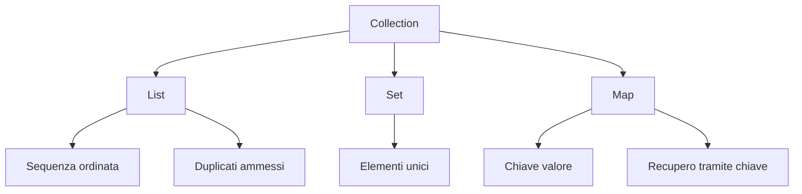

# 02 - Generics, `List`, `Set` e `Map`

## 1. Il problema delle collezioni non tipizzate

Prima dei Generics era possibile creare collezioni senza indicare il tipo degli elementi.

```java
ArrayList elementi = new ArrayList();
elementi.add("testo");
elementi.add(10);
elementi.add(new CorsoAula("Java", 40));
```

Questa forma è da evitare nei laboratori del corso.

Il problema è che la lista può contenere oggetti eterogenei senza controllo forte del compilatore.

Quando si estrae un elemento, spesso serve un cast:

```java
String valore = (String) elementi.get(0);
```

Se il cast è sbagliato, l'errore si manifesta a runtime.

## 2. Generics

I Generics permettono di specificare il tipo degli elementi contenuti in una collection.

```java
List<String> nomi = new ArrayList<>();
```

In questo modo:

- il compilatore impedisce inserimenti non validi;
- non servono cast quando si legge un elemento;
- il codice è più chiaro;
- il contratto della collection è esplicito.

Esempio:

```java
List<Corso> corsi = new ArrayList<>();
```

Questa lista accetta oggetti di tipo `Corso` e sottotipi di `Corso`.

## 3. Diamond operator

Nelle versioni moderne di Java si usa spesso il diamond operator:

```java
List<Corso> corsi = new ArrayList<>();
```

Il tipo `Corso` è scritto a sinistra. A destra può essere omesso tra le parentesi angolari perché il compilatore lo ricava dal contesto.

Forma più lunga:

```java
List<Corso> corsi = new ArrayList<Corso>();
```

Forma consigliata:

```java
List<Corso> corsi = new ArrayList<>();
```

## 4. Tipo dell'interfaccia e tipo concreto

È buona pratica dichiarare il riferimento usando l'interfaccia:

```java
List<Corso> corsi = new ArrayList<>();
```

Non è necessario scrivere sempre:

```java
ArrayList<Corso> corsi = new ArrayList<>();
```

Il vantaggio è che il codice client dipende dal comportamento generale di una lista, non da una specifica implementazione.

## 5. `Set<T>`

`Set` rappresenta una collezione che non ammette duplicati.

```java
Set<String> codici = new HashSet<>();

codici.add("C001");
codici.add("C002");
codici.add("C001");
```

Il codice `C001` resta presente una sola volta.

Import necessari:

```java
import java.util.HashSet;
import java.util.Set;
```

`Set` è utile quando il problema riguarda unicità e appartenenza.

Esempi:

- insieme dei codici già usati;
- insieme delle categorie presenti;
- insieme dei tag associati a un corso;
- insieme degli username già registrati.

## 6. `Map<K,V>`

`Map` rappresenta una struttura chiave-valore.

```java
Map<String, Corso> corsiPerCodice = new HashMap<>();

corsiPerCodice.put("C001", new CorsoAula("Java OO", 40));
Corso corso = corsiPerCodice.get("C001");
```

In questo esempio:

| Parte | Significato |
|---|---|
| `String` | tipo della chiave |
| `Corso` | tipo del valore |
| `HashMap` | implementazione concreta |

Import necessari:

```java
import java.util.HashMap;
import java.util.Map;
```

`Map` è utile quando bisogna recuperare un oggetto tramite una chiave stabile.

Esempi:

- codice corso -> corso;
- matricola -> studente;
- username -> utente;
- id prodotto -> prodotto.

## 7. Scelta tra `List`, `Set` e `Map`

| Domanda | Struttura consigliata |
|---|---|
| Devo mantenere un elenco ordinato e iterabile? | `List<T>` |
| Devo evitare duplicati? | `Set<T>` |
| Devo recuperare un elemento tramite chiave? | `Map<K,V>` |
| Devo fare un CRUD semplice in memoria? | spesso `List<T>` con ricerca per codice |
| Devo avere accesso diretto per id/codice? | spesso `Map<K,V>` |

## 8. `equals` e `hashCode`

Alcune operazioni delle collections dipendono dal modo in cui Java confronta gli oggetti.

Esempi:

```java
lista.contains(oggetto);
lista.remove(oggetto);
set.add(oggetto);
```

Per oggetti personalizzati, il confronto predefinito è basato sull'identità in memoria.

Se due oggetti devono essere considerati uguali perché hanno lo stesso codice, bisogna ridefinire `equals` e `hashCode`.

Esempio semplificato:

```java
@Override
public boolean equals(Object obj) {
    if (this == obj) {
        return true;
    }

    if (!(obj instanceof Corso)) {
        return false;
    }

    Corso altro = (Corso) obj;
    return codice.equals(altro.codice);
}

@Override
public int hashCode() {
    return codice.hashCode();
}
```

Qui è sufficiente capire il principio. 
L'uso sistematico di `equals` e `hashCode` sarà ripreso quando servirà nei CRUD e nei modelli con entità. Un approfondimento è presentato nel prossimo documento **02.2-equals-hashcode-in-Corso.md**

## 9. Collezioni e progettazione a layer

Le collections non devono essere sparse casualmente in tutto il codice.

Una scelta più ordinata è collocarle dentro una classe di servizio o repository in memoria.

Esempio:

```java
public class CatalogoService {
    private List<Corso> corsi = new ArrayList<>();

    public boolean aggiungi(Corso corso) {
        corsi.add(corso);
        return true;
    }

    public List<Corso> elenco() {
        return corsi;
    }
}
```

Questa struttura prepara il passaggio verso:

- DAO in memoria;
- DAO su file;
- DAO con JDBC;
- repository Spring Data.

## 10. Schema sintetico


