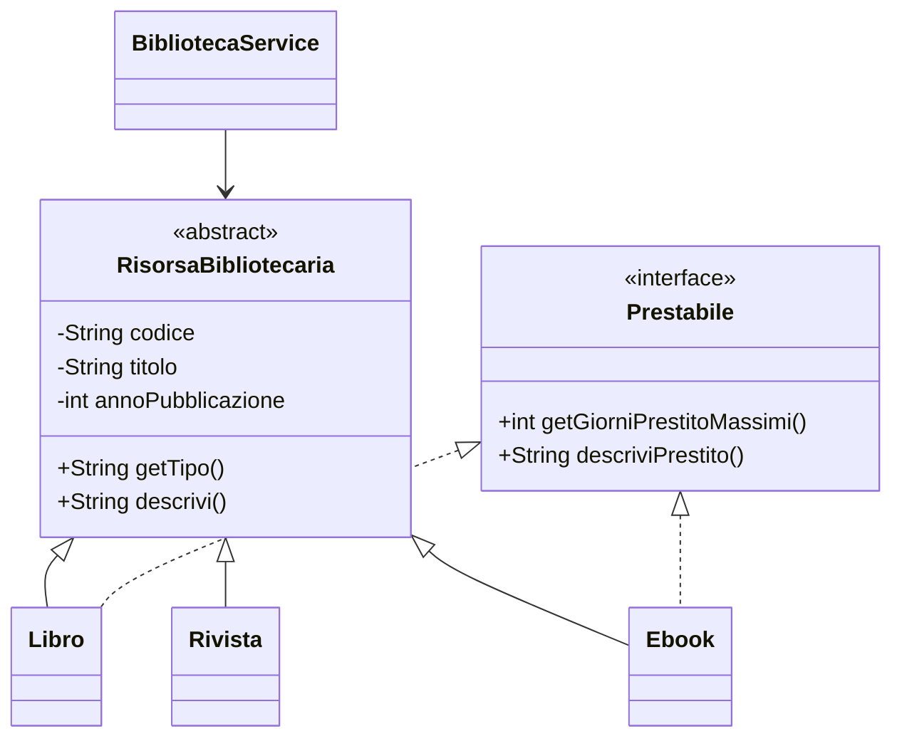

# 04 - LAB17 autonomo: gestione biblioteca con Collections

## Obiettivo del laboratorio autonomo

Realizzare una piccola gestione in memoria di risorse bibliotecarie usando Collections e Generics.

Il laboratorio deve dimostrare che il partecipante sa usare `List`, `Set` e `Map` in modo coerente, senza ricorrere ad array per gestire l'archivio principale.

## Scenario

Una biblioteca tecnica gestisce risorse diverse:

- libri cartacei;
- riviste;
- ebook.

Tutte le risorse hanno:

- codice;
- titolo;
- anno di pubblicazione.

Ogni tipo di risorsa aggiunge informazioni specifiche.

Alcune risorse sono prestabili, altre no.

Il sistema deve permettere di:

- aggiungere risorse;
- impedire codici duplicati;
- elencare tutte le risorse;
- cercare una risorsa per codice;
- cercare risorse per parte del titolo;
- rimuovere una risorsa per codice;
- elencare solo le risorse prestabili;
- ottenere l'insieme dei tipi di risorsa presenti;
- costruire una mappa codice -> risorsa.

## Struttura richiesta

Creare questa struttura:

```text
UD17_gestione_biblioteca_collections/
  src/
    corso/
      ud17/
        biblioteca/
          RisorsaBibliotecaria.java
          Prestabile.java
          Libro.java
          Rivista.java
          Ebook.java
          BibliotecaService.java
          EseguiBiblioteca.java
  docs/
    evidence_UD17_autonomo.md
```

## Verifica strumenti prima del laboratorio

Da terminale verificare:

```bash
java -version
javac -version
git --version
```

Per questa UD non devono essere installati strumenti aggiuntivi.

Non servono:

- Maven;
- Docker;
- MariaDB/MySQL;
- phpMyAdmin;
- DBeaver;
- Bootstrap;
- jQuery;
- Postman.

La compilazione deve essere eseguita con `javac`.

## Requisiti tecnici

### 1. Classe astratta `RisorsaBibliotecaria`

Creare una classe astratta con almeno:

- `codice`;
- `titolo`;
- `annoPubblicazione`;
- costruttore;
- getter;
- metodo astratto `getTipo()`;
- metodo concreto `descrivi()`.

Il metodo `descrivi()` deve produrre una descrizione base comune.

### 2. Interfaccia `Prestabile`

Creare un'interfaccia con almeno:

```java
int getGiorniPrestitoMassimi();
String descriviPrestito();
```

L'interfaccia deve rappresentare una capacità, non una gerarchia principale.

### 3. Classi concrete

Creare almeno tre classi concrete:

#### `Libro`

Campi specifici consigliati:

- autore;
- numeroPagine;
- giorniPrestitoMassimi.

Deve implementare `Prestabile`.

#### `Rivista`

Campi specifici consigliati:

- numero;
- mese.

Non deve necessariamente implementare `Prestabile`.

#### `Ebook`

Campi specifici consigliati:

- formato;
- dimensioneMB;
- giorniPrestitoMassimi.

Deve implementare `Prestabile`.

### 4. Classe `BibliotecaService`

La classe deve contenere una collection principale:

```java
private List<RisorsaBibliotecaria> risorse;
```

Il costruttore deve inizializzarla con `ArrayList`.

```java
risorse = new ArrayList<>();
```

Implementare almeno questi metodi:

```java
boolean aggiungi(RisorsaBibliotecaria risorsa)
List<RisorsaBibliotecaria> elenco()
RisorsaBibliotecaria cercaPerCodice(String codice)
List<RisorsaBibliotecaria> cercaPerTitolo(String testo)
boolean rimuoviPerCodice(String codice)
List<Prestabile> elencoPrestabili()
Set<String> tipiPresenti()
Map<String, RisorsaBibliotecaria> indicePerCodice()
```

### 5. Classe `EseguiBiblioteca`

La classe `main` deve:

- creare il servizio;
- aggiungere almeno 5 risorse;
- includere almeno un codice duplicato e dimostrare che viene rifiutato;
- stampare l'elenco completo;
- cercare almeno una risorsa per codice;
- cercare risorse per titolo;
- stampare solo le risorse prestabili;
- stampare i tipi presenti usando `Set`;
- creare una `Map` e recuperare una risorsa tramite codice;
- rimuovere una risorsa;
- stampare l'elenco finale.

## Vincoli

Non usare array per l'archivio principale.

Non usare Lambda o Stream.

Non usare Maven.

Non usare database o file.

Non usare variabili `public` nei model.

Non inserire tutta la logica nel `main`.

Il `main` deve dimostrare il funzionamento, non contenere la logica applicativa principale.

## Compilazione richiesta

Dalla cartella principale del progetto:

```bash
javac -encoding UTF-8 -d out src/corso/ud17/biblioteca/*.java
java -cp out corso.ud17.biblioteca.EseguiBiblioteca
```

## Evidenze richieste

Creare il file:

```text
docs/evidence_UD17_autonomo.md
```

Il file deve contenere:

1. struttura delle classi realizzate;
2. comando di compilazione;
3. comando di esecuzione;
4. output del programma;
5. spiegazione dell'uso di `List`;
6. spiegazione dell'uso di `Set`;
7. spiegazione dell'uso di `Map`;
8. spiegazione dell'uso dei Generics;
9. spiegazione del collegamento con polimorfismo e interfacce;
10. breve schema Mermaid del modello.

## Schema minimo richiesto

Inserire nel file di evidenza uno schema simile, adattandolo al proprio codice:



## Criteri di riuscita

Il laboratorio è completato correttamente se:

- il codice compila;
- il programma esegue tutti i casi richiesti;
- non vengono usati array come archivio principale;
- i Generics sono usati correttamente;
- il servizio incapsula la collection;
- `List`, `Set` e `Map` hanno ciascuna un ruolo motivato;
- il file di evidenza spiega le scelte progettuali.
