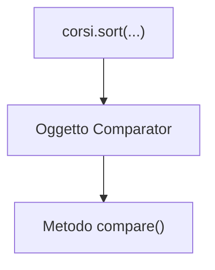
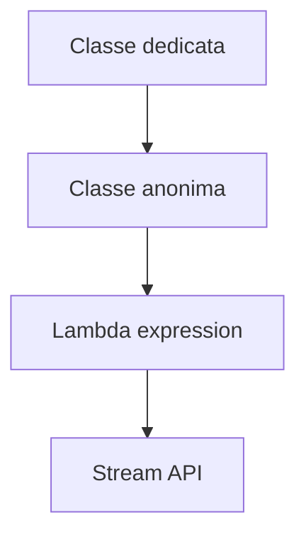

# 01 - Lambda expression base

## 00 Introduzione alle Classi Anonime

Prima delle lambda expression, in Java era comune passare comportamenti utilizzando:

- classi dedicate
- classi anonime

Per comprendere bene le lambda è importante capire prima cosa sono le classi anonime.

---

# 1. Il problema

Supponiamo di avere una lista di corsi:

```java
List<Corso> corsi = new ArrayList<>();
```

e di volerla ordinare per titolo.

Java ha bisogno di sapere:

> come confrontare due oggetti `Corso`.

---

# 2. Comparator

Per definire una regola di confronto si utilizza l’interfaccia:

```java
Comparator<Corso>
```

Questa interfaccia richiede l’implementazione del metodo:

```java
compare(Corso c1, Corso c2)
```
| Valore restituito | Significato              |
| ----------------- | ------------------------ |
| numero negativo   | `c1` viene prima di `c2` |
| zero              | equivalenti              |
| numero positivo   | `c2` viene prima di `c1` |


---


# 3. Prima soluzione: classe dedicata

Si può creare una classe separata.

```java
public class ComparatoreTitolo implements Comparator<Corso> {

    @Override
    public int compare(Corso c1, Corso c2) {
        return c1.getTitolo().compareTo(c2.getTitolo());
    }
}
```

Utilizzo:

```java
corsi.sort(new ComparatoreTitolo());
```

---

# 4. Problema della classe dedicata

La classe:

```java
ComparatoreTitolo
```

serve solo una volta.

Creare un file separato può risultare eccessivo.

---

# 5. Classe anonima

Per questo Java permette di creare una classe direttamente nel punto in cui serve.

```java
corsi.sort(new Comparator<Corso>() {

    @Override
    public int compare(Corso c1, Corso c2) {
        return c1.getTitolo().compareTo(c2.getTitolo());
    }
});
```

---

# 6. Perché si chiama "classe anonima"

Questa parte:

```java
new Comparator<Corso>() {
```

significa:

- creare una nuova classe
- senza assegnarle un nome
- che implementa `Comparator`

La classe esiste, ma non ha un nome esplicito.

---

# 7. Cosa sta succedendo realmente

La classe anonima crea un oggetto che contiene il comportamento richiesto.



---

# 8. Collegamento con il polimorfismo

Il metodo `sort()` non conosce la classe concreta.

Conosce soltanto il contratto:

```java
Comparator<Corso>
```

Questo è un esempio di polimorfismo.

---

# 9. Arrivano le lambda

Poiché molte classi anonime erano molto verbose, Java ha introdotto una sintassi più compatta: le lambda expression.

## Classe anonima

```java
new Comparator<Corso>() {

    @Override
    public int compare(Corso c1, Corso c2) {
        return c1.getTitolo().compareTo(c2.getTitolo());
    }
}
```

## Lambda equivalente

```java
(c1, c2) -> c1.getTitolo().compareTo(c2.getTitolo())
```

---

# 10. Idea fondamentale

La lambda NON introduce un concetto completamente nuovo.

È una forma abbreviata di una classe anonima utilizzata per rappresentare un comportamento.

---

# 11. Evoluzione concettuale



---

# 12. Riassunto

| Soluzione | Caratteristica |
|---|---|
| Classe dedicata | Classe separata con nome |
| Classe anonima | Classe senza nome creata al volo |
| Lambda | Sintassi compatta per esprimere un comportamento |

---

# Frase da ricordare

> Una classe anonima permette di creare rapidamente un oggetto che implementa un comportamento senza definire una classe separata con nome.  
> Le lambda expression rappresentano una forma più compatta di questo approccio.

````
````


# 02. Perché introdurre le lambda

Prima delle lambda, dicevamo, per passare un comportamento a un metodo si usavano spesso classi anonime o classi dedicate.

Esempio con una classe anonima:

```java
corsi.sort(new Comparator<Corso>() {
    @Override
    public int compare(Corso c1, Corso c2) {
        return c1.getTitolo().compareTo(c2.getTitolo());
    }
});
```
| Parte del codice                | Responsabilità                                     |
| ------------------------------- | -------------------------------------------------- |
| `corsi.sort(...)`               | attraversa e riordina la lista                     |
| `new Comparator<Corso>() {...}` | crea l’oggetto che contiene la regola di confronto |
| `compare(Corso c1, Corso c2)`   | dice quale dei due corsi deve venire prima         |
| `compareTo()`                   | confronta alfabeticamente due titoli               |

La stessa logica può essere scritta con una lambda:

```java
corsi.sort((c1, c2) -> c1.getTitolo().compareTo(c2.getTitolo()));
```

La lambda non elimina il concetto di interfaccia. Lo rende più compatto quando l'interfaccia contiene un solo metodo astratto.

## 2. Interfaccia funzionale

Una interfaccia funzionale è una interfaccia che espone un solo metodo astratto.

Esempio:

```java
public interface ValutatoreCorso {
    boolean verifica(Corso corso);
}
```

Una lambda può implementare quel comportamento:

```java
ValutatoreCorso corsoLungo = corso -> corso.getDurataOre() >= 24;
```

Qui la lambda rappresenta una regola applicabile a un oggetto `Corso`.

## 3. Forma generale di una lambda

```java
(parametri) -> espressione
```

oppure:

```java
(parametri) -> {
    // istruzioni
    return valore;
}
```

Esempi:

```java
corso -> corso.isAttivo()
```

```java
(c1, c2) -> c1.getTitolo().compareTo(c2.getTitolo())
```

```java
corso -> {
    double prezzoOrario = corso.getPrezzo() / corso.getDurataOre();
    return prezzoOrario < 20.0;
}
```

## 4. Lambda e leggibilità

Una lambda è utile quando il comportamento è breve e leggibile.

Buon uso:

```java
corso -> corso.isAttivo()
```

Uso poco leggibile:

```java
corso -> corso.isAttivo() && corso.getPrezzo() > 0 && corso.getDurataOre() > 10 && corso.getArea().startsWith("J")
```

Quando la regola diventa troppo lunga, è preferibile spostarla in un metodo con nome chiaro.

Esempio:

```java
private static boolean isCorsoJavaAvanzato(Corso corso) {
    return corso.isAttivo()
            && corso.getArea().equalsIgnoreCase("Java")
            && corso.getDurataOre() >= 24;
}
```

Uso:

```java
corsi.stream()
     .filter(ClasseDiSupporto::isCorsoJavaAvanzato)
     .forEach(System.out::println);
```

## 5. Method reference

Quando una lambda richiama direttamente un metodo esistente, si può usare una method reference.

Lambda:

```java
corso -> corso.isAttivo()
```

Method reference:

```java
Corso::isAttivo
```

Lambda:

```java
corso -> corso.getTitolo()
```

Method reference:

```java
Corso::getTitolo
```

Lambda:

```java
valore -> System.out.println(valore)
```

Method reference:

```java
System.out::println
```

## 6. Lambda e variabili esterne

Una lambda può leggere variabili locali esterne solo se sono finali o effettivamente finali.

Esempio valido:

```java
int sogliaOre = 24;

corsi.stream()
     .filter(corso -> corso.getDurataOre() >= sogliaOre)
     .forEach(System.out::println);
```

Esempio non valido:

```java
int sogliaOre = 24;
sogliaOre = 30;

corsi.stream()
     .filter(corso -> corso.getDurataOre() >= sogliaOre)
     .forEach(System.out::println);
```

La variabile usata nella lambda non deve essere modificata dopo la sua assegnazione.

## 7. Errori frequenti

| Errore | Conseguenza |
|---|---|
| usare lambda troppo lunghe | codice meno leggibile |
| modificare stato esterno dentro una lambda | comportamento fragile |
| usare lambda dove un metodo normale sarebbe più chiaro | peggiora la manutenzione |
| credere che lambda significhi assenza di oggetti | interpretazione sbagliata |

## 8. Sintesi

Le lambda sono utili per rappresentare comportamenti brevi, soprattutto quando si lavora con ordinamenti, filtri, trasformazioni e stream.

Non sostituiscono la progettazione a oggetti. Si aggiungono agli strumenti già studiati: classi, interfacce, polimorfismo e collections.
