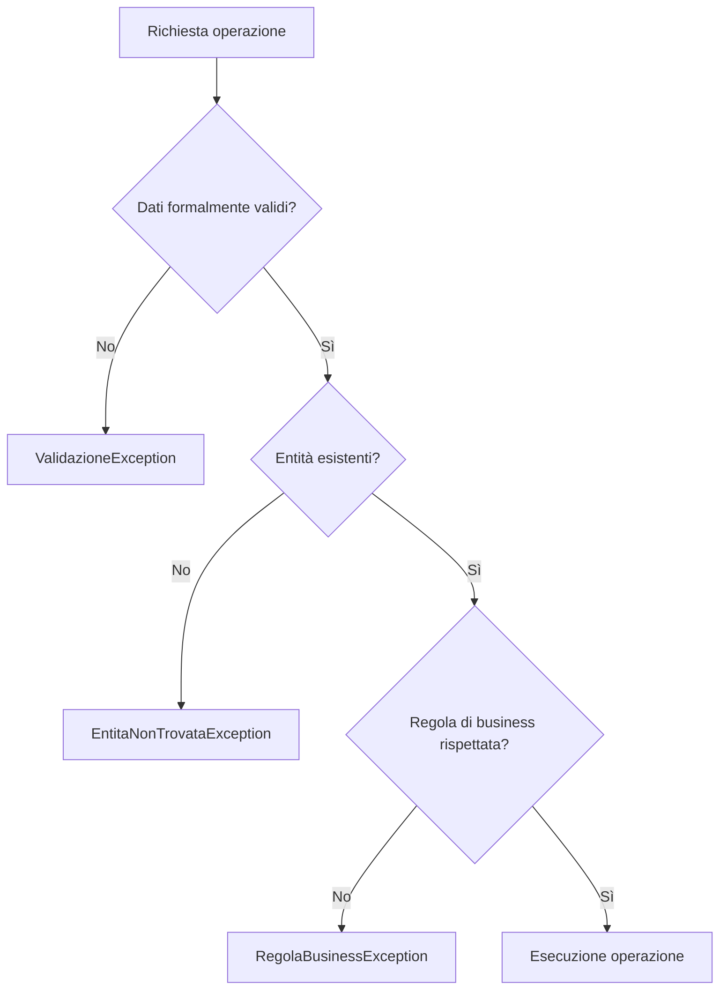

# 01 - Gestione errori ed eccezioni

## Perché servono le eccezioni

In un programma reale non basta scrivere codice che funziona nel caso ideale.

Un'applicazione deve gestire situazioni come:

- input vuoti;
- numeri negativi dove non sono ammessi;
- codici duplicati;
- entità non trovate;
- operazioni non consentite;
- file non leggibili;
- connessioni non disponibili.

Le eccezioni permettono di separare il flusso normale dal flusso anomalo.

## Problema senza eccezioni

Esempio fragile:

```java
public Corso cercaCorso(String codice) {
    for (Corso corso : corsi) {
        if (corso.getCodice().equals(codice)) {
            return corso;
        }
    }
    return null;
}
```

Il metodo restituisce `null` quando non trova il corso.

Il problema è che chi chiama il metodo deve ricordarsi sempre di controllare:

```java
Corso corso = service.cercaCorso("JAVA-01");
System.out.println(corso.getTitolo());
```

Se `corso` è `null`, il programma fallisce con `NullPointerException`.

## Segnalare il problema esplicitamente

Alternativa più chiara:

```java
public Corso cercaCorso(String codice) {
    for (Corso corso : corsi) {
        if (corso.getCodice().equals(codice)) {
            return corso;
        }
    }
    throw new EntitaNonTrovataException("Corso non trovato: " + codice);
}
```

Il metodo dichiara chiaramente che l'assenza del corso è un caso anomalo.

## `try` e `catch`

Il blocco `try` contiene il codice che può generare un'eccezione.

Il blocco `catch` contiene la gestione del problema.

```java
try {
    Corso corso = service.cercaCorso("JAVA-01");
    System.out.println(corso.getTitolo());
} catch (EntitaNonTrovataException ex) {
    System.out.println(ex.getMessage());
}
```

## `throw`

La parola chiave `throw` serve a lanciare un'eccezione.

```java
if (durataOre <= 0) {
    throw new ValidazioneException("La durata deve essere maggiore di zero");
}
```

## `finally`

Il blocco `finally` viene eseguito comunque, sia in caso di successo sia in caso di eccezione.

```java
try {
    System.out.println("Operazione in corso");
} catch (RuntimeException ex) {
    System.out.println("Errore: " + ex.getMessage());
} finally {
    System.out.println("Operazione terminata");
}
```

Nelle applicazioni reali `finally` è utile soprattutto per rilasciare risorse.

Nelle unità successive questo concetto tornerà con file, stream di input/output e connessioni a database.

## Checked e unchecked exception

In Java esistono due grandi famiglie operative:

| Tipo | Esempio | Caratteristica |
|---|---|---|
| checked exception | `IOException` | il compilatore obbliga a gestirla o dichiararla |
| unchecked exception | `IllegalArgumentException`, `RuntimeException` | il compilatore non obbliga a gestirla |

In questa UD si usano soprattutto eccezioni unchecked custom, perché il focus è sulle regole applicative e sulla chiarezza del dominio.

## Eccezione standard o custom?

Usare un'eccezione standard quando il significato è già chiaro:

```java
throw new IllegalArgumentException("Il prezzo non può essere negativo");
```

Usare un'eccezione custom quando il problema ha un significato applicativo specifico:

```java
throw new RegolaBusinessException("Il corso non è pubblicato e non può ricevere iscrizioni");
```

## Errori da evitare

### 1. Catturare tutto con `Exception`

```java
try {
    service.iscrivi(codicePartecipante, codiceCorso);
} catch (Exception ex) {
    System.out.println("Errore generico");
}
```

Questa soluzione nasconde il significato del problema.

### 2. Stampare l'errore ma continuare come se nulla fosse

```java
try {
    service.creaCorso(corso);
} catch (ValidazioneException ex) {
    System.out.println(ex.getMessage());
}
// il programma continua senza sapere se l'operazione è riuscita
```

Dopo un errore bisogna decidere cosa fare: riprovare, annullare l'operazione o informare l'utente.

### 3. Usare eccezioni per il flusso normale

Le eccezioni non devono sostituire normali condizioni previste.

Se una lista può essere vuota, spesso è sufficiente controllare:

```java
if (corsi.isEmpty()) {
    System.out.println("Nessun corso disponibile");
}
```

Non serve lanciare un'eccezione per ogni situazione normale.

## Schema del flusso


