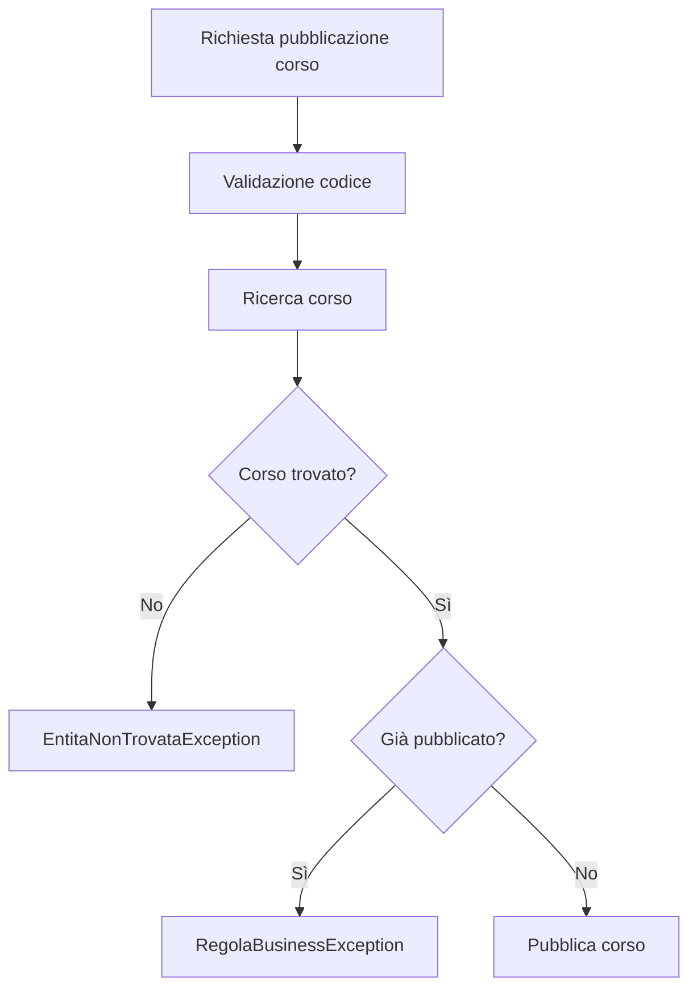

# 03 - LAB19 guidato - Catalogo corsi con validazione applicativa

## Scenario

Una società di formazione gestisce un catalogo corsi in memoria.

Nelle UD precedenti il focus era sulla struttura a oggetti, sulle collections e sugli stream. In questo laboratorio il focus diventa la robustezza applicativa: i dati devono essere validati e le operazioni non consentite devono produrre eccezioni leggibili.

## Obiettivi del laboratorio

Al termine del laboratorio il partecipante deve saper:

- creare una gerarchia minima di eccezioni applicative;
- centralizzare controlli ricorrenti in una classe `Validator`;
- distinguere validazione dei dati e regole di business;
- evitare ritorni `null` quando un'entità obbligatoria non viene trovata;
- gestire gli errori nel `main` senza duplicare la logica del servizio.

## Software e tool necessari

| Strumento | Necessario |
|---|---:|
| JDK | sì |
| VS Code o IDE Java equivalente | sì |
| Git | sì |

Non sono previste nuove installazioni per questo laboratorio.

## Struttura del progetto

Creare la seguente struttura:

```text
UD19_catalogo_corsi_validazione/
  src/
    corso/
      ud19/
        catalogo/
          ApplicazioneException.java
          ValidazioneException.java
          EntitaNonTrovataException.java
          RegolaBusinessException.java
          Validator.java
          Corso.java
          CatalogoService.java
          EseguiCatalogoValidazione.java
  docs/
    evidence_UD19_guidato.md
```

## Passo 1 - Creare la base delle eccezioni applicative

File:

```text
src/corso/ud19/catalogo/ApplicazioneException.java
```

Codice:

```java
package corso.ud19.catalogo;

public class ApplicazioneException extends RuntimeException {
    public ApplicazioneException(String message) {
        super(message);
    }
}
```

Questa classe rappresenta la base comune per gli errori applicativi del laboratorio.

## Passo 2 - Creare le eccezioni specializzate

File:

```text
src/corso/ud19/catalogo/ValidazioneException.java
```

```java
package corso.ud19.catalogo;

public class ValidazioneException extends ApplicazioneException {
    public ValidazioneException(String message) {
        super(message);
    }
}
```

File:

```text
src/corso/ud19/catalogo/EntitaNonTrovataException.java
```

```java
package corso.ud19.catalogo;

public class EntitaNonTrovataException extends ApplicazioneException {
    public EntitaNonTrovataException(String message) {
        super(message);
    }
}
```

File:

```text
src/corso/ud19/catalogo/RegolaBusinessException.java
```

```java
package corso.ud19.catalogo;

public class RegolaBusinessException extends ApplicazioneException {
    public RegolaBusinessException(String message) {
        super(message);
    }
}
```

## Passo 3 - Creare la classe `Validator`

File:

```text
src/corso/ud19/catalogo/Validator.java
```

Codice:

```java
package corso.ud19.catalogo;

public final class Validator {
    private Validator() {
    }

    public static void requireText(String valore, String messaggio) {
        if (valore == null || valore.isBlank()) {
            throw new ValidazioneException(messaggio);
        }
    }

    public static void requirePositive(int valore, String messaggio) {
        if (valore <= 0) {
            throw new ValidazioneException(messaggio);
        }
    }

    public static void requireNonNegative(double valore, String messaggio) {
        if (valore < 0) {
            throw new ValidazioneException(messaggio);
        }
    }
}
```

La classe è `final` e ha costruttore privato perché contiene solo metodi statici di utilità.

## Passo 4 - Creare la classe `Corso`

File:

```text
src/corso/ud19/catalogo/Corso.java
```

Codice:

```java
package corso.ud19.catalogo;

public class Corso {
    private String codice;
    private String titolo;
    private String area;
    private int durataOre;
    private double prezzo;
    private boolean pubblicato;

    public Corso(String codice, String titolo, String area, int durataOre, double prezzo) {
        Validator.requireText(codice, "Il codice corso è obbligatorio");
        Validator.requireText(titolo, "Il titolo corso è obbligatorio");
        Validator.requireText(area, "L'area corso è obbligatoria");
        Validator.requirePositive(durataOre, "La durata deve essere maggiore di zero");
        Validator.requireNonNegative(prezzo, "Il prezzo non può essere negativo");

        this.codice = codice;
        this.titolo = titolo;
        this.area = area;
        this.durataOre = durataOre;
        this.prezzo = prezzo;
        this.pubblicato = false;
    }

    public String getCodice() {
        return codice;
    }

    public String getTitolo() {
        return titolo;
    }

    public String getArea() {
        return area;
    }

    public int getDurataOre() {
        return durataOre;
    }

    public double getPrezzo() {
        return prezzo;
    }

    public boolean isPubblicato() {
        return pubblicato;
    }

    public void pubblica() {
        this.pubblicato = true;
    }

    public void ritira() {
        this.pubblicato = false;
    }

    @Override
    public String toString() {
        return codice + " - " + titolo + " [" + area + ", " + durataOre + " ore, " + prezzo + " euro, pubblicato=" + pubblicato + "]";
    }
}
```

## Passo 5 - Creare il servizio applicativo

File:

```text
src/corso/ud19/catalogo/CatalogoService.java
```

Codice iniziale:

```java
package corso.ud19.catalogo;

import java.util.ArrayList;
import java.util.List;
import java.util.Optional;

public class CatalogoService {
    private List<Corso> corsi = new ArrayList<>();

}
```

## Passo 6 - Aggiungere un corso con controllo duplicati

Aggiungere alla classe `CatalogoService`:

```java
public void aggiungiCorso(Corso corso) {
    if (corso == null) {
        throw new ValidazioneException("Il corso non può essere null");
    }

    if (esisteCorso(corso.getCodice())) {
        throw new RegolaBusinessException("Esiste già un corso con codice " + corso.getCodice());
    }

    corsi.add(corso);
}
```

Aggiungere il metodo di supporto:

```java
public boolean esisteCorso(String codice) {
    Validator.requireText(codice, "Il codice corso è obbligatorio");

    return corsi.stream()
            .anyMatch(corso -> corso.getCodice().equalsIgnoreCase(codice));
}
```

## Passo 7 - Cercare un corso senza restituire `null`

Aggiungere:

```java
public Corso cercaCorso(String codice) {
    Validator.requireText(codice, "Il codice corso è obbligatorio");

    Optional<Corso> trovato = corsi.stream()
            .filter(corso -> corso.getCodice().equalsIgnoreCase(codice))
            .findFirst();

    if (trovato.isEmpty()) {
        throw new EntitaNonTrovataException("Corso non trovato: " + codice);
    }

    return trovato.get();
}
```

## Passo 8 - Pubblicare un corso

Aggiungere:

```java
public void pubblicaCorso(String codice) {
    Corso corso = cercaCorso(codice);

    if (corso.isPubblicato()) {
        throw new RegolaBusinessException("Il corso " + codice + " è già pubblicato");
    }

    corso.pubblica();
}
```

## Passo 9 - Ritirare un corso

Aggiungere:

```java
public void ritiraCorso(String codice) {
    Corso corso = cercaCorso(codice);

    if (!corso.isPubblicato()) {
        throw new RegolaBusinessException("Il corso " + codice + " non è pubblicato");
    }

    corso.ritira();
}
```

## Passo 10 - Elencare i corsi pubblicati

Aggiungere:

```java
public List<Corso> elencoPubblicati() {
    return corsi.stream()
            .filter(Corso::isPubblicato)
            .toList();
}
```

## Passo 11 - Creare il programma principale

File:

```text
src/corso/ud19/catalogo/EseguiCatalogoValidazione.java
```

Codice:

```java
package corso.ud19.catalogo;

public class EseguiCatalogoValidazione {
    public static void main(String[] args) {
        CatalogoService service = new CatalogoService();

        eseguiCaso("Aggiunta corsi validi", () -> {
            service.aggiungiCorso(new Corso("JAVA-01", "Java Object Oriented", "Java", 40, 900));
            service.aggiungiCorso(new Corso("SQL-01", "SQL operativo", "Database", 24, 600));
            System.out.println("Corsi aggiunti correttamente");
        });

        eseguiCaso("Aggiunta corso con titolo vuoto", () -> {
            service.aggiungiCorso(new Corso("ERR-01", "", "Java", 16, 300));
        });

        eseguiCaso("Aggiunta corso duplicato", () -> {
            service.aggiungiCorso(new Corso("JAVA-01", "Java duplicato", "Java", 20, 500));
        });

        eseguiCaso("Pubblicazione corso esistente", () -> {
            service.pubblicaCorso("JAVA-01");
            System.out.println("Corso pubblicato");
        });

        eseguiCaso("Pubblicazione corso già pubblicato", () -> {
            service.pubblicaCorso("JAVA-01");
        });

        eseguiCaso("Ricerca corso inesistente", () -> {
            service.cercaCorso("NOPE-99");
        });

        System.out.println("\nCorsi pubblicati:");
        service.elencoPubblicati().forEach(System.out::println);
    }

    // il metodo che segue evita di dover ripetere il blocco try/catch per ogni caso (chicca)

    private static void eseguiCaso(String descrizione, Runnable azione) {
        System.out.println("\n--- " + descrizione + " ---");
        try {
            azione.run();                       // qui viene eseguito il codice passato nella lambda 
        } catch (ApplicazioneException ex) {
            System.out.println("Operazione non completata: " + ex.getMessage());
        }
    }
}
```
**Esempio esplicito**
Una delle lambda viste sopra era:
```java
eseguiCaso("Aggiunta corso duplicato", () -> {
    service.aggiungiCorso(new Corso("JAVA-01", "Java duplicato", "Java", 20, 500));
});
```
è equivalente a scrivere:
```java
eseguiCaso("Aggiunta corso duplicato", new Runnable() {
    @Override
    public void run() {
        service.aggiungiCorso(new Corso("JAVA-01", "Java duplicato", "Java", 20, 500));
    }
});
```

## Passo 12 - Compilare ed eseguire

Da dentro la cartella `UD19_catalogo_corsi_validazione`:

```bash
javac -encoding UTF-8 -d out src/corso/ud19/catalogo/*.java
java -cp out corso.ud19.catalogo.EseguiCatalogoValidazione
```

## Passo 13 - Evidenza richiesta

Creare il file:

```text
docs/evidence_UD19_guidato.md
```

Inserire:

1. output dell'esecuzione;
2. spiegazione della differenza tra `ValidazioneException`, `EntitaNonTrovataException` e `RegolaBusinessException`;
3. indicazione di almeno due controlli che non devono stare nel `main`;
4. breve schema del flusso di validazione.

Esempio di schema:



## Domande di consolidamento

1. Perché `cercaCorso` non restituisce `null`?
2. Perché il controllo del duplicato sta nel servizio e non nel `main`?
3. Che differenza c'è tra dato non valido e regola di business violata?
4. In quali casi useresti una eccezione standard invece di una custom?
5. Come cambierebbe il codice quando verrà introdotta la persistenza su file o database?
