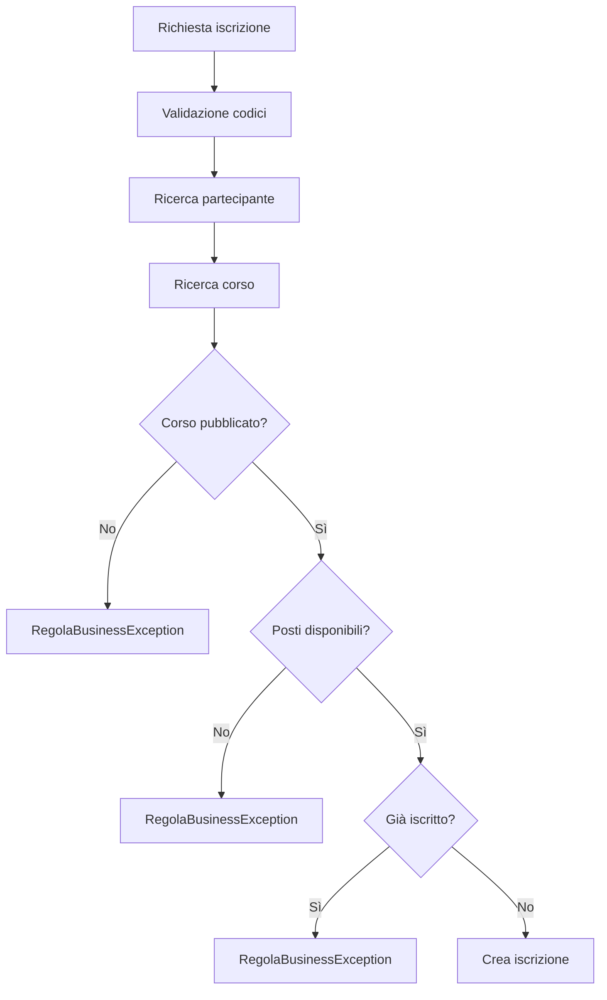

# 04 - LAB19 autonomo - Gestione iscrizioni con validazione ed eccezioni

## Scenario

Una società di formazione deve gestire le iscrizioni dei partecipanti ai corsi.

Il sistema lavora ancora in memoria, ma deve essere progettato come preparazione ai passaggi successivi verso persistenza, DAO e database.

L'obiettivo non è soltanto creare classi e liste, ma progettare una gestione robusta degli errori applicativi.

## Obiettivi del laboratorio

Realizzare una piccola applicazione Java che gestisca:

- partecipanti;
- corsi;
- iscrizioni;
- validazione dei dati;
- regole di business;
- eccezioni custom;
- output dimostrativo con casi riusciti e casi falliti.

## Software e tool necessari

| Strumento | Necessario |
|---|---:|
| JDK | sì |
| VS Code o IDE Java equivalente | sì |
| Git | sì |

Non sono previste nuove installazioni per questo laboratorio.

## Struttura richiesta

Creare il progetto:

```text
UD19_gestione_iscrizioni_validazione/
  src/
    corso/
      ud19/
        iscrizioni/
          ApplicazioneException.java
          ValidazioneException.java
          EntitaNonTrovataException.java
          RegolaBusinessException.java
          Validator.java
          StatoIscrizione.java
          Partecipante.java
          Corso.java
          Iscrizione.java
          IscrizioneService.java
          EseguiGestioneIscrizioni.java
  docs/
    evidence_UD19_autonomo.md
```

## Requisiti funzionali

### Partecipante

Ogni partecipante deve avere:

- codice;
- nome;
- email.

Regole minime:

- codice obbligatorio;
- nome obbligatorio;
- email obbligatoria;
- email formalmente plausibile.

Non è richiesto un controllo email perfetto: è sufficiente una validazione semplice e motivata.

### Corso

Ogni corso deve avere:

- codice;
- titolo;
- posti massimi;
- stato di pubblicazione.

Regole minime:

- codice obbligatorio;
- titolo obbligatorio;
- posti massimi maggiore di zero;
- un corso non pubblicato non può ricevere iscrizioni.

### Iscrizione

Ogni iscrizione deve avere:

- codice iscrizione;
- partecipante;
- corso;
- data iscrizione;
- stato iscrizione.

Stati richiesti:

```java
ATTIVA
ANNULLATA
```

## Regole applicative obbligatorie

Il servizio deve impedire:

1. inserimento di partecipanti con codice duplicato;
2. inserimento di partecipanti con email duplicata;
3. inserimento di corsi con codice duplicato;
4. iscrizione a corso inesistente;
5. iscrizione di partecipante inesistente;
6. iscrizione a corso non pubblicato;
7. doppia iscrizione attiva dello stesso partecipante allo stesso corso;
8. iscrizione oltre il numero massimo di posti;
9. annullamento di una iscrizione inesistente;
10. annullamento di una iscrizione già annullata.

## Eccezioni richieste

Creare almeno queste eccezioni custom:

```java
ApplicazioneException
ValidazioneException
EntitaNonTrovataException
RegolaBusinessException
```

Tutte le eccezioni specifiche devono estendere `ApplicazioneException`.

## Classe `Validator`

Creare una classe `Validator` con metodi statici riusabili.

Metodi minimi richiesti:

```java
requireText(String valore, String messaggio)
requirePositive(int valore, String messaggio)
requireEmail(String valore, String messaggio)
requireNotNull(Object valore, String messaggio)
```

## Classe `IscrizioneService`

La classe deve gestire internamente le liste:

```java
List<Partecipante> partecipanti
List<Corso> corsi
List<Iscrizione> iscrizioni
```

Metodi minimi richiesti:

```java
void aggiungiPartecipante(Partecipante partecipante)
void aggiungiCorso(Corso corso)
Iscrizione iscrivi(String codicePartecipante, String codiceCorso)
void annullaIscrizione(String codiceIscrizione)
List<Iscrizione> elencoIscrizioniAttive()
```

È possibile aggiungere metodi privati di supporto per rendere il codice più leggibile.

## Programma principale

La classe `EseguiGestioneIscrizioni` deve dimostrare almeno:

- inserimento di partecipanti validi;
- inserimento di corsi validi;
- pubblicazione di un corso;
- iscrizione valida;
- tentativo di iscrizione duplicata;
- tentativo di iscrizione a corso non pubblicato;
- tentativo di iscrizione a corso pieno;
- annullamento iscrizione;
- tentativo di annullamento già effettuato;
- stampa finale delle iscrizioni attive.

Usare un metodo di supporto simile a:

```java
private static void eseguiCaso(String descrizione, Runnable azione) {
    System.out.println("\n--- " + descrizione + " ---");
    try {
        azione.run();
    } catch (ApplicazioneException ex) {
        System.out.println("Operazione non completata: " + ex.getMessage());
    }
}
```

## Vincoli progettuali

- Non usare `Scanner` in questa UD.
- Non restituire `null` nei metodi di ricerca obbligatoria.
- Non gestire gli errori stampando messaggi dentro il servizio.
- Non mettere tutte le regole nel `main`.
- Usare eccezioni custom con messaggi chiari.
- Usare `List` e, dove utile, stream base.

## Compilazione ed esecuzione

Da dentro la cartella del progetto:

```bash
javac -encoding UTF-8 -d out src/corso/ud19/iscrizioni/*.java
java -cp out corso.ud19.iscrizioni.EseguiGestioneIscrizioni
```

## Evidenza richiesta

Creare il file:

```text
docs/evidence_UD19_autonomo.md
```

Il file deve contenere:

1. descrizione sintetica del problema risolto;
2. elenco delle classi realizzate;
3. output completo dell'esecuzione;
4. tabella con almeno cinque casi di errore gestiti;
5. spiegazione delle eccezioni custom usate;
6. schema del flusso di iscrizione;
7. risposta alle domande finali.

## Schema Mermaid del flusso richiesto

Inserire uno schema simile:



## Domande finali

1. Quali controlli appartengono alla validazione dei dati?
2. Quali controlli appartengono alle regole di business?
3. Perché il servizio non deve stampare direttamente i messaggi di errore?
4. Perché è utile avere una eccezione base `ApplicazioneException`?
5. Quali parti del codice saranno utili quando verrà introdotta la persistenza?
