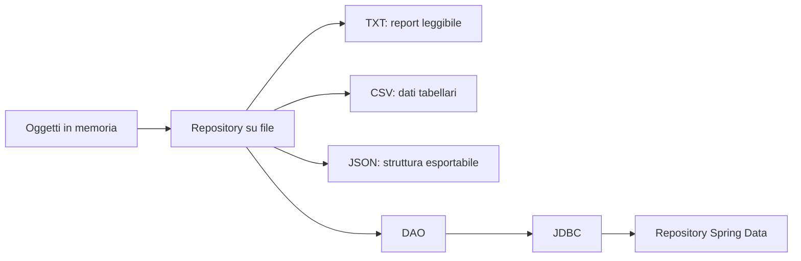

# UD20.v2 - Persistenza su file TXT, CSV e JSON

## Obiettivo generale

L'obiettivo della UD20.v2 è trasformare le applicazioni console sviluppate finora da programmi completamente volatili a programmi capaci di salvare e recuperare dati da file.

La persistenza su file viene usata come passaggio intermedio tra:

```text
oggetti in memoria -> file strutturati -> database -> DAO/JDBC -> ORM/Spring Data
```

Il focus non è soltanto scrivere righe su disco, ma progettare correttamente il punto in cui il programma dialoga con il mondo esterno.

## Problema didattico di partenza

Fino a questo momento molte applicazioni hanno creato dati in memoria:

```java
List<Corso> corsi = new ArrayList<>();
```

Alla chiusura del programma, però, questi dati vengono persi.

Questa UD introduce una domanda progettuale fondamentale:

> Dove devono essere salvati i dati e quale parte del programma deve occuparsi di farlo?

La risposta non deve essere: dentro il `main`, dentro la vista o dentro il menu.

## Risultati attesi

Al termine della UD20.v2 il partecipante deve essere in grado di progettare e implementare una piccola persistenza su file, mantenendo separate le responsabilità applicative.

In particolare, deve essere in grado di:

### 1. Distinguere memoria e persistenza

Il partecipante deve saper spiegare:

- quali dati vivono solo durante l'esecuzione del programma;
- quali dati vengono salvati su disco;
- cosa succede quando il programma viene chiuso e riaperto;
- perché una `List` non è una forma di persistenza.

### 2. Usare i file come sorgente e destinazione dati

Il partecipante deve saper:

- creare una cartella `data/` per i file applicativi;
- scrivere un report leggibile in formato TXT;
- esportare dati tabellari in CSV;
- produrre una rappresentazione JSON semplice;
- leggere dati CSV e ricostruire oggetti Java.

### 3. Separare dominio, servizio e persistenza

Il partecipante deve evitare soluzioni in cui il `main` scrive direttamente file riga per riga.

Deve invece riconoscere ruoli distinti:

| Ruolo | Responsabilità |
|---|---|
| Model | Rappresenta le entità del dominio |
| Service | Applica regole e operazioni applicative |
| Repository file | Legge e scrive dati su file |
| Main / vista | Coordina la demo o l'interazione utente |

### 4. Progettare un repository file-oriented

Il partecipante deve saper creare una classe dedicata all'accesso ai file, ad esempio:

```java
public class CorsoFileRepository {
    public void salvaCsv(List<Corso> corsi) { }
    public List<Corso> caricaCsv() { }
    public void esportaJson(List<Corso> corsi) { }
}
```

Il punto non è soltanto avere metodi che funzionano, ma impedire che il codice di persistenza si disperda in tutta l'applicazione.

### 5. Gestire errori di lettura e scrittura

Il partecipante deve saper intercettare errori di I/O e trasformarli in messaggi comprensibili.

Deve evitare due estremi:

- ignorare l'errore;
- stampare stack trace tecnici all'utente finale.

### 6. Preparare il passaggio verso DAO e database

La UD20.v2 deve rendere evidente che un repository su file e un DAO JDBC avranno lo stesso scopo logico:

```text
applicazione -> oggetto dedicato alla persistenza -> supporto fisico dei dati
```

Oggi il supporto fisico è un file.

Nelle UD successive sarà un database.

## Schema di progressione



## Struttura della giornata

| Fase | Durata indicativa | Attività |
|---|---:|---|
| Concetti introduttivi | 45 min | Memoria, file, formati e responsabilità |
| Esempi guidati | 75 min | Scrittura TXT, CSV e JSON semplice |
| Laboratorio guidato | 120 min | Catalogo corsi persistito su file |
| Laboratorio autonomo | 180 min | Registro iscrizioni con salvataggio e caricamento |
| Revisione finale | 60 min | Discussione soluzioni, errori comuni, evidenze |

## Collegamento con le UD precedenti

La UD20.v2 riutilizza:

- interfacce e polimorfismo;
- collections e generics;
- stream per filtrare o trasformare liste;
- eccezioni custom e validazione;
- separazione tra model, service e classi di supporto.

## Collegamento con le UD successive

La UD prepara:

- UD21.v2: CRUD console più strutturato con protezione dello stato;
- UD22.v2: stato condiviso e sincronizzazione;
- UD23.v2: database e modellazione;
- UD24.v2: SQL operativo;
- UD26.v2: JDBC;
- UD27.v2: DAO con JDBC.
