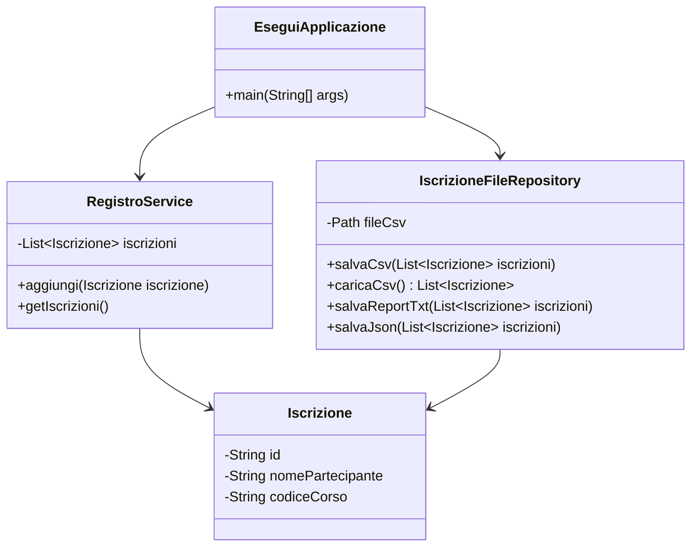

# Persistenza su file e responsabilità applicative

## 1. Il problema della memoria volatile

Quando un programma Java crea oggetti in memoria, questi oggetti esistono finché il processo è attivo.

Esempio:

```java
List<String> nomi = new ArrayList<>();
nomi.add("Anna");
nomi.add("Luca");
```

La lista esiste durante l'esecuzione del programma.

Quando il programma termina, il contenuto viene perso.

Per rendere i dati disponibili anche dopo la chiusura del programma, bisogna salvarli su un supporto persistente:

- file;
- database;
- servizio remoto;
- altro sistema esterno.

In questa UD si usa il file system.

## 2. Cosa significa persistere un oggetto

Un oggetto Java non viene salvato automaticamente come oggetto.

Deve essere trasformato in una rappresentazione testuale o binaria.

Esempio oggetto:

```java
Corso corso = new Corso("JAVA-BASE", "Java Base", 40);
```

Possibile rappresentazione CSV:

```csv
JAVA-BASE;Java Base;40
```

Possibile rappresentazione JSON:

```json
{
  "codice": "JAVA-BASE",
  "titolo": "Java Base",
  "ore": 40
}
```

Questa trasformazione si chiama, in senso generale, serializzazione.

L'operazione inversa si chiama deserializzazione:

```text
file -> righe/testo -> dati primitivi -> oggetto Java
```

## 3. Perché non scrivere file direttamente nel main

Soluzione fragile:

```java
public static void main(String[] args) throws IOException {
    List<Corso> corsi = new ArrayList<>();
    // creazione corsi

    Files.writeString(Path.of("corsi.csv"), "...");
}
```

Il problema non è che questo codice non possa funzionare.

Il problema è che mescola responsabilità diverse:

- creazione dati;
- logica applicativa;
- formato dei file;
- gestione degli errori;
- percorso fisico dei file.

Un'applicazione cresce meglio se il codice di persistenza viene isolato.

## 4. Repository su file

Una soluzione più ordinata consiste nel creare una classe dedicata:

```java
public class CorsoFileRepository {

    public void salvaCsv(List<Corso> corsi) {
        // scrittura file
    }

    public List<Corso> caricaCsv() {
        // lettura file
    }
}
```

Il resto dell'applicazione non deve sapere come il file è scritto internamente.

Deve sapere soltanto che esiste un oggetto responsabile di salvare e caricare dati.

## 5. Separazione dei ruoli



## 6. Gestione degli errori

Le operazioni su file possono fallire.

Esempi:

- cartella inesistente;
- file bloccato;
- permessi insufficienti;
- disco non disponibile;
- formato non valido;
- riga incompleta;
- numero non convertibile.

Il repository deve gestire questi casi in modo controllato.

Esempio:

```java
try {
    Files.write(path, righe, StandardCharsets.UTF_8);
} catch (IOException e) {
    throw new FileRepositoryException("Errore durante il salvataggio del file", e);
}
```

In questo modo il dettaglio tecnico resta disponibile, ma l'applicazione riceve un errore più significativo.

## 7. File e validazione

I dati letti da file non devono essere considerati automaticamente corretti.

Un file può essere modificato manualmente, generato male o corrotto.

Per questo motivo, durante il caricamento bisogna controllare:

- numero di campi;
- campi obbligatori;
- conversioni numeriche;
- valori ammessi;
- coerenza con le regole applicative.

## 8. Regola pratica

Una buona progettazione per questa fase è:

```text
main/menu -> service -> repository -> file
```

Il `main` coordina.

Il service applica regole.

Il repository legge e scrive.

Il file conserva i dati.
