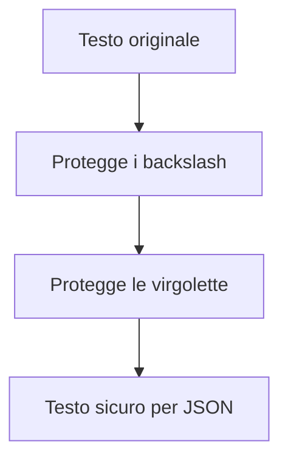

# Spiegazione passo dopo passo di `replace("\\", "\\\\").replace("\"", "\\\"")`

## Obiettivo

Questa sezione spiega cosa fa il seguente codice Java:

```java
valore.replace("\\", "\\\\").replace("\"", "\\\"");
```

Il codice serve a trasformare una stringa in modo che possa essere inserita in modo più sicuro dentro un testo JSON costruito manualmente.

In particolare gestisce due caratteri problematici:

- il backslash: `\`
- le virgolette doppie: `"`

Questi caratteri sono importanti perché nel formato JSON hanno un significato speciale.

---

## 1. Il problema da risolvere

Supponiamo di voler salvare un titolo dentro una riga JSON.

Esempio:

```java
String titolo = "Corso \"Java Base\"";
```

Il contenuto reale della stringa è:

```text
Corso "Java Base"
```

Se questo valore viene inserito direttamente dentro un JSON costruito con concatenazioni di stringhe, si può ottenere un risultato non valido:

```json
{
  "titolo": "Corso "Java Base""
}
```

Il problema è che le virgolette interne vengono interpretate come chiusura della stringa JSON.

Il JSON corretto dovrebbe invece essere:

```json
{
  "titolo": "Corso \"Java Base\""
}
```

Le virgolette interne devono quindi essere precedute da backslash.

---

## 2. Il codice completo

Il codice da analizzare è:

```java
valore.replace("\\", "\\\\").replace("\"", "\\\"");
```

La trasformazione avviene in due passaggi consecutivi:

```java
valore
    .replace("\\", "\\\\")
    .replace("\"", "\\\"");
```

Primo passaggio:

```java
.replace("\\", "\\\\")
```

Secondo passaggio:

```java
.replace("\"", "\\\"")
```

---

## 3. Distinzione fondamentale: codice Java e contenuto reale

Quando si lavora con backslash e virgolette bisogna distinguere due livelli:

1. ciò che si scrive nel codice Java;
2. il carattere reale presente nella stringa in memoria.

Esempio:

```java
"\\"
```

Nel codice Java vediamo due backslash, ma nella stringa reale c'è un solo backslash:

```text
\
```

Altro esempio:

```java
"\""
```

Nel codice Java vediamo backslash più virgoletta, ma nella stringa reale c'è solo una virgoletta:

```text
"
```

Questa distinzione è essenziale per capire il codice.

---

## 4. Primo passaggio: protezione del backslash

Codice:

```java
.replace("\\", "\\\\")
```

Questa istruzione significa:

```text
sostituisci ogni backslash singolo \ con due backslash \\
```

In Java, però, il backslash è un carattere speciale nelle stringhe.

Per rappresentare un solo backslash reale bisogna scrivere:

```java
"\\"
```

Questo nel contenuto reale della stringa rappresenta:

```text
\
```

Per rappresentare due backslash reali bisogna scrivere:

```java
"\\\\"
```

Questo nel contenuto reale della stringa rappresenta:

```text
\\
```

Quindi:

```java
.replace("\\", "\\\\")
```

vuol dire realmente:

```text
\  diventa  \\
```

---

## 5. Esempio sul primo passaggio

Codice iniziale:

```java
String valore = "C:\\temp\\file.txt";
```

Contenuto reale della stringa:

```text
C:\temp\file.txt
```

Dopo questo passaggio:

```java
valore.replace("\\", "\\\\")
```

il contenuto diventa:

```text
C:\\temp\\file.txt
```

Il backslash è stato raddoppiato.

Questo è utile perché, quando il testo viene scritto dentro JSON, il backslash deve essere rappresentato come `\\`.

---

## 6. Secondo passaggio: protezione delle virgolette

Codice:

```java
.replace("\"", "\\\"")
```

Questa istruzione significa:

```text
sostituisci ogni virgoletta " con \"
```

Anche qui bisogna distinguere tra ciò che si scrive nel codice Java e il carattere reale.

Per rappresentare una virgoletta doppia dentro una stringa Java bisogna scrivere:

```java
"\""
```

Questo nel contenuto reale rappresenta:

```text
"
```

Per rappresentare una virgoletta preceduta da backslash bisogna scrivere:

```java
"\\\""
```

Questo nel contenuto reale rappresenta:

```text
\"
```

Quindi:

```java
.replace("\"", "\\\"")
```

vuol dire realmente:

```text
"  diventa  \"
```

---

## 7. Esempio sul secondo passaggio

Codice iniziale:

```java
String valore = "Corso \"Java Base\"";
```

Contenuto reale della stringa:

```text
Corso "Java Base"
```

Dopo questo passaggio:

```java
valore.replace("\"", "\\\"")
```

il contenuto diventa:

```text
Corso \"Java Base\"
```

Le virgolette interne sono state protette con il backslash.

---

## 8. Esempio completo passo dopo passo

Codice:

```java
String valore = "Cartella C:\\corsi\\java - corso \"base\"";

String risultato = valore
        .replace("\\", "\\\\")
        .replace("\"", "\\\"");

System.out.println(risultato);
```

Contenuto reale iniziale:

```text
Cartella C:\corsi\java - corso "base"
```

Dopo il primo `replace`:

```java
.replace("\\", "\\\\")
```

risultato intermedio:

```text
Cartella C:\\corsi\\java - corso "base"
```

I backslash sono stati raddoppiati.

Dopo il secondo `replace`:

```java
.replace("\"", "\\\"")
```

risultato finale:

```text
Cartella C:\\corsi\\java - corso \"base\"
```

Anche le virgolette sono state protette.

---

## 9. Tabella riassuntiva

| Codice Java | Carattere reale rappresentato | Significato |
|---|---|---|
| `"\\"` | `\` | un backslash singolo |
| `"\\\\"` | `\\` | due backslash |
| `"\""` | `"` | una virgoletta doppia |
| `"\\\""` | `\"` | una virgoletta preceduta da backslash |

La trasformazione complessiva è:

| Prima | Dopo |
|---|---|
| `\` | `\\` |
| `"` | `\"` |

---

## 10. Perché l'ordine è importante

Il codice usa questo ordine:

```java
valore
    .replace("\\", "\\\\")
    .replace("\"", "\\\"");
```

Prima protegge i backslash già presenti nel testo.

Poi protegge le virgolette.

Questo ordine è corretto perché evita di trasformare di nuovo i backslash aggiunti per proteggere le virgolette.

Esempio concettuale:

```text
1. Prima raddoppio i backslash originali.
2. Poi aggiungo il backslash davanti alle virgolette.
```

---

## 11. Metodo completo consigliato nel laboratorio

Una versione più completa del metodo può essere questa:

```java
private static String escapeJson(String valore) {
    if (valore == null) {
        return "";
    }

    return valore
            .replace("\\", "\\\\")
            .replace("\"", "\\\"")
            .replace("\n", "\\n")
            .replace("\r", "\\r")
            .replace("\t", "\\t");
}
```

Questo metodo gestisce anche:

- ritorno a capo;
- ritorno carrello;
- tabulazione.

---

## 12. Schema del flusso



---

## 13. Idea principale da ricordare

Il codice:

```java
valore.replace("\\", "\\\\").replace("\"", "\\\"");
```

non modifica il significato del testo.

Modifica solo il modo in cui alcuni caratteri speciali vengono rappresentati, in modo che il testo possa essere inserito correttamente dentro una stringa JSON.

In sintesi:

```text
\  diventa  \\
"  diventa  \"
```

---

## 14. Nota progettuale

In un'applicazione reale è preferibile non costruire JSON manualmente con concatenazioni di stringhe.

Per produrre JSON in modo robusto si usano librerie dedicate, per esempio Jackson o Gson.

In questo laboratorio, però, il metodo `escapeJson` è utile per capire il problema e vedere cosa deve accadere quando un testo viene trasformato in un formato compatibile con JSON.
