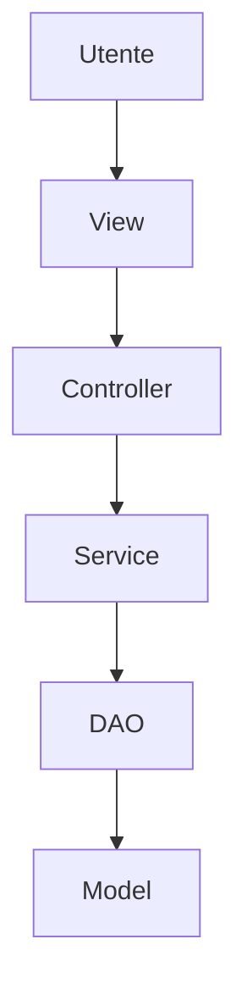
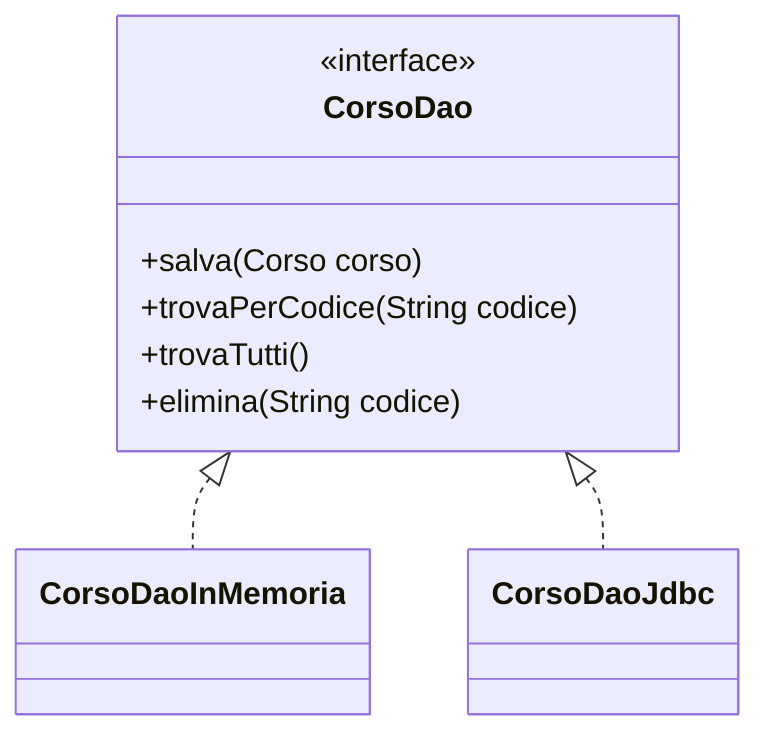

# CRUD console e separazione delle responsabilità

## Che cosa significa CRUD

CRUD è l'acronimo delle quattro operazioni fondamentali sui dati:

| Operazione | Significato | Esempio |
|---|---|---|
| Create | creare un nuovo elemento | inserire un corso |
| Read | leggere o cercare elementi | visualizzare tutti i corsi |
| Update | modificare un elemento esistente | cambiare durata o prezzo |
| Delete | eliminare un elemento | rimuovere un corso obsoleto |

In una console application queste operazioni vengono spesso associate a un menu:

```text
1. Inserisci
2. Elenca
3. Cerca
4. Modifica
5. Elimina
0. Esci
```

Il menu però è solo la superficie del problema.

Il vero obiettivo è decidere dove collocare il codice.

## Il problema del CRUD monolitico

Un CRUD scritto tutto nel `main` tende ad accumulare responsabilità diverse nello stesso punto:

```java
public static void main(String[] args) {
    Scanner input = new Scanner(System.in);
    List<Corso> corsi = new ArrayList<>();

    // lettura input
    // validazione
    // ricerca
    // modifica
    // stampa
    // gestione errori
}
```

Questa soluzione presenta diversi problemi:

- il codice cresce rapidamente;
- le regole applicative sono mescolate con la lettura da console;
- cambiare la persistenza richiede modifiche in molti punti;
- testare una singola funzionalità diventa difficile;
- duplicare controlli e messaggi è molto probabile.

## Separare i ruoli

Una struttura più ordinata separa le responsabilità.



Questa rappresentazione va letta così:

- l'utente interagisce con la vista;
- la vista legge input e mostra output;
- il controller decide quale operazione avviare;
- il service applica regole e validazioni;
- il DAO conserva e recupera i dati;
- il model rappresenta gli oggetti del dominio.

## Ruoli principali

### Model

Il model contiene le classi del dominio.

Esempio:

```java
public class Corso {
    private String codice;
    private String titolo;
    private int ore;
}
```

Il model non deve leggere da tastiera, stampare menu o conoscere il DAO.

### DAO

Il DAO gestisce il salvataggio e il recupero dei dati.

Nel laboratorio useremo un DAO in memoria:

```java
public class CorsoDaoInMemoria implements CorsoDao {
    private final List<Corso> corsi = new ArrayList<>();
}
```

Nelle unità successive lo stesso ruolo potrà essere svolto da un DAO JDBC.

### Service

Il service contiene le regole applicative.

Esempio:

- non si possono inserire due corsi con lo stesso codice;
- le ore devono essere positive;
- un corso può essere eliminato solo se esiste;
- la modifica deve mantenere valido l'oggetto.

### View

La view gestisce input e output.

Nel nostro standard didattico, lo `Scanner` deve stare nella view, non nel DAO e non nel model.

### Controller

Il controller coordina il flusso:

- mostra il menu tramite la view;
- legge la scelta;
- chiama il service;
- gestisce il risultato;
- chiede alla view di mostrare messaggi.

## Regola pratica

Quando si scrive codice, una domanda utile è:

```text
Questa classe sta facendo il proprio mestiere oppure sta invadendo il lavoro di un'altra classe?
```

Se una classe legge input, valida regole, modifica liste e stampa output, probabilmente sta facendo troppo.

## Obiettivo architetturale

La struttura finale deve permettere questo tipo di sostituzione:



Il service deve poter lavorare con `CorsoDao` senza conoscere quale implementazione concreta viene usata.
