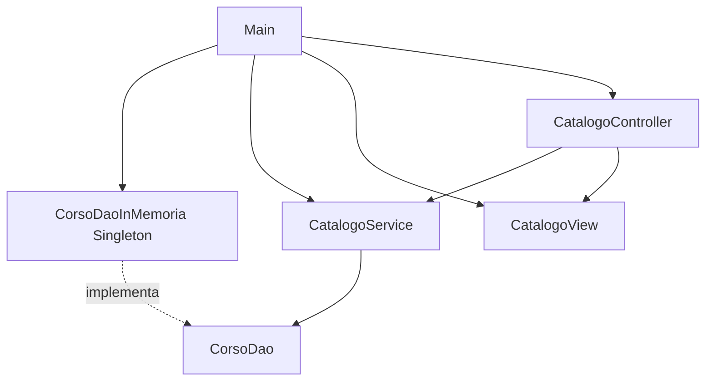

# DAO, Singleton e dipendenze nel CRUD

## Obiettivo del file

Questo file collega i pattern introdotti nei file precedenti al laboratorio CRUD della UD21.

I concetti principali sono:

- DAO come contratto di accesso ai dati;
- implementazione in memoria basata su `List`;
- Singleton come protezione contro repository multipli non coordinati;
- service dipendente da interfaccia, non da classe concreta;
- passaggio futuro a JDBC e Spring.

## Perché introdurre un DAO

DAO significa **Data Access Object**.

Nel percorso didattico il DAO serve a nascondere il modo in cui i dati vengono salvati e recuperati.

Oggi i dati saranno salvati in memoria.

Più avanti potranno essere salvati in:

- database relazionale;
- repository JDBC;
- repository JPA;
- repository Spring Data.

L'idea importante è che il resto dell'applicazione non debba conoscere i dettagli tecnici della persistenza.

## Contratto prima dell'implementazione

Si parte da un'interfaccia:

```java
public interface CorsoDao {
    void salva(Corso corso);
    Optional<Corso> trovaPerCodice(String codice);
    List<Corso> trovaTutti();
    boolean aggiorna(Corso corso);
    boolean elimina(String codice);
}
```

Il service dipende dal contratto:

```java
public class CatalogoService {
    private final CorsoDao corsoDao;

    public CatalogoService(CorsoDao corsoDao) {
        this.corsoDao = corsoDao;
    }
}
```

Questa scelta rende il service indipendente dall'implementazione concreta.

Oggi userà:

```java
CorsoDaoInMemoria
```

Più avanti potrà usare:

```java
CorsoDaoJdbc
```

senza cambiare la logica del service.

## Implementazione in memoria

Una prima implementazione può usare una lista:

```java
public class CorsoDaoInMemoria implements CorsoDao {
    private final List<Corso> corsi = new ArrayList<>();
}
```

Questa classe contiene lo stato condiviso dell'applicazione.

## Problema: più repository in memoria

Se più parti del programma creano istanze diverse del DAO, si ottengono liste diverse:

```java
CorsoDao dao1 = new CorsoDaoInMemoria();
CorsoDao dao2 = new CorsoDaoInMemoria();
```

In questo caso:

- `dao1` salva in una lista;
- `dao2` legge da un'altra lista;
- il programma sembra perdere dati;
- il comportamento diventa difficile da spiegare.

Nel laboratorio si usa il Singleton per evitare questo problema.

## Singleton applicato al DAO

```java
public class CorsoDaoInMemoria implements CorsoDao {
    private static CorsoDaoInMemoria instance;

    private final List<Corso> corsi = new ArrayList<>();

    private CorsoDaoInMemoria() {
    }

    public static CorsoDaoInMemoria getInstance() {
        if (instance == null) {
            instance = new CorsoDaoInMemoria();
        }
        return instance;
    }
}
```

Caratteristiche:

- il costruttore è `private`;
- il campo statico conserva l'unica istanza;
- il metodo statico `getInstance()` restituisce l'istanza condivisa;
- la lista interna è unica per tutta l'applicazione.

## Punto importante: non abusare del Singleton

Il Singleton viene usato solo per il DAO in memoria.

Il service non deve chiamare direttamente `CorsoDaoInMemoria.getInstance()` al proprio interno.

Da evitare:

```java
public class CatalogoService {
    public void aggiungiCorso(Corso corso) {
        CorsoDaoInMemoria.getInstance().salva(corso);
    }
}
```

Da preferire:

```java
public class CatalogoService {
    private final CorsoDao corsoDao;

    public CatalogoService(CorsoDao corsoDao) {
        this.corsoDao = corsoDao;
    }
}
```

Avvio dell'applicazione:

```java
CorsoDao corsoDao = CorsoDaoInMemoria.getInstance();
CatalogoService service = new CatalogoService(corsoDao);
CatalogoView view = new CatalogoView();
CatalogoController controller = new CatalogoController(service, view);
controller.avvia();
```

In questo modo:

- il DAO è Singleton;
- il service dipende dall'interfaccia;
- le dipendenze restano visibili;
- il codice prepara la Dependency Injection.

## Relazione tra DAO, Service e Controller



## Perché questa struttura prepara JDBC

Quando verrà introdotto JDBC, l'interfaccia potrà restare simile:

```java
public interface CorsoDao {
    void salva(Corso corso);
    Optional<Corso> trovaPerCodice(String codice);
    List<Corso> trovaTutti();
    boolean aggiorna(Corso corso);
    boolean elimina(String codice);
}
```

Cambierà l'implementazione:

```java
public class CorsoDaoJdbc implements CorsoDao {
    // usa Connection, PreparedStatement e ResultSet
}
```

Il service potrà continuare a dipendere da `CorsoDao`.

## Collegamento con Spring

In Spring non si scriverà normalmente un Singleton manuale per ogni servizio o repository.

Il container Spring gestirà i bean e fornirà le istanze necessarie.

Il percorso concettuale è:

```text
Singleton manuale in UD21
        ↓
Dipendenze passate tramite costruttore
        ↓
Dependency Injection reale in Spring
        ↓
Bean gestiti dal container
```

## Sintesi

In UD21 il Singleton non è il pattern più importante in assoluto.

È uno strumento usato per evidenziare un problema concreto: evitare più repository in memoria non coordinati.

La competenza più importante resta progettare una struttura in cui ogni classe abbia una responsabilità chiara.
