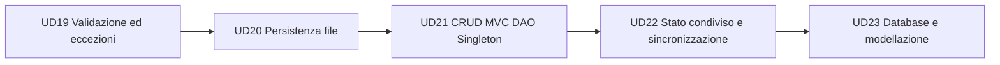

# UD22.v2 - Stato condiviso e sincronizzazione

## Perché questa unità

Nelle unità precedenti il programma Java è stato visto come una sequenza controllata di operazioni: menu, scelta utente, chiamata a controller, service e DAO. In un'applicazione reale, però, più attività possono accedere agli stessi dati nello stesso momento.

Anche se il corso non è ancora entrato in Spring, database e web application, il problema è già presente:

- più operazioni possono lavorare sullo stesso repository;
- un Singleton può esporre uno stato condiviso;
- un servizio può ricevere più richieste ravvicinate;
- un'operazione apparentemente semplice può essere composta da più passaggi interni.

Questa UD introduce quindi il concetto di **stato condiviso protetto**.

## Risultato atteso

Al termine della giornata il partecipante deve essere in grado di progettare e implementare una piccola simulazione Java nella quale più thread operano su uno stesso oggetto condiviso, riconoscendo quali operazioni sono critiche e proteggendole con una sincronizzazione adeguata.

Non è sufficiente sapere scrivere:

```java
Thread t = new Thread(new MioRunnable());
t.start();
```

Il partecipante deve saper spiegare:

- quale oggetto è condiviso;
- quale dato può essere modificato da più thread;
- quale sequenza di istruzioni deve essere considerata atomica a livello applicativo;
- perché senza protezione possono comparire risultati incoerenti;
- dove posizionare `synchronized` senza bloccare inutilmente tutto il programma.

## Collegamento con le UD precedenti



La UD22 chiude il blocco Java core avanzato prima dell'ingresso nei database.

## Concetti principali

| Concetto | Descrizione operativa |
|---|---|
| Thread | Flusso di esecuzione indipendente all'interno dello stesso programma |
| Runnable | Oggetto che descrive il lavoro da eseguire in un thread |
| Stato condiviso | Oggetto o dato accessibile da più thread |
| Race condition | Errore causato dall'interleaving non controllato tra thread |
| Sezione critica | Parte di codice che deve essere eseguita da un solo thread alla volta |
| synchronized | Meccanismo base di Java per proteggere una sezione critica |

## Struttura della giornata

| Sessione | Attività |
|---|---|
| Mattina | Concetti, esempi guidati, laboratorio su bacheca messaggi concorrente |
| Pomeriggio | Laboratorio autonomo su prenotazioni concorrenti e soluzione ragionata |

## Competenze in uscita

Il partecipante deve essere in grado di:

1. leggere una simulazione concorrente semplice;
2. individuare il punto in cui si genera una race condition;
3. modificare il codice introducendo sincronizzazione solo dove serve;
4. documentare il comportamento prima e dopo la correzione;
5. collegare il tema al Singleton e ai futuri servizi applicativi.
