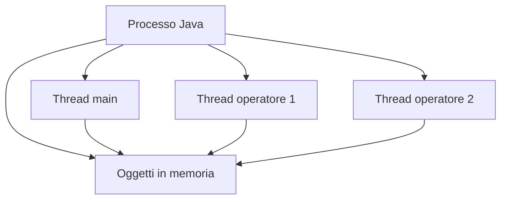
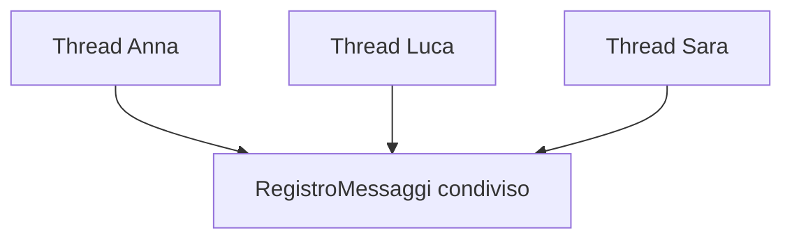

# 01 - Thread, Runnable e stato condiviso

## Processo e thread

Un programma Java in esecuzione vive dentro un processo. Dentro lo stesso processo possono esistere più thread, cioè più flussi di esecuzione che condividono la memoria del processo.



Il punto importante è che i thread possono accedere agli stessi oggetti. Questo permette collaborazione, ma introduce anche rischi.

## Runnable

`Runnable` è un'interfaccia funzionale che rappresenta un'attività eseguibile da un thread.

```java
public class StampaMessaggioTask implements Runnable {
    private String messaggio;

    public StampaMessaggioTask(String messaggio) {
        this.messaggio = messaggio;
    }

    @Override
    public void run() {
        System.out.println(messaggio);
    }
}
```

Un oggetto `Runnable` non è ancora un thread. Descrive soltanto il lavoro da svolgere.

```java
Runnable task = new StampaMessaggioTask("Operazione in corso");
Thread thread = new Thread(task);
thread.start();
```

Il metodo `start()` avvia un nuovo thread. Il metodo `run()` non deve essere chiamato direttamente quando si vuole simulare concorrenza.

## Esempio base

```java
public class EsempioThread {
    public static void main(String[] args) {
        Runnable task1 = new StampaMessaggioTask("Primo task");
        Runnable task2 = new StampaMessaggioTask("Secondo task");

        Thread t1 = new Thread(task1);
        Thread t2 = new Thread(task2);

        t1.start();
        t2.start();
    }
}
```

L'ordine delle stampe non è garantito. Il sistema operativo e la JVM decidono come alternare i thread.

## Stato condiviso

Uno stato è condiviso quando più thread accedono allo stesso oggetto.

```java
RegistroMessaggi registro = new RegistroMessaggi();

Thread t1 = new Thread(new ScrittoreTask(registro, "Anna"));
Thread t2 = new Thread(new ScrittoreTask(registro, "Luca"));
```

In questo esempio entrambi i thread ricevono lo stesso riferimento `registro`.



## Perché lo stato condiviso è delicato

Un'operazione apparentemente semplice può essere composta da più istruzioni.

Esempio concettuale:

```java
postiDisponibili = postiDisponibili - 1;
```

A livello logico sembra una sola operazione, ma il programma deve:

1. leggere il valore attuale;
2. calcolare il nuovo valore;
3. scrivere il nuovo valore.

Se due thread eseguono questi passaggi nello stesso momento, il risultato finale può essere errato.

## Regola didattica

Non tutti gli oggetti usati da più classi sono pericolosi. Il rischio nasce quando più thread modificano lo stesso stato.

| Caso | Rischio |
|---|---|
| Oggetto immutabile condiviso | basso |
| Oggetto letto da più thread ma non modificato | basso |
| Oggetto modificato da un solo thread | basso |
| Oggetto modificato da più thread | alto |
| Oggetto Singleton con stato interno modificabile | alto |
