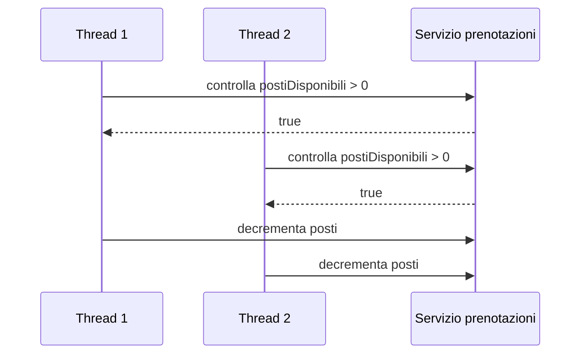

# 02 - Sincronizzazione e sezioni critiche

## Race condition

Una race condition si verifica quando il risultato del programma dipende dall'ordine imprevedibile con cui i thread accedono a una risorsa condivisa.

Esempio:

```java
public boolean prenota() {
    if (postiDisponibili > 0) {
        postiDisponibili--;
        return true;
    }
    return false;
}
```

Il codice sembra corretto. Il problema è che controllo e modifica devono essere trattati come un'unica operazione logica.

## Sequenza pericolosa

Supponiamo che `postiDisponibili` valga `1`.



Risultato: due prenotazioni accettate per un solo posto disponibile.

## Sezione critica

Una sezione critica è una porzione di codice che deve essere eseguita da un solo thread alla volta.

Nel caso precedente la sezione critica comprende:

1. controllo dei posti disponibili;
2. creazione della prenotazione;
3. decremento dei posti;
4. salvataggio della prenotazione.

## synchronized su metodo

```java
public synchronized boolean prenota(String nomePartecipante) {
    if (postiDisponibili > 0) {
        postiDisponibili--;
        return true;
    }
    return false;
}
```

Con `synchronized`, un solo thread alla volta può eseguire quel metodo sullo stesso oggetto.

## synchronized su blocco

```java
private final Object lock = new Object();

public boolean prenota(String nomePartecipante) {
    synchronized (lock) {
        if (postiDisponibili > 0) {
            postiDisponibili--;
            return true;
        }
        return false;
    }
}
```

Il blocco sincronizzato permette di proteggere solo la parte critica.

## Singleton e sincronizzazione

Un Singleton garantisce che esista una sola istanza di una classe, ma non garantisce che lo stato interno sia protetto.

```java
public class RegistroSingleton {
    private static RegistroSingleton istanza;
    private int contatore;

    private RegistroSingleton() {
    }

    public static RegistroSingleton getInstance() {
        if (istanza == null) {
            istanza = new RegistroSingleton();
        }
        return istanza;
    }

    public void incrementa() {
        contatore++;
    }
}
```

In presenza di più thread questo codice ha due problemi distinti:

- creazione dell'istanza non protetta;
- modifica del contatore non protetta.

Per questa UD è sufficiente concentrarsi sulla protezione delle operazioni sullo stato condiviso.

## Criteri pratici

| Domanda | Indicazione |
|---|---|
| Il metodo modifica dati condivisi? | Probabile candidato alla sincronizzazione |
| Il metodo legge soltanto dati immutabili? | Di solito non serve sincronizzare |
| Il metodo controlla e poi modifica? | La sequenza completa va protetta |
| Il metodo contiene solo stampa a video? | Non è il punto principale della sincronizzazione |
| L'oggetto è Singleton e ha stato modificabile? | Va analizzato con attenzione |

## Errori frequenti

- sincronizzare il `main` invece del servizio condiviso;
- creare un oggetto diverso per ogni thread e pensare di simulare stato condiviso;
- usare `Thread.sleep()` come soluzione al problema;
- sincronizzare tutto senza distinguere le sezioni critiche;
- pensare che `ArrayList` sia automaticamente sicura in ambiente concorrente;
- confondere ordine delle stampe con correttezza dello stato finale.
