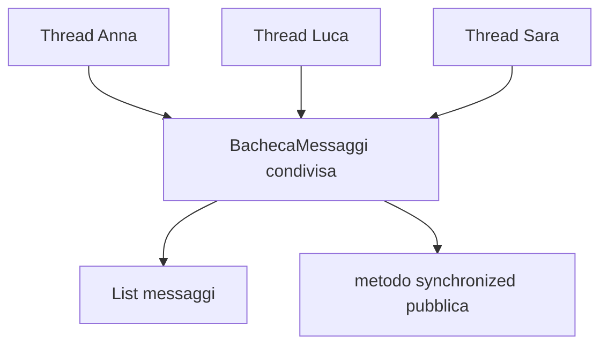

# 03 - LAB22 guidato: bacheca messaggi concorrente

## Scenario

Si vuole simulare una piccola bacheca condivisa usata da più operatori. Ogni operatore pubblica un certo numero di messaggi. Tutti i messaggi finiscono nello stesso oggetto `BachecaMessaggi`.

Il laboratorio mostra prima una versione non protetta, poi una versione sincronizzata.

## Obiettivi

- Creare classi che implementano `Runnable`.
- Avviare più thread che lavorano sullo stesso oggetto.
- Individuare lo stato condiviso.
- Proteggere l'aggiunta di messaggi con `synchronized`.
- Documentare la differenza tra versione non protetta e versione protetta.

## Requisiti software

| Software/Tool | Uso nel laboratorio |
|---|---|
| JDK | Compilazione ed esecuzione del codice Java |
| Editor Java | Scrittura dei file sorgente |
| Terminale | Esecuzione dei comandi `javac` e `java` |

## Struttura consigliata

```text
UD22_bacheca_messaggi/
  src/
    corso/
      ud22/
        bacheca/
          Messaggio.java
          BachecaMessaggi.java
          OperatoreTask.java
          EseguiBachecaMessaggi.java
  docs/
    evidence_UD22_guidato.md
```

## Passo 1 - Creare il model `Messaggio`

```java
package corso.ud22.bacheca;

public class Messaggio {
    private String autore;
    private String testo;

    public Messaggio(String autore, String testo) {
        this.autore = autore;
        this.testo = testo;
    }

    public String getAutore() {
        return autore;
    }

    public String getTesto() {
        return testo;
    }

    @Override
    public String toString() {
        return autore + ": " + testo;
    }
}
```

## Passo 2 - Creare una bacheca non ancora sincronizzata

```java
package corso.ud22.bacheca;

import java.util.ArrayList;
import java.util.List;

public class BachecaMessaggi {
    private List<Messaggio> messaggi = new ArrayList<>();

    public void pubblica(Messaggio messaggio) {
        messaggi.add(messaggio);
    }

    public int contaMessaggi() {
        return messaggi.size();
    }

    public List<Messaggio> getMessaggi() {
        return new ArrayList<>(messaggi);
    }
}
```

La lista è privata, ma l'oggetto `BachecaMessaggi` sarà condiviso da più thread. L'incapsulamento non basta a rendere sicuro l'accesso concorrente.

## Passo 3 - Creare il task degli operatori

```java
package corso.ud22.bacheca;

public class OperatoreTask implements Runnable {
    private BachecaMessaggi bacheca;
    private String nomeOperatore;
    private int numeroMessaggi;

    public OperatoreTask(BachecaMessaggi bacheca, String nomeOperatore, int numeroMessaggi) {
        this.bacheca = bacheca;
        this.nomeOperatore = nomeOperatore;
        this.numeroMessaggi = numeroMessaggi;
    }

    @Override
    public void run() {
        for (int i = 1; i <= numeroMessaggi; i++) {
            Messaggio messaggio = new Messaggio(nomeOperatore, "messaggio " + i);
            bacheca.pubblica(messaggio);
        }
    }
}
```

Il punto importante è che ogni task riceve lo stesso riferimento alla bacheca.

## Passo 4 - Creare il programma principale

```java
package corso.ud22.bacheca;

public class EseguiBachecaMessaggi {
    public static void main(String[] args) throws InterruptedException {
        BachecaMessaggi bacheca = new BachecaMessaggi();

        Thread t1 = new Thread(new OperatoreTask(bacheca, "Anna", 1000));
        Thread t2 = new Thread(new OperatoreTask(bacheca, "Luca", 1000));
        Thread t3 = new Thread(new OperatoreTask(bacheca, "Sara", 1000));

        t1.start();
        t2.start();
        t3.start();

        t1.join();
        t2.join();
        t3.join();

        System.out.println("Messaggi attesi: 3000");
        System.out.println("Messaggi presenti: " + bacheca.contaMessaggi());
    }
}
```

`join()` fa attendere al thread `main` la conclusione degli altri thread. Senza `join()`, il programma potrebbe stampare il conteggio prima del completamento dei task.

## Passo 5 - Compilare ed eseguire

Posizionarsi nella cartella principale del laboratorio.

```bash
javac -encoding UTF-8 -d out $(find src -name "*.java")
java -cp out corso.ud22.bacheca.EseguiBachecaMessaggi
```

Su Windows PowerShell, in alternativa:

```powershell
Get-ChildItem -Recurse src -Filter *.java | ForEach-Object { $_.FullName } > sources.txt
javac -encoding UTF-8 -d out @sources.txt
java -cp out corso.ud22.bacheca.EseguiBachecaMessaggi
```

## Passo 6 - Osservare il problema

Il risultato potrebbe essere corretto oppure no. Una race condition non produce necessariamente errore a ogni esecuzione.

Eseguire più volte il programma e annotare i risultati.

```text
Messaggi attesi: 3000
Messaggi presenti: ...
```

## Passo 7 - Sincronizzare il metodo critico

Modificare `BachecaMessaggi`.

```java
public synchronized void pubblica(Messaggio messaggio) {
    messaggi.add(messaggio);
}

public synchronized int contaMessaggi() {
    return messaggi.size();
}

public synchronized List<Messaggio> getMessaggi() {
    return new ArrayList<>(messaggi);
}
```

La sincronizzazione va collocata sull'oggetto condiviso, non sui singoli task.

## Passo 8 - Rieseguire e documentare

Compilare ed eseguire di nuovo.

```bash
javac -encoding UTF-8 -d out $(find src -name "*.java")
java -cp out corso.ud22.bacheca.EseguiBachecaMessaggi
```

Nel file `docs/evidence_UD22_guidato.md` documentare:

1. qual è lo stato condiviso;
2. quali thread accedono alla bacheca;
3. quale metodo rappresenta la sezione critica principale;
4. perché `join()` è necessario nel programma principale;
5. perché il problema può non manifestarsi a ogni esecuzione;
6. perché la sincronizzazione è stata inserita nella classe `BachecaMessaggi`.

## Schema finale


