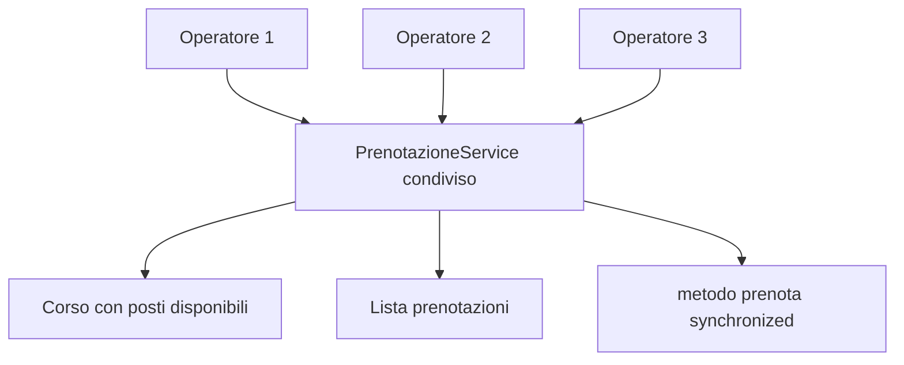

# 04 - LAB22 autonomo: prenotazioni concorrenti

## Scenario

Si vuole simulare la gestione delle prenotazioni a un corso con posti limitati. Più operatori cercano di iscrivere partecipanti allo stesso corso nello stesso momento.

Il sistema deve impedire che vengano accettate più prenotazioni dei posti disponibili.

## Obiettivo

Realizzare una piccola applicazione Java che simuli prenotazioni concorrenti su uno stato condiviso, usando `Runnable`, `Thread`, `join()` e `synchronized`.

## Requisiti software

| Software/Tool | Uso nel laboratorio |
|---|---|
| JDK | Compilazione ed esecuzione del codice Java |
| Editor Java | Scrittura dei file sorgente |
| Terminale | Esecuzione dei comandi |

## Struttura richiesta

```text
UD22_prenotazioni_concorrenti/
  src/
    corso/
      ud22/
        prenotazioni/
          Corso.java
          Prenotazione.java
          PrenotazioneService.java
          OperatorePrenotazioneTask.java
          PostiEsauritiException.java
          EseguiPrenotazioniConcorrenti.java
  docs/
    evidence_UD22_autonomo.md
```

## Requisiti funzionali

### 1. Classe `Corso`

La classe deve contenere almeno:

- codice corso;
- titolo;
- numero massimo di posti;
- numero di posti disponibili.

Deve esporre metodi utili per:

- leggere i dati principali;
- verificare i posti disponibili;
- decrementare i posti disponibili.

La modifica dei posti può essere gestita direttamente nel service, purché la responsabilità sia chiara e documentata.

### 2. Classe `Prenotazione`

La classe deve contenere almeno:

- nome partecipante;
- nome operatore;
- codice corso.

### 3. Eccezione `PostiEsauritiException`

Creare una eccezione custom checked o unchecked. La scelta deve essere motivata nel file di evidenza.

### 4. Classe `PrenotazioneService`

Questa è la classe centrale del laboratorio.

Deve contenere:

- il corso condiviso;
- l'elenco delle prenotazioni accettate;
- un metodo per effettuare una prenotazione;
- un metodo per leggere il numero di prenotazioni accettate;
- un metodo per leggere i posti rimasti.

Il metodo che controlla disponibilità, crea la prenotazione e aggiorna i posti deve essere protetto con `synchronized`.

### 5. Classe `OperatorePrenotazioneTask`

La classe deve implementare `Runnable`.

Ogni task deve:

- ricevere lo stesso `PrenotazioneService`;
- avere un nome operatore;
- tentare più prenotazioni;
- gestire il caso di posti esauriti senza interrompere l'intero programma.

### 6. Classe `EseguiPrenotazioniConcorrenti`

Il programma principale deve:

- creare un solo corso con un numero limitato di posti;
- creare un solo `PrenotazioneService` condiviso;
- creare almeno tre thread operatore;
- avviare i thread;
- attendere la conclusione con `join()`;
- stampare un riepilogo finale.

## Vincoli tecnici

- Non usare database.
- Non usare file.
- Non usare framework.
- Non usare collection concorrenti già pronte.
- Usare `ArrayList` per le prenotazioni.
- Proteggere manualmente la sezione critica.
- Non usare `Thread.sleep()` come soluzione di correttezza.

## Output minimo atteso

Il programma deve stampare un riepilogo simile:

```text
Corso: Java Core avanzato
Posti iniziali: 10
Prenotazioni accettate: 10
Posti rimasti: 0
Tentativi respinti: ...
```

Il numero di prenotazioni accettate non deve mai superare il numero iniziale di posti.

## Evidenza richiesta

Nel file `docs/evidence_UD22_autonomo.md` documentare:

1. quali oggetti sono condivisi tra i thread;
2. quale metodo è stato sincronizzato;
3. quale sequenza di operazioni costituisce la sezione critica;
4. perché `join()` è necessario;
5. perché il Singleton non sarebbe sufficiente da solo a risolvere il problema;
6. cosa accadrebbe se il metodo di prenotazione non fosse sincronizzato;
7. almeno uno schema Mermaid della soluzione.

## Schema da completare



## Criterio di successo

Il laboratorio è completato correttamente quando:

- il codice compila;
- il programma viene eseguito più volte;
- le prenotazioni accettate non superano mai i posti iniziali;
- il partecipante sa spiegare dove si trovava il rischio di race condition;
- la soluzione non sincronizza casualmente tutto il codice, ma protegge la parte realmente critica.
