# 04 - LAB22 autonomo: prenotazioni concorrenti

## Scenario

Si vuole simulare la gestione delle prenotazioni a un corso con posti limitati. Più operatori cercano di iscrivere partecipanti allo stesso corso nello stesso momento.

Il sistema deve impedire che vengano accettate più prenotazioni dei posti disponibili.

## Obiettivo

Realizzare una piccola applicazione Java che simuli prenotazioni concorrenti su uno stato condiviso, usando `Runnable`, `Thread`, `join()` e `synchronized`.

Il laboratorio serve a comprendere:

- cosa significa avere uno stato condiviso tra più thread;
- dove può nascere una race condition;
- perché una sequenza di operazioni deve essere protetta come sezione critica;
- perché `join()` è necessario per attendere la conclusione dei thread;
- perché un Singleton, da solo, non risolve i problemi di concorrenza.

## Requisiti software

| Software/Tool | Uso nel laboratorio |
|---|---|
| JDK | Compilazione ed esecuzione del codice Java |
| Editor Java | Scrittura dei file sorgente |
| Terminale | Esecuzione dei comandi |

## Struttura richiesta

```text
UD22_prenotazioni_concorrenti/
  src/
    corso/
      ud22/
        prenotazioni/
          Corso.java
          Prenotazione.java
          PrenotazioneService.java
          OperatorePrenotazioneTask.java
          PostiEsauritiException.java
          EseguiPrenotazioniConcorrenti.java
  docs/
    evidence_UD22_autonomo.md
```

## Requisiti funzionali

### 1. Classe `Corso`

La classe deve contenere almeno:

- codice corso;
- titolo;
- numero massimo di posti;
- numero di posti disponibili.

Deve esporre metodi utili per:

- leggere il codice del corso;
- leggere il titolo del corso;
- leggere il numero massimo di posti;
- leggere il numero di posti disponibili;
- verificare se ci sono ancora posti disponibili;
- decrementare il numero di posti disponibili.

La modifica dei posti disponibili deve avvenire solo durante una prenotazione accettata.

Nel laboratorio la protezione della sezione critica deve essere gestita nel `PrenotazioneService`. La classe `Corso` rappresenta lo stato del corso, ma non deve essere responsabile della sincronizzazione tra thread.

Esempi di metodi possibili:

```java
public String getCodice()
public String getTitolo()
public int getNumeroMassimoPosti()
public int getPostiDisponibili()
public boolean hasPostiDisponibili()
public void decrementaPostiDisponibili()
```

### 2. Classe `Prenotazione`

La classe deve contenere almeno:

- numero progressivo della prenotazione;
- nome partecipante;
- nome operatore;
- codice corso.

Il numero progressivo della prenotazione deve essere assegnato dal `PrenotazioneService` solo alle prenotazioni accettate.

Non devono esistere due prenotazioni accettate con lo stesso numero.

Esempi di attributi possibili:

```java
private final int numeroPrenotazione;
private final String nomePartecipante;
private final String nomeOperatore;
private final String codiceCorso;
```

Esempi di metodi possibili:

```java
public int getNumeroPrenotazione()
public String getNomePartecipante()
public String getNomeOperatore()
public String getCodiceCorso()
```

### 3. Eccezione `PostiEsauritiException`

Creare una eccezione custom unchecked, estendendo `RuntimeException`.

L'eccezione deve essere lanciata dal `PrenotazioneService` quando un operatore tenta di effettuare una prenotazione ma non ci sono più posti disponibili.

Anche se l'eccezione è unchecked, deve essere gestita nella classe `OperatorePrenotazioneTask` con un blocco `try/catch`, in modo che il singolo tentativo venga respinto senza interrompere l'intero programma.

Esempio di struttura:

```java
public class PostiEsauritiException extends RuntimeException {

    public PostiEsauritiException(String message) {
        super(message);
    }
}
```

Motivazione didattica:

- il laboratorio è centrato sulla concorrenza, non sulla progettazione avanzata delle eccezioni;
- `RuntimeException` evita di appesantire il metodo `run()` con dichiarazioni `throws`;
- il caso di posti esauriti resta comunque gestito esplicitamente con `try/catch`;
- il programma deve continuare anche dopo uno o più tentativi respinti.

### 4. Classe `PrenotazioneService`

Questa è la classe centrale del laboratorio.

Deve contenere:

- il corso condiviso;
- l'elenco delle prenotazioni accettate;
- il prossimo numero progressivo di prenotazione da assegnare;
- il numero di tentativi respinti;
- un metodo per effettuare una prenotazione;
- un metodo per leggere il numero di prenotazioni accettate;
- un metodo per leggere i posti rimasti;
- un metodo per leggere il numero di tentativi respinti.

Esempi di attributi possibili:

```java
private final Corso corso;
private final ArrayList<Prenotazione> prenotazioni;
private int prossimoNumeroPrenotazione;
private int tentativiRespinti;
```

Il metodo che effettua la prenotazione deve essere protetto con `synchronized`.

Esempio di firma possibile:

```java
public synchronized Prenotazione prenota(String nomePartecipante, String nomeOperatore)
```

Il metodo sincronizzato deve eseguire in modo atomico questa sequenza:

1. verificare se ci sono posti disponibili;
2. se non ci sono posti disponibili:
   - incrementare il numero di tentativi respinti;
   - lanciare `PostiEsauritiException`;
3. assegnare il numero progressivo alla nuova prenotazione;
4. creare l'oggetto `Prenotazione`;
5. aggiungere la prenotazione all'elenco delle prenotazioni accettate;
6. decrementare il numero di posti disponibili;
7. restituire la prenotazione creata.

Questa sequenza costituisce la sezione critica del laboratorio.

La numerazione delle prenotazioni deve avvenire dentro il metodo sincronizzato. In caso contrario, due thread potrebbero ottenere lo stesso numero di prenotazione.

Esempi di metodi possibili:

```java
public synchronized Prenotazione prenota(String nomePartecipante, String nomeOperatore)

public synchronized int getNumeroPrenotazioniAccettate()

public synchronized int getPostiRimasti()

public synchronized int getTentativiRespinti()
```

I metodi di lettura sono indicati come `synchronized` per mantenere una visione coerente dello stato condiviso. La parte essenziale resta comunque la sincronizzazione del metodo `prenota`.

### 5. Classe `OperatorePrenotazioneTask`

La classe deve implementare `Runnable`.

Ogni task deve:

- ricevere lo stesso `PrenotazioneService`;
- avere un nome operatore;
- tentare più prenotazioni;
- generare o ricevere i nomi dei partecipanti da prenotare;
- gestire il caso di posti esauriti senza interrompere l'intero programma.

Esempio di attributi possibili:

```java
private final PrenotazioneService service;
private final String nomeOperatore;
private final String[] partecipantiDaPrenotare;
```

Nel metodo `run()`, ogni operatore deve eseguire più tentativi di prenotazione.

Ogni chiamata a `prenota()` deve essere protetta con `try/catch`.

Esempio concettuale:

```java
try {
    Prenotazione prenotazione = service.prenota(nomePartecipante, nomeOperatore);
    System.out.println(nomeOperatore + " ha creato la prenotazione numero "
            + prenotazione.getNumeroPrenotazione()
            + " per " + prenotazione.getNomePartecipante());
} catch (PostiEsauritiException e) {
    System.out.println(nomeOperatore + ": prenotazione respinta per "
            + nomePartecipante + " - " + e.getMessage());
}
```

Il blocco `catch` non deve terminare l'intero programma. Deve gestire solo il singolo tentativo fallito.

### 6. Classe `EseguiPrenotazioniConcorrenti`

Il programma principale deve:

- creare un solo corso con un numero limitato di posti;
- creare un solo `PrenotazioneService` condiviso;
- creare almeno tre thread operatore;
- assegnare a ogni operatore più partecipanti da prenotare;
- avviare i thread;
- attendere la conclusione di tutti i thread con `join()`;
- stampare un riepilogo finale.

Il numero totale di tentativi deve essere maggiore del numero di posti disponibili.

Esempio:

- posti disponibili: 10;
- operatori: 3;
- tentativi totali: almeno 15.

In questo modo il programma deve produrre sia prenotazioni accettate sia prenotazioni respinte.

## Vincoli tecnici

- Non usare database.
- Non usare file.
- Non usare framework.
- Non usare collection concorrenti già pronte.
- Usare `ArrayList` per le prenotazioni.
- Proteggere manualmente la sezione critica.
- Non usare `Thread.sleep()` come soluzione di correttezza.
- Non usare Singleton come soluzione al problema di concorrenza.
- Non assegnare il numero della prenotazione fuori dal `PrenotazioneService`.

## Output minimo atteso

Il programma deve stampare un riepilogo simile:

```text
Corso: Java Core avanzato
Posti iniziali: 10
Prenotazioni accettate: 10
Posti rimasti: 0
Tentativi respinti: 5
```

Durante l'esecuzione è possibile stampare anche messaggi intermedi, ad esempio:

```text
Operatore A ha creato la prenotazione numero 1 per Mario Rossi
Operatore B ha creato la prenotazione numero 2 per Laura Bianchi
Operatore C: prenotazione respinta per Anna Verdi - Posti esauriti per il corso JAVA-CORE
```

Il numero di prenotazioni accettate non deve mai superare il numero iniziale di posti.

Il numero di posti rimasti non deve mai diventare negativo.

Non devono esistere due prenotazioni accettate con lo stesso numero progressivo.

## Evidenza richiesta

Nel file `docs/evidence_UD22_autonomo.md` documentare:

1. quali oggetti sono condivisi tra i thread;
2. quale metodo è stato sincronizzato;
3. quale sequenza di operazioni costituisce la sezione critica;
4. perché il numero della prenotazione deve essere assegnato dentro il metodo sincronizzato;
5. perché `join()` è necessario;
6. perché il Singleton non sarebbe sufficiente da solo a risolvere il problema;
7. perché `PostiEsauritiException` è stata realizzata come unchecked exception;
8. cosa accadrebbe se il metodo di prenotazione non fosse sincronizzato;
9. almeno uno schema Mermaid della soluzione.

## Schema da completare

```mermaid
flowchart TD
    A[Operatore 1] --> S[PrenotazioneService condiviso]
    B[Operatore 2] --> S
    C[Operatore 3] --> S

    S --> D[Corso con posti disponibili]
    S --> E[ArrayList prenotazioni accettate]
    S --> N[Prossimo numero prenotazione]
    S --> R[Tentativi respinti]
    S --> F[metodo prenota synchronized]

    F --> G[verifica posti disponibili]
    G --> H{Posti disponibili?}
    H -->|Sì| I[assegna numero progressivo]
    I --> L[crea Prenotazione]
    L --> M[aggiunge alla lista]
    M --> O[decrementa posti disponibili]
    H -->|No| P[incrementa tentativi respinti]
    P --> Q[lancia PostiEsauritiException]
```



## Criterio di successo

Il laboratorio è completato correttamente quando:

- il codice compila;
- il programma viene eseguito più volte;
- le prenotazioni accettate non superano mai i posti iniziali;
- i posti rimasti non diventano mai negativi;
- ogni prenotazione accettata ha un numero progressivo univoco;
- i tentativi respinti vengono conteggiati;
- il partecipante sa spiegare dove si trovava il rischio di race condition;
- il partecipante sa spiegare perché il numero progressivo deve essere assegnato nella sezione critica;
- la soluzione non sincronizza casualmente tutto il codice, ma protegge la parte realmente critica.
