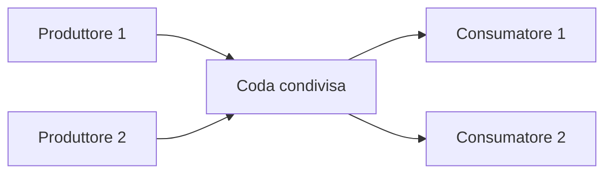

# UD22 - Esercitazioni di potenziamento su thread, produttori/consumatori e concorrenza

## Obiettivo della sessione

Queste esercitazioni servono a consolidare i concetti introdotti nella UD22 attraverso piccoli casi d'uso realistici.

Il punto centrale non è creare thread “per vedere che partono”, ma capire come più parti del programma possano lavorare contemporaneamente su una risorsa condivisa senza produrre risultati incoerenti.

Gli esercizi riprendono il modello **produttore/consumatore** e lo applicano a scenari vicini ad applicazioni reali:

- gestione di una coda di attività;
- elaborazione asincrona di richieste;
- prenotazioni concorrenti;
- controllo dello stato condiviso;
- differenza tra codice apparentemente corretto e codice realmente sicuro in presenza di più thread.

## Prerequisiti

Software richiesto:

- JDK già configurato;
- editor o IDE già utilizzato nel corso.

Conoscenze richieste:

- classi e oggetti;
- metodi e costruttori;
- liste e collezioni di base;
- eccezioni;
- separazione minima delle responsabilità tra classi;
- concetto base di `Thread` e `Runnable`;
- uso di `synchronized`, `wait()` e `notifyAll()` visto nel laboratorio guidato.

---

# Organizzazione delle 4 ore

| Fase | Durata indicativa | Attività |
|---|---:|---|
| 1 | 30 min | Ripasso guidato del modello produttore/consumatore |
| 2 | 45 min | Esercizio 1: coda limitata di messaggi |
| 3 | 45 min | Esercizio 2: sportello pratiche con produttori e operatori |
| 4 | 60 min | Esercizio 3 autonomo: prenotazioni concorrenti con numero progressivo |
| 5 | 30 min | Esercizio 4 autonomo: log asincrono degli eventi |
| 6 | 30 min | Discussione, correzione, domande e confronto tra soluzioni |

---

# Ripasso iniziale - Il modello produttore/consumatore

Nel modello produttore/consumatore esistono almeno tre elementi:

1. uno o più **produttori**, che generano dati, richieste o attività;
2. una **coda condivisa**, dove i dati vengono depositati temporaneamente;
3. uno o più **consumatori**, che prelevano elementi dalla coda e li elaborano.

Schema logico:



Il problema principale è che la coda è una risorsa condivisa.

Se più thread accedono alla stessa struttura dati senza coordinamento, possono verificarsi errori come:

- due thread leggono contemporaneamente uno stato non aggiornato;
- un consumatore prova a leggere da una coda vuota;
- un produttore continua a inserire dati oltre il limite previsto;
- alcuni dati vengono persi;
- il risultato finale cambia da una esecuzione all'altra.

La sincronizzazione serve a evitare questi problemi.

---

# Esercizio 1 - Coda limitata di messaggi

## Scenario

Si vuole simulare una piccola coda di messaggi.

Un thread produttore inserisce messaggi nella coda.
Un thread consumatore preleva i messaggi e li stampa.

La coda può contenere al massimo **3 messaggi**.

Se la coda è piena, il produttore deve attendere.
Se la coda è vuota, il consumatore deve attendere.

## Obiettivo didattico

Comprendere il comportamento di:

- `synchronized`;
- `wait()`;
- `notifyAll()`;
- accesso controllato a una lista condivisa.

## Classi richieste

Creare le seguenti classi:

```text
corso.ud22.potenziamento.messaggi
├── CodaMessaggi.java
├── ProduttoreMessaggi.java
├── ConsumatoreMessaggi.java
└── EseguiCodaMessaggi.java
```

## Specifiche della classe `CodaMessaggi`

La classe deve contenere:

- una lista interna di stringhe;
- una capacità massima passata tramite costruttore;
- un metodo `inserisci(String messaggio)`;
- un metodo `preleva()` che restituisce una `String`.

Il metodo `inserisci` deve:

1. attendere se la coda è piena;
2. inserire il messaggio;
3. stampare un messaggio di conferma;
4. notificare gli altri thread in attesa.

Il metodo `preleva` deve:

1. attendere se la coda è vuota;
2. rimuovere il primo messaggio disponibile;
3. stampare un messaggio di conferma;
4. notificare gli altri thread in attesa;
5. restituire il messaggio prelevato.

## Traccia di lavoro

Completare la classe `CodaMessaggi` seguendo questa struttura:

```java
package corso.ud22.potenziamento.messaggi;

import java.util.LinkedList;
import java.util.Queue;

public class CodaMessaggi {
    private Queue<String> messaggi = new LinkedList<>();
    private int capacitaMassima;

    public CodaMessaggi(int capacitaMassima) {
        this.capacitaMassima = capacitaMassima;
    }

    public synchronized void inserisci(String messaggio) throws InterruptedException {
        // completare
    }

    public synchronized String preleva() throws InterruptedException {
        // completare
        return null;
    }
}
```

## Comportamento atteso

Esempio di output possibile:

```text
Prodotto: Messaggio 1
Prodotto: Messaggio 2
Prodotto: Messaggio 3
Coda piena. Il produttore attende...
Consumato: Messaggio 1
Prodotto: Messaggio 4
Consumato: Messaggio 2
Consumato: Messaggio 3
Consumato: Messaggio 4
```

L'ordine esatto delle stampe può variare, perché i thread vengono pianificati dal sistema operativo.
Benvenuti nel mondo reale: non tutto obbedisce alla nostra scaletta, nemmeno il processore.

## Domande finali

Rispondere nel file `evidence_ud22_potenziamento.md`:

1. Perché i metodi `inserisci` e `preleva` devono essere `synchronized`?
2. Che cosa accadrebbe se il consumatore prelevasse da una coda vuota?
3. Perché si usa `while` e non solo `if` prima di `wait()`?
4. A cosa serve `notifyAll()` dopo un inserimento o un prelievo?

---

# Esercizio 2 - Sportello pratiche

## Scenario

Un ufficio riceve pratiche da elaborare.

I cittadini inseriscono nuove pratiche nel sistema.
Gli operatori prelevano le pratiche e le lavorano.

In questa simulazione:

- ci sono **2 produttori**;
- ci sono **2 consumatori**;
- la coda può contenere al massimo **5 pratiche**;
- ogni pratica ha un codice e una descrizione.

## Obiettivo didattico

Applicare il modello produttore/consumatore non più a semplici stringhe, ma a oggetti.

## Classi richieste

```text
corso.ud22.potenziamento.pratiche
├── Pratica.java
├── CodaPratiche.java
├── CittadinoProduttore.java
├── OperatoreConsumatore.java
└── EseguiSportelloPratiche.java
```

## Specifiche della classe `Pratica`

La classe `Pratica` deve avere:

- `codice`;
- `descrizione`;
- costruttore;
- getter;
- `toString()`.

Esempio:

```java
public class Pratica {
    private String codice;
    private String descrizione;

    public Pratica(String codice, String descrizione) {
        this.codice = codice;
        this.descrizione = descrizione;
    }

    public String getCodice() {
        return codice;
    }

    public String getDescrizione() {
        return descrizione;
    }

    @Override
    public String toString() {
        return codice + " - " + descrizione;
    }
}
```

## Specifiche della coda

La classe `CodaPratiche` deve funzionare come la coda dell'esercizio precedente, ma deve gestire oggetti `Pratica`.

Metodi richiesti:

```java
public synchronized void inserisci(Pratica pratica) throws InterruptedException
public synchronized Pratica preleva() throws InterruptedException
```

## Specifiche dei produttori

Ogni `CittadinoProduttore` deve:

- implementare `Runnable`;
- ricevere nel costruttore:
  - nome del produttore;
  - riferimento alla coda;
  - numero di pratiche da generare;
- generare pratiche con codice progressivo locale.

Esempio di codice pratica:

```text
Mario-P1
Mario-P2
Mario-P3
```

## Specifiche dei consumatori

Ogni `OperatoreConsumatore` deve:

- implementare `Runnable`;
- ricevere nel costruttore:
  - nome dell'operatore;
  - riferimento alla coda;
  - numero di pratiche da elaborare;
- prelevare pratiche dalla coda;
- simulare l'elaborazione con una piccola pausa usando `Thread.sleep()`.

## Comportamento atteso

Esempio di output possibile:

```text
Cittadino Mario ha inserito pratica Mario-P1
Cittadino Anna ha inserito pratica Anna-P1
Operatore Luca elabora pratica Mario-P1 - Richiesta certificato
Operatore Sara elabora pratica Anna-P1 - Richiesta certificato
Cittadino Mario ha inserito pratica Mario-P2
Cittadino Anna ha inserito pratica Anna-P2
```

## Vincoli

- La lista interna della coda non deve essere accessibile dall'esterno.
- Solo la classe `CodaPratiche` deve gestire la sincronizzazione.
- I produttori e i consumatori non devono sincronizzarsi direttamente tra loro.
- I produttori e i consumatori devono comunicare solo attraverso la coda condivisa.

## Domande finali

Rispondere nel file `evidence_ud22_potenziamento.md`:

1. Quale classe rappresenta la risorsa condivisa?
2. Perché la sincronizzazione è dentro `CodaPratiche` e non dentro i produttori?
3. Che differenza c'è tra avere un solo consumatore e averne due?
4. L'ordine di elaborazione delle pratiche è sempre prevedibile? Motivare la risposta.

---

# Esercizio 3 autonomo - Prenotazioni concorrenti con numero progressivo

## Scenario

Un piccolo sistema riceve richieste di prenotazione per un evento.

Più utenti tentano di prenotarsi contemporaneamente.
Il sistema deve assegnare a ogni prenotazione confermata un **numero progressivo univoco**.

L'evento ha un numero massimo di posti disponibili.

Quando i posti terminano, le ulteriori richieste devono essere rifiutate.

Questo esercizio riprende il tema del laboratorio autonomo sulle prenotazioni concorrenti, ma rende più esplicito il problema dello stato condiviso.

## Obiettivo didattico

Capire perché in un'applicazione reale la concorrenza può produrre errori anche su operazioni apparentemente semplici come:

```text
controllo posti disponibili
assegnazione numero prenotazione
inserimento prenotazione
```

Queste tre operazioni devono essere trattate come un blocco logico coerente.
Se vengono interrotte o sovrapposte da altri thread, il risultato può diventare errato.
Classico: due utenti, un solo posto, entrambi contenti. Poi arriva la realtà con una sedia sola.

## Classi richieste

```text
corso.ud22.potenziamento.prenotazioni
├── Prenotazione.java
├── GestorePrenotazioni.java
├── UtentePrenotazione.java
└── EseguiPrenotazioniConcorrenti.java
```

## Specifiche della classe `Prenotazione`

La classe deve rappresentare una prenotazione confermata.

Attributi richiesti:

- `numero` di tipo `int`;
- `nomeUtente` di tipo `String`;
- `evento` di tipo `String`.

Metodi richiesti:

- costruttore;
- getter;
- `toString()`.

Esempio di rappresentazione testuale:

```text
Prenotazione n. 3 - Evento: Java Day - Utente: Anna
```

## Specifiche della classe `GestorePrenotazioni`

La classe deve contenere:

- nome dell'evento;
- numero massimo di posti;
- lista delle prenotazioni confermate;
- contatore per il prossimo numero di prenotazione.

Metodi richiesti:

```java
public synchronized boolean prenota(String nomeUtente)
public synchronized int getPostiDisponibili()
public synchronized int getNumeroPrenotazioni()
public synchronized void stampaPrenotazioni()
```

Il metodo `prenota` deve:

1. controllare se ci sono posti disponibili;
2. se non ci sono posti, stampare un messaggio di rifiuto e restituire `false`;
3. se ci sono posti, creare una nuova `Prenotazione`;
4. assegnare alla prenotazione un numero progressivo univoco;
5. aggiungere la prenotazione alla lista;
6. stampare un messaggio di conferma;
7. restituire `true`.

## Specifiche della classe `UtentePrenotazione`

La classe deve:

- implementare `Runnable`;
- ricevere nel costruttore:
  - nome utente;
  - riferimento a `GestorePrenotazioni`;
- nel metodo `run`, provare a effettuare una prenotazione.

## Specifiche della classe `EseguiPrenotazioniConcorrenti`

La classe deve:

1. creare un `GestorePrenotazioni` per un evento con **5 posti disponibili**;
2. creare almeno **10 thread**, ognuno associato a un utente diverso;
3. avviare tutti i thread;
4. attendere la fine di tutti i thread usando `join()`;
5. stampare:
   - elenco delle prenotazioni confermate;
   - numero totale di prenotazioni;
   - posti ancora disponibili.

## Output atteso

L'ordine delle righe può cambiare, ma il risultato finale deve rispettare questi vincoli:

```text
Prenotazioni confermate: 5
Posti disponibili: 0
```

I numeri di prenotazione devono essere:

```text
1, 2, 3, 4, 5
```

Non devono esserci:

- due prenotazioni con lo stesso numero;
- più prenotazioni dei posti disponibili;
- posti negativi;
- eccezioni dovute all'accesso concorrente alla lista.

## Richieste autonome

Completare il laboratorio senza codice già pronto, rispettando queste richieste:

1. progettare le classi prima di scrivere il codice;
2. individuare quale classe contiene lo stato condiviso;
3. rendere sincronizzati solo i metodi realmente critici;
4. evitare di sincronizzare l'intero programma senza motivo;
5. usare `join()` per attendere la fine dei thread;
6. verificare più volte il programma, perché gli errori di concorrenza non compaiono sempre alla prima esecuzione.

## Variante di verifica

Eseguire il programma con queste configurazioni:

| Posti disponibili | Thread utenti | Risultato atteso |
|---:|---:|---|
| 5 | 10 | 5 confermate, 5 rifiutate |
| 3 | 20 | 3 confermate, 17 rifiutate |
| 10 | 10 | 10 confermate, 0 rifiutate |
| 1 | 5 | 1 confermata, 4 rifiutate |

## Domande finali

Rispondere nel file `evidence_ud22_potenziamento.md`:

1. Quale attributo rappresenta il numero progressivo della prenotazione?
2. Perché il metodo `prenota` deve essere sincronizzato?
3. Che cosa potrebbe accadere se il controllo dei posti e l'inserimento nella lista non fossero nello stesso blocco sincronizzato?
4. Perché `numeroPrenotazioni` e `postiDisponibili` devono essere letti in modo coerente?
5. Quale differenza c'è tra proteggere il singolo contatore e proteggere tutta l'operazione di prenotazione?

---

# Esercizio 4 autonomo - Log asincrono degli eventi

## Scenario

Durante le prenotazioni, il sistema deve registrare gli eventi principali:

- richiesta ricevuta;
- prenotazione confermata;
- prenotazione rifiutata;
- fine elaborazione.

Invece di stampare direttamente tutto dai thread degli utenti, si vuole usare una coda di log.

I thread degli utenti producono eventi di log.
Un thread dedicato consuma gli eventi e li stampa.

Questo modello è molto vicino a quello che accade in molte applicazioni reali: il codice applicativo genera eventi, mentre un componente separato li raccoglie e li scrive su console, file o sistemi di monitoraggio.

## Obiettivo didattico

Collegare il modello produttore/consumatore a un caso reale: la gestione asincrona dei log.

## Classi richieste

```text
corso.ud22.potenziamento.log
├── EventoLog.java
├── CodaLog.java
├── LoggerConsumatore.java
└── EseguiLogAsincrono.java
```

## Specifiche della classe `EventoLog`

Attributi richiesti:

- `livello`, ad esempio `INFO`, `WARN`, `ERROR`;
- `messaggio`;
- `nomeThread`.

Metodi richiesti:

- costruttore;
- getter;
- `toString()`.

Esempio di output:

```text
[INFO] [Thread-utente-1] Prenotazione confermata per Anna
```

## Specifiche della classe `CodaLog`

La classe deve gestire una coda condivisa di eventi di log.

Metodi richiesti:

```java
public synchronized void aggiungi(EventoLog evento)
public synchronized EventoLog preleva() throws InterruptedException
```

Il consumatore deve attendere se non ci sono eventi disponibili.

## Specifiche della classe `LoggerConsumatore`

La classe deve:

- implementare `Runnable`;
- prelevare eventi dalla coda;
- stampare gli eventi;
- terminare quando riceve un evento speciale di fine lavoro.

## Evento speciale di terminazione

Per terminare il logger, usare un evento con messaggio:

```text
STOP
```

Quando il logger riceve questo evento, deve uscire dal ciclo.

Esempio logico:

```java
if (evento.getMessaggio().equals("STOP")) {
    break;
}
```

## Richieste autonome

Realizzare il programma rispettando questi vincoli:

1. i thread produttori non devono stampare direttamente gli eventi principali;
2. gli eventi devono passare dalla `CodaLog`;
3. il logger deve essere un thread separato;
4. il programma principale deve inviare l'evento `STOP` solo dopo che tutti i produttori hanno terminato;
5. il programma principale deve attendere anche la terminazione del logger.

## Collegamento con il laboratorio prenotazioni

Dopo aver completato questo esercizio, integrare il logger asincrono nel sistema di prenotazioni dell'esercizio 3.

Nuova struttura consigliata:

```text
corso.ud22.potenziamento.prenotazionilog
├── Prenotazione.java
├── GestorePrenotazioni.java
├── UtentePrenotazione.java
├── EventoLog.java
├── CodaLog.java
├── LoggerConsumatore.java
└── EseguiPrenotazioniConLog.java
```

La classe `GestorePrenotazioni` deve ricevere una `CodaLog` nel costruttore.
Quando accade un evento importante, deve inserire un evento nella coda.

Esempi di eventi:

```text
Richiesta prenotazione ricevuta da Anna
Prenotazione confermata per Anna con numero 1
Prenotazione rifiutata per Marco: posti esauriti
```

## Domande finali

Rispondere nel file `evidence_ud22_potenziamento.md`:

1. Perché può essere utile separare la generazione dei log dalla loro scrittura?
2. Quale thread produce gli eventi di log?
3. Quale thread consuma gli eventi di log?
4. Perché serve un evento `STOP`?
5. Che cosa potrebbe accadere se il programma principale terminasse senza attendere il logger?

---

# Consegna richiesta

Creare un file:

```text
evidence_ud22_potenziamento.md
```

Il file deve contenere:

1. titolo dell'esercitazione;
2. nome e cognome del partecipante;
3. elenco degli esercizi completati;
4. screenshot o copia testuale degli output principali;
5. risposte alle domande finali;
6. breve spiegazione degli errori incontrati e delle correzioni applicate.

Struttura suggerita:

```markdown
# Evidence UD22 - Potenziamento concorrenza

## Partecipante

Nome e cognome:

## Esercizio 1 - Coda limitata di messaggi

### Output principale

```text
incollare qui l'output
```

### Risposte

1. ...
2. ...
3. ...
4. ...

## Esercizio 2 - Sportello pratiche

### Output principale

```text
incollare qui l'output
```

### Risposte

1. ...
2. ...
3. ...
4. ...

## Esercizio 3 - Prenotazioni concorrenti

### Output principale

```text
incollare qui l'output
```

### Risposte

1. ...
2. ...
3. ...
4. ...
5. ...

## Esercizio 4 - Log asincrono

### Output principale

```text
incollare qui l'output
```

### Risposte

1. ...
2. ...
3. ...
4. ...
5. ...

## Errori incontrati e correzioni

Descrivere qui eventuali problemi risolti durante il lavoro.
```

---

# Criteri di valutazione

| Criterio | Descrizione |
|---|---|
| Correttezza funzionale | Il programma produce il risultato atteso |
| Sicurezza concorrente | Lo stato condiviso è protetto correttamente |
| Separazione delle responsabilità | Le classi hanno ruoli chiari |
| Uso corretto di `Runnable` e `Thread` | I thread sono creati, avviati e attesi correttamente |
| Uso corretto di `wait()` e `notifyAll()` | La coda gestisce attese e notifiche in modo coerente |
| Evidence | Il file di consegna documenta output e risposte |

---

# Sintesi dei concetti rinforzati

Alla fine di questa sessione il partecipante deve saper spiegare:

- perché una risorsa condivisa deve essere protetta;
- perché non basta “sperare” che i thread non si pestino i piedi;
- come funziona una coda produttore/consumatore;
- perché `wait()` rilascia il lock e sospende il thread;
- perché `notifyAll()` risveglia i thread in attesa;
- perché il controllo di disponibilità e l'aggiornamento dello stato devono essere coerenti;
- perché `join()` è necessario quando il programma principale deve attendere la fine dei thread;
- come un modello didattico può diventare un caso reale, ad esempio prenotazioni o log asincrono.
