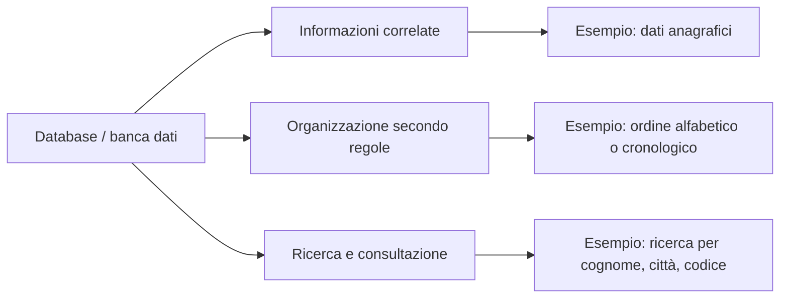
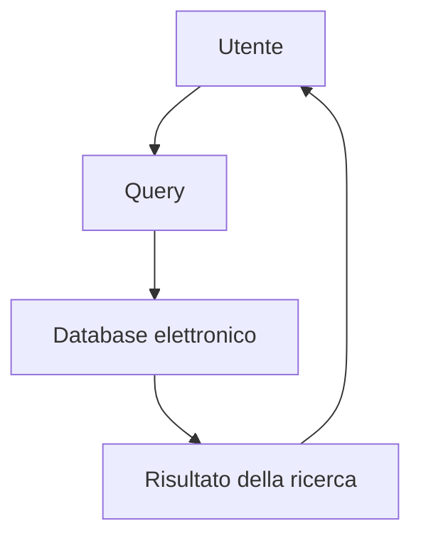
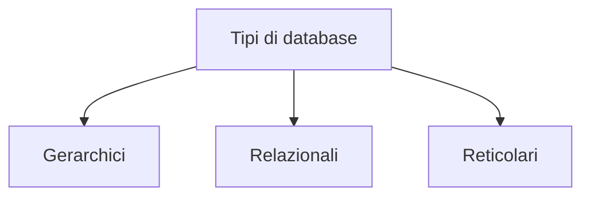
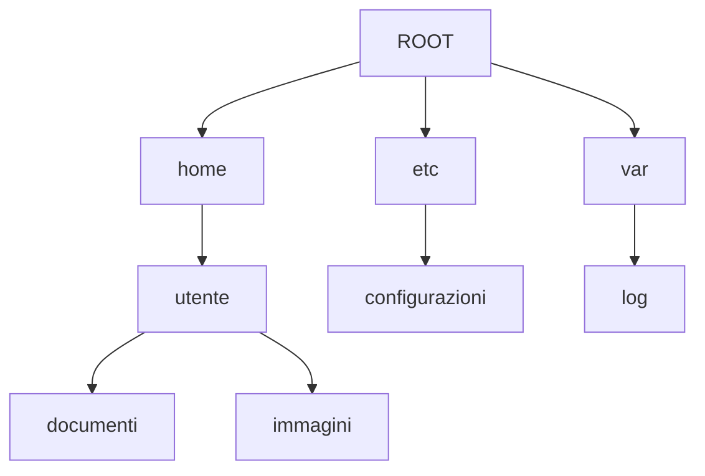
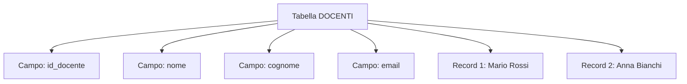
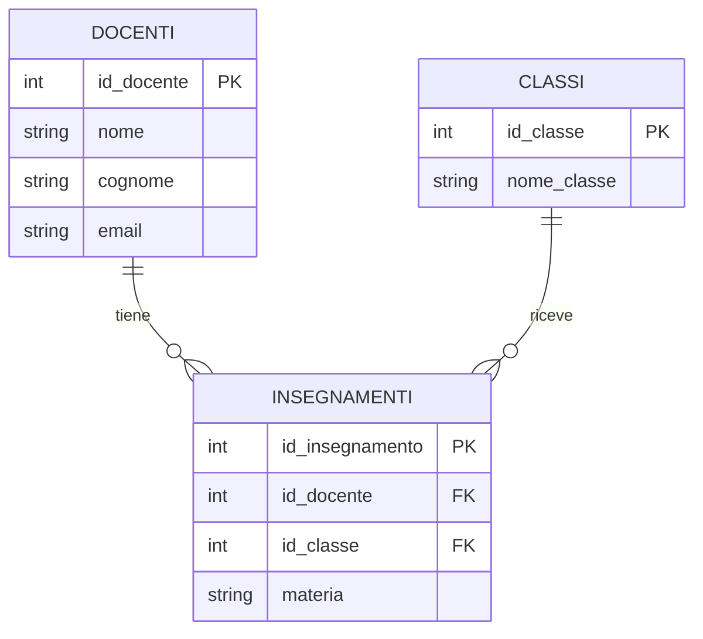
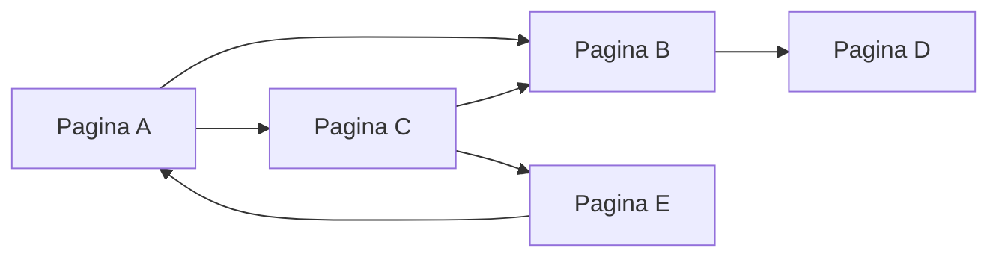

# 01 - Che cos'è un Database

## Obiettivi della lezione

Al termine di questa unità il partecipante deve essere in grado di:

- spiegare che cos'è una banca dati;
- distinguere il concetto generale di database dal database elettronico;
- riconoscere le principali tipologie di database: gerarchico, relazionale e reticolare;
- comprendere il ruolo di tabelle, record, campi e relazioni nei database relazionali.

---

## 1. Che cos'è un database

Una **banca dati**, o **database**, è un insieme di informazioni logicamente correlate tra loro, organizzate secondo una struttura precisa, in modo da poter essere ricercate, consultate e analizzate.

Un database non è necessariamente elettronico. Anche un archivio cartaceo ordinato, un elenco telefonico o un catalogo strutturato sono esempi di banche dati, perché permettono di conservare informazioni e ritrovarle seguendo criteri definiti.

---

## 2. Database elettronico

Un **database elettronico** è un sistema per memorizzare e gestire dati in formato digitale.

In un database elettronico i dati devono essere:

- organizzati secondo un modello;
- mantenuti possibilmente senza duplicazioni inutili;
- interrogabili tramite comandi di ricerca;
- gestibili in modo controllato.

I comandi usati per estrarre informazioni da un database sono chiamati **query**.

---

## 3. Tipi principali di database

Le principali tipologie introduttive sono:

- database gerarchici;
- database relazionali;
- database reticolari.

---

## 4. Database gerarchici

Un database gerarchico organizza i dati con una struttura ad albero.

La struttura parte da un nodo principale, chiamato **root**, e permette di raggiungere gli altri elementi attraverso percorsi.

Un esempio semplice è il filesystem di un sistema operativo.

### Caratteristiche principali

| Aspetto | Descrizione |
|---|---|
| Struttura | Albero rovesciato |
| Nodo iniziale | Root |
| Collegamenti | Percorsi padre-figlio |
| Esempio | Filesystem |

---

## 5. Database relazionali

Un database relazionale organizza i dati in **tabelle**.

Una tabella è composta da:

- **colonne**, dette anche **campi**;
- **righe**, dette anche **record** o **tuple**.

Ogni colonna rappresenta una caratteristica dell'oggetto memorizzato. Ogni riga rappresenta un singolo oggetto o evento registrato.

Esempio di tabella:

| id_docente | nome | cognome | email |
|---:|---|---|---|
| 1 | Mario | Rossi | mario.rossi@example.it |
| 2 | Anna | Bianchi | anna.bianchi@example.it |

---

## 6. Relazioni tra tabelle

I database relazionali evitano la duplicazione inutile delle informazioni mettendo in relazione tabelle diverse.

Le relazioni vengono create usando:

- **chiavi primarie**, che identificano in modo univoco un record;
- **chiavi esterne**, che collegano un record a un record presente in un'altra tabella.

In questo esempio la tabella `INSEGNAMENTI` collega i docenti alle classi.

---

## 7. Database reticolari

Un database reticolare organizza le informazioni come una rete di collegamenti.

Un esempio intuitivo è il Web: le pagine possono essere collegate tra loro tramite link, permettendo di passare direttamente da un contenuto a un altro.

### Confronto sintetico

| Tipo di database | Struttura | Esempio intuitivo |
|---|---|---|
| Gerarchico | Albero | Filesystem |
| Relazionale | Tabelle collegate | Database SQL |
| Reticolare | Rete di collegamenti | Web ipertestuale |

---

## Sintesi finale

Un database serve a organizzare dati in modo strutturato. Nei database elettronici i dati possono essere interrogati tramite query. Il modello relazionale è oggi uno dei più utilizzati perché permette di rappresentare informazioni complesse tramite tabelle collegate tra loro.
