# 02 - Che cos'è un DBMS

## Obiettivi della lezione

Al termine di questa unità il partecipante deve essere in grado di:

- definire il ruolo di un DBMS;
- comprendere il concetto di transazione;
- spiegare le proprietà ACID;
- distinguere i principali tipi di backup.

---

## 1. Definizione di DBMS

**DBMS** significa **Database Management System**.

Un DBMS è un software che permette di:

- creare database;
- gestire database;
- interrogare database;
- controllare accessi, vincoli, sicurezza e consistenza dei dati.

Esempi di DBMS molto diffusi sono MySQL, Oracle Database, Microsoft SQL Server, PostgreSQL e MariaDB.

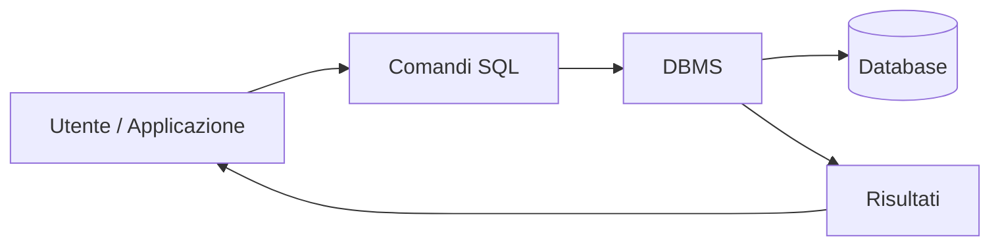

L'utente, o un'applicazione, non lavora direttamente sui file fisici del database: comunica con il DBMS attraverso un linguaggio, normalmente SQL.

---

## 2. SQL

SQL significa **Structured Query Language**.

È il linguaggio usato dai DBMS relazionali per lavorare con:

- tabelle;
- viste;
- indici;
- utenti;
- vincoli;
- transazioni.

Alcuni comandi SQL possono cambiare leggermente da un DBMS all'altro. Questa è una delle tante gioie dell'informatica: uno standard esiste, poi ogni prodotto fa finta di rispettarlo a modo suo.

---

## 3. Che cos'è una transazione

Una **transazione** è un gruppo di operazioni SQL che deve essere eseguito come un'unica unità logica.

La regola è semplice:

> o vengono eseguite tutte le operazioni, oppure non ne viene confermata nessuna.

Esempio classico: trasferimento di denaro da un conto a un altro.

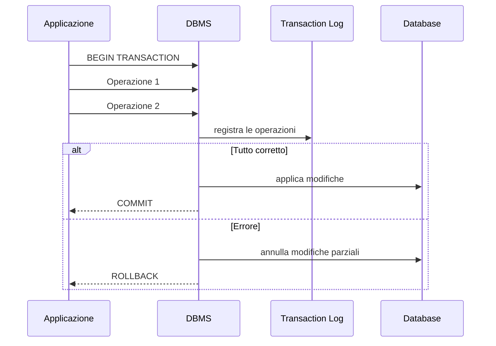

---

## 4. Commit e rollback

| Comando | Significato |
|---|---|
| `COMMIT` | Conferma definitivamente le modifiche della transazione |
| `ROLLBACK` | Annulla le modifiche della transazione e ripristina lo stato precedente |

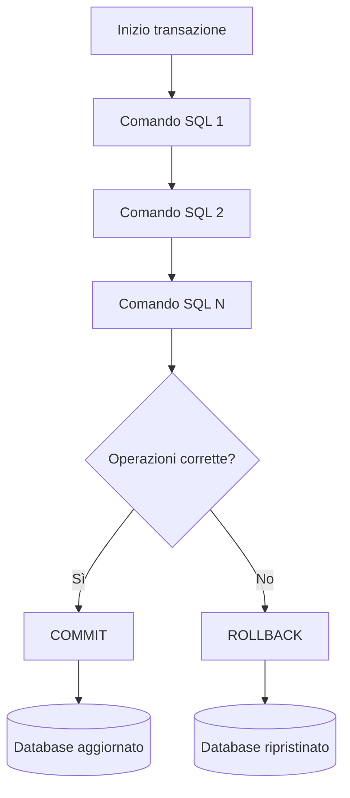

---

## 5. Transaction Log

Il **Transaction Log** è un registro in cui il DBMS annota le operazioni delle transazioni.

Serve a:

- recuperare dati in caso di errore;
- annullare transazioni incomplete;
- ripristinare una condizione consistente del database;
- garantire maggiore affidabilità.

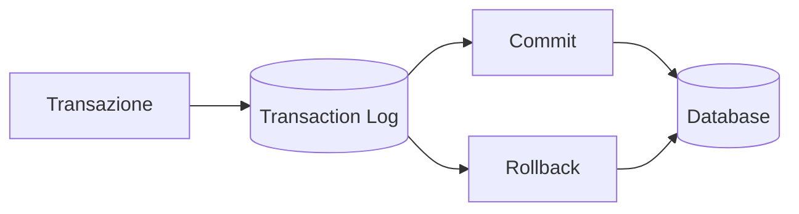

---

## 6. Le proprietà ACID

Le proprietà ACID descrivono le garanzie fondamentali che un DBMS deve offrire nella gestione delle transazioni.

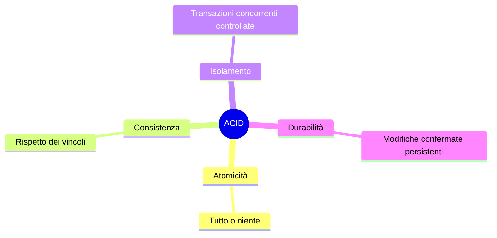

---

## 7. Atomicità

L'atomicità garantisce che una transazione venga considerata come una singola unità di elaborazione.

Questo significa che:

- se tutte le operazioni vanno a buon fine, la transazione viene confermata;
- se anche una sola operazione fallisce, la transazione viene annullata.

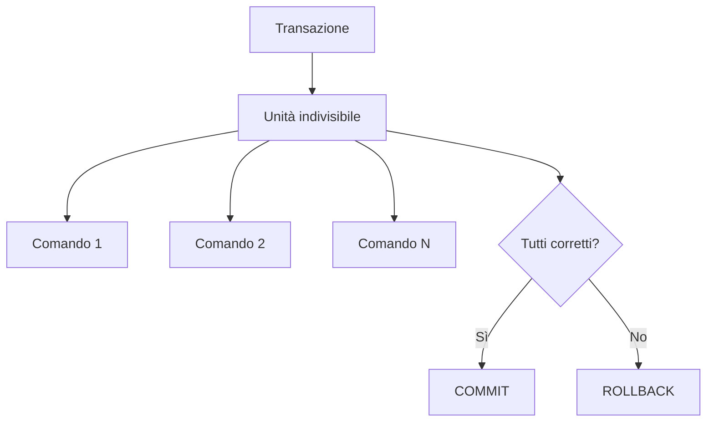

---

## 8. Consistenza

La consistenza garantisce che una transazione lasci il database in uno stato valido, rispettando tutti i vincoli definiti.

Esempi di vincoli:

- chiave primaria;
- indice univoco;
- campo obbligatorio, cioè `NOT NULL`;
- vincolo `CHECK`;
- integrità referenziale.

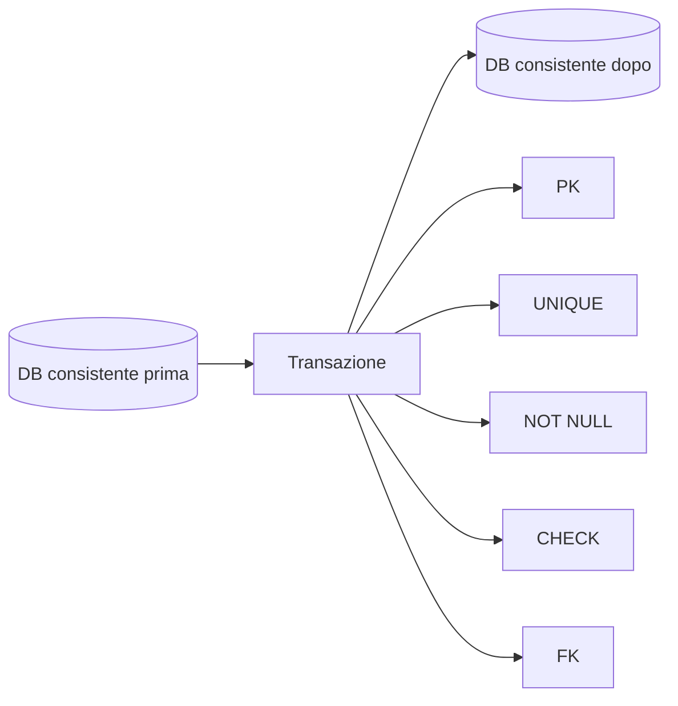

---

## 9. Isolamento

L'isolamento riguarda le transazioni eseguite contemporaneamente.

Il DBMS deve gestire la concorrenza in modo che il risultato finale sia coerente, come se le transazioni fossero state eseguite una alla volta.

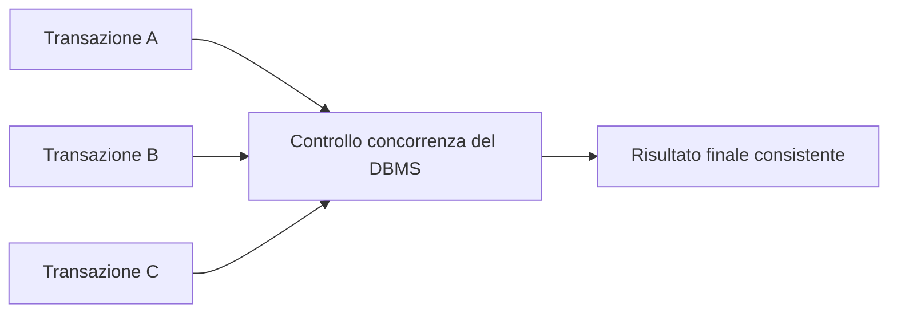

---

## 10. Durabilità

La durabilità garantisce che gli effetti di una transazione confermata con `COMMIT` siano persistenti nel tempo, anche in caso di guasti.

Per ottenere questo risultato il DBMS usa:

- Transaction Log;
- backup;
- restore;
- procedure di recovery;
- controlli periodici di integrità.

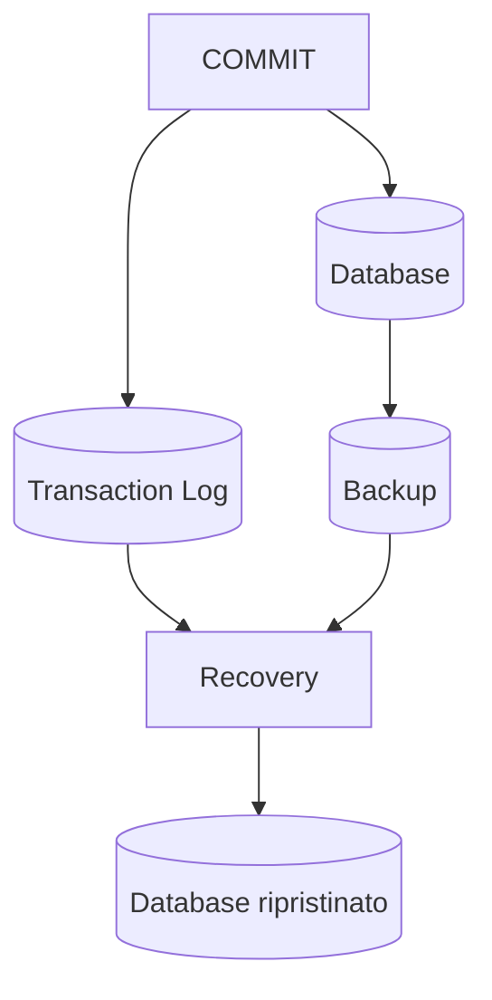

---

## 11. Tipi di backup

I principali tipi di backup sono:

- backup completo;
- backup incrementale;
- backup differenziale;
- backup del Transaction Log.

---

## 12. Backup completo

Il **backup completo** copia tutti i dati presenti nel database.

È semplice da comprendere e da ripristinare, ma può richiedere molto spazio e molto tempo.

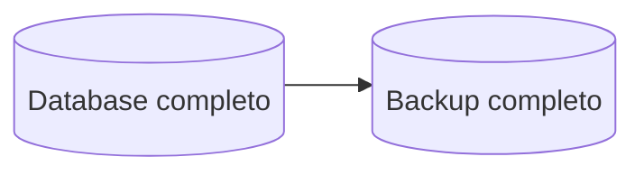

---

## 13. Backup incrementale

Il **backup incrementale** copia solo i dati modificati dopo l'ultimo backup, completo o incrementale.

Per ripristinare il database servono:

1. l'ultimo backup completo;
2. tutti i backup incrementali successivi.

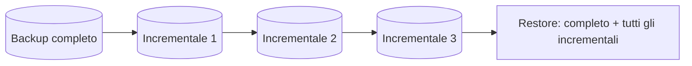

### Vantaggio

Riduce la quantità di dati copiati a ogni esecuzione.

### Svantaggio

Il ripristino dipende da tutta la catena dei backup incrementali.

---

## 14. Backup differenziale

Il **backup differenziale** copia i dati modificati dopo l'ultimo backup completo.

Per ripristinare il database servono:

1. l'ultimo backup completo;
2. l'ultimo backup differenziale disponibile.

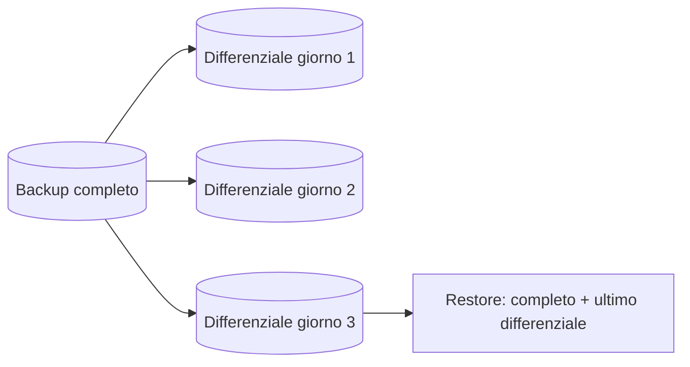

### Vantaggio

Il restore è più semplice rispetto all'incrementale.

### Svantaggio

I backup differenziali tendono a crescere fino al successivo backup completo.

---

## 15. Backup del Transaction Log

Il **backup del Transaction Log** salva le modifiche registrate nel log delle transazioni.

È importante quando si vuole ripristinare il database fino a un punto temporale preciso.

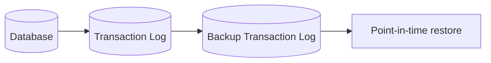

---

## Sintesi finale

Un DBMS è il software che permette di creare, interrogare e proteggere un database. Le transazioni garantiscono che le operazioni critiche siano eseguite in modo controllato. Le proprietà ACID descrivono le garanzie fondamentali per mantenere i dati corretti, consistenti e recuperabili.
