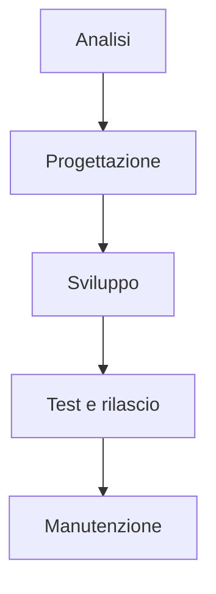
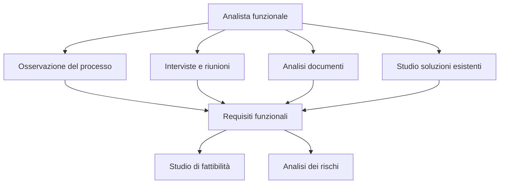
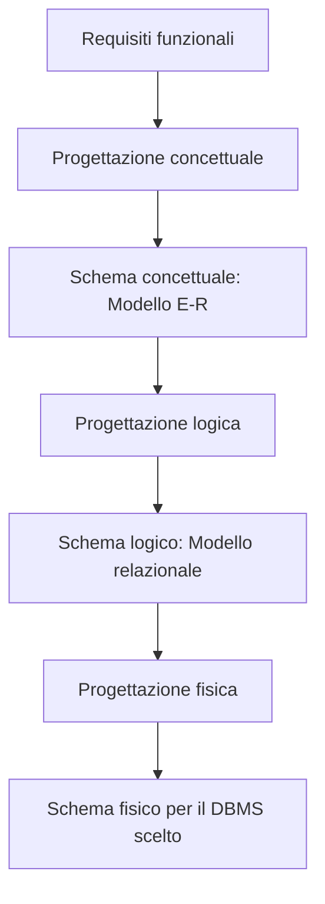
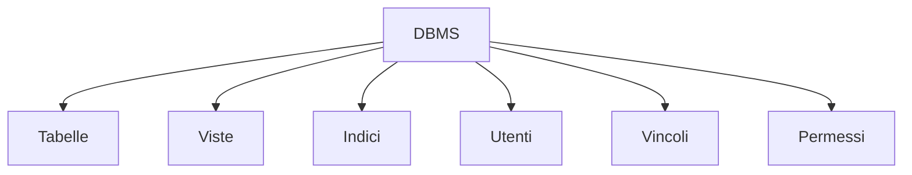
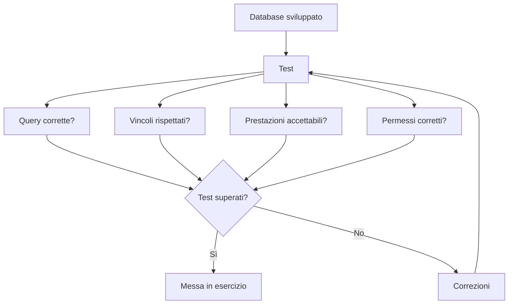
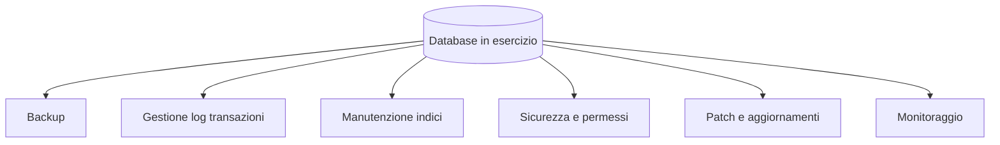
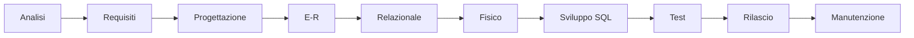

# 03 - Il modello a cascata nella progettazione di un database

## Obiettivi della lezione

Al termine di questa unità il partecipante deve essere in grado di:

- spiegare il modello a cascata;
- collegare le fasi del ciclo di vita del software alla progettazione di un database;
- distinguere analisi, progettazione, sviluppo e manutenzione;
- riconoscere gli artefatti prodotti nelle diverse fasi.

---

## 1. Perché serve un modello di progettazione

Quando si crea un database non conviene partire subito dalla creazione delle tabelle.

Prima bisogna capire:

- quali dati devono essere gestiti;
- quali relazioni esistono tra i dati;
- quali regole devono essere rispettate;
- quali operazioni dovranno essere eseguite;
- quali vincoli e controlli saranno necessari.

Il **modello a cascata** descrive un processo ordinato per arrivare dalla comprensione del problema alla realizzazione e manutenzione del sistema.

---

## 2. Le fasi principali

| Fase | Scopo principale | Output tipico |
|---|---|---|
| Analisi | Capire il problema e raccogliere requisiti | Documento dei requisiti, studio di fattibilità, analisi dei rischi |
| Progettazione | Modellare il database | Schema concettuale, schema logico, schema fisico |
| Sviluppo | Creare il database nel DBMS | Tabelle, viste, indici, utenti, vincoli |
| Manutenzione | Gestire il database dopo il rilascio | Backup, aggiornamenti, sicurezza, ottimizzazione |

---

## 3. Analisi

La fase di **analisi** serve a individuare le caratteristiche che il database dovrà avere.

Durante questa fase l'analista funzionale collabora con il cliente o con i responsabili del processo, raccogliendo informazioni attraverso:

- osservazione del processo attuale;
- riunioni e interviste;
- analisi dei documenti già esistenti;
- studio di soluzioni presenti sul mercato;
- individuazione dei dati da gestire;
- individuazione delle regole operative.

### Artefatti principali dell'analisi

- Documento dei requisiti funzionali.
- Studio di fattibilità.
- Analisi dei rischi.

---

## 4. Progettazione

La fase di **progettazione** trasforma i requisiti raccolti in modelli tecnici sempre più precisi.

La progettazione del database avviene normalmente in tre livelli:

1. progettazione concettuale;
2. progettazione logica;
3. progettazione fisica.

### Progettazione concettuale

Produce il **modello E-R**, cioè il modello Entità-Relazione.

### Progettazione logica

Trasforma il modello E-R in **modello relazionale**, quindi in tabelle, colonne e relazioni.

### Progettazione fisica

Aggiunge dettagli legati al DBMS scelto, come tipi di dato, indici, vincoli e impostazioni tecniche.

---

## 5. Sviluppo

La fase di **sviluppo** consiste nella creazione concreta del database attraverso un DBMS.

In questa fase si usano comandi SQL per creare e gestire gli oggetti del database.

I principali oggetti sono:

- tabelle;
- viste;
- indici;
- utenti;
- vincoli;
- autorizzazioni.

### Tabelle

Sono strutture composte da righe e colonne in cui vengono memorizzati i dati.

### Viste

Sono prospetti logici costruiti leggendo dati da una o più tabelle.

### Indici

Sono strutture che migliorano le prestazioni delle ricerche su determinate colonne.

### Utenti

Rappresentano gli utilizzatori del database. A ciascun utente possono essere associati credenziali e permessi.

---

## 6. Test

Dopo la creazione del database è necessario verificare che quanto realizzato rispetti i requisiti.

Le attività di test possono riguardare:

- correttezza delle tabelle;
- correttezza delle relazioni;
- verifica dei vincoli;
- esecuzione delle query previste;
- verifica delle autorizzazioni;
- controllo delle prestazioni.

---

## 7. Manutenzione

La **manutenzione** comprende tutte le attività successive alla messa in esercizio.

Le attività più comuni sono:

- backup dei dati;
- restore in caso di problemi;
- gestione degli indici;
- gestione del Transaction Log;
- gestione degli utenti e dei permessi;
- applicazione di patch e aggiornamenti;
- monitoraggio della sicurezza;
- ottimizzazione delle prestazioni.

---

## 8. Visione complessiva

---

## Sintesi finale

Il modello a cascata aiuta a non confondere le fasi del lavoro. Prima si analizza il problema, poi si progetta, si realizza, si verifica e infine si mantiene il database nel tempo. Saltare l'analisi e partire subito con le tabelle espone il progetto a errori di modellazione e successive correzioni più costose.
