# 04 - Il modello Entità-Relazione

## Obiettivi della lezione

Al termine di questa unità il partecipante deve essere in grado di:

- definire il modello Entità-Relazione;
- riconoscere entità, attributi e relazioni;
- comprendere il significato di chiave primaria nel modello concettuale;
- leggere la cardinalità di una relazione;
- interpretare un semplice modello E-R.

---

## 1. Che cos'è il modello E-R

Il **modello Entità-Relazione**, abbreviato in **modello E-R**, è uno schema concettuale usato nella progettazione dei database.

Serve a rappresentare:

- le **entità** del dominio;
- le **caratteristiche** delle entità, cioè gli attributi;
- le **relazioni** tra entità.

Il modello E-R appartiene alla fase di **progettazione concettuale**.

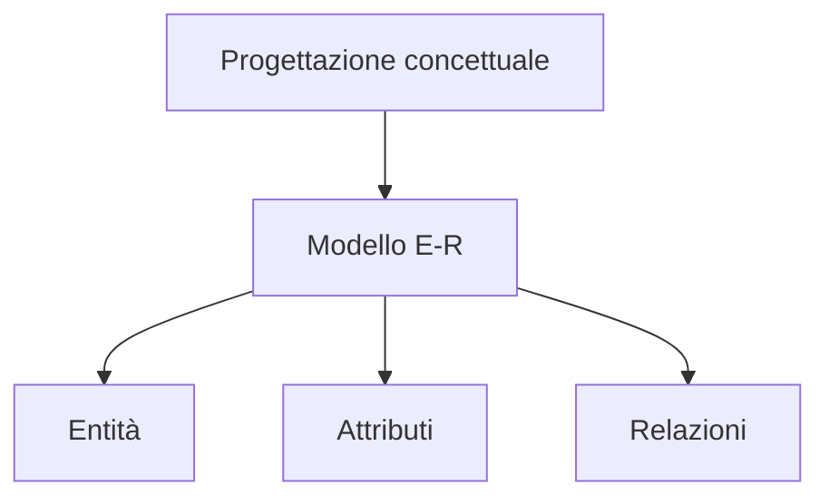

---

## 2. Entità

Un'**entità** è un gruppo omogeneo di informazioni che descrive un oggetto, una persona, un evento o un concetto rilevante per il sistema.

Esempi di entità:

- Libro;
- Lettore;
- Scaffale;
- Cliente;
- Fornitore;
- Prodotto.

Un'entità individuata nel modello E-R potrà diventare una tabella nel modello relazionale.

---

## 3. Attributi

Gli **attributi** sono le caratteristiche che descrivono un'entità.

Esempio: l'entità `LIBRO` può avere attributi come codice, ISBN, titolo, genere, autore, editore ed edizione.

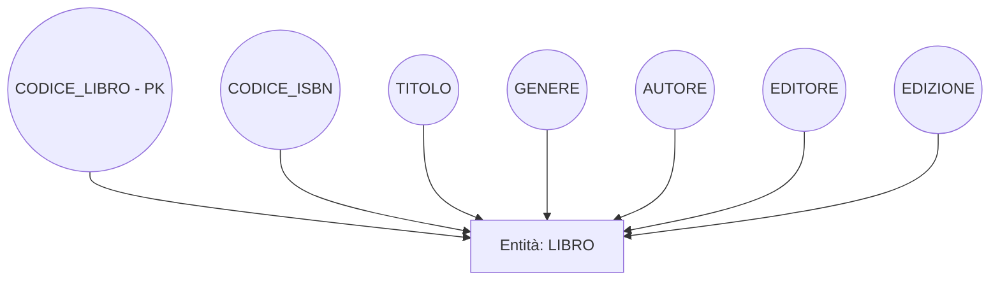

### Chiave primaria

Un attributo che non accetta duplicati e identifica univocamente un elemento può diventare **chiave primaria**.

Nel caso dell'entità `LIBRO`, `CODICE_LIBRO` può essere usato come chiave primaria.

---

## 4. Relazioni

Una **relazione** rappresenta un'associazione significativa tra due o più entità.

Esempio: un lettore può prendere in prestito un libro.

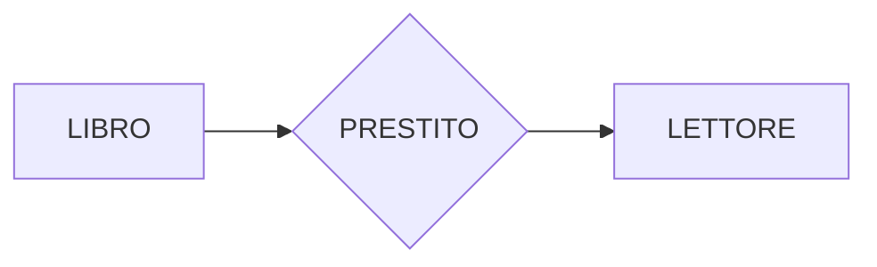

La relazione `PRESTITO` collega l'entità `LIBRO` all'entità `LETTORE`.

---

## 5. Esempio: Libro e Lettore

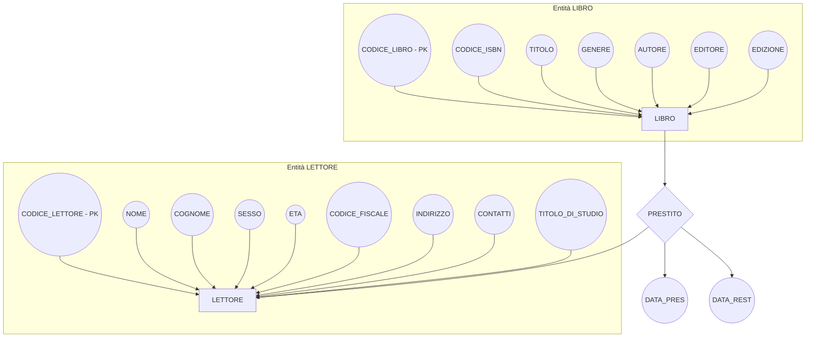

---

## 6. Simboli del modello E-R

Il modello E-R classico usa simboli grafici specifici. Nel diagramma seguente sono rappresentati con forme equivalenti.

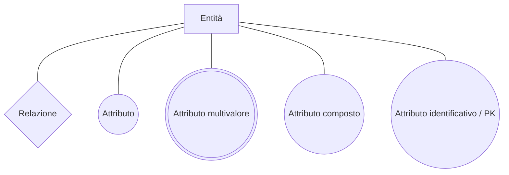

### Lettura dei simboli

| Concetto | Significato |
|---|---|
| Entità | Oggetto principale da rappresentare |
| Relazione | Associazione tra entità |
| Attributo | Caratteristica dell'entità o della relazione |
| Attributo multivalore | Attributo che può avere più valori, ad esempio più recapiti |
| Attributo composto | Attributo scomponibile, ad esempio indirizzo in via, CAP, città |
| Attributo identificativo | Attributo che non accetta duplicati |

---

## 7. Specifiche funzionali dell'esempio Database Libri

Il database dell'esempio deve permettere di:

1. caricare i libri nella posizione identificata dallo scaffale;
2. scaricare dallo scaffale i libri prestati ai lettori;
3. individuare il lettore a cui è stato prestato un libro;
4. ottenere un elenco dei libri prestati, dei lettori coinvolti e delle date di restituzione.

---

## 8. Modello E-R dell'esempio Biblioteca

Il seguente schema rappresenta il modello E-R rielaborato dell'esempio.

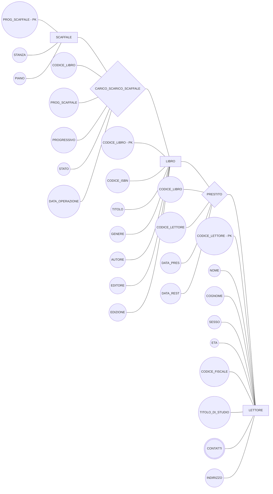

---

## 9. Cardinalità delle relazioni

Quando si indica una relazione tra due entità, bisogna specificare la **cardinalità**.

La cardinalità indica quante volte un'istanza di un'entità può partecipare a una relazione.

La forma usata è:

```text
(Min, Max)
```

Dove:

- `Min` indica la partecipazione minima;
- `Max` indica la partecipazione massima.

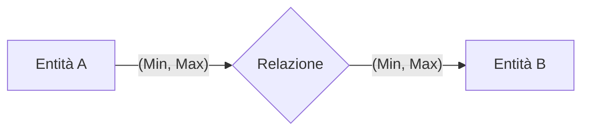

---

## 10. Significato dei valori più comuni

| Cardinalità | Significato |
|---|---|
| `(1,1)` | Obbligatoria, una sola volta |
| `(1,N)` | Obbligatoria, una o più volte |
| `(0,1)` | Opzionale, al massimo una volta |
| `(0,N)` | Opzionale, zero o più volte |

---

## 11. Tipi principali di relazione

Osservando i valori massimi delle cardinalità si ottengono tre casi principali:

- uno a uno;
- uno a molti;
- molti a molti.

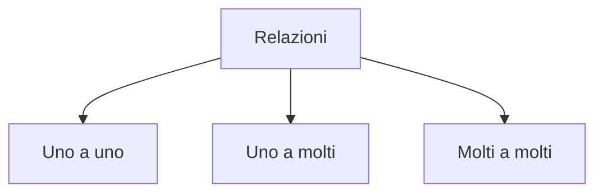

---

## 12. Relazione uno a uno

Esempio: un libro ha un solo codice ISBN e un codice ISBN identifica un solo libro.

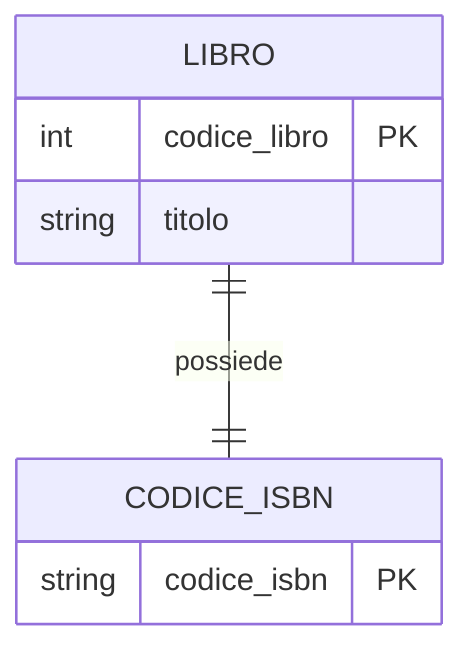

---

## 13. Relazione molti a molti

Esempio: un libro può essere preso in prestito da lettori diversi nel tempo, e un lettore può prendere in prestito libri diversi.

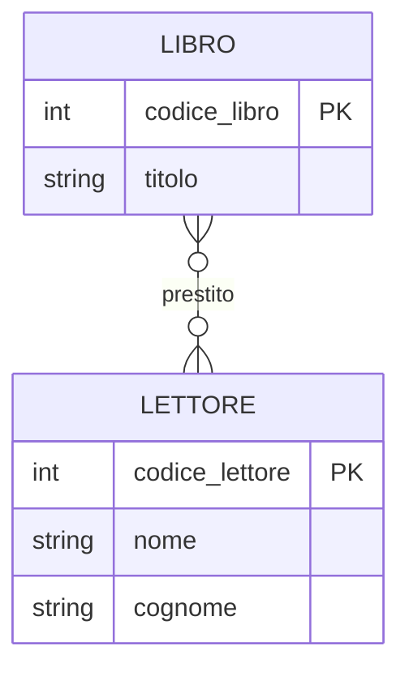

Nel modello relazionale questa relazione dovrà diventare una tabella intermedia, ad esempio `PRESTITO`.

---

## 14. Relazione uno a molti

Esempio: un autore può scrivere molti libri, mentre un libro dell'esempio è associato a un solo autore.

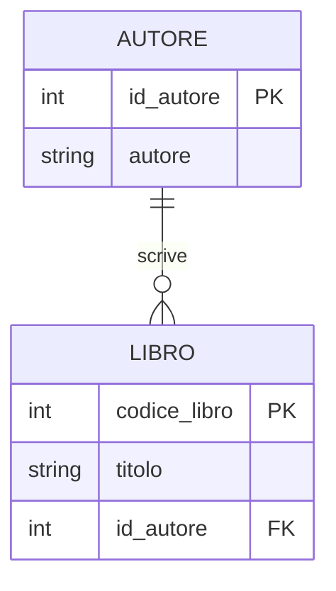

---

## Sintesi finale

Il modello E-R permette di descrivere un database prima della sua realizzazione tecnica. È utile perché separa il ragionamento concettuale dalla costruzione fisica delle tabelle. Prima si capisce cosa esiste nel dominio, poi si decide come trasformarlo in strutture relazionali.
