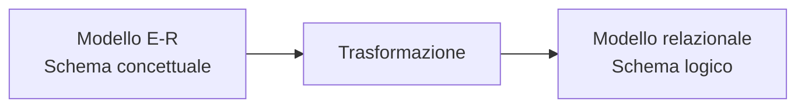
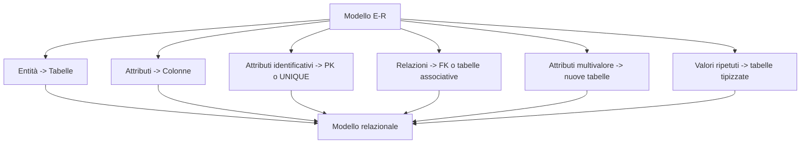
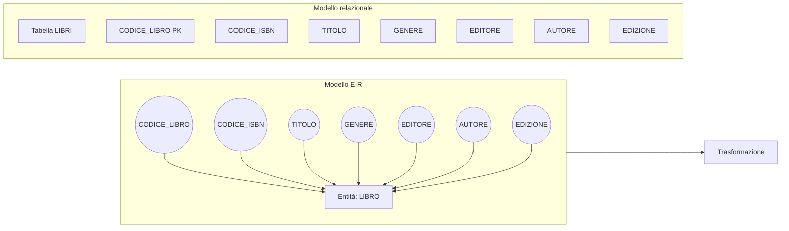
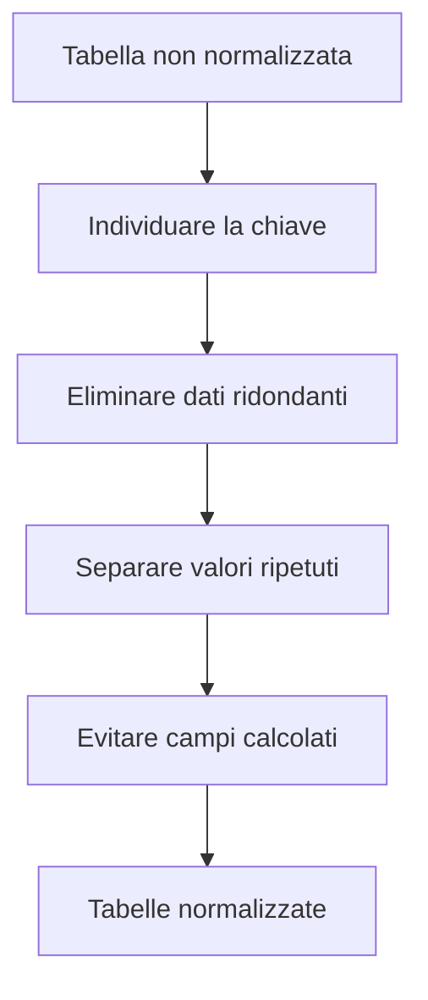
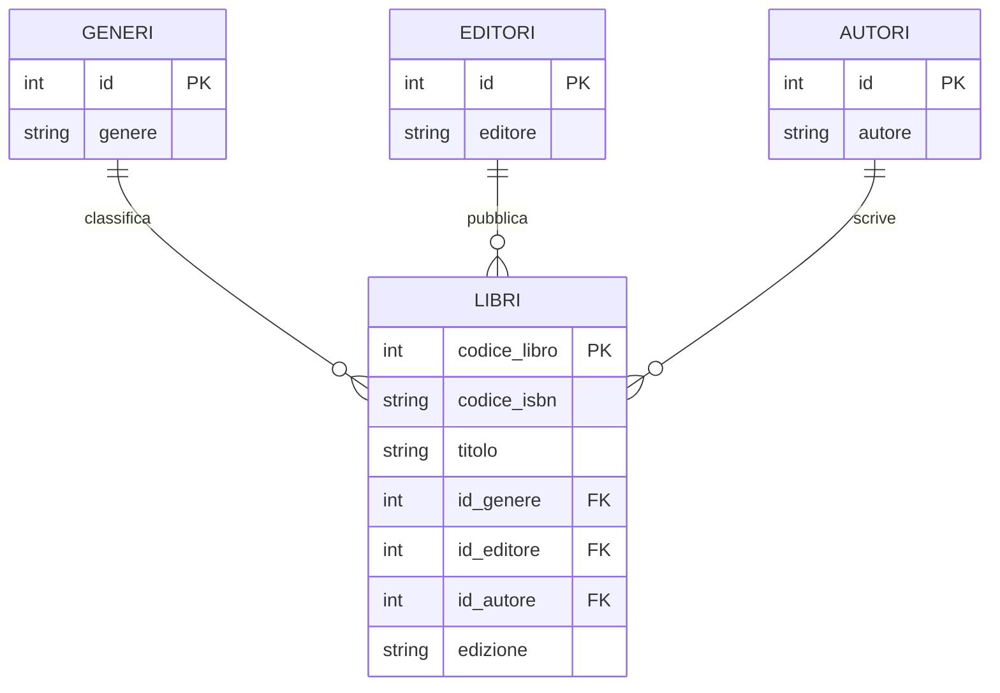
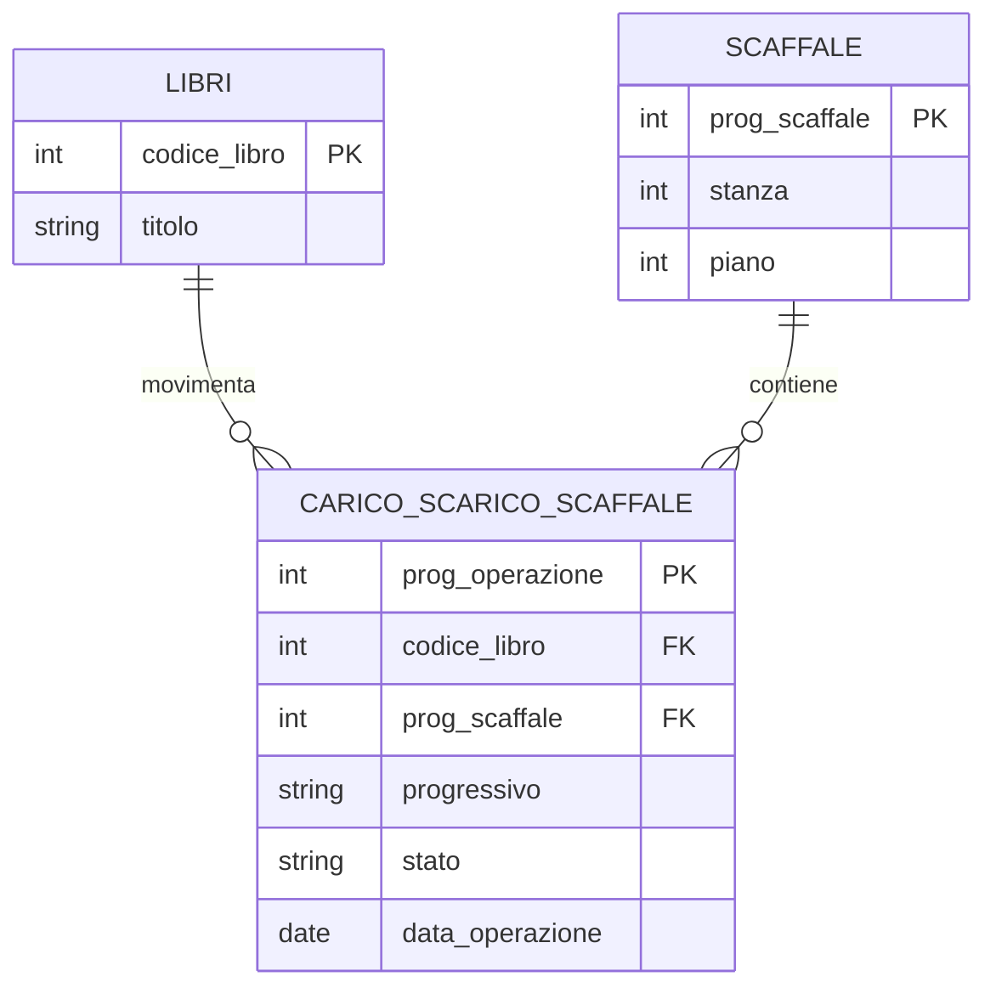
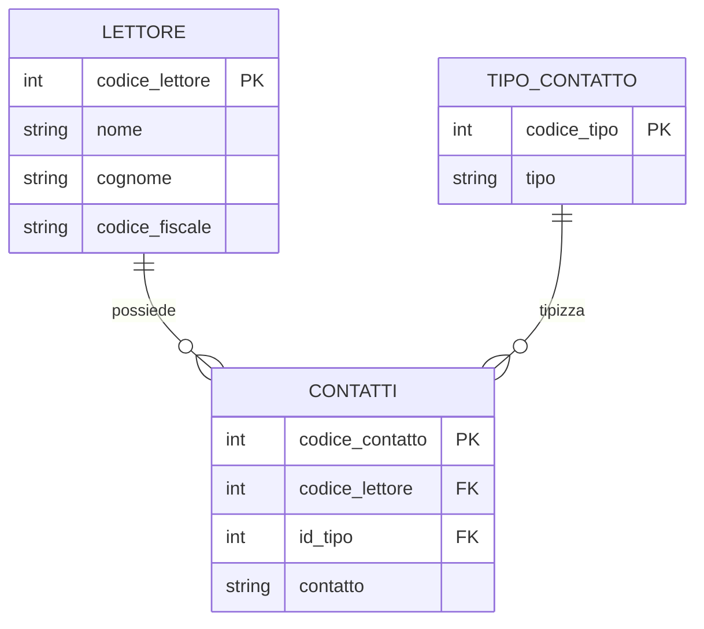
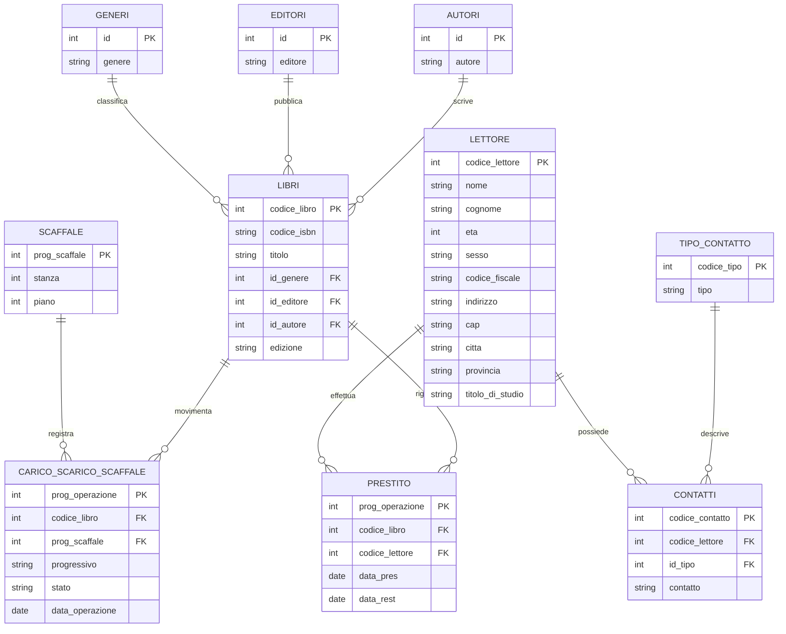

# 05 - Il modello relazionale

## Obiettivi della lezione

Al termine di questa unità il partecipante deve essere in grado di:

- spiegare il passaggio dal modello E-R al modello relazionale;
- trasformare entità, attributi e relazioni in tabelle e colonne;
- comprendere il concetto di normalizzazione;
- leggere un modello relazionale di base.

---

## 1. Dal modello E-R al modello relazionale

Il **modello relazionale** deriva dalla trasformazione del modello Entità-Relazione in una struttura composta da tabelle.

Il modello E-R descrive il dominio in modo concettuale. Il modello relazionale prepara la struttura logica che poi potrà essere implementata in un DBMS.

---

## 2. Regole di trasformazione principali

Per trasformare un modello E-R in modello relazionale si applicano alcune regole.

---

## 3. Entità e attributi

Un'entità diventa una tabella. Gli attributi diventano colonne.

Esempio: entità `LIBRO`.

Tabella iniziale:

| LIBRI |
|---|
| CODICE_LIBRO PK |
| CODICE_ISBN |
| TITOLO |
| GENERE |
| EDITORE |
| AUTORE |
| EDIZIONE |

---

## 4. Normalizzazione

La **normalizzazione** serve a organizzare le tabelle in modo da ridurre duplicazioni, anomalie e incoerenze.

Le regole introduttive più importanti sono:

1. ogni tabella deve avere una colonna, o un insieme di colonne, che renda univoco ogni record;
2. i dati ripetuti devono essere spostati in tabelle separate;
3. i campi calcolati non dovrebbero essere memorizzati se possono essere ricavati da altri dati.

---

## 5. Esempio di normalizzazione: libri, generi, editori, autori

Nella tabella `LIBRI`, valori come genere, editore e autore possono ripetersi molte volte.

Per ridurre la ridondanza, questi valori vengono spostati in tabelle tipizzate.

### Prima della normalizzazione

| codice_libro | titolo | genere | editore | autore |
|---:|---|---|---|---|
| 1 | Libro A | Informatica | Editore X | Autore 1 |
| 2 | Libro B | Informatica | Editore X | Autore 2 |
| 3 | Libro C | Romanzo | Editore Y | Autore 1 |

### Dopo la normalizzazione

`LIBRI` contiene chiavi esterne verso `GENERI`, `EDITORI` e `AUTORI`.

| codice_libro | titolo | id_genere | id_editore | id_autore |
|---:|---|---:|---:|---:|
| 1 | Libro A | 1 | 1 | 1 |
| 2 | Libro B | 1 | 1 | 2 |
| 3 | Libro C | 2 | 2 | 1 |

---

## 6. Relazioni che diventano tabelle

Alcune relazioni del modello E-R devono diventare tabelle nel modello relazionale.

Esempio: la relazione `CARICO_SCARICO_SCAFFALE` collega libri e scaffali e possiede attributi propri, come stato, progressivo e data operazione.

### Perché serve una tabella autonoma

La movimentazione non è solo un collegamento tra `LIBRI` e `SCAFFALE`: contiene dati propri. Per questo diventa una tabella.

---

## 7. Attributi multivalore

Un attributo multivalore non va gestito come una singola colonna piena di valori separati da virgole.

Esempio: un lettore può avere più contatti.

Soluzione: creare una tabella `CONTATTI` collegata a `LETTORE`.

### Esempio

| codice_lettore | nome | cognome |
|---:|---|---|
| 1 | Mario | Rossi |

| codice_contatto | codice_lettore | id_tipo | contatto |
|---:|---:|---:|---|
| 1 | 1 | 1 | mario@example.it |
| 2 | 1 | 2 | 3331234567 |

---

## 8. Modello relazionale completo dell'esempio Biblioteca

---

## Sintesi finale

Il modello relazionale è il passaggio intermedio tra modello concettuale e database fisico. Le entità diventano tabelle, gli attributi diventano colonne, le relazioni diventano chiavi esterne o tabelle associative. La normalizzazione riduce duplicazioni e rende il database più robusto.
