# 06 - Implementazione di un database

## Obiettivi della lezione

Al termine di questa unità il partecipante deve essere in grado di:

- spiegare che cos'è lo schema fisico;
- riconoscere tipi di dato, indici e vincoli;
- distinguere chiave primaria, indice unico e chiave esterna;
- comprendere l'integrità referenziale;
- leggere uno schema fisico di base.

---

## 1. Dallo schema logico allo schema fisico

L'**implementazione** del database consiste nella creazione concreta delle strutture nel DBMS scelto.

Si parte dal modello relazionale e si aggiungono informazioni tecniche:

- tipi di dato delle colonne;
- indici;
- vincoli;
- chiavi primarie;
- chiavi esterne;
- contatori automatici;
- eventuali regole specifiche del DBMS.

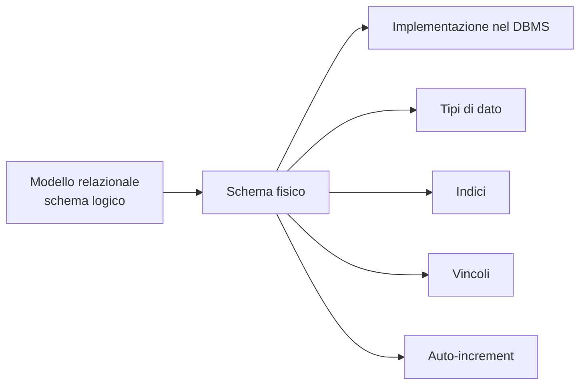

Lo **schema logico** descrive le tabelle, le colonne e le relazioni dal punto di vista del modello dei dati.

Lo **schema fisico** aggiunge le informazioni necessarie per creare davvero il database dentro un DBMS, ad esempio MySQL, SQL Server, PostgreSQL o Oracle.

---

## 2. Tipi di dato principali

I tipi di dato indicano quale tipo di valore può essere memorizzato in una colonna.

| Tipo dato | Descrizione |
|---|---|
| `TINYINT` | Numero intero di piccole dimensioni |
| `INT` | Numero intero standard |
| `BIGINT` | Numero intero di grandi dimensioni |
| `DECIMAL(n,m)` | Numero decimale con precisione definita |
| `FLOAT(n,m)` | Numero a virgola mobile |
| `DOUBLE(n,m)` | Numero a doppia precisione |
| `CHAR(n)` | Stringa a lunghezza fissa |
| `VARCHAR(n)` | Stringa a lunghezza variabile |
| `LONGTEXT` | Testo molto lungo |
| `DATE` | Data, ad esempio `2026-05-19` |
| `TIME` | Ora, minuti e secondi |

Attenzione: i tipi possono cambiare leggermente tra DBMS diversi.

Esempio:

```sql
CREATE TABLE articoli (
    id_articolo INT AUTO_INCREMENT PRIMARY KEY,
    descrizione VARCHAR(100) NOT NULL,
    prezzo DECIMAL(10,2) NOT NULL,
    data_inserimento DATE
);
```

---

## 3. Indici

Un **indice** è una struttura che migliora la velocità di ricerca o ordinamento su una o più colonne.

In una tabella possiamo trovare:

- indici per la ricerca;
- indici per l'ordinamento;
- indici unici;
- chiavi primarie, che si comportano anche come indici unici.

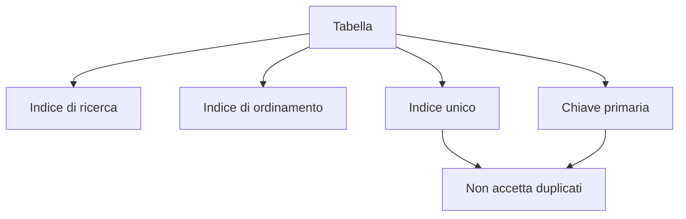

Un indice può velocizzare le ricerche, ma non deve essere creato senza criterio. Ogni indice ha un costo: occupa spazio e può rallentare inserimenti, modifiche e cancellazioni.

---

## 4. Chiave primaria e indice unico

La **chiave primaria** identifica in modo univoco ogni record di una tabella.

Un **indice unico** impedisce valori duplicati su una colonna, ma non è necessariamente la chiave primaria.

| Caratteristica | Chiave primaria | Indice unico |
|---|---|---|
| Impedisce duplicati | Sì | Sì |
| Numero ammesso per tabella | Una sola | Più di uno |
| Può essere usata come riferimento da FK | Sì | Dipende dal DBMS e dal modello |
| Identifica il record principale | Sì | Non necessariamente |

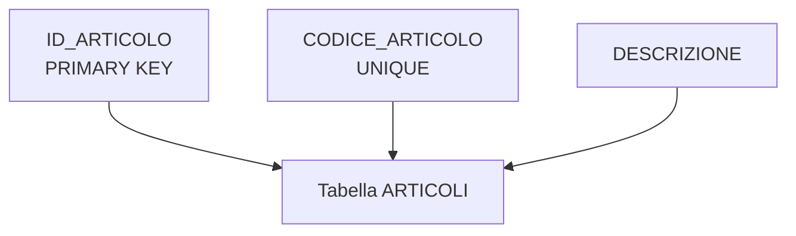

Esempio:

```sql
CREATE TABLE articoli (
    id_articolo INT AUTO_INCREMENT PRIMARY KEY,
    codice_articolo VARCHAR(20) UNIQUE,
    descrizione VARCHAR(100) NOT NULL
);
```

In questo caso:

- `id_articolo` è la chiave primaria tecnica;
- `codice_articolo` è un codice applicativo che non deve essere duplicato.

---

## 5. Integrità referenziale

Quando due tabelle sono collegate, il DBMS deve impedire operazioni incongruenti.

Il vincolo di **integrità referenziale** collega:

- la chiave primaria della tabella principale, detta anche tabella master;
- la chiave esterna della tabella figlia, detta anche tabella dettaglio.

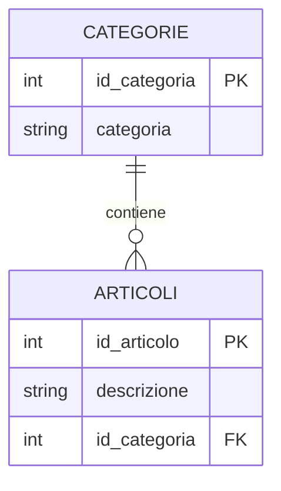

Con questo vincolo attivo:

1. nella tabella figlia non si può inserire una chiave esterna che non esiste nella tabella master;
2. nella tabella master non si può cancellare un record ancora usato da record della tabella figlia, salvo regole specifiche come cancellazione a cascata.

---

## 6. Esempio di errore di integrità referenziale

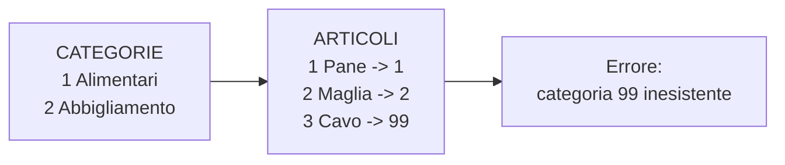

Il record `Cavo -> 99` è incongruente perché nella tabella `CATEGORIE` non esiste una categoria con id `99`.

Esempio SQL:

```sql
CREATE TABLE categorie (
    id_categoria INT AUTO_INCREMENT PRIMARY KEY,
    categoria VARCHAR(50) NOT NULL
);

CREATE TABLE articoli (
    id_articolo INT AUTO_INCREMENT PRIMARY KEY,
    descrizione VARCHAR(100) NOT NULL,
    id_categoria INT NOT NULL,
    CONSTRAINT fk_articoli_categorie
        FOREIGN KEY (id_categoria)
        REFERENCES categorie(id_categoria)
);
```

---

## 7. Vincolo CHECK

Il vincolo `CHECK` controlla che un valore rispetti una condizione.

Esempio: una colonna `eta` deve contenere solo valori maggiori o uguali a 18.

```sql
eta INT CHECK (eta >= 18)
```

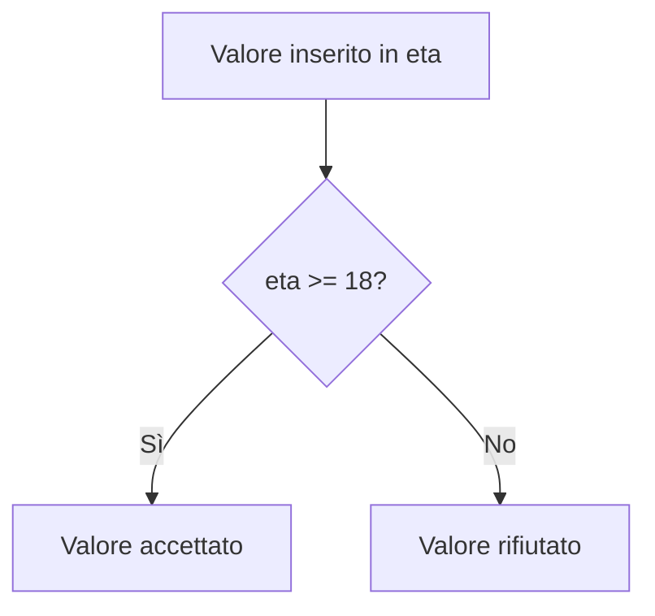

Il vincolo `CHECK` è utile quando una regola semplice può essere controllata direttamente dal database.

Altri esempi:

```sql
prezzo DECIMAL(10,2) CHECK (prezzo >= 0)
quantita INT CHECK (quantita >= 0)
stato INT CHECK (stato IN (0, 1, 2))
```

---

## 8. Vincolo NOT NULL

Il vincolo `NOT NULL` rende obbligatorio il valore di una colonna.

Esempio:

```sql
nome VARCHAR(50) NOT NULL
```

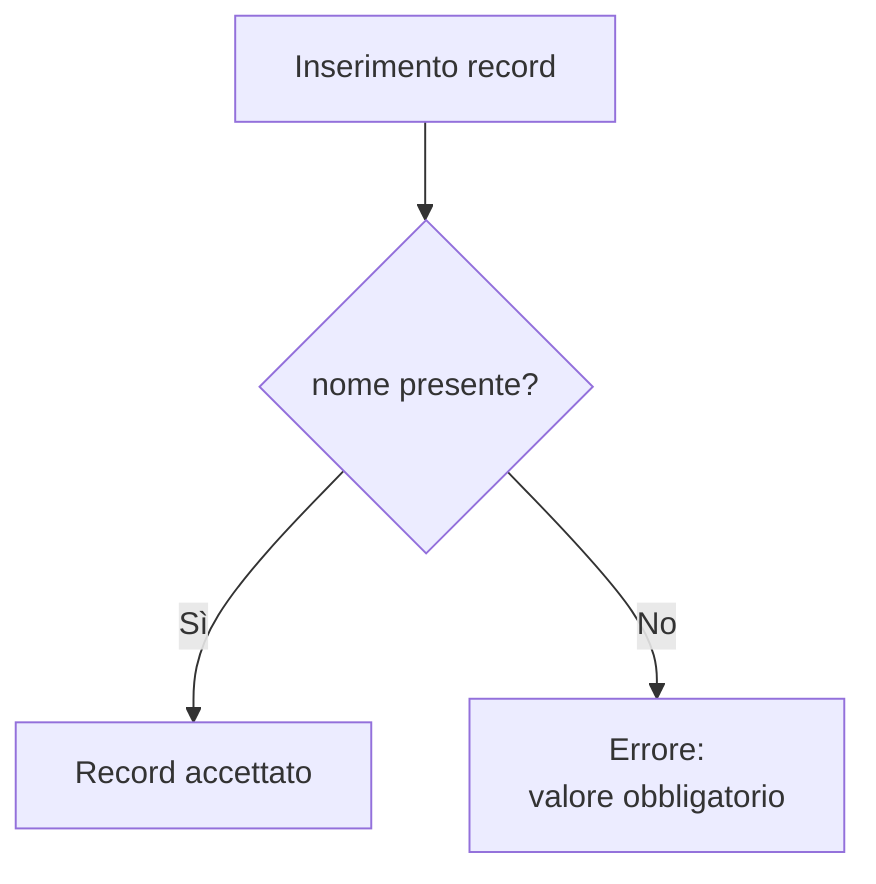

Se una colonna è `NOT NULL`, il record non può essere salvato senza un valore per quella colonna.

---

## 9. Contatore auto-incrementale

Un contatore auto-incrementale genera automaticamente valori numerici unici e crescenti.

È spesso usato per le chiavi primarie tecniche.

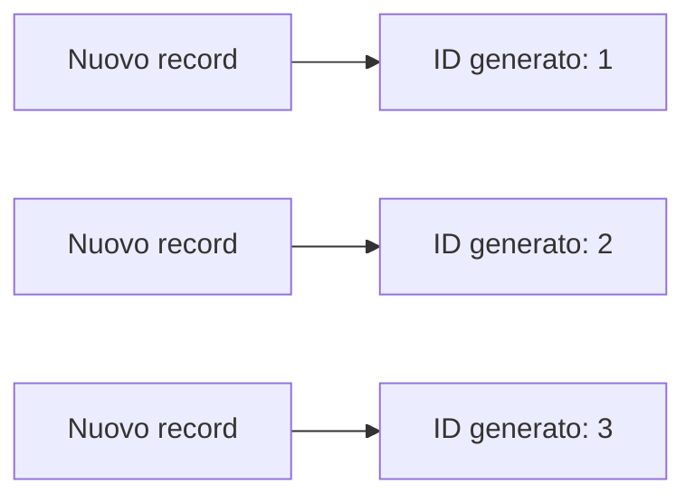

Esempio:

```sql
CREATE TABLE lettori (
    codice_lettore INT AUTO_INCREMENT PRIMARY KEY,
    nome VARCHAR(50) NOT NULL,
    cognome VARCHAR(50) NOT NULL
);
```

### Attenzione

Un contatore auto-incrementale garantisce valori unici e crescenti, ma non deve essere confuso con un progressivo contabile o amministrativo.

Un progressivo con regole particolari può richiedere logiche dedicate, ad esempio procedure, trigger o gestione applicativa.

---

## 10. Schema fisico: area libri

### Legenda per i diagrammi ER

Nei diagrammi seguenti sono usate queste abbreviazioni:

| Sigla | Significato |
|---|---|
| `PK` | Primary Key, chiave primaria |
| `FK` | Foreign Key, chiave esterna |
| `UK` | Unique Key, vincolo di unicità |
| `AUTO_INCREMENT` | Valore numerico generato automaticamente |
| `INDEX` | Colonna indicizzata |
| `NOT NULL` | Valore obbligatorio |

Le informazioni come `AUTO_INCREMENT`, `INDEX`, `NOT NULL` e `CHECK` sono inserite come annotazioni tra virgolette. In questo modo il diagramma resta leggibile e viene renderizzato correttamente anche su GitHub.

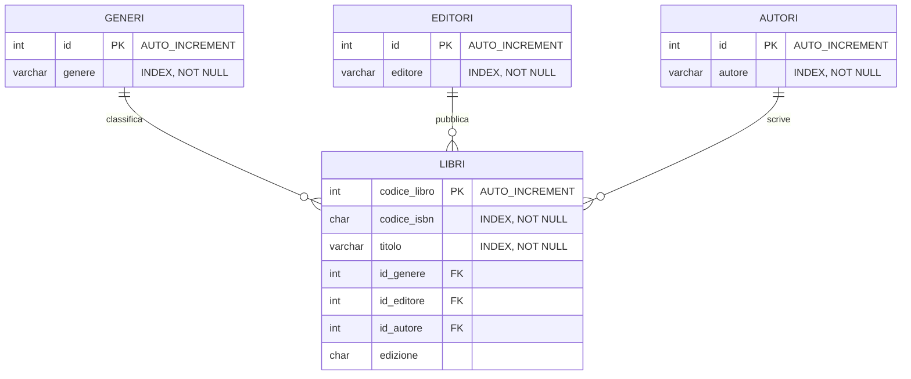

### Lettura dello schema

La tabella `LIBRI` contiene i dati principali del libro.

Le colonne `id_genere`, `id_editore` e `id_autore` sono chiavi esterne e collegano ogni libro a:

- un genere;
- un editore;
- un autore.

---

## 11. Schema fisico: lettori e contatti

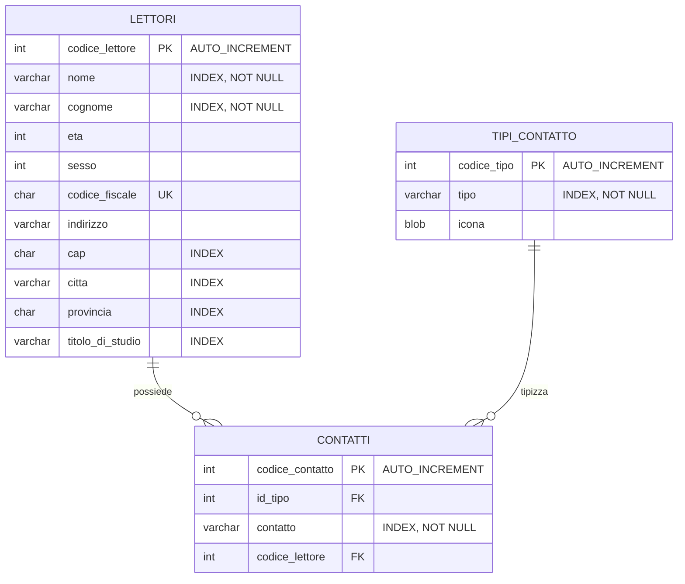

### Lettura dello schema

La tabella `LETTORI` contiene i dati anagrafici del lettore.

La tabella `CONTATTI` permette di registrare più contatti per lo stesso lettore, ad esempio email, telefono o altro recapito.

La tabella `TIPI_CONTATTO` serve a classificare il tipo di contatto.

In questo modello:

- un lettore può avere zero, uno o molti contatti;
- ogni contatto appartiene a un solo lettore;
- ogni contatto ha un solo tipo;
- un tipo di contatto può essere usato da molti contatti.

---

## 12. Schema fisico: scaffali, movimentazioni e prestiti

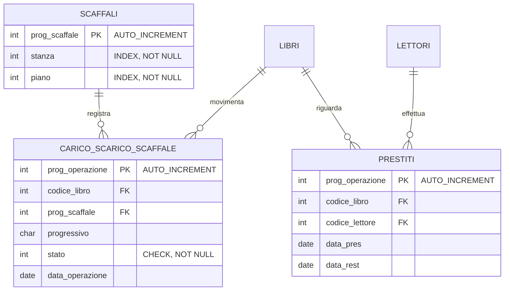

### Lettura dello schema

La tabella `SCAFFALI` descrive la posizione fisica dei libri.

La tabella `CARICO_SCARICO_SCAFFALE` registra le movimentazioni dei libri sugli scaffali.

La tabella `PRESTITI` registra il prestito di un libro a un lettore.

In questo modello:

- uno scaffale può avere molte operazioni di carico o scarico;
- un libro può comparire in molte movimentazioni;
- un libro può comparire in molti prestiti nel tempo;
- un lettore può effettuare molti prestiti.

---

## 13. Lettura complessiva dello schema fisico

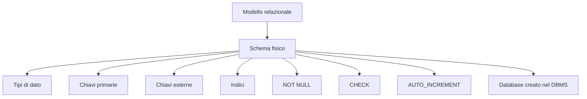

Lo schema fisico deve quindi rispondere a domande concrete:

- quale tipo di dato userà ogni colonna?
- quali colonne sono obbligatorie?
- quali colonne devono essere uniche?
- quali colonne devono essere indicizzate?
- quali tabelle sono collegate da chiavi esterne?
- quali regole devono essere garantite direttamente dal database?

---

## 14. Dallo schema fisico alla creazione del database

Uno schema fisico può essere trasformato in istruzioni SQL `CREATE TABLE`.

Esempio semplificato relativo all'area libri:

```sql
CREATE TABLE generi (
    id INT AUTO_INCREMENT PRIMARY KEY,
    genere VARCHAR(50) NOT NULL,
    INDEX idx_generi_genere (genere)
);

CREATE TABLE editori (
    id INT AUTO_INCREMENT PRIMARY KEY,
    editore VARCHAR(80) NOT NULL,
    INDEX idx_editori_editore (editore)
);

CREATE TABLE autori (
    id INT AUTO_INCREMENT PRIMARY KEY,
    autore VARCHAR(80) NOT NULL,
    INDEX idx_autori_autore (autore)
);

CREATE TABLE libri (
    codice_libro INT AUTO_INCREMENT PRIMARY KEY,
    codice_isbn CHAR(13) NOT NULL,
    titolo VARCHAR(150) NOT NULL,
    id_genere INT,
    id_editore INT,
    id_autore INT,
    edizione CHAR(10),

    INDEX idx_libri_isbn (codice_isbn),
    INDEX idx_libri_titolo (titolo),

    CONSTRAINT fk_libri_generi
        FOREIGN KEY (id_genere)
        REFERENCES generi(id),

    CONSTRAINT fk_libri_editori
        FOREIGN KEY (id_editore)
        REFERENCES editori(id),

    CONSTRAINT fk_libri_autori
        FOREIGN KEY (id_autore)
        REFERENCES autori(id)
);
```

---

## 15. Sintesi finale

Lo schema fisico è il modello relazionale completato con le scelte tecniche necessarie alla creazione del database.

In questa fase vengono definiti:

- tipi di dato;
- chiavi primarie;
- chiavi esterne;
- vincoli;
- indici;
- contatori automatici;
- regole compatibili con il DBMS scelto.

Il modello smette di essere soltanto una rappresentazione teorica e diventa una struttura che il DBMS può creare, controllare e utilizzare.
