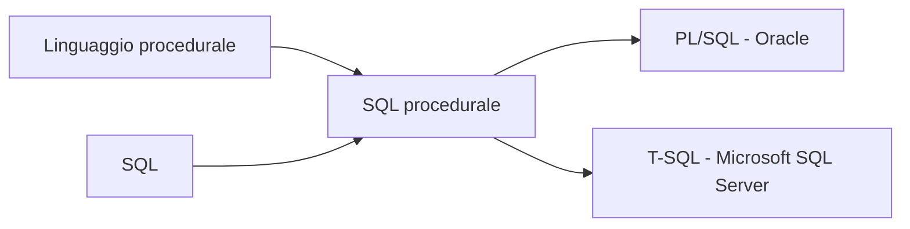
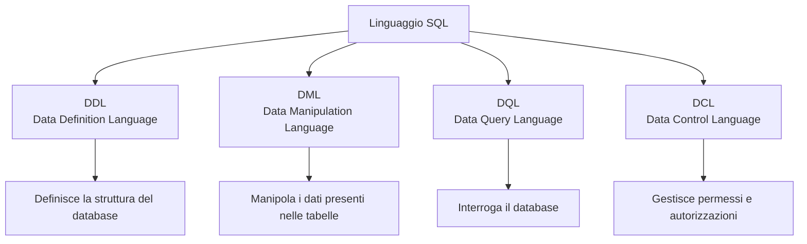
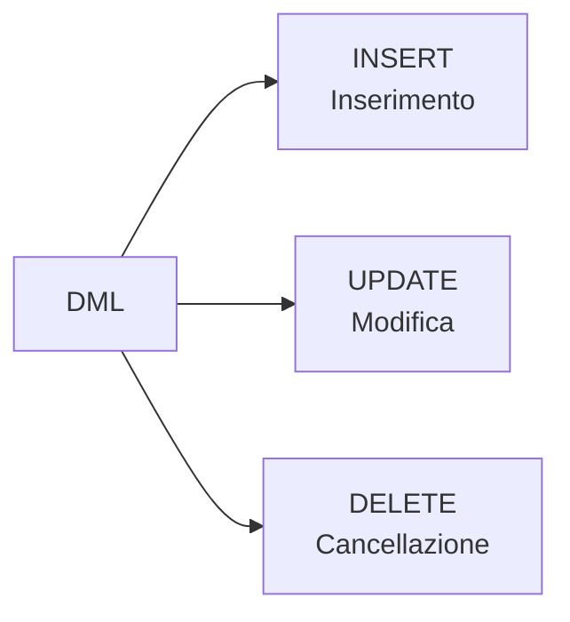
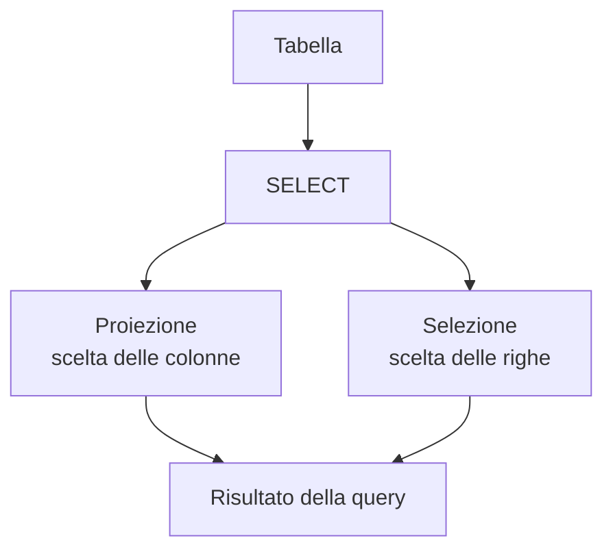
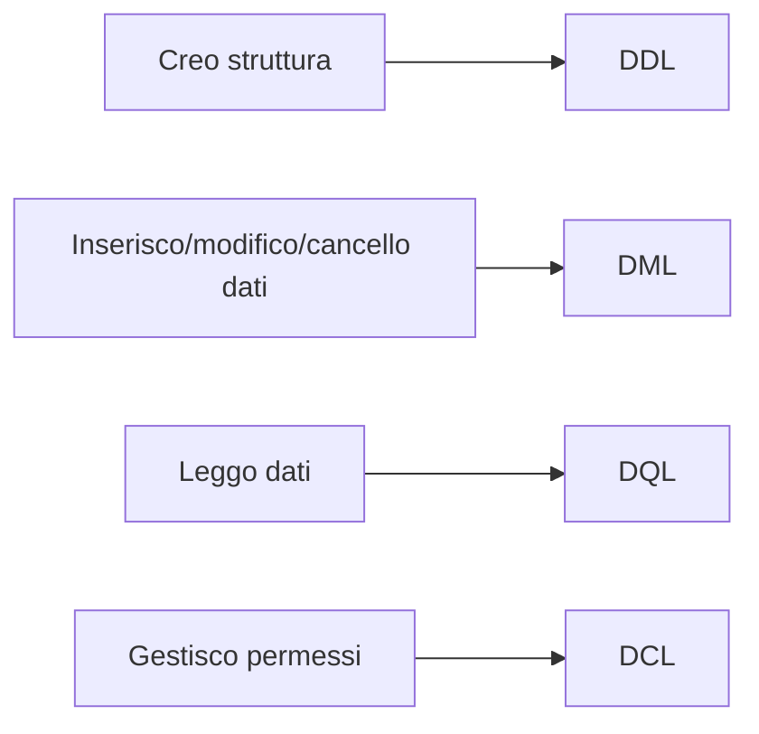

# 07 - Introduzione al linguaggio SQL

## Obiettivi della lezione

Al termine di questa unità il partecipante deve essere in grado di:

- spiegare che cos'è SQL;
- distinguere SQL puro dai linguaggi procedurali integrati con SQL;
- riconoscere le principali categorie di comandi SQL;
- distinguere DDL, DML, DQL e DCL;
- capire in quale situazione si usa ciascuna categoria.

---

## 1. Che cos'è SQL

SQL significa **Structured Query Language**.

È un linguaggio nato per gestire database relazionali. Viene usato per:

- creare la struttura di un database;
- inserire, modificare e cancellare dati;
- interrogare le tabelle;
- gestire permessi e autorizzazioni.

Storicamente SQL nasce in ambito IBM negli anni Settanta. In origine era chiamato **SEQUEL**, poi il nome fu abbreviato in **SQL**.

Nel tempo SQL è diventato uno standard, ma ogni DBMS può introdurre estensioni proprie. Questo significa che molti comandi sono comuni, ma alcuni dettagli possono cambiare tra MySQL, SQL Server, Oracle, PostgreSQL e altri sistemi.

---

## 2. SQL e linguaggi procedurali

SQL è un linguaggio dichiarativo: si specifica **che cosa** si vuole ottenere, non tutti i passaggi interni necessari per ottenerlo.

Alcuni DBMS integrano SQL con linguaggi procedurali, cioè linguaggi che permettono di scrivere istruzioni più simili alla programmazione tradizionale.



Esempi:

| DBMS | Linguaggio associato |
|---|---|
| Oracle | PL/SQL |
| Microsoft SQL Server | T-SQL |
| PostgreSQL | PL/pgSQL |
| MySQL / MariaDB | stored procedure SQL con sintassi propria |

---

## 3. Macro-categorie di comandi SQL

I comandi SQL possono essere raggruppati in quattro grandi categorie.



---

## 4. DDL - Data Definition Language

I comandi **DDL** servono a creare, modificare o eliminare gli oggetti che costituiscono la struttura di un database.

Oggetti tipici:

- database;
- tabelle;
- viste;
- indici;
- vincoli;
- utenti.

Comandi principali:

| Comando | Uso principale |
|---|---|
| `CREATE` | crea un oggetto del database |
| `ALTER` | modifica un oggetto esistente |
| `DROP` | elimina un oggetto esistente |

Esempio:

```sql
CREATE TABLE libri (
    codice_libro INT AUTO_INCREMENT PRIMARY KEY,
    titolo VARCHAR(100) NOT NULL
);
```

---

## 5. DML - Data Manipulation Language

I comandi **DML** servono a manipolare i record delle tabelle.

Comandi principali:

| Comando | Uso principale |
|---|---|
| `INSERT` | inserisce nuovi record |
| `UPDATE` | modifica record esistenti |
| `DELETE` | cancella record esistenti |



Esempi:

```sql
INSERT INTO lettori (nome, cognome)
VALUES ('Carlo', 'Rossi');

UPDATE lettori
SET citta = 'Milano'
WHERE codice_lettore = 1;

DELETE FROM lettori
WHERE codice_lettore = 1;
```

---

## 6. DQL - Data Query Language

I comandi **DQL** servono a interrogare il database.

Il comando principale è:

```sql
SELECT
```

Una query `SELECT` permette di ottenere un risultato composto da righe e colonne.



Esempio:

```sql
SELECT nome, cognome, citta
FROM lettori
WHERE citta = 'Roma';
```

Nota importante: in molti materiali introduttivi il risultato di una query viene chiamato informalmente "vista". In SQL, però, una **VIEW** è un oggetto specifico creato con `CREATE VIEW`. Qui useremo quindi il termine **risultato della query**, più preciso e meno incline a generare mostri concettuali.

---

## 7. DCL - Data Control Language

I comandi **DCL** servono a gestire permessi e autorizzazioni.

Comandi principali:

| Comando | Uso principale |
|---|---|
| `GRANT` | assegna permessi |
| `REVOKE` | revoca permessi |

Esempio concettuale:

```sql
GRANT SELECT ON biblioteca.lettori TO 'utente_report';
REVOKE SELECT ON biblioteca.lettori FROM 'utente_report';
```

---

## 8. Riepilogo operativo

| Categoria | Nome esteso | Comandi tipici | A cosa serve |
|---|---|---|---|
| DDL | Data Definition Language | `CREATE`, `ALTER`, `DROP` | definire la struttura |
| DML | Data Manipulation Language | `INSERT`, `UPDATE`, `DELETE` | modificare i dati |
| DQL | Data Query Language | `SELECT` | leggere e interrogare i dati |
| DCL | Data Control Language | `GRANT`, `REVOKE` | gestire permessi |



---

## Sintesi finale

SQL è il linguaggio usato per lavorare con database relazionali. Le sue istruzioni si dividono in categorie: DDL per la struttura, DML per la modifica dei dati, DQL per le interrogazioni e DCL per i permessi. Questa divisione aiuta a capire subito quale comando usare in base al tipo di operazione richiesta.
